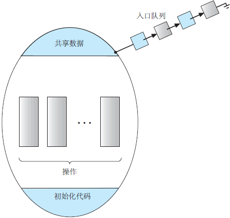
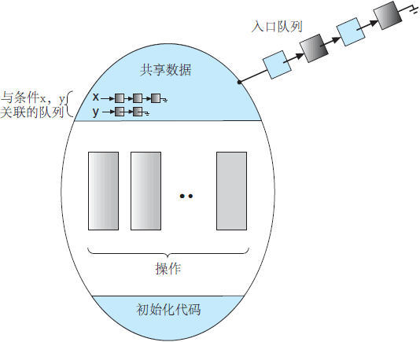

# 管程

汤小丹等人的《计算机操作系统》书中是这样说的

> 在利用管程实现进程同步时，当某进程通过管程请求获得临界资源而未能满足时，管程便调用wait原语使该进程等待，并将其排在等待队列上。
> 仅当另一个进程访问完成并释放该资源后，管程才又调用signal原语，唤醒等待队列中的队首进程。
> 但是，考虑这样一种情况：当一个进程调用了管程后，在管程中时被阻塞或挂起，直到阻塞或挂起的原因解除；
> 在此期间，如果该进程不释放管程，则其它进程就无法进入管程，被迫长时间等待。为了解决这个问题，引入条件变量condition。
> 通常，一个进程被被阻塞或挂起的条件（原因）可有多个，因此在管程中设置了多个条件变量，对这些条件变量的访问智能在管程中进行。

我的理解是，调用管程的进程，在管程中可能会因为某些资源限制而被阻塞或挂起；为了不占用管程资源，同时又不能直接退出管程，
就需要在管程中按照被阻塞或挂起的原因，分别挂到不同的等待队列上，而条件变量conditions就是分门别类的队列+相应操作。

需要condition变量的原因本质上就是程序执行顺序的不确定性.管程(monitor)只是保证了同一时刻只有一个进程在管程内活动,
即管程内定义的操作在同一时刻只被一个进程调用(由编译器实现).但是这样并不能保证进程以设计的顺序执行,因此需要设置condition变量,
让进入管程而无法继续执行的进程阻塞自己.也可以这么说,由于程执行顺序的不确定性,进程在entry序列中的顺序并不一定是我们想要的,
而condition变量就是用来操作entry序列的.有了condition变量,我们就可以让在自己前驱进程之前提前进入管程的进程挂起自己,
退回到entry序列中重新排队.具体来说: 以生产者-消费者问题(也称有限缓冲问题)为例, 
如果我们不使用信号量(semaphore)而简单的用整形变量count来记录buffer中的数据项数目, 用系统调用sleep()阻塞进程 和 wakeup() 唤醒进程

管程类型也包括一组变量，用于定义这一类型的实例状态，也包括操作这些变量的函数实现。管程类型的语法如下所示:

```
monitor monitor name
{
    /* shared variable declarations */
    function P1 (...) {
        ...
    }
    function P2 (...){
        ...
    }
    .
    .
    .
    function Pn ( . . . ) {
        ...
    }
    initialization_code (...){
        ...
    }
}
```

管程类型的表示不能直接由各种进程所使用。因此，只有管程内定义的函数才能访问管程内的局部声明的变量和形式参数。类似地，管程的局部变量只能为局部函数所访问。

管程结构确保每次只有一个进程在管程内处于活动状态。因此，程序员不需要明确编写同步约束.



然而，如到目前为止所定义的管程结构，在处理某些同步问题时，还不够强大。为此，我们需要定义附加的同步机制；
这些可由条件（condition)结构来提供。 当程序员需要编写定制的同步方案时，他可定义一个或多个类型为 condition 的变量：

    condition x, y;

对于条件变量，只有操作 wait() 和 signal() 可以调用。操作 x.wait(); 意味着调用这一操作的进程会被挂起，直到另一进程调用 x.signal();

操作 x.signal() 重新恢复正好一个挂起进程。如果没有挂起进程，那么操作 signal() 就没有作用，即x的状态如同没有执行任何操作。
这一操作与信号量的操作 signal() 不同，后者始终影响信号量的状态。



现在，假设当操作 x.signal() 被一个进程 P 调用时，在条件变量 x 上有一个挂起进程 Q。显然，如果挂起进程 Q 允许重执行，那么进程 P 必须等待。否则，管程内有两个进程 P 和 Q 可能同时执行。

注意，从概念上说两个进程都可以继续执行。有两种可能性存在：
1. 唤醒并等待：进程 P 等待直到 Q 离开管程，或者等待另一个条件。
2. 唤醒并继续：进程 Q 等待直到 P 离开管程或者等待另一个条件。

对于任一选项，都有赞同理由。一方面，由于 P 已经在管程中执行，唤醒并继续的方法似乎更为合理。另一方面，如果我们允许线程 P 继续，那么 Q 等待的逻辑条件在 Q 重新启动时可能已不再成立。
Concurrent Pascal 语言采用这两种选择的折中。当进程 P 执行操作 signal 时，它立即离开管程。因此，进程 Q 立即重新执行。
