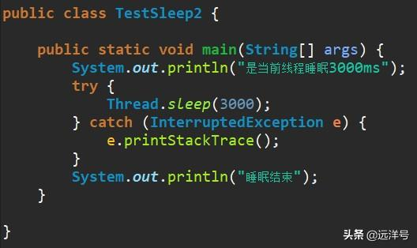

# 线程的sleep操作实现原理

## 前言

sleep操作是我们经常会使用的操作，特别是在开发环境中调试的时候，有时为了模拟长时间的执行就会使用sleep来模拟。该操作对应着java.lang.Thread类的sleep本地方法，该方法能使当前线程睡眠指定的时间。

## 例子

先通过一个简单的例子来看sleep的操作，代码如下，我们让主线程睡眠3000ms，即3秒。于是主线程先输出“是当前线程睡眠3000ms”，然后暂停三秒钟，最后再输出“睡眠结束”。

## sleep方法的要点

* 该方法只针对当前线程，即让当前线程进入休眠状态，哪个线程调用Thread.sleep则哪个线程会睡眠。
* 注意sleep方法传入的睡眠时间并不精准，这个取决于操作系统的计时器和调度器。
* 如果在synchronized块里面进行sleep操作，或在已获得锁的线程中执行sleep操作，都不会让线程失去锁，这点与Object.wait方法不同。
* 当前线程执行sleep操作进入睡眠状态后，其它线程能够中断当前线程，使其解除睡眠状态并抛出InterruptedException异常。

## 不会释放锁

前面说到sleep操作不会使得当前线程释放锁，现在我们看一个例子，该例子通过synchronized同步块实现锁机制。主线程创建thread1和thread2两个线程，其中thread1比thread2先启动。
thread1获取锁后输出"thread1 gets the lock."并开始睡眠三秒。接着thread2启动，但它会因为获取不到锁而阻塞，直到thread1睡眠结束输出"thread1 releases the lock."并释放锁，thread2才能获得锁往下执行，输出"thread2 gets the lock 3 second later."。

## 支持中断

sleep操作是支持中断机制的，即某个线程如果处于睡眠状态，那么其他线程可以将其中断。该例子中主线程创建thread1和thread2两个线程，thread1启动后输出"thread1 sleeps for 30 seconds."，然后开始睡眠30秒。
主线程休眠两秒后开始启动thread2，它输出"thread2 interrupts thread1."后对thread1进行中断操作。最终thread1还没休眠够30秒而被中断，捕获异常后输出"thread1 is interrupted by thread2."。

## 关于sleep(0)

sleep方法传入的时间参数值必须大于等于0，正常情况下我们都会传入大于0的值，但有时我们也会看到竟然有传入0的。0？是不是表示不睡眠呢？那不睡眠的话又为什么要执行sleep操作呢？实际上sleep(0)并非指睡眠0秒钟，它的意义是让出该轮cpu时间，也就是说它的意义与yield方法相同，而JVM实现的时候也可以用yield操作来代替。下面例子中MyThread会不断让出自己的CPU时间，而主线程则得到更多的执行时间，这个过程一共输出100次“main thread”，而仅输出几次“yield cpu time”。

## sleep工作过程

我们依据前面的一张线程状态图来看sleep的工作过程，处于runnable队列的任务会按一定的策略分到CPU时间，然后线程状态为running。此时如果线程调用了sleep操作的话则会进入阻塞状态，睡眠时间到达后就会重新进入到runnable队列等待分配CPU时间。

