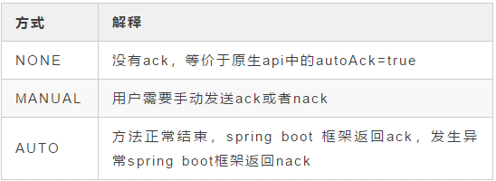
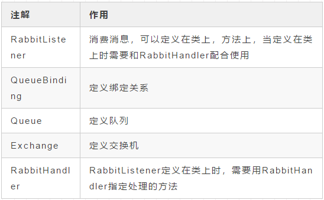
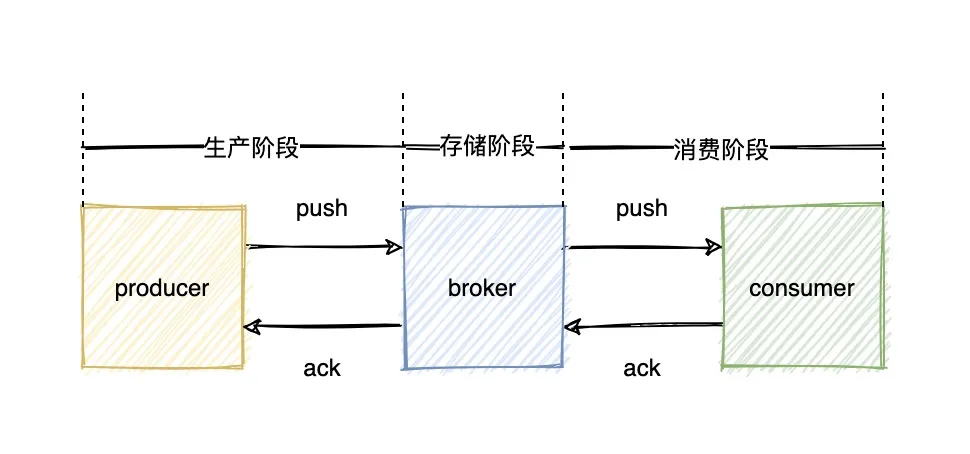

# RabbitMQ如何保证消息的可靠投递

Spring Boot针对消息ack的方式和原生api针对消息ack的方式有点不同

## 原生api消息ack的方式

#### 消息的确认方式有2种

自动确认（autoAck=true）
手动确认（autoAck=false）

#### 消费者在消费消息的时候，可以指定autoAck参数

String basicConsume(String queue, boolean autoAck, Consumer callback)

autoAck=false: RabbitMQ会等待消费者显示回复确认消息后才从内存（或者磁盘）中移出消息

autoAck=true: RabbitMQ会自动把发送出去的消息置为确认，然后从内存（或者磁盘）中删除，而不管消费者是否真正的消费了这些消息

#### 手动确认的方法如下，有2个参数

basicAck(long deliveryTag, boolean multiple)

deliveryTag: 用来标识信道中投递的消息。RabbitMQ 推送消息给Consumer时，会附带一个deliveryTag，以便Consumer可以在消息确认时告诉RabbitMQ到底是哪条消息被确认了。
RabbitMQ保证在每个信道中，每条消息的deliveryTag从1开始递增

multiple=true: 消息id<=deliveryTag的消息，都会被确认

myltiple=false: 消息id=deliveryTag的消息，都会被确认

#### 消息一直不确认会发生啥？

如果队列中的消息发送到消费者后，消费者不对消息进行确认，那么消息会一直留在队列中，直到确认才会删除。
如果发送到A消费者的消息一直不确认，只有等到A消费者与rabbitmq的连接中断，rabbitmq才会考虑将A消费者未确认的消息重新投递给另一个消费者

## Spring Boot中针对消息ack的方式

有三种方式，定义在AcknowledgeMode枚举类中



spring boot针对消息默认的ack的方式为AUTO。

在实际场景中，我们一般都是手动ack。

application.yaml的配置改为如下

```
spring:
  rabbitmq:
    host: myhost
    port: 5672
    username: guest
    password: guest
    virtual-host: /
    listener:
      simple:
        acknowledge-mode: manual # 手动ack，默认为auto
```

相应的消费者代码改为

```
@Slf4j
@Component
public class LogListenerManual {

    /**
     * 接收info级别的日志
     */
    @RabbitListener(
            bindings = @QueueBinding(
                    value = @Queue(value = "${log.info.queue}", durable = "true"),
                    exchange = @Exchange(value = "${log.exchange}", type = ExchangeTypes.TOPIC),
                    key = "${log.info.binding-key}"
            )
    )
    public void infoLog(Message message, Channel channel) throws Exception {
        String msg = new String(message.getBody());
        log.info("infoLogQueue 收到的消息为: {}", msg);
        try {
            // 这里写各种业务逻辑
            channel.basicAck(message.getMessageProperties().getDeliveryTag(), false);
        } catch (Exception e) {
            channel.basicNack(message.getMessageProperties().getDeliveryTag(), false, false);
        }
    }
}
```

我们上面用到的注解，作用如下



## RabbitMQ如何保证消息的可靠投递

一个消息往往会经历如下几个阶段



所以要保证消息的可靠投递，只需要保证这3个阶段的可靠投递即可

#### 生产阶段

这个阶段的可靠投递主要靠ConfirmListener（发布者确认）和ReturnListener（失败通知）
前面已经介绍过了，一条消息在RabbitMQ中的流转过程为
producer -> rabbitmq broker cluster -> exchange -> queue -> consumer

ConfirmListener可以获取消息是否从producer发送到broker
ReturnListener可以获取从exchange路由不到queue的消息

我用Spring Boot Starter 的api来演示一下效果

发布者确认回调

```
@Component
public class ConfirmCallback implements RabbitTemplate.ConfirmCallback {

    @Autowired
    private MessageSender messageSender;

    @Override
    public void confirm(CorrelationData correlationData, boolean ack, String cause) {
        String msgId = correlationData.getId();
        String msg = messageSender.dequeueUnAckMsg(msgId);
        if (ack) {
            
        } else {
            // 可以加一些重试的逻辑
          
        }
    }
}
```

失败通知回调

```
@Component
public class ReturnCallback implements RabbitTemplate.ReturnCallback {

    @Override
    public void returnedMessage(Message message, int replyCode, String replyText, String exchange, String routingKey) {
        String msg = new String(message.getBody());

    }
}
```


```
@Configuration
public class RabbitMqConfig {

    @Bean
    public ConnectionFactory connectionFactory(
            @Value("${spring.rabbitmq.host}") String host,
            @Value("${spring.rabbitmq.port}") int port,
            @Value("${spring.rabbitmq.username}") String username,
            @Value("${spring.rabbitmq.password}") String password,
            @Value("${spring.rabbitmq.virtual-host}") String vhost) {
        CachingConnectionFactory connectionFactory = new CachingConnectionFactory(host);
        connectionFactory.setPort(port);
        connectionFactory.setUsername(username);
        connectionFactory.setPassword(password);
        connectionFactory.setVirtualHost(vhost);
        connectionFactory.setPublisherConfirms(true);
        connectionFactory.setPublisherReturns(true);
        return connectionFactory;
    }

    @Bean
    public RabbitTemplate rabbitTemplate(ConnectionFactory connectionFactory,
                                         ReturnCallback returnCallback, ConfirmCallback confirmCallback) {
        RabbitTemplate rabbitTemplate = new RabbitTemplate(connectionFactory);
        rabbitTemplate.setReturnCallback(returnCallback);
        rabbitTemplate.setConfirmCallback(confirmCallback);
        // 要想使 returnCallback 生效，必须设置为true
        rabbitTemplate.setMandatory(true);
        return rabbitTemplate;
    }
}
```

这里我对RabbitTemplate做了一下包装，主要就是发送的时候增加消息id，并且保存消息id和消息的对应关系，因为RabbitTemplate.ConfirmCallback只能拿到消息id，并不能拿到消息内容，所以需要我们自己保存这种映射关系。在一些可靠性要求比较高的系统中，你可以将这种映射关系存到数据库中，成功发送删除映射关系，失败则一直发送

```
@Component
public class MessageSender {

    @Autowired
    private RabbitTemplate rabbitTemplate;

    public final Map<String, String> unAckMsgQueue = new ConcurrentHashMap<>();

    public void convertAndSend(String exchange, String routingKey, String message) {
        String msgId = UUID.randomUUID().toString();
        CorrelationData correlationData = new CorrelationData();
        correlationData.setId(msgId);
        rabbitTemplate.convertAndSend(exchange, routingKey, message, correlationData);
        unAckMsgQueue.put(msgId, message);
    }

    public String dequeueUnAckMsg(String msgId) {
        return unAckMsgQueue.remove(msgId);
    }

}
```

#### 存储阶段

这个阶段的高可用还真没研究过，毕竟集群都是运维搭建的，后续有时间的话会把这快的内容补充一下

#### 消费阶段

消费阶段的可靠投递主要靠ack来保证。
前文已经介绍了原生api ack的方式和Spring Boot框架ack的方式

总而言之，在生产环境中，我们一般都是单条手动ack，消费失败后不会重新入队（因为很大概率还会再次失败），而是将消息重新投递到死信队列，方便以后排查问题

## 总结一下各种情况

ack后消息从broker中删除
nack或者reject后，分为如下2种情况
(1) reque=true，则消息会被重新放入队列(2) reque=fasle，消息会被直接丢弃，如果指定了死信队列的话，会被投递到死信队列
