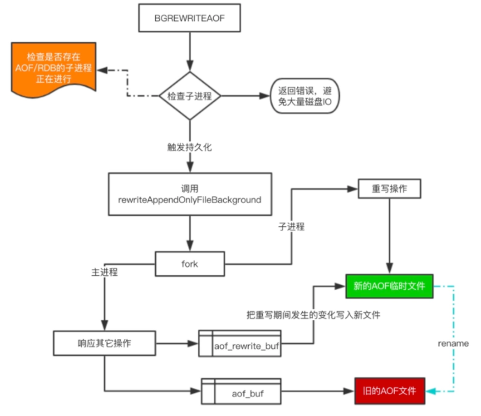

# Redis持久化

## redis aof文件过大问题

BGREWRITEAOF

执行一个 AOF文件 重写操作。重写会创建一个当前 AOF 文件的体积优化版本。

即使 BGREWRITEAOF 执行失败，也不会有任何数据丢失，因为旧的 AOF 文件在 BGREWRITEAOF 成功之前不会被修改。

重写操作只会在没有其他持久化工作在后台执行时被触发，也就是说：

如果 Redis 的子进程正在执行快照的保存工作，那么 AOF 重写的操作会被预定(scheduled)，等到保存工作完成之后再执行 AOF 重写。在这种情况下， BGREWRITEAOF 的返回值仍然是 OK ，但还会加上一条额外的信息，说明 BGREWRITEAOF 要等到保存操作完成之后才能执行。在 Redis 2.6 或以上的版本，可以使用 INFO 命令查看 BGREWRITEAOF 是否被预定。

如果已经有别的 AOF 文件重写在执行，那么 BGREWRITEAOF 返回一个错误，并且这个新的 BGREWRITEAOF 请求也不会被预定到下次执行。

从 Redis 2.4 开始， AOF 重写由 Redis 自行触发， BGREWRITEAOF 仅仅用于手动触发重写操作。

1、在重写期间，由于主进程依然在响应命令，为了保证最终备份的完整性；因此它依然会写入旧的AOF file中，如果重写失败，能够保证数据不丢失。

2、为了把重写期间响应的写入信息也写入到新的文件中，因此也会为子进程保留一个buf，防止新写的file丢失数据。

3、重写是直接把当前内存的数据生成对应命令，并不需要读取老的AOF文件进行分析、命令合并。

4、AOF文件直接采用的文本协议，主要是兼容性好、追加方便、可读性高可认为修改修复。

无论是 RDB 还是 AOF 都是先写入一个临时文件，然后通过 rename 完成文件的替换工作。

**混合持久化[#](https://link.zhihu.com/?target=https%3A//www.cnblogs.com/jojop/p/13941195.html%232784000098)**
重启 Redis 时，如果使用 RDB 来恢复内存状态，会丢失大量数据。而如果只使用 AOF 日志重放，那么效率又太过于低下。Redis 4.0 提供了混合持久化方案，将 RDB 文件的内容和增量的 AOF 日志文件存在一起。这里的 AOF 日志不再是全量的日志，而是自 RDB 持久化开始到持久化结束这段时间发生的增量 AOF 日志，通常这部分日志很小。

于是在 Redis 重启的时候，可以先加载 RDB 的内容，然后再重放增量 AOF 日志，就可以完全替代之前的 AOF 全量重放，重启效率因此得到大幅提升。