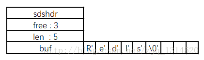

# Redis String底层实现

Redis使用自己的简单动态字符串(simple dynamic string, SDS)的抽象类型。Redis中，默认以SDS作为自己的字符串表示。
只有在一些字符串不可能出现变化的地方使用C字符串。

SDS的定义如下：

```
struct sdshdr {    
  // 用于记录buf数组中使用的字节的数目
  // 和SDS存储的字符串的长度相等  
	int len;    
  // 用于记录buf数组中没有使用的字节的数目   
	int free;    
  // 字节数组，用于储存字符串
	char buf[];   //buf的大小等于len+free+1，其中多余的1个字节是用来存储’\0’的。
};

```
> SDS除了用来保存数据库中的字符串之外，SDS还被用作缓冲区（buffer），如AOF模块中的AOF缓冲区，以及客户端状态中的输入缓冲区

SDS 的存储示例：




使用SDS而不使用c语言的string的好处：

#### 常数复杂度获取字符串长度

C语言中:字符串只是简单的字符的数组，当使用strlen获取字符串长度的时候，内部其实是直接顺序遍历数组的内容，找到对应的’\0’对应的字符，从而计算出字符串的长度。即O(N)。

SDS:只需要访问SDS的len属性就能得到字符串的长度，复杂度为O(1)。

#### 杜绝缓冲区溢出

Redis是C语言编写的，并没有方便的数据类型来进行内存的分配和释放（C++ STL String），必须手动进行内存分配和释放。

对于字符串的拼接、复制等操作，C语言开发者必须确保目标字符串的空间足够大，不然就会出现溢出的情况。

当使用SDS的API对字符串进行修改的时候，

1. API内部第一步会检测字符串的大小是否满足。
2. 如果空间已经满足要求，那么就像C语言一样操作即可。如果不满足，则拓展buf的空间
3. 之后再进行操作。每次操作之后，len和free的值会做相应的修改。
   * 扩展buf空间策略：
   * 修改之后总长度len<1MB: 总空间为2*len+1;
   * 修改之后总长度len>=1MB: 总空间为len+1MB+1。
   * 换句话说，预分配的空间上限是1MB，尽量为len。

#### 减少修改字符串时带来的内存重分配次数
Redis主要通过以下两种策略来处理内存问题。

* 字符串长度增加操作时，进行空间预分配
* 字符串长度减少操作时，惰性空间释放

   * 当执行字符串长度缩短的操作的时候，SDS并不直接重新分配多出来的字节，而是修改len和free的值（len相应减小，free相应增大，buf的空间大小不变化），避免内存重分配。
   * SDS也提供直接释放未使用空间的API，在需要的时候，也能真正的释放掉多余的空间。
   
#### 二进制安全

C字符串除了末尾之外不能出现空字符，否则会被程序认为是字符串的结尾。这就使得C字符串只能存储文本数据，而不能保存图像，音频等二进制数据。

使用SDS就不需要依赖控制符，而是用len来指定存储数据的大小，所有的SDS API都会以处理二进制的方式来处理SDS的buf的数据。程序不会对buf的数据做任何限制、过滤或假设，数据写入的时候是什么，读取的时候依然不变。

#### 兼容部分C字符串函数

SDS的buf的定义（字符串末尾为’\0’)和C字符串完全相同，因此很多的C字符串的操作都是适用于SDS->buf的。比如当buf里面存的是文本字符串的时候，大多数通过调用C语言的函数就可以。

## 总结

| C字符串| SDS|
| :---: |  :---: | 
|获取字符串长度的复杂度为O(N) | 可以使用所有库中的函数| 
|API是不安全的，可能会造成缓冲区溢出 |	API是安全的，不会造成缓冲区溢出 | 
|修改字符串长度N次必然需要执行N次内存重分配 | 修改字符串长度N次最多需要执行N次内存重分配| 
|只能保存文本数据 | 可以保存文本或者二进制数据| 
| 可以使用所有库中的函数| 可以使用一部分库的函数| 

