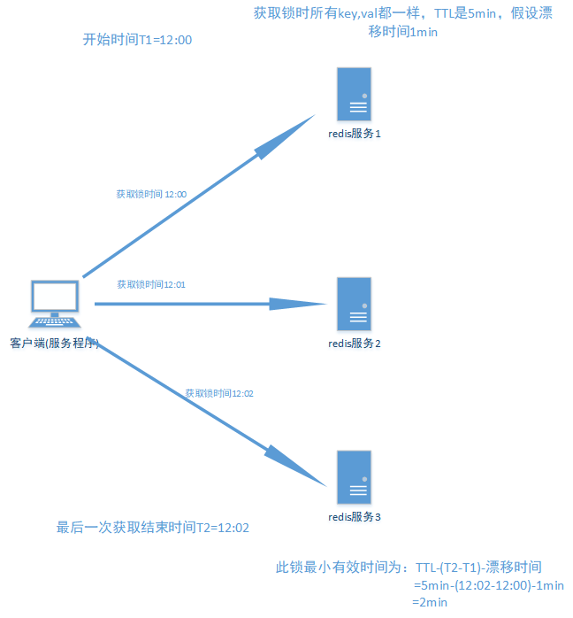

# Redlock 原理分析


## 最低保证分布式锁的有效性及安全性的要求如下：

1. 互斥；任何时刻只能有一个client获取锁
2. 释放死锁；即使锁定资源的服务崩溃或者分区，仍然能释放锁
3. 容错性；只要多数redis节点（一半以上）在使用，client就可以获取和释放锁

## 网上讲的基于故障转移实现的redis主从无法真正实现Redlock:

因为redis在进行主从复制时是异步完成的，比如在clientA获取锁后，主redis复制数据到从redis过程中崩溃了，导致没有复制到从redis中，然后从redis选举出一个升级为主redis,造成新的主redis没有clientA 设置的锁，这是clientB尝试获取锁，并且能够成功获取锁，导致互斥失效；

思考题：这个失败的原因是因为从redis立刻升级为主redis，如果能够过TTL时间再升级为主redis（延迟升级）后，或者立刻升级为主redis但是过TTL的时间后再执行获取锁的任务，就能成功产生互斥效果；是不是这样就能实现基于redis主从的Redlock;


## redis单实例中实现分布式锁的正确方式（原子性非常重要）

#### 设置锁时，使用set命令，因为其包含了setnx,expire的功能，起到了原子操作的效果，给key设置随机值，并且只有在key不存在时才设置成功返回True,并且设置key的过期时间（最好用毫秒）

    SET key_name my_random_value NX PX 30000                  # NX 表示if not exist 就设置并返回True，否则不设置并返回False   PX 表示过期时间用毫秒级， 30000 表示这些毫秒时间后此key过期
#### 在获取锁后，并完成相关业务后，需要删除自己设置的锁（必须是只能删除自己设置的锁，不能删除他人设置的锁）；

删除原因：保证服务器资源的高利用效率，不用等到锁自动过期才删除；

删除方法：最好使用Lua脚本删除（redis保证执行此脚本时不执行其他操作，保证操作的原子性），代码如下；逻辑是 先获取key，如果存在并且值是自己设置的就删除此key;否则就跳过；

```
if redis.call("get",KEYS[1]) == ARGV[1] then
    return redis.call("del",KEYS[1])
else
    return 0
end
```

## 多节点redis实现的分布式锁算法(RedLock):有效防止单点故障

假设有5个完全独立的redis主服务器

1.获取当前时间戳
2.client尝试按照顺序使用相同的key,value获取所有redis服务的锁，在获取锁的过程中的获取时间比锁过期时间短很多，这是为了不要过长时间等待已经关闭的redis服务。并且试着获取下一个redis实例。 比如：TTL为5s,设置获取锁最多用1s，所以如果一秒内无法获取锁，就放弃获取这个锁，从而尝试获取下个锁
3.client通过获取所有能获取的锁后的时间减去第一步的时间，这个时间差要小于TTL时间并且至少有3个redis实例成功获取锁，才算真正的获取锁成功
4.如果成功获取锁，则锁的真正有效时间是 TTL减去第三步的时间差 的时间；比如：TTL 是5s,获取所有锁用了2s,则真正锁有效时间为3s(其实应该再减去时钟漂移);
5.如果客户端由于某些原因获取锁失败，便会开始解锁所有redis实例；因为可能已经获取了小于3个锁，必须释放，否则影响其他client获取锁
算法示意图如下：



#### RedLock算法是否是异步算法

可以看成是同步算法；因为 即使进程间（多个电脑间）没有同步时钟，但是每个进程时间流速大致相同；并且时钟漂移相对于TTL叫小，可以忽略，所以可以看成同步算法；（不够严谨，算法上要算上时钟漂移，因为如果两个电脑在地球两端，则时钟漂移非常大）

#### RedLock失败重试

当client不能获取锁时，应该在随机时间后重试获取锁；并且最好在同一时刻并发的把set命令发送给所有redis实例；而且对于已经获取锁的client在完成任务后要及时释放锁，这是为了节省时间；

#### RedLock释放锁

由于释放锁时会判断这个锁的value是不是自己设置的，如果是才删除；所以在释放锁时非常简单，只要向所有实例都发出释放锁的命令，不用考虑能否成功释放锁；

#### RedLock注意点（Safety arguments）

1. 先假设client获取所有实例，所有实例包含相同的key和过期时间(TTL) ,但每个实例set命令时间不同导致不能同时过期，第一个set命令之前是T1,最后一个set命令后为T2,则此client有效获取锁的最小时间为TTL-(T2-T1)-时钟漂移;
2. 对于以N/2+ 1(也就是一半以 上)的方式判断获取锁成功，是因为如果小于一半判断为成功的话，有可能出现多个client都成功获取锁的情况， 从而使锁失效
3. 一个client锁定大多数事例耗费的时间大于或接近锁的过期时间，就认为锁无效，并且解锁这个redis实例(不执行业务) ;只要在TTL时间内成功获取一半以上的锁便是有效锁;否则无效

#### 系统有活性的三个特征

1. 能够自动释放锁
2. 在获取锁失败（不到一半以上），或任务完成后 能够自动释放锁，不用等到其自动过期
3. 在client重试获取哦锁前（第一次失败到第二次重试时间间隔）大于第一次获取锁消耗的时间；
4. 重试获取锁要有一定次数限制

#### RedLock性能及崩溃恢复的相关解决方法

1. 如果redis没有持久化功能，在clientA获取锁成功后，所有redis重启，clientB能够再次获取到锁，这样违法了锁的排他互斥性;
2. 如果启动AOF永久化存储，事情会好些， 举例:当我们重启redis后，由于redis过期机制是按照unix时间戳走的，所以在重启后，然后会按照规定的时间过期，不影响业务;但是由于AOF同步到磁盘的方式默认是每秒-次，如果在一秒内断电，会导致数据丢失，立即重启会造成锁互斥性失效;但如果同步磁盘方式使用Always(每一个写命令都同步到硬盘)造成性能急剧下降;所以在锁完全有效性和性能方面要有所取舍; 
3. 有效解决既保证锁完全有效性及性能高效及即使断电情况的方法是redis同步到磁盘方式保持默认的每秒，在redis无论因为什么原因停掉后要等待TTL时间后再重启(学名:延迟重启) ;缺点是 在TTL时间内服务相当于暂停状态;

## 总结：

1. TTL时长 要大于正常业务执行的时间+获取所有redis服务消耗时间+时钟漂移
2. 获取redis所有服务消耗时间要 远小于TTL时间，并且获取成功的锁个数要 在总数的一般以上:N/2+1
3. 尝试获取每个redis实例锁时的时间要 远小于TTL时间
4. 尝试获取所有锁失败后 重新尝试一定要有一定次数限制
5. 在redis崩溃后（无论一个还是所有），要延迟TTL时间重启redis
6. 在实现多redis节点时要结合单节点分布式锁算法 共同实现