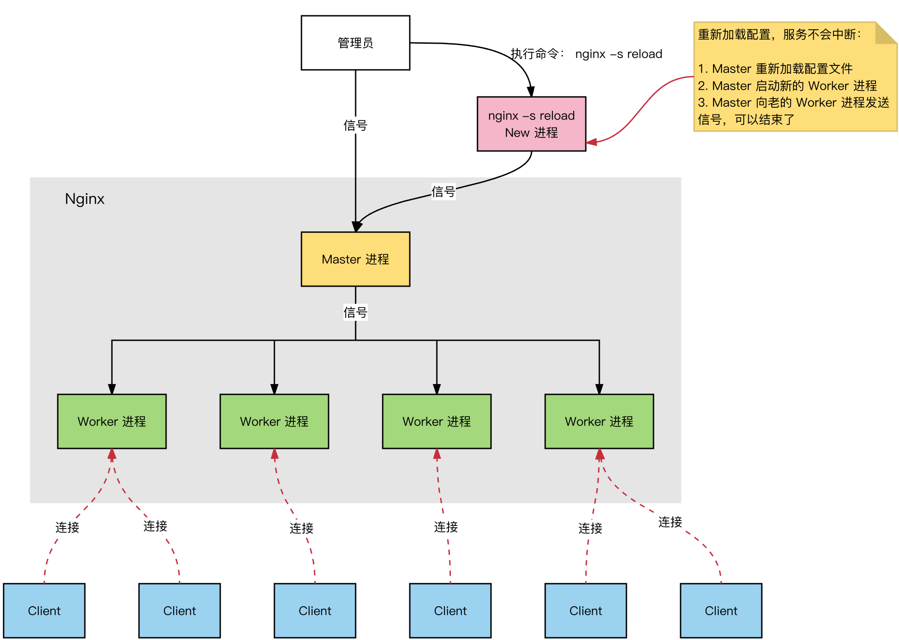
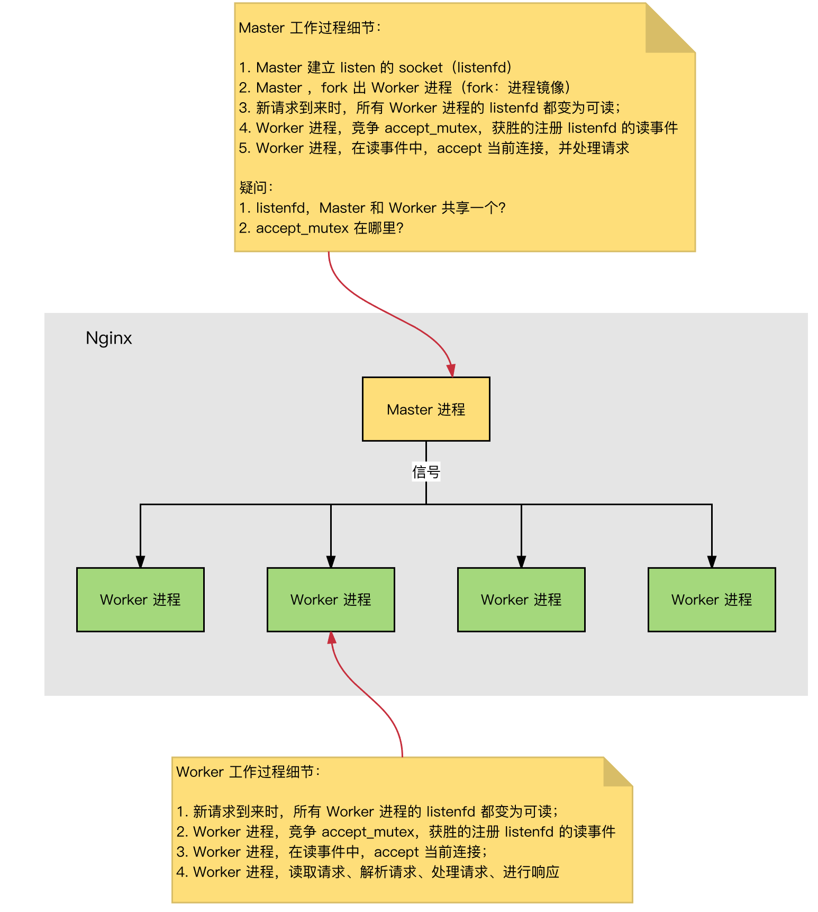
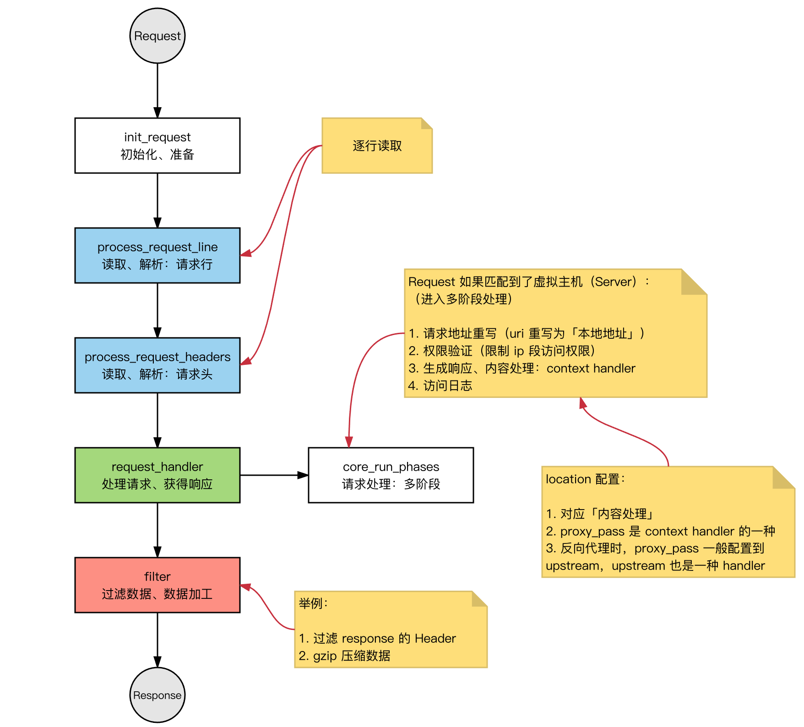

# nginx

### docker安装

```shell
docker pull ngnix

docker run --name nginx -m 200m -p 80:80 \
-v /Users/apple/DockerFile/nginx/nginx.conf:/etc/nginx/nginx.conf \
-v /Users/apple/DockerFile/nginx/conf:/etc/nginx/conf.d \
-v /Users/apple/DockerFile/nginx/html:/usr/share/nginx/html \
-e TZ=Asia/Shanghai \
--privileged=true -d nginx
```


```Text
docker cp ecstatic_jepsen:/etc/nginx/nginx.conf /Users/apple/DockerFile/nginx/
docker cp ecstatic_jepsen:/etc/nginx/conf.d /Users/apple/DockerFile/nginx/conf
```


### 静态资源解决跨域

```
server {
                listen          80;
                add_header 'Access-Control-Allow-Origin' '*';
        }
```


## 为什么使用nginx？

* 限制其托管应用程序的对外公开部分
* 提供附加的配置和防御层
* 方便与现有基础架构更好地集成
* 简化负载平衡和安全通信（HTTPS）配置。只有反向代理服务器需要 X.509 证书，并且该服务器可以使用 HTTP 与内部网络上的应用服务器进行通信。

## Nginx 的进程模型




Nginx 服务器，正常运行过程中：

1. 多进程：一个 Master 进程、多个 Worker 进程
2. Master 进程：管理 Worker 进程
3. 对外接口：接收外部的操作（信号）
4. 对内转发：根据外部的操作的不同，通过信号管理 Worker
5. 监控：监控 worker 进程的运行状态，worker 进程异常终止后，自动重启 worker 进程
6. Worker 进程：所有 Worker 进程都是平等的
7. 实际处理：网络请求，由 Worker 进程处理；
8. Worker 进程数量：在 nginx.conf 中配置，一般设置为核心数，充分利用 CPU 资源，同时，避免进程数量过多，避免进程竞争 CPU 资源，增加上下文切换的损耗。

#### 思考

1. 请求是连接到 Nginx，Master 进程负责处理和转发？
2. 如何选定哪个 Worker 进程处理请求？请求的处理结果，是否还要经过 Master 进程？



## HTTP 连接建立和请求处理过程

1. Nginx 启动时，Master 进程，加载配置文件
2. Master 进程，初始化监听的 socket
3. Master 进程，fork 出多个 Worker 进程
4. Worker 进程，竞争新的连接，获胜方通过三次握手，建立 Socket 连接，并处理请求

## Nginx 高性能、高并发

* Nginx 采用：多进程 + 异步非阻塞方式（IO 多路复用 epoll）
* 请求的完整过程：
   1. 建立连接
   1. 读取请求：解析请求
   1. 处理请求
   1. 响应请求
   

请求的完整过程，对应到底层，就是：读写 socket 事件

## Nginx 的事件处理模型

request：Nginx 中 http 请求。

基本的 HTTP Web Server 工作模式：

1. 接收请求：逐行读取请求行和请求头，判断段有请求体后，读取请求体
2. 处理请求
3. 返回响应：根据处理结果，生成相应的 HTTP 请求（响应行、响应头、响应体）

Nginx 也是这个套路，整体流程一致。



## 模块化体系结构


nginx的模块根据其功能基本上可以分为以下几种类型：

* event module: 搭建了独立于操作系统的事件处理机制的框架，及提供了各具体事件的处理。包括ngx_events_module， ngx_event_core_module和ngx_epoll_module等。nginx具体使用何种事件处理模块，这依赖于具体的操作系统和编译选项。
* phase handler: 此类型的模块也被直接称为handler模块。主要负责处理客户端请求并产生待响应内容，比如ngx_http_static_module模块，负责客户端的静态页面请求处理并将对应的磁盘文件准备为响应内容输出。
* output filter: 也称为filter模块，主要是负责对输出的内容进行处理，可以对输出进行修改。例如，可以实现对输出的所有html页面增加预定义的footbar一类的工作，或者对输出的图片的URL进行替换之类的工作。
* upstream: upstream模块实现反向代理的功能，将真正的请求转发到后端服务器上，并从后端服务器上读取响应，发回客户端。upstream模块是一种特殊的handler，只不过响应内容不是真正由自己产生的，而是从后端服务器上读取的。
* load-balancer: 负载均衡模块，实现特定的算法，在众多的后端服务器中，选择一个服务器出来作为某个请求的转发服务器。

#### IO 多路复用 和 多线程 的适用场景？

* IO 多路复用：单个连接的请求处理速度没有优势，适合 IO 密集型 场景，事件驱动
* 大并发量：只使用一个线程，处理大量的并发请求，降低上下文环境切换损耗，也不需要考虑并发问题，相对可以处理更多的请求；
* 消耗更少的系统资源（不需要线程调度开销）
* 适用于长连接的情况（多线程模式长连接容易造成线程过多，造成频繁调度）
* 阻塞IO + 多线程：实现简单，可以不依赖系统调用，适合 CPU 密集型 场景
* 每个线程，都需要时间和空间；
* 线程数量增长时，线程调度开销指数增长

## Nginx 最大连接数

#### 基础背景：

1. Nginx 是多进程模型，Worker 进程用于处理请求；
2. 单个进程的连接数（文件描述符 fd），有上限（nofile）：ulimit -n
3. Nginx 上配置单个 worker 进程的最大连接数：worker_connections 上限为 nofile
4. Nginx 上配置 worker 进程的数量：worker_processes

####  因此，Nginx 的最大连接数：

1. Nginx 的最大连接数：Worker 进程数量 x 单个 Worker 进程的最大连接数
2. 上面是 Nginx 作为通用服务器时，最大的连接数
3. Nginx 作为反向代理服务器时，能够服务的最大连接数：（Worker 进程数量 x 单个 Worker 进程的最大连接数）/ 2。
4. Nginx 反向代理时，会建立 Client 的连接和后端 Web Server 的连接，占用 2 个连接

###### 思考：

1. 每打开一个 socket 占用一个 fd
2. 为什么，一个进程能够打开的 fd 数量有限制？

## IO 模型

#### 场景：

处理多个请求时，可以采用：IO 多路复用 或者 阻塞 IO +多线程

* IO 多路服用：一个 线程，跟踪多个 socket 状态，哪个就绪，就读写哪个；
* 阻塞 IO + 多线程：每一个请求，新建一个服务线程

#### 思考：IO 多路复用 和 多线程 的适用场景？

* IO 多路复用：单个连接的请求处理速度没有优势
* 大并发量：只使用一个线程，处理大量的并发请求，降低上下文环境切换损耗，也不需要考虑并发问题，相对可以处理更多的请求；
* 消耗更少的系统资源（不需要线程调度开销）
* 适用于长连接的情况（多线程模式长连接容易造成线程过多，造成频繁调度）
* 阻塞IO + 多线程：实现简单，可以不依赖系统调用。
* 每个线程，都需要时间和空间；
* 线程数量增长时，线程调度开销指数增长
* select/poll 和 epoll 比较

#### 详细内容，参考：

###### select poll epoll三者之间的比较
select/poll 系统调用：

```yaml
// select 系统调用
int select(int maxfdp,fd_set *readfds,fd_set *writefds,fd_set *errorfds,struct timeval *timeout); 
// poll 系统调用
int poll(struct pollfd fds[], nfds_t nfds, int timeout)；

```

**select**

* 查询 fd_set 中，是否有就绪的 fd，可以设定一个超时时间，当有 fd (File descripter) 就绪或超时返回；
* fd_set 是一个位集合，大小是在编译内核时的常量，默认大小为 1024
* 特点：
* 连接数限制，fd_set 可表示的 fd 数量太小了；
* 线性扫描：判断 fd 是否就绪，需要遍历一边 fd_set；
* 数据复制：用户空间和内核空间，复制连接就绪状态信息

**poll：**

* 解决了连接数限制：
* poll 中将 select 中的 fd_set 替换成了一个 pollfd 数组
* 解决 fd 数量过小的问题
* 数据复制：用户空间和内核空间，复制连接就绪状态信息

**epoll： event 事件驱动**

* 事件机制：避免线性扫描
* 为每个 fd，注册一个监听事件
* fd 变更为就绪时，将 fd 添加到就绪链表
* fd 数量：无限制（OS 级别的限制，单个进程能打开多少个 fd）

**select，poll，epoll：**

1. I/O多路复用的机制；
1. I/O多路复用就通过一种机制，可以监视多个描述符，一旦某个描述符就绪（一般是读就绪或者写就绪），能够通知程序进行相应的读写操作。
1. 监视多个文件描述符
1. 但select，poll，epoll本质上都是同步I/O：
1. 用户进程负责读写（从内核空间拷贝到用户空间），读写过程中，用户进程是阻塞的；
1. 异步 IO，无需用户进程负责读写，异步IO，会负责从内核空间拷贝到用户空间；

## Nginx 的并发处理能力

#### 关于 Nginx 的并发处理能力：

并发连接数，一般优化后，峰值能保持在 1~3w 左右。（内存和 CPU 核心数不同，会有进一步优化空间）


Nginx是一款轻量级的Web服务器、反向代理服务器，由于它的内存占用少，启动极快，高并发能力强，在互联网项目中广泛应用。


架构图

上图基本上说明了当下流行的技术架构，其中Nginx有点入口网关的味道。

## 反向代理服务器？

经常听人说到一些术语，如反向代理，那么什么是反向代理，什么又是正向代理呢？

**正向代理：**


正向代理示意图

**反向代理：**


反向代理示意图

由于防火墙的原因，我们并不能直接访问谷歌，那么我们可以借助VPN来实现，这就是一个简单的正向代理的例子。这里你能够发现，正向代理“代理”的是客户端，而且客户端是知道目标的，而目标是不知道客户端是通过VPN访问的。

当我们在外网访问百度的时候，其实会进行一个转发，代理到内网去，这就是所谓的反向代理，即反向代理“代理”的是服务器端，而且这一个过程对于客户端而言是透明的。

## Nginx的Master-Worker模式


nginx进程

启动Nginx后，其实就是在80端口启动了Socket服务进行监听，如图所示，Nginx涉及Master进程和Worker进程。


Master-Worker模式


nginx.conf

Master进程的作用是？

**读取并验证配置文件nginx.conf；管理worker进程；**

Worker进程的作用是？

**每一个Worker进程都维护一个线程（避免线程切换），处理连接和请求；注意Worker进程的个数由配置文件决定，一般和CPU个数相关（有利于进程切换），配置几个就有几个Worker进程。**

## 思考：Nginx如何做到热部署？

所谓热部署，就是配置文件nginx.conf修改后，不需要stop Nginx，不需要中断请求，就能让配置文件生效！（nginx -s reload 重新加载/nginx -t检查配置/nginx -s stop）

通过上文我们已经知道worker进程负责处理具体的请求，那么如果想达到热部署的效果，可以想象：

方案一：

修改配置文件nginx.conf后，主进程master负责推送给woker进程更新配置信息，woker进程收到信息后，更新进程内部的线程信息。（有点valatile的味道）

方案二：

修改配置文件nginx.conf后，重新生成新的worker进程，当然会以新的配置进行处理请求，而且新的请求必须都交给新的worker进程，至于老的worker进程，等把那些以前的请求处理完毕后，kill掉即可。

Nginx采用的就是方案二来达到热部署的！

## 思考：Nginx如何做到高并发下的高效处理？

上文已经提及Nginx的worker进程个数与CPU绑定、worker进程内部包含一个线程高效回环处理请求，这的确有助于效率，但这是不够的。

**作为专业的程序员，我们可以开一下脑洞：BIO/NIO/AIO、异步/同步、阻塞/非阻塞...**

要同时处理那么多的请求，要知道，有的请求需要发生IO，可能需要很长时间，如果等着它，就会拖慢worker的处理速度。

**Nginx采用了Linux的epoll模型，epoll模型基于事件驱动机制，它可以监控多个事件是否准备完毕，如果OK，那么放入epoll队列中，这个过程是异步的。worker只需要从epoll队列循环处理即可。**

## 思考：Nginx挂了怎么办？

Nginx既然作为入口网关，很重要，如果出现单点问题，显然是不可接受的。

答案是：**Keepalived+Nginx实现高可用**。

Keepalived是一个高可用解决方案，主要是用来防止服务器单点发生故障，可以通过和Nginx配合来实现Web服务的高可用。（其实，Keepalived不仅仅可以和Nginx配合，还可以和很多其他服务配合）

Keepalived+Nginx实现高可用的思路：

第一：请求不要直接打到Nginx上，应该先通过Keepalived（这就是所谓虚拟IP，VIP）

第二：Keepalived应该能监控Nginx的生命状态（提供一个用户自定义的脚本，定期检查Nginx进程状态，进行权重变化,，从而实现Nginx故障切换）


Keepalived+Nginx

## 我们的主战场：nginx.conf

很多时候，在开发、测试环境下，我们都得自己去配置Nginx，就是去配置nginx.conf。

nginx.conf是典型的分段配置文件，下面我们来分析下。

## 虚拟主机


http的server段


访问结果

其实这是把Nginx作为web server来处理静态资源。

第一：location可以进行正则匹配，应该注意正则的几种形式以及优先级。（这里不展开）

第二：Nginx能够提高速度的其中一个特性就是：动静分离，就是把静态资源放到Nginx上，由Nginx管理，动态请求转发给后端。

**第三：我们可以在Nginx下把静态资源、日志文件归属到不同域名下（也即是目录），这样方便管理维护。**

**第四：Nginx可以进行IP访问控制，有些电商平台，就可以在Nginx这一层，做一下处理，内置一个黑名单模块，那么就不必等请求通过Nginx达到后端在进行拦截，而是直接在Nginx这一层就处理掉。**

## 反向代理【proxy_pass】

所谓反向代理，很简单，其实就是在location这一段配置中的root替换成**proxy_pass**即可。root说明是静态资源，可以由Nginx进行返回；而proxy_pass说明是动态请求，需要进行转发，比如代理到Tomcat上。

反向代理，上面已经说了，过程是透明的，比如说request -> Nginx -> Tomcat，那么对于Tomcat而言，请求的IP地址就是Nginx的地址，而非真实的request地址，这一点需要注意。不过好在Nginx不仅仅可以反向代理请求，还可以由用户**自定义设置HTTP HEADER**。

## 负载均衡【upstream】

上面的反向代理中，我们通过proxy_pass来指定Tomcat的地址，很显然我们只能指定一台Tomcat地址，那么我们如果想指定多台来达到负载均衡呢？

第一，通过**upstream**来定义一组Tomcat，并指定负载策略（IPHASH、加权论调、最少连接），健康检查策略（Nginx可以监控这一组Tomcat的状态）等。

第二，将proxy_pass替换成upstream指定的值即可。

**负载均衡可能带来的问题？**

负载均衡所带来的明显的问题是，一个请求，可以到A server，也可以到B server，这完全不受我们的控制，当然这也不是什么问题，只是我们得注意的是：**用户状态的保存问题，如Session会话信息，不能在保存到服务器上。**

## 缓存

缓存，是Nginx提供的，可以加快访问速度的机制，说白了，在配置上就是一个开启，同时指定目录，让缓存可以存储到磁盘上。具体配置，大家可以参考Nginx官方文档，这里就不在展开了。
