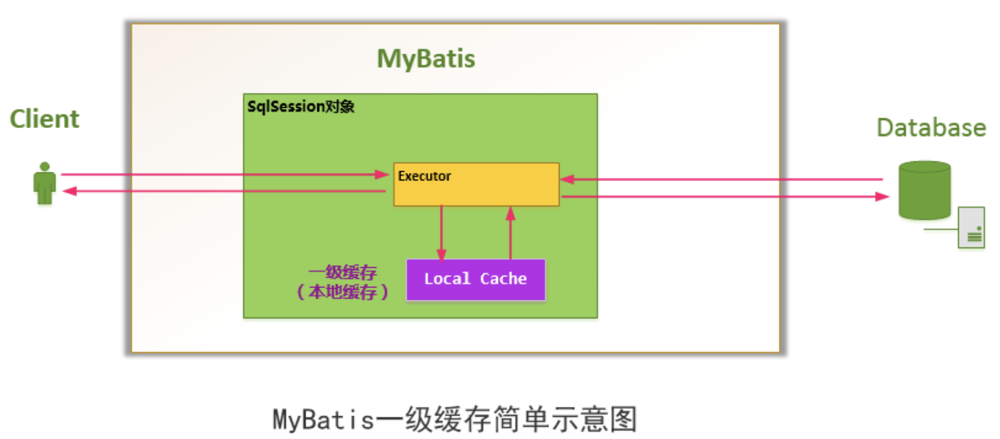
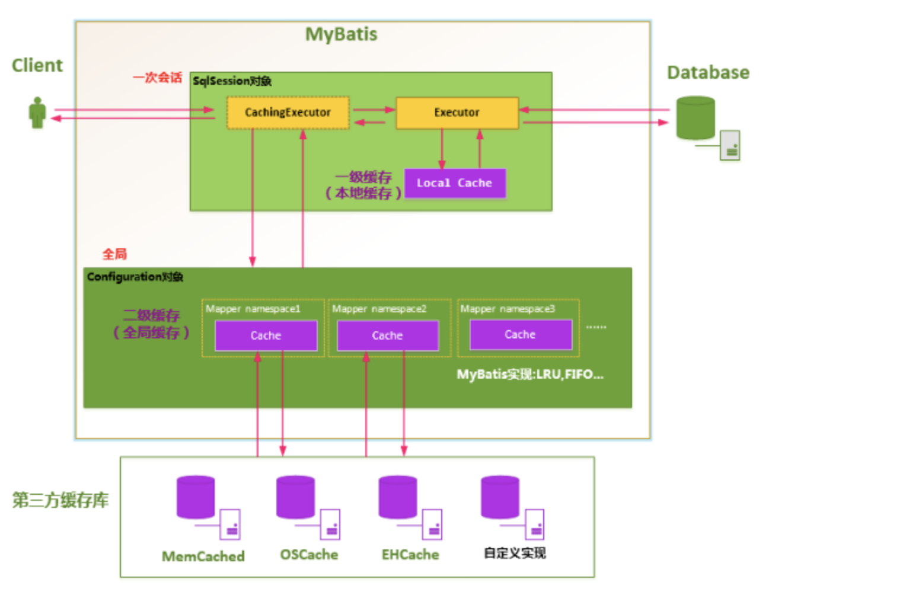

# Mybatis鸡肋的缓存体系

众所周知mybatis缓存体系分为一级缓存和二级缓存，所以今天就分别聊聊这两级缓存。

## 一级缓存

Mybatis对缓存提供支持，但是在没有配置的默认情况下，它只开启一级缓存，一级缓存只是相对于同一个SqlSession而言。

在参数和SQL完全一样的情况下，我们使用同一个SqlSession对象调用一个Mapper方法，往往只执行一次SQL，因为使用SelSession第一次查询后，MyBatis会将其放在缓存中，以后再查询的时候，如果没有声明需要刷新，并且缓存没有超时的情况下，SqlSession都会取出当前缓存的数据，而不会再次发送SQL到数据库。



一级缓存的使用是不需要任何配置的，直接使用session就可以使用一级缓存。代码如下:

```java
  public <E> List<E> selectList(String statement, Object parameter, RowBounds rowBounds) {
    try {
      MappedStatement ms = configuration.getMappedStatement(statement);
      return executor.query(ms, wrapCollection(parameter), rowBounds, Executor.NO_RESULT_HANDLER);
    }...
    }
  }
 
   public <E> List<E> query(MappedStatement ms, Object parameter, RowBounds rowBounds, ResultHandler resultHandler) throws SQLException {
    BoundSql boundSql = ms.getBoundSql(parameter);
    CacheKey key = createCacheKey(ms, parameter, rowBounds, boundSql);
    return query(ms, parameter, rowBounds, resultHandler, key, boundSql);
 }

  public <E> List<E> query(MappedStatement ms, Object parameter, RowBounds rowBounds, ResultHandler resultHandler, CacheKey key, BoundSql boundSql) throws SQLException {
    ...
        list = queryFromDatabase(ms, parameter, rowBounds, resultHandler, key, boundSql);
      ...
    return list;
  }
 
   private <E> List<E> queryFromDatabase(MappedStatement ms, Object parameter, RowBounds rowBounds, ResultHandler resultHandler, CacheKey key, BoundSql boundSql) throws SQLException {
    List<E> list;
    localCache.putObject(key, EXECUTION_PLACEHOLDER);
    try {
      list = doQuery(ms, parameter, rowBounds, resultHandler, boundSql);
    } finally {
      localCache.removeObject(key);
    }
    localCache.putObject(key, list);
    if (ms.getStatementType() == StatementType.CALLABLE) {
      localOutputParameterCache.putObject(key, parameter);
    }
    return list;
  }

```

localCache就是所谓的一级缓存。
```java
this.localCache = new PerpetualCache("LocalCache");

public class PerpetualCache implements Cache {

  private final String id;

  private Map<Object, Object> cache = new HashMap<Object, Object>();

  public PerpetualCache(String id) {
    this.id = id;
  }
 }

```
从代码中可以看出localCache是一个PerpetualCache的实现类。在该类里面，存了一个hashmap,这便是一级缓存。看到这儿大家会发现一级缓存是如此简单，以至于没有任何的淘汰，过期策略! 如果一直执行查询的话，一级缓存会不断增加。那么什么时候一级缓存会清空呢？两种情况:

1. 执行增，删，改，之类的写操作的时候，一级缓存会清空。
2. 当session执行commit的时候，一级缓存会清空。

看到这儿大家会发现，一级缓存并不好用。

1. 首先每次修改数据库的时候，缓存都会被清空 对，是清空!
2. 其次，因为没有过期，淘汰之类的策略，长时间的查询会导致缓存变得异常庞大。只能通过session的commit操作来清空缓存，对又是清空!

这边还有个细节就是当mybatis与spring整合的时候，mybatis在SqlSessionTemplate类中给session封装了一层SqlSessionInterceptor，而这个类中有这样一个逻辑。


```java
  private class SqlSessionInterceptor implements InvocationHandler {
    @Override
    public Object invoke(Object proxy, Method method, Object[] args) throws Throwable {
      ...
        Object result = method.invoke(sqlSession, args);
        if (!isSqlSessionTransactional(sqlSession, SqlSessionTemplate.this.sqlSessionFactory)) {
          sqlSession.commit(true);
        }
        return result;
      ...
    }
  }

```
如果该线程没有开启事务则执行sqlSession.commit(true)。也就是清空一级缓存。所以大家在spring中使用mybatis的话，是不用担心一级缓存的问题的，因为每次操作后都会删掉。当然在spring中你也别想使用一级缓存。

## 二级缓存

MyBatis的二级缓存是Application级别的缓存，它可以提高对数据库查询的效率，以提高应用的性能。

MyBatis的缓存机制整体设计以及二级缓存的工作模式



SqlSessionFactory层面上的二级缓存默认是不开启的，二级缓存的开启需要进行配置，实现二级缓存的时候，MyBatis要求返回的POJO必须是可序列化的。也就是要求实现Serializable接口，配置方法很简单，只需要在映射XML文件配置就可以开启缓存了<cache/>，如果我们配置了二级缓存就意味着：

（1）映射语句文件中的所有select语句将会被缓存。
（2）映射语句文件中的所有insert、update和delete语句会刷新缓存。
（3）缓存会使用默认的Least Recently Used（LRU，最近最少使用的）算法来收回。
（4）根据时间表，比如No Flush Interval,（CNFI没有刷新间隔），缓存不会以任何时间顺序来刷新。
（5）缓存会存储列表集合或对象(无论查询方法返回什么)的1024个引用
（6）缓存会被视为是read/write(可读/可写)的缓存，意味着对象检索不是共享的，而且可以安全的被调用者修改，不干扰其他调用者或线程所做的潜在修改。

二级缓存使用需要开启一下配置，首先在mapper文件中添加cache配置。

```java
<mapper namespace="***">
    <cache/>
</mapper>
```
其次数据bean还需要实现Serializable接口。这样就可以开启二级缓存了。二级缓存代码如下:

```java
public <E> List<E> selectList(String statement, Object parameter, RowBounds rowBounds) {
    try {
      MappedStatement ms = configuration.getMappedStatement(statement);
      return executor.query(ms, wrapCollection(parameter), rowBounds, Executor.NO_RESULT_HANDLER);
    } ...
    }
  }
 
   public <E> List<E> query(MappedStatement ms, Object parameterObject, RowBounds rowBounds, ResultHandler resultHandler) throws SQLException {
    BoundSql boundSql = ms.getBoundSql(parameterObject);
    CacheKey key = createCacheKey(ms, parameterObject, rowBounds, boundSql);
    return query(ms, parameterObject, rowBounds, resultHandler, key, boundSql);
  }
 
   public <E> List<E> query(MappedStatement ms, Object parameterObject, RowBounds rowBounds, ResultHandler resultHandler, CacheKey key, BoundSql boundSql)
      throws SQLException {
    Cache cache = ms.getCache();
    ...
        List<E> list = (List<E>) tcm.getObject(cache, key);
        if (list == null) {
          list = delegate.<E> query(ms, parameterObject, rowBounds, resultHandler, key, boundSql);
          tcm.putObject(cache, key, list); 
        }
        return list;
      }
      ...
  }

```

这个地方cache就是二级缓存。当然二级缓存在使用上和一级缓存稍有区别。一级缓存执行session.commit()之后，缓存就清空了。二级缓存则必须执行session.commit()数据才会被真正的缓存下来。这边可以看一下 tcm.putObject(cache, key, list); 这个方法


```java
 public void putObject(Cache cache, CacheKey key, Object value) {
    getTransactionalCache(cache).putObject(key, value);
  }
 
   public void putObject(Object key, Object object) {
   数据仅仅是被存到了entriesToAddOnCommit这个里面
    entriesToAddOnCommit.put(key, object);
  }
 
 session.commit();

  public void commit(boolean force) {
    try {
      executor.commit(isCommitOrRollbackRequired(force));
      dirty = false;
    } catch (Exception e) {
      throw ExceptionFactory.wrapException("Error committing transaction.  Cause: " + e, e);
    } finally {
      ErrorContext.instance().reset();
    }
  }
 
   public void commit(boolean required) throws SQLException {
    delegate.commit(required);
    //这个方法才是真正存数据的方法
    tcm.commit();
  }
 
   public void commit() {
    for (TransactionalCache txCache : transactionalCaches.values()) {
      txCache.commit();
    }
  }
 
   public void commit() {
    if (clearOnCommit) {
      delegate.clear();
    }
    flushPendingEntries();
    reset();
  }
 
   private void flushPendingEntries() {
    for (Map.Entry<Object, Object> entry : entriesToAddOnCommit.entrySet()) {
      delegate.putObject(entry.getKey(), entry.getValue());
    }
    for (Object entry : entriesMissedInCache) {
      if (!entriesToAddOnCommit.containsKey(entry)) {
        delegate.putObject(entry, null);
      }
    }
  }

```

二级缓存是带有过期和淘汰策略的。进入XMLMapperBuilder的cacheElement方法:

```java
  private void cacheElement(XNode context) throws Exception {
    if (context != null) {
      String type = context.getStringAttribute("type", "PERPETUAL");
      Class<? extends Cache> typeClass = typeAliasRegistry.resolveAlias(type);
      String eviction = context.getStringAttribute("eviction", "LRU");
      Class<? extends Cache> evictionClass = typeAliasRegistry.resolveAlias(eviction);
      Long flushInterval = context.getLongAttribute("flushInterval");
      Integer size = context.getIntAttribute("size");
      boolean readWrite = !context.getBooleanAttribute("readOnly", false);
      boolean blocking = context.getBooleanAttribute("blocking", false);
      Properties props = context.getChildrenAsProperties();
      builderAssistant.useNewCache(typeClass, evictionClass, flushInterval, size, readWrite, blocking, props);
    }
  }

```

这个地方可以看到和缓存相关的配置以及默认值。这边逻辑比较简单大家自己看看就好。
那么相比于一级缓存而言，拥有了过期，淘汰等策略，还可以自定义的二级缓存是不是就好用一点了呢？至少我觉得不是，因为翻看代码可以发现，在默认情况下，**每次执行增删改等操作的时候，二级缓存也会被清空**。这等于手动触发缓存雪崩啊。当然你可以自己定义，但是因为CacheKey是固定生成模式，想要自己定义，得自己解析相应的key或者结果集，还是比较麻烦的。
