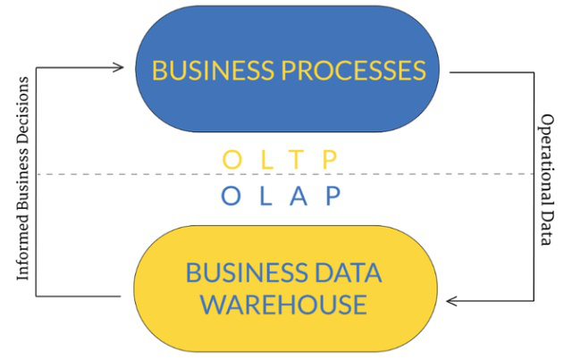
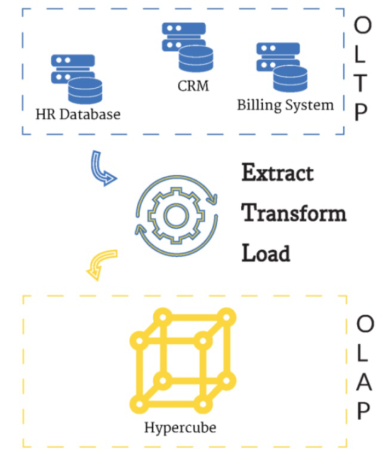

# OLTP与OLAP

为了完全理解OLTP(联机事务处理)和OLAP(联机分析处理)，有必要结合一些行业背景来谈。
在软件技术发展的早期，数据通常存储在一个文件中。
随后，IT需要解决的问题越来越大，关系数据库管理系统(DBMS)开始席卷市场。
在接下来的几十年里，它几乎成为了每个企业的数据存储解决方案。

随着网络的出现，一切都发生了巨大的变化。搜索引擎和社交网络如今会在某些网域中对数据进行建模，这些数据之间的关系不容易识别，有时甚至根本不需要(例如搜索引擎索引文档)。

不过，一些传统的术语今天仍然在使用，用现代的方法来看待它们是很重要的。
其中两个就是OLTP和OLAP，下面的图片显示了OLTP和OLAP之间的关系。

OLTP是一个在线交易系统；OLAP是一个在线检索和分析系统

上图强调的是，OLTP和OLAP并非解决同一问题，不存在竞争关系，而是相互补充的过程。下面是更深入的解释。

#### 关于OLTP

OLTP，即联机事务处理，它通常会涉及到那些存储和管理与系统/公司日常运营有关数据的数据库。在过去，OLTP通常与正在运行的关系数据库相关联，其主要关注点是从给定环境正在发生的事情中收集数据。

简而言之:OLTP用于存储和管理日常运营的数据。

由于存储在OLTP数据仓库上的信息通常对业务来说至关重要，所以往往需要付出巨大的努力来确保数据的原子性、一致性、隔离性和持久性(即ACID)。根据这四个原则存储的数据会被标记为与ACID兼容，这就是关系数据库管理系统的优势所在。

但是拥有一个与ACID兼容的数据仓库并不意味着我们不需要做任何额外的工作来保证数据符合这些原则。我们处理数据的方式很重要，例如，如果在数据存储中允许冗余，我们如何保证数据的一致性?

如果我们要存储客户的地址，重要的是要确保当客户移动到另一个地方时，这个地址在任何地方都是更新的。但是，将地址存储在多个位置会使数据很难保持一致的状态。这就是为什么关系数据库常常被设计成与第五种范式(5NF)相匹配——一种避免冗余的关系数据设计方法。

正如前面所说，自从定义OLTP术语以来，世界已经发生了变化，现在很容易在非关系数据库中存储数据。这些数据存储大部分只符合ACID的四个原则中的一部分。但是，根据用例的不同，可以适当放宽这些原则中的一两个，以换取其他收益(速度、可伸缩性等)。

例如，如果我们在存储社交网络的帖子中“赞”的数量时，保证“赞”数量100%准确真的很重要吗?或者说，可不可以显示995个赞而不是准确的998个，以换取对数百万用户的更快响应?

由于OLTP指的是联机事务处理，所以我们看到它并不局限于关系数据库，甚至不完全附从ACID数据库。它只是指使用这些数据存储的方式，例如，如果我们使用文档数据存储(例如MongoDB)来存储和处理来自社交应用程序日常运营的数据(例如注册用户、存储点赞等)，我们也可以说它是OLTP。

#### 关于OLAP

OLAP，即联机分析处理，通常涉及到那些存储和管理与分析和决策相关的数据的数据库。

OLAP与商业智能(BI)紧密相关，BI是一种专门的软件开发模式，用于交付业务分析应用程序。换句话说，BI的目标是允许高层管理人员在没有IT人员参与的情况下查询和研究数据。

简而言之:OLAP用于分析数据并做出决策。

这个领域带来的最大进步是实时生成报告的能力，它不需要另外再请IT部门来定制报告，而是自动生成特定的报告。BI系统可以回答开发人员不需要提前知道的问题。

BI系统可以通过以一种名叫Hypercube(超立方体)的形式组织数据来实现，此形式会探索数据的多个维度，并允许用户通过操纵立方体的大小维度来聚合或下钻数据。

有趣的是，有了正确的接口，高层管理人员就可以在没有帮助的情况下动态生成报告。

OLAP系统可以使用关系数据库实现，这种技术通常称为ROLAP(关系OLAP)。但为此，我们需要用第三范式而不是第五范式来设计数据库。

在分析数据时，我们可以处理冗余数据，真正重要的是浏览数据维度的能力。这就是ROLAP的亮点，因为第三范式的数据库模式适合于聚合和下钻。

#### 将它们相结合

当第一次遇到OLTP和OLAP这两个术语时，很容易产生疑问：哪个更好?实际上，我们应该问的是：他们如何互相补充?

我们现在知道:

OLTP用于存储和管理日常操作的数据;

OLAP用于分析这些数据。

这正是它们在现有业务中使用的方式。

#### OLTP和OLAP协同工作

上述示例中上部的数据(HR数据库、CRM、计费系统)一般是通过一个萃取、转置和加载(Extract, Transform and Load, ETL)的过程进行批量处理(通常是在夜间)。它用于从多个OLTP源收集数据并将其放入OLAP数据仓库(允许跨系统分析)。在图的下半部分，您可以看到数据在OLAP立方体中得到了正确的存储和组织。

这样，进行分析的人员就可以处理最新的信息，并及时做出决定，而不会中断操作。
