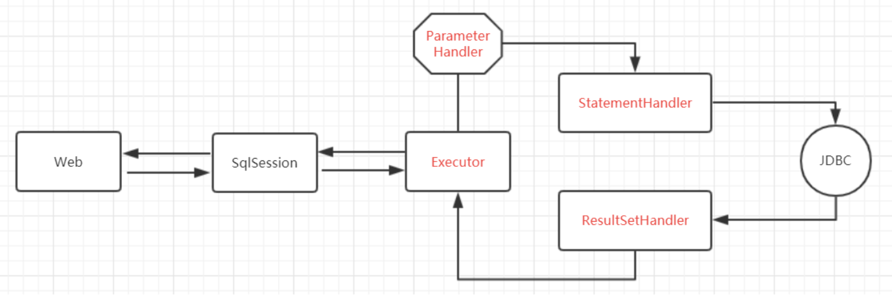

# Mybatis工作原理与核心流程

## 前言

MyBatis的底层操作封装了JDBC的API，MyBatis的工作原理以及核心流程与JDBC的使用步骤一脉相承，MyBatis的核心对象（SqlSession，Executor）与JDBC的核心对象（Connection，Statement）相互对应。

## 如何掌握MyBatis的工作原理？

关于MyBatis的工作原理，网上的文章是汗牛充栋，但是站长觉得，要结合JDBC来理解MyBatis的工作原理往往才能更透彻。我们知道，JDBC有四个核心对象：

1. DriverManager，用于注册数据库连接
2. Connection，与数据库连接对象
3. Statement/PrepareStatement，操作数据库SQL语句的对象
4. ResultSet，结果集或一张虚拟表

而MyBatis也有四大核心对象：

1. SqlSession对象，该对象中包含了执行SQL语句的所有方法【1】。类似于JDBC里面的Connection 【2】。
2. Executor接口，它将根据SqlSession传递的参数动态地生成需要执行的SQL语句，同时负责查询缓存的维护。类似于JDBC里面的Statement/PrepareStatement。
3. MappedStatement对象，该对象是对映射SQL的封装，用于存储要映射的SQL语句的id、参数等信息。
4. ResultHandler对象，用于对返回的结果进行处理，最终得到自己想要的数据格式或类型。可以自定义返回类型。

在JDBC中，Connection不直接执行SQL方法，而是利用Statement或者PrepareStatement来执行方法。在使用JDBC建立了连接之后，可以使用Connection接口的createStatement()方法来获取Statement对象，也可以调用prepareStatement()方法获得PrepareStatement对象，通过executeUpdate()方法来执行SQL语句。而在MyBatis中，SqlSession对象包含了执行SQL语句的所有方法，但是它是委托Executor执行的。从某种意义上来看，MyBatis里面的SqlSession类似于JDBC中的Connection，他们都是委托给其他类去执行。虽然SqlSession对象包含了执行SQL语句的所有方法，但是它同样包括了<**T**> T getMapper(Class<**T**> type);所以SqlSession也可以委托给映射器来执行数据的增删改查操作，这样来看，SqlSession是不是也类似于JDBC中的Connection呢？

## MyBatis的工作原理以及核心流程详解

上面中流程就是MyBatis内部核心流程，每一步流程的详细说明如下文所述：

1. 读取MyBatis的配置文件。mybatis-config.xml为MyBatis的全局配置文件，用于配置数据库连接信息。
2. 加载映射文件。映射文件即SQL映射文件，该文件中配置了操作数据库的SQL语句，需要在MyBatis配置文件mybatis-config.xml中加载。mybatis-config.xml 文件可以加载多个映射文件，每个文件对应数据库中的一张表。
3. 构造会话工厂。通过MyBatis的环境配置信息构建会话工厂SqlSessionFactory。
4. 创建会话对象。由会话工厂创建SqlSession对象，该对象中包含了执行SQL语句的所有方法。
5. Executor执行器。MyBatis底层定义了一个Executor接口来操作数据库，它将根据SqlSession传递的参数动态地生成需要执行的SQL语句，同时负责查询缓存的维护。
6. MappedStatement对象。在Executor接口的执行方法中有一个MappedStatement类型的参数，该参数是对映射信息的封装，用于存储要映射的SQL语句的id、参数等信息。
7. 输入参数映射。输入参数类型可以是Map、List等集合类型，也可以是基本数据类型和POJO类型。输入参数映射过程类似于JDBC对preparedStatement对象设置参数的过程。
8. 输出结果映射。输出结果类型可以是Map、List等集合类型，也可以是基本数据类型和POJO类型。输出结果映射过程类似于JDBC对结果集的解析过程。

## 核心类

#### SqlSessionFactoryBuilder

每一个MyBatis的应用程序的入口是SqlSessionFactoryBuilder。它的作用是通过XML配置文件创建Configuration对象，然后通过build方法创建SqlSessionFactory对象。

没有必要每次访问Mybatis就创建一次SqlSessionFactoryBuilder，通常的做法是创建一个全局的对象就可以了。

#### SqlSessionFactory

SqlSessionFactory的主要功能是创建SqlSession对象，和SqlSessionFactoryBuilder对象一样，没有必要每次访问Mybatis就创建一次SqlSessionFactory，通常的做法是创建一个全局的对象就可以了。

#### SqlSession

SqlSession类的主要功能是完成一次数据库的访问和结果的映射，它类似于一次会话概念，顾命名为：SqlSession。

SqlSession类似于JDBC里面的Connection，Connection不是线程安全的，SqlSession也不是线程安全的。由于不是线程安全的，所以SqlSession对象的作用域需限制方法内。

SqlSession的默认实现类是DefaultSqlSession，它有两个必须配置的属性：Configuration和Executor。mybatis-config.xml中的配置，最后会解析xml成Configuration这个类。SqlSession对数据库的操作都是通过Executor来完成的。

SqlSession有一个重要的方法getMapper，顾名思义，这个方式是用来获取Mapper映射器的。

#### Executor

Executor对象在创建Configuration对象的时候创建，并且缓存在Configuration对象里。

Executor对象的主要功能是调用StatementHandler访问数据库，并将查询结果存入缓存中（如果配置了缓存的话）。

#### StatementHandler

StatementHandler是真正访问数据库的地方，并调用ResultSetHandler处理查询结果。

#### ResultSetHandler

处理查询结果。

### MyBatis核心类工作流程

以上核心类，侧重于刻画数据库的交互过程，而在SQL封装以及动态SQL方面，还有两大核心类：MappedStatement和SqlSource。前者存储sql节点的属性，包括：id，resultMap，resultType，useCache等等；后者存储sql语句，实现动态sql的解析和处理。

### SqlSession 线程安全性分析

SqlSession是应用程序与持久存储层之间执行交互操作的一个单线程对象，也是MyBatis执行持久化操作的关键对象。

SqlSession对象完全包含以数据库为背景的所有执行SQL操作的方法，它的底层封装了JDBC连接，可以用SqlSession实例来直接执行已映射的SQL语句。

SqlSession 的实例不是线程安全的，因此是不能被共享的，所以它的最佳的作用域是请求或方法作用域。绝对不能将 SqlSession 实例的引用放在一个类的静态域，甚至一个类的实例变量也不行。也不能将 SqlSession 实例的引用放在任何类型的托管作用域中，比如 Servlet 框架中的 HttpSession。如果你现在正在使用一种 Web 框架，要考虑 SqlSession 放在一个和 HTTP 请求对象相似的作用域中。换句话说，每次收到的 HTTP 请求，就可以打开一个 SqlSession，返回一个响应，就关闭它。这个关闭操作是很重要的，你应该把这个关闭操作放到 finally 块中以确保每次都能执行关闭。

可以考虑使用ThreadLocal来封装SqlSession

#### SqlSession与Executor

SqlSession只是一个前台客服，真正发挥作用的是Executor，对SqlSession方法的访问最终都会落到Executor的相应方法上去。Executor分成两大类：一类是CachingExecutor，另一类是普通的Executor。

1. CachingExecutor有一个重要属性delegate，它保存的是某类普通的Executor，在构造函数时候传入。执行数据库update操作时，它直接调用delegate的update方法，执行query方法时先尝试从cache中取值，取不到再调用delegate的查询方法，并将查询结果存入cache中。
2. 普通Executor分三类：SimpleExecutor、ReuseExecutor和BatchExecutor。它们都继承于BaseExecutor，BatchExecutor专门用于执行批量sql操作，ReuseExecutor会重用Statement执行sql操作，SimpleExecutor只是简单执行sql。

* SimpleExecutor是一种常规执行器，每次执行都会创建一个Statement，用完后关闭。
* ReuseExecutor是可重用执行器，将Statement存入map中，操作map中的Statement而不会重复创建Statement。
* BatchExecutor是批处理型执行器，doUpdate预处理存储过程或批处理操作，doQuery提交并执行过程。

总之，Executor最终是通过JDBC的java.sql.Statement来执行数据库操作。