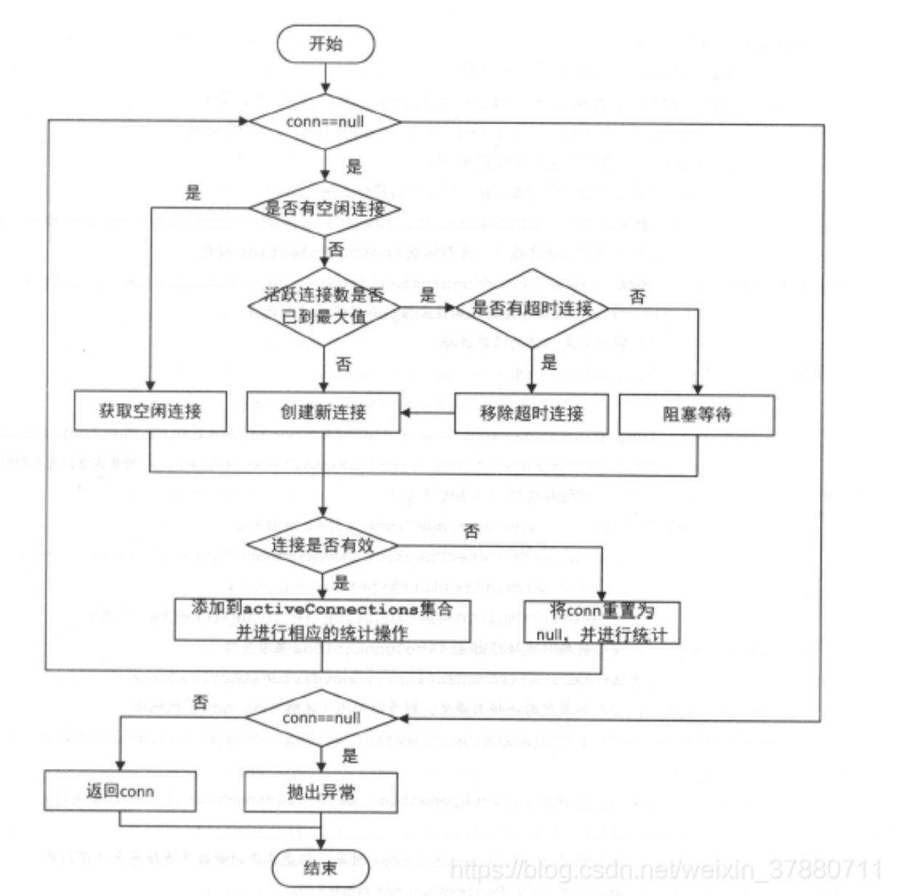
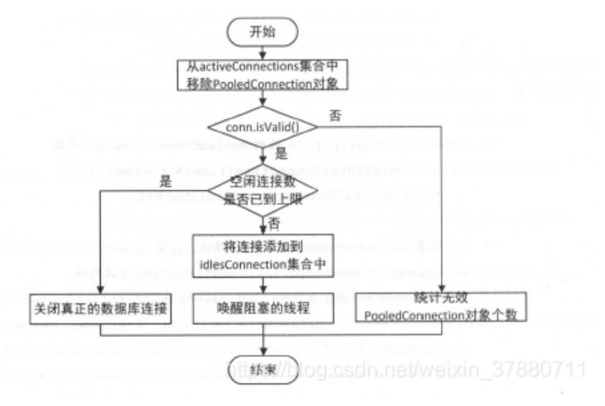

# 数据源DataSource

Mybatis提供了两个数据源的实现：PooledDataSource和UnPolledDataSource，然后通过不同的工厂方法创建不同的DataSource.

* UnpooledDataSourceFactory工厂：在UnpooledDataSourceFactory工厂中，直接构造UnpooledDataSource对象，setProperties方法会完成UnpooledDataSource的属性设置。
* PooledDataSourceFactory工厂：继承了UnpooledDataSourceFactory，没有重写方法，只是在初始化的时候会将DataSource初始化为PooledDataSource。

#### UnpooledDataSource

实现DataSource接口，用于获取数据库的连接，每次通过UnpooledDataSource.getConnection方法获取数据库连接时都会创建一个新的连接。通过属性registeredDrivers记录注册的JDBC驱动。

#### PooledDataSource

数据库连接耗时长，因此一般是通过数据库连接池实现数据库连接的管理，在初始化的时候，一般会在连接池中添加一定的连接备用，当需要使用数据库连接的时候，从池中获取连接，不再使用的时候，将连接放回连接池中，而不是直接关闭。PooledDataSource实现了简单的连接池功能，通过其封装的UnpooledDataSource创建新的连接。而且不会直接管理Connection，是通过管理PooledConnection来管理连接的。然后通过PooledState管理PooledConnection对象的连接状态。通过PopConnection方法获取连接，逻辑如下图：



```java
private PooledConnection popConnection(String username, String password) throws SQLException {
  boolean countedWait = false;
  PooledConnection conn = null;
  long t = System.currentTimeMillis();
  int localBadConnectionCount = 0;

  while (conn == null) {
    synchronized (state) {
      if (!state.idleConnections.isEmpty()) { //检测空闲连接
        // Pool has available connection
        conn = state.idleConnections.remove(0); //获取连接
        if (log.isDebugEnabled()) {
          log.debug("Checked out connection " + conn.getRealHashCode() + " from pool.");
        }
      } else {
        // 没有空闲的连接，
        if (state.activeConnections.size() < poolMaximumActiveConnections) {
          // 活跃连接数没有达到最大值，可以创建新的连接
          conn = new PooledConnection(dataSource.getConnection(), this);
          if (log.isDebugEnabled()) {
            log.debug("Created connection " + conn.getRealHashCode() + ".");
          }
        } else {
          // 活跃连接数达到最大值，获取最先创建的连接
          PooledConnection oldestActiveConnection = state.activeConnections.get(0);
          long longestCheckoutTime = oldestActiveConnection.getCheckoutTime();
          //连接是否超时
          if (longestCheckoutTime > poolMaximumCheckoutTime) {
            // 对超时连接进行统计
            state.claimedOverdueConnectionCount++;
            state.accumulatedCheckoutTimeOfOverdueConnections += longestCheckoutTime;
            state.accumulatedCheckoutTime += longestCheckoutTime;
            //将起时连接移出活跃连接集合
            state.activeConnections.remove(oldestActiveConnection);
            if (!oldestActiveConnection.getRealConnection().getAutoCommit()) {
              oldestActiveConnection.getRealConnection().rollback();
            }
            //创建新的PooledConnection，没有创建数据库连接
            conn = new PooledConnection(oldestActiveConnection.getRealConnection(), this);
            oldestActiveConnection.invalidate();
            if (log.isDebugEnabled()) {
              log.debug("Claimed overdue connection " + conn.getRealHashCode() + ".");
            }
          } else {
            // 没有空闲连接，无法创建新的连接而且无超时连接，阻塞等待
            try {
              if (!countedWait) {
                state.hadToWaitCount++;
                countedWait = true;
              }
              if (log.isDebugEnabled()) {
                log.debug("Waiting as long as " + poolTimeToWait + " milliseconds for connection.");
              }
              long wt = System.currentTimeMillis();
              state.wait(poolTimeToWait);
              state.accumulatedWaitTime += System.currentTimeMillis() - wt;
            } catch (InterruptedException e) {
              break;
            }
          }
        }
      }
      if (conn != null) {
        if (conn.isValid()) {
          if (!conn.getRealConnection().getAutoCommit()) {
            conn.getRealConnection().rollback();
          }
          conn.setConnectionTypeCode(assembleConnectionTypeCode(dataSource.getUrl(), username, password));
          conn.setCheckoutTimestamp(System.currentTimeMillis());
          conn.setLastUsedTimestamp(System.currentTimeMillis());
          state.activeConnections.add(conn);
          state.requestCount++;
          state.accumulatedRequestTime += System.currentTimeMillis() - t;
        } else {
          if (log.isDebugEnabled()) {
            log.debug("A bad connection (" + conn.getRealHashCode() + ") was returned from the pool, getting another connection.");
          }
          state.badConnectionCount++;
          localBadConnectionCount++;
          conn = null;
          if (localBadConnectionCount > (poolMaximumIdleConnections + 3)) {
            if (log.isDebugEnabled()) {
              log.debug("PooledDataSource: Could not get a good connection to the database.");
            }
            throw new SQLException("PooledDataSource: Could not get a good connection to the database.");
          }
        }
      }
    }

  }

  if (conn == null) {
    if (log.isDebugEnabled()) {
      log.debug("PooledDataSource: Unknown severe error condition.  The connection pool returned a null connection.");
    }
    throw new SQLException("PooledDataSource: Unknown severe error condition.  The connection pool returned a null connection.");
  }

  return conn;
}
```


  使用完连接之后，通过pushConnection进行处理




#### PooledConnection

继承了Invocationhandler接口，通过动态代理的方式对close进行代理，并且调用真正的数据库连接的方法前进行检查

```java
public Object invoke(Object proxy, Method method, Object[] args) throws Throwable {
  String methodName = method.getName();
  //如果调用的方法是close，将其放回连接池，不是关闭
  if (CLOSE.hashCode() == methodName.hashCode() && CLOSE.equals(methodName)) {
    dataSource.pushConnection(this);
    return null;
  } else {
    try {
      if (!Object.class.equals(method.getDeclaringClass())) {
        // issue #579 toString() should never fail
        // throw an SQLException instead of a Runtime
        checkConnection();
      }
      //调用方法
      return method.invoke(realConnection, args);
    } catch (Throwable t) {
      throw ExceptionUtil.unwrapThrowable(t);
    }
  }
}
```

