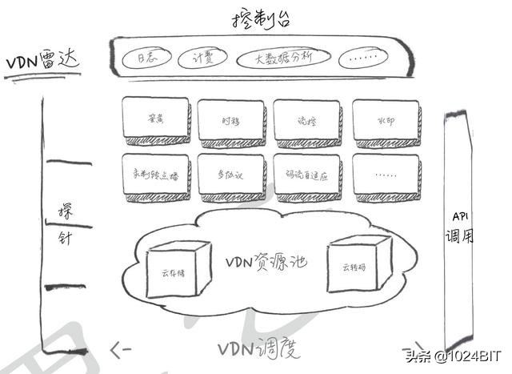

# CDN详解

CDN 全称:Content Delivery Network或Content Ddistribute Network，即内容分发网络

## 基本思路：

尽可能避开互联网上有可能影响数据传输速度和稳定性的瓶颈和环节，使内容传输的更快、更稳定。通过在网络各处放置节点服务器所构成的在现有的互联网基础之上的一层智能虚拟网络，CDN系统能够实时地根据网络流量和各节点的连接、负载状况以及到用户的距离和响应时间等综合信息将用户的请求重新导向离用户最近的服务节点上。

## 目的：

解决因分布、带宽、服务器性能带来的访问延迟问题，适用于站点加速、点播、直播等场景。使用户可就近取得所需内容，解决 Internet网络拥挤的状况，提高用户访问网站的响应速度和成功率。

控制时延无疑是现代信息科技的重要指标，CDN的意图就是尽可能的减少资源在转发、传输、链路抖动等情况下顺利保障信息的连贯性。

## 优势：

如果你在经营一家网站，那你应该知道几点因素是你制胜的关键：

1. 内容有吸引力
1. 访问速度快
1. 支持频繁的用户互动
1. 可以在各处浏览无障碍

另外：你的网站必须能在复杂的网络环境下运行，考虑到全球的用户访问体验。你的网站也会随着使用越来越多的对象（如图片、帧、CSS及APIs）和形形色色的动作（分享、跟踪）而系统逐渐庞大。所以，系统变慢带来用户的流失。

Google及其它网站的研究表明，一个网站每慢一秒钟，就会丢失许多访客，甚至这些访客永远不会再次光顾这些网站。可以想象，如果网站是你的盈利渠道或是品牌窗口，那么网站速度慢将是一个致命的打击。

这就是你使用CDN的第一个也是最重要的原因：加速网站的访问

除此之外，CDN还有一些作用：

#### 为了实现跨运营商、跨地域的全网覆盖
互联不互通、区域ISP地域局限、出口带宽受限制等种种因素都造成了网站的区域性无法访问。CDN加速可以覆盖全球的线路，通过和运营商合作，部署IDC资源，在全国骨干节点商，合理部署CDN边缘分发存储节点，充分利用带宽资源，平衡源站流量。

####  为了保障你的网站安全
CDN的负载均衡和分布式存储技术，可以加强网站的可靠性，相当无无形中给你的网站添加了一把保护伞，应对绝大部分的互联网攻击事件。防攻击系统也能避免网站遭到恶意攻击。

####  为了异地备援
当某个服务器发生意外故障时，系统将会调用其他临近的健康服务器节点进行服务，进而提供接近100%的可靠性，这就让你的网站可以做到永不宕机。

####  为了节约成本投入
使用CDN加速可以实现网站的全国铺设，你根据不用考虑购买服务器与后续的托管运维，服务器之间镜像同步，也不用为了管理维护技术人员而烦恼，节省了人力、精力和财力。

####  为了让你更专注业务本身
CDN加速厂商一般都会提供一站式服务，业务不仅限于CDN，还有配套的云存储、大数据服务、视频云服务等，而且一般会提供7x24运维监控支持，保证网络随时畅通，你可以放心使用。并且将更多的精力投入到发展自身的核心业务之上。

## 引入一个词：控制时延

无疑是现代信息科技的重要指标，CDN的意图就是尽可能的减少资源在转发、传输、链路抖动等情况下顺利保障信息的连贯性

根据论文《WAITING TIMES IN QUALITY OF EXPERIENCE FOR WEB BASED SERVICES》中提出的： 其指出基于人脑在等待不同时长的信息时，产生的不同意识行为，进而对信息获取产生的差别感官体验。

感知的持续时间 VS 客观持续时间

根据研究发现：当人们获得Voice这类声音讯息时，好感度随时间流逝下降的最为迅速，仅需16分钟“评估意见等级”下降了70%，可见音像资源受缓冲时间的影响可见一斑

* 0.1 s： 用户几乎感觉不到系统是否不连贯性。
* 1.0 s： 用户明显注意到时延的发生，但是在该时间内思维依然是连贯的。
* 10 s： 超过该时间的时延会使用户失去等待意愿。 控制时延无疑是现代信息科技的重要指标，CDN的意图就是尽可能的减少资源在转发、传输、链路抖动等情况下顺利保障信息的连贯性。

通俗点说就是在网速一定的前提下，CDN就像网络中快递员小哥
## 主要特点：
1、本地Cache加速，提高了企业站点（尤其含有大量图片和静态页面站点）的访问速度，并大大提高以上性质站点的稳定性

2、镜像服务消除了不同运营商之间互联的瓶颈造成的影响，实现了跨运营商的网络加速，保证不同网络中的用户都能得到良好的访问质量。

3、远程加速 远程访问用户根据DNS负载均衡技术 智能自动选择Cache服务器，选择最快的Cache服务器，加快远程访问的速度

4、带宽优化 自动生成服务器的远程Mirror（镜像）cache服务器，远程用户访问时从cache服务器上读取数据，减少远程访问的带宽、分担网络流量、减轻原站点WEB服务器负载等功能。

5、集群抗攻击 广泛分布的CDN节点加上节点之间的智能冗余机制，可以有效地预防黑客入侵以及降低各种D.D.o.S攻击对网站的影响，同时保证较好的服务质量 。

## 关键技术：
   

内容发布：它借助于建立索引、缓存、流分裂、组播（Multicast）等技术

内容路由：它是整体性的网络负载均衡技术，通过内容路由器中的重定向（DNS）机制，在多个远程POP上均衡用户的请求，以使用户请求得到最近内容源的响应；

内容交换：它根据内容的可用性、服务器的可用性以及用户的背景，在POP的缓存服务器上，利用应用层交换、流分裂、重定向（ICP、WCCP）等技术，智能地平衡负载流量；

性能管理：它通过内部和外部监控系统，获取网络部件的状况信息，测量内容发布的端到端性能（如包丢失、延时、平均带宽、启动时间、帧速率等），保证网络处于最佳的运行状态。

## Q & A

1.CDN加速是对网站所在服务器加速，还是对其域名加速？

CDN是只对网站的某一个具体的域名加速。如果同一个网站有多个域名，则访客访问加入CDN的域名获得加速效果，访问未加入CDN的域名，或者直接访问IP地址，则无法获得CDN效果。

2.CDN和镜像站点比较有何优势？　　

CDN对网站的访客完全透明，不需要访客手动选择要访问的镜像站点，保证了网站对访客的友好性。　　
CDN对每个节点都有可用性检查，不合格的节点会第一时间剔出，从而保证了极高的可用率，而镜像站点无法实现这一点。　　
CDN部署简单，对原站基本不做任何改动即可生效。

3.CDN和双线机房相比有何优势？

常见的双线机房只能解决网通和电信互相访问慢的问题，其它ISP（譬如教育网，移动网，铁通）互通的问题还是没得到解决。　　
而CDN是访问者就近取数据，而CDN的节点遍布各ISP，从而保证了网站到任意ISP的访问速度。另外CDN因为其流量分流到各节点的原理，天然获得抵抗网络攻击的能力。

4.CDN使用后，原来的网站是否需要做修改，做什么修改？

一般而言，网站无需任何修改即可使用CDN获得加速效果。只是对需要判断访客IP程序，才需要做少量修改。

5.为什么我的网站更新后，通过CDN后看到网页还是旧网页，如何解决？　　

由于CDN采用各节点缓存的机制，网站的静态网页和图片修改后，如果CDN缓存没有做相应更新，则看到的还是旧的网页。
为了解决这个问题，CDN管理面板中提供了URL推送服务，来通知CDN各节点刷新自己的缓存。　　
在URL推送地址栏中，输入具体的网址或者图片地址，则各节点中的缓存内容即被统一删除，并且当即生效。　　
如果需要推送的网址和图片太多，可以选择目录推送，输入 http://www.kkk.com/newshttp://www.kkk.com/news 即可以对网站下news目录下所有网页和图片进行了刷新。

6.能不能让CDN不缓存某些即时性要求很高的网页和图片？

只需要使用动态页面，asp，php，jsp等动态技术做成的页面不被CDN缓存，无需每次都要刷新。或者采用一个网站两个域名，一个启用CDN，另外一个域名不用CDN，对即时性要求高的页面和图片放在不用CDN的域名下。

7.网站新增了不少网页和图片，这些需要使用URL推送吗？　　

后来增加的网页和图片，不需要使用URL推送，因为它们本来就不存在缓存中。

8.网站用CDN后，有些地区反映无法访问了，怎么办？

CDN启用后，访客不能访问网站有很多种可能，可能是CDN的问题，也可能是源站点出现故障或者源站点被关闭，还可能是访客自己所在的网络出现问题，甚至我们实际故障排除中，还出现过客户自己计算机中毒，导致无法访问网站。　　
客户报告故障时，可随时联系我们24小时技术部进行处理。