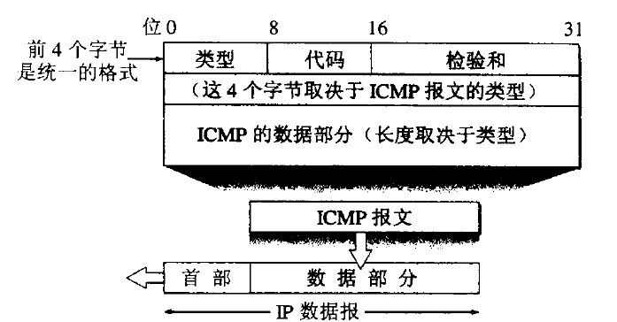
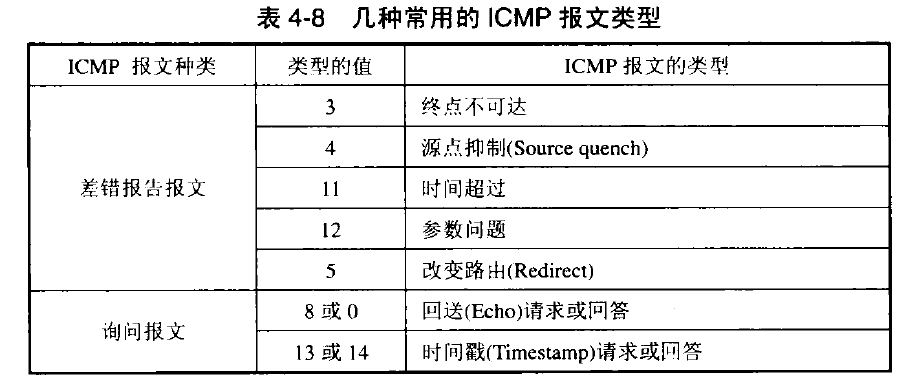

# 网际报文控制协议ICMP

为了更有效地转发IP数据报和提高交付成功的机会，在网际层使用了网际控制报文协议ICMP。ICMP允许主机或路由器报告差错情况和提供有关异常情况的报告。ICMP是因特网的标准协议。但ICMP不是高层协议，而是IP层的协议。ICMP报文作为IP层数据报的数据，加上数据报的首部，组成IP数据报发送出去。

ICMP报文分为了两类类：ICMP差错报告报文，ICMP询问报文，通知类。ICMP报文包括8个字节的报头和长度可变的数据部分。对于不同的报文类型，报头的格式一般是不相同的，但是前3个字段(4个字节)对所有的ICMP报文都是相同的。

### ICMP差错报文种类：

* 终点不可达:当路由器或主机不能交付数据报时就像源点发送终点不可达报文。
* 源点抑制:源点抑制提供了拥塞控制,当路由器或者主机因拥塞丢弃数据报时,每个被丢弃的数据报都要向源点发送源点抑制报文；源点抑制作用有:1:告诉源点数据报被丢弃2:要求源点放慢发包速度.
* 超时:有两种情况:生存时间(实际是跳数)递减为0,数据报被丢弃,向源点发送ICMP超时报文,这种报文只有可能是路由器发送。当目的主机收到一个分片时,就会启动一个分片计时器,如果计时器内分片没完全到达,则发送超时报文并丢弃已经收到的所有分片
* 参数问题:数据报首部出现错误或者首部缺少一些选项发送此报文,主机和路由器都可能发送此报文。
* 改变路由(重定向):路由器要经常更新自己的路由表,网络上主机的数量远远大于路由器的数量,如果主机也动态更新,将产生无法忍受的通信量,所以主机使用静态路由选择,一般情况下,开始时主机只知道默认路由地址,IP数据报将被发送到默认路由器,但也许此数据报应该被发到另外的路由器,默认路由器知道这种情况后,转发此数据报,并向源点发送改变路由ICMP, 让主机刷新自己的路由表,主机的路由表通过这种方式进行更新。

### ICMP询问报文种类：

* 回送请求和回答：一般用于源主机或源路由器判断目的主机或目的路由器能否与其通信,主机和路由器都能发送此报文,此报文包括了回送请求报文和回送回答报文,ping命令便是此报文。
* 时间戳请求和回答：括时间戳请求报文和时间戳回答报文,它能够确定IP数据报在两台机器的往返时间,即使两个路由器本地时间不同步,但他们的往返时间仍然是精确的。
