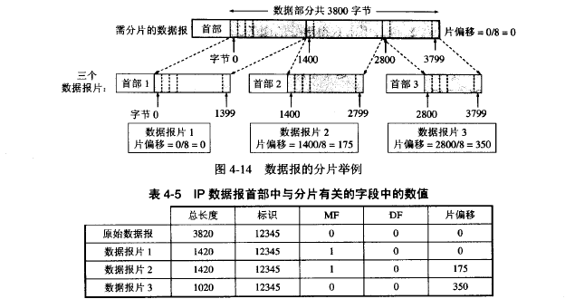

# 网络层详解

### 网络层提供的两种服务

* 虚电路服务：当两个计算机进行通信时，先建立连接，以保证双方通信所需的一切网络资源。
* 数据报服务：网络层只向上提供简单灵活的、无连接的、尽最大努力交付的数据报服务。网络在发送分组时不建立连接，每一个分组独立发送，与其前后分组无关，也不提供服务质量承诺。

### IP协议

IP协议配套使用的还包括ARP（地址解析协议）、RARP（逆地址解析协议）、ICMP（网际控制报文协议）、IGMP（网际组管理协议）。

### 虚拟互连网络

将网络互连需要通过一些中间设备：转发器物理层（）、网桥或桥接器（数据链路层）、路由器（网络层）和网关（网络层以上）。当中间设备是转发器或网桥时仅仅是把一个网络扩大，一般不称为网络互连。

虚拟专用网：逻辑互联网。意思是互连起来的各种物理网络的异构性是客观存在的，但是使用IP协议可以使这些性能各异的网络在网络层看起来是一个统一的网络。

### 分类的IP地址

IP地址就是给因特网上的每一个主机（或路由器）的每一个端口分配一个唯一的32为标识符。IP地址的编制方法经历了三个阶段：

1. 分类的IP地址
2. 子网划分
3. 构成超网

IP地址划分为若干个固定的类，每一个地址都有两个固定长度的字段组成，其中第一个字段是网络号，第二个字段是主机号。

* A类地址：网络地址(1Byte) + 主机地址(3Byte)，且网络地址的首位必须是0；则网络地址的取值范围是0~127,网络号全为0的地址是保留地址，而127也是保留的地址，并且是用于测试环回用的。因此A类地址的范围其实是从1-126之间。 可用的A类网络有126个，每个网络能容纳1亿多个主机(2的24次方减2的主机数目)。 子网掩码：255.0.0.0。A类IP范围：首位为0；1.0.0.1~~126.255.255.254；主机号24位
* B类地址：网络地址(2Byte) + 主机地址(2Byte)，且网络地址的前两位是10；则网络地址的取值范围是128~ ~191, 可用的B类网络有2的14方减1个，每个网络能容纳6万多个主机 (2的16次方减0和广播地址)。 子网掩码：255.255.0.0。B类IP范围：前两位为10 ；128.1.0.1~~191.255.255.254；主机号16位
* C类地址：网络地址(3Byte)+主机地址(1Byte),且网络地址的前三位是110；则网络地址的取值范围是192.0.1~ ~223,可用的C类网络有2的21次方减1，可达209万余个，每个网络能容纳254个主机。子网掩码：255.255.255.0。
   
   C类IP范围：前三位为110；192.0.0.1~~223.255.255.254；主机号8位
* D类地址：此类地址称为多播地址，也叫做组播地址，前四位必须是1110；网络地址的取值范围是224~ ~239,D类IP范围：前四位为1110；224.0.0.1~~239.255.255.254
* E类地址：此类地址是保留地址，留作将来使用，前五位必须是11110；网络地址的取值范围是240~ ~254,E类IP范围：前五位为11110；240.0.0.1~~254.255.255.254

### IP地址的特点：

1. 每一个IP地址都有网络号+主机号两部分组成。 从这个意义上讲，IP地址是一种分等级的地址结构。分等级带来的好处: a、IP地址管理机构在分配IP地址时，只分配网络号，而剩下的主机号则由得到该网络号的单位自行分配。这样便于管理； b、路由器仅根据目的主机所连接的网络号来转发分组(不许用考虑主机号)，这样就可以使用路由表中的项目数大幅度减少，从而减少路由表所占用的内存，检查查找路由所使用的时间。
2. 实际上一个IP地址用来标志  一个主机（或 路由器）和一条链路的接口。当一个主机同时连接到两个网络时(如：实验室的代理服务器)。该主机必须具有两个相应的IP地址。这是的主机成为多归属主机
3. 交换机是数据链路层上的设备，用它连接起来的主机仍然属于同一个网络。而不同局域网的主机由于网络号不同，必须通过路由器连接起来。
4. 所有的网络号是对等的。

### IP地址与硬件地址

物理地址是数据链路层和物理层使用的地址，而IP地址是网络层和以上各层使用的地址，是一种逻辑地址（IP地址是用软件实现的）。

在发送数据时，数据从高层下到底层，然后才到通信链路上传输。使用IP地址的IP数据报一旦交给了数据链路层，就被封装成MAC帧。MAC帧在传送时使用的源地址和目的地址都是硬件地址，这两个硬件地址都写在MAC帧的首部中。

连接在通信链路上的设备（主机或路由器）在接收MAC帧时，其根据是MAC帧首部中的硬件地址。在数据链路层看不见隐藏在MAC帧的数据中的IP地址。只有在剥去MAC帧的首部和尾部后把MAC层的数据上交给网络层后，网络层才能在IP数据报的首部中找到源IP地址和目的IP地址。

总之，IP地址放在IP数据报的首部，而硬件地址则放在MAC帧的首部。在网络层和网络层以上使用的是IP地址，而数据链路层以及以下使用的是硬件地址。 在上图中知道，当IP数据报放入数据链路层的MAC帧中以后，整个的IP数据报就成为MAC帧的数据，因而在数据链路层看不见数据报的IP地址。

举例：a画的是三个局域网用两个路由器R1和R2互连起来。现在主机H1要和主机H2通信。这两个主机的IP地址分别是IP1和IP2，而它们的硬件地址分别是HA1和HA2（HA表示hardware address）。通信路径是：H1->经过R1转发->再经过R2转发->H2。路由器R1因同时连接到两个局域网上，因此它由两个硬件地址，即HA3和HA4。同理，路由器R2也有两个硬件地址HA5和HA6。

这里注意：

1. 在IP层抽象的互联网上只能看到IP数据报。虽然IP数据报要经过路由器R1和R2的两次转发，但在它的首部中的源地址和目的地址始终分别是IP1和 IP2。图中的数据报上写的从IP1到IP2就表示前者是源地址而后知是目的地址。数据报中间经过的两个路由器的IP地址并不出现在IP数据报的首部中。
2. 虽然在IP数据报首部有源站IP地址，但路由器只根据目的站的IP地址的网络号进行路由选择。
3. 在局域网的链路层，只能看见MAC帧。IP数据报被封装在MAC帧中。MAC帧在不同网络上传送时，其MAC帧首部中的源地址和目的地址要发生变化。
4. 尽管互连在一起的网络的硬件地址体系各不相同，但IP层抽象的互联网却屏蔽了下层这些很复杂的细节。只要我们在网络层上讨论问题，就能够使用统一的，抽象的IP地址研究主机和主机或路由器直接的通信。

### 地址解析协议

网络层使用的是IP地址，但在实际网络的链路上传送数据帧时，最终还是必须使用该网络的硬件地址。但IP地址和下面的网络的硬件地址之间由于格式不同而不存在简单的映射关系（IP地址有32位，而局域网硬件地址是48位）。此外，在一个网络上可能经常会有新的主机加入进来，或撤走一些主机。更换网络适配器也会使主机的硬件地址改变。地址解析协议ARP解决这个问题的方法是在主机ARP高速缓存中存放一个从IP地址到硬件地址的映射表，并且这个映射表还经常动态更新（新增或超时删除）。

每一个主机都设有一个ARP高速缓存，里面有本局域网上的各主机和路由器的IP地址到硬件地址的映射表，这些都是该主机目前知道的一些地址。那么主机怎样知道这些地址呢？

当主机A要向本局域网上的某个主机B发送IP数据报时，就先在其ARP高速缓存中查看有无主机B的IP地址。如有，就在ARP高速缓存中查出其对应的硬件地址，再把这个硬件地址写入MAC帧，然后通过局域网把这个MAC帧发往此硬件地址。也有可能查不到主机B的IP地址的项目，这可能是主机B才入网，也可 能是主机A刚开机，其高速缓存还是空的。这种情况下，主机A就自动运行ARP，然后按以下步骤找出主机B的硬件地址。

1. ARP进程在本局域网上广播发送一个ARP请求分组。ARP请求分组的主要内容是表明：我的IP地址是209.0.0.5，硬件地址是00-00-C0-15-AD-18。我想知道IP地址为209.0.0.6的主机的硬件地址。
2. 在本局域网上的所有主机上运行的ARP进程都收到此ARP请求分组。
3. 主机B在ARP请求分组中见到自己的IP地址，就向主机A发送ARP响应分组，并写入自己的硬件地址。其余的所有主机都不理睬这个ARP请求分组。ARP响应分组的主要内容：我的IP地址是209.0.0.6，我的硬件地址是08-00-2B-00-EE-0A。注意，虽然ARP请求分组是广播发送的，但 ARP响应分组是普通的单播，即从一个源地址发送到一个目的地址。
4. 主机A收到主机B的ARP响应分组后，就在其ARP高速缓存中写入主机B的IP地址到硬件地址的映射。

可见ARP高速缓存非常有用。如果不适用ARP高速缓存，那么任何一个主机只要进行一次通信，就必须在网络上用广播方式发送ARP请求分组，这就使网络上的 通信量大大增加。ARP把已经得到的地址映射保存在高速缓存中，这样就使得该主机下次再和具有同样目的地址的主机通信时，可以直接从高速缓存中找到所需的 硬件地址而不必再用广播方式发送ARP请求分组。ARP是解决同一个局域网上的主机或路由器的IP地址和硬件地址的映射问题。
归纳下使用ARP的4种情况：

1. 发送方是主机，要把IP数据报发送到本网络上的另一个主机。这时用ARP找到目的主机的硬件地址。
2. 发送方是主机，要把IP数据报发送到另一个网络上的一个主机。这时用ARP找到本网络上的一个路由器的硬件地址。剩下的工作交给这个路由器来完成。
3. 发送方是路由器，要把IP数据报转发到本网络上的一个主机。这时用ARP找到目的的主机的硬件地址。
4. 发送方是路由器，要把IP数据报转发到另一个网络上的一个主机。这时用ARP找到本网络上的一个路由器的硬件地址。剩下的工作交给这个路由器来完成。

### IP数据报格式

在TCP/IP标准中，各种数据格式常常以32位为单位来描述。一个IP数据报由首部和数据两部分组成。首部的前一部分是固定产度，共20字节，是所有IP数据报都必须具有的。在首部的固定部分的后面是一些可选字段，其长度是可变的。
* 版本：占4位，指IP协议的版本。通信双方使用的IP协议的版本必须一致。目前广泛使用的IP协议版本号为4（即IPv4）。以后应该会使用IPV6
* 首部长度 :占4位，可表示的最大十进制数值是15。注意，这个字段所表示数的单位是32位字（1个32位字是4字节），因此首部最大长度为60字节。当IP分组的首部长度不是4字节的整数倍时，必须利用组后的填充字段加以填充。
* 区分服务 ：占8位，用来获得更好的服务。
* 总长度：总长度指首部和数据之和的长度，单位为字节。总长度字段为16位，因此数据报的最大长度为2^16-1=65535字节。虽然使用尽可能长的数据报会使传输效率提高，但由于以太网的普遍应用，所以实际上使用的数据报长度很少有超过1500字节的。当数据报长度超过网络所允许的最大传送单元MTU时，就必须把过长的数据包进行分片后才能在网络上发送。
* 标识:占16位。IP软件在存储器中维持一个计数器，每产生一个数据报，计数器就+1，并将此值赋给标识字段。但这个标识不是序号，因为IP是无连接服务，数据报不存在按序接收的问题。当数据包由于长度超过网络的MTU而必须分片时，这个标识字段的值就被复制到所有的数据报片的标识字段中。相同的标识字段的值使分片后的个数据报片最后能正确地重装成为原来的数据报。
* 标志 :占3位 ,目前只有2位有意义。 标志字段中的最低位记为MF（more fragment)。MF=1即标识后面还有分片的数据报。MF=0标识这已是若干数据报片中的最后一个。标志字段中间的以为记为DF（don't fragment)，意思是不能分片。只有当DF=0时才允许分片。
* 片偏移：13位。片偏移指出：较长的分组在分片后，某片在原分组中的相对位置。也就是说，相对于用户数据字段的起点，该片从何处开始。片偏移以8个字节为偏移单位。这就是说，每个分片的长度一定是8字节的整数倍。

##### 举例：

一个数据报总长度3820字节，其数据部分3800字节（使用固定首部）,需要分片为长度不超过1420字节的数据报片。因固定首部长度为20字节，因此每 个数据报片的数据部分长度不能超过1400字节。于是分为3个数据报片，其数据部分长度分别为1400,1400和1000字节。原始数据报首部被复制为 各个数据报片的首部，但必须修改有关字段的值。

* 生存时间TTL（time to live）：占8位，表示数据报在网络中的寿命。由发出数据报的源点设置这个字段。其目的是防止无法交付的数据报无限制地在因特网中兜圈子，白白消耗网络资源。路由器在转发数据报之前就把TTL值-1.若TTL值减小到0，就丢弃这个数据报，不再转发。因此TTL的单位是跳数。TTL的意义是指明数据报在因特网中至少可经过多少个路由器。显然，8位对应255，所以数据报能在因特网经过的路由器最大是255个。若把TTL的初始值设置为1，就表示这个数据报只能在本局域网中传送。因为这个数据报一传送到局域网上的某个路由器，在被转发前TTL值就减到0了，因而就会被这个路由器丢弃。
* 协议：占8位，协议字段指出数据报携带的数据使用何种协议，以便使目的主机的IP层知道应该将数据部分上交给哪个处理过程。
* 首部检验和   占16位。这个字段只检验数据报的首部，不包括数据部分。这是因为数据报每经过一个路由器，路由器都要重新计算一下首部检验和（一些字段，如生存时间，标志，片偏移等都可能发生变化）。不检验数据部分可减少计算的工作量。
* 源地址：32位
* 目的地址：32位

IP 数据报首部的可变部分就是一个选项字段。用来支持排错，测量一级安全等措施，内容很丰富。此段长度可变，从1个字节到40个字节不等，取决于所选择的项目。增加首部的可变部分是为了增加IP数据报的功能，但这同时也使得IP数据报的首部长度成为可变。这就增加了每一个路由器处理数据报的开销。实际上这些选项很少备用。新的IPv6版本就把IP数据报的首部长度做成固定的。

### IP层分组转发的流程

1. 从数据报的首部提取目的主机的IP地址D，计算出目的主机的网络地址N。
2. 若N就是与此路由器直接相连的某个网络的网络地址。则直接进行交付，不需要经过其他路由器，而是直接将IP数据报交付给目的主机。(注意，直接交付时，路由器需要将目的主机地址D转换为具体的硬件地址，把数据报封装在MAC帧，在发送此帧。) 若N不是与此路由器直接相连的网络，就进行间接交付。执行3.
3. 若路由表中有目的地址为D的特定主机路由，则把数据报传送给路由表中所指明的下一跳路由器；否则，执行4。
4. 若路由表中有到达网络N的路由，则把数据报传送给路由表中所指明的下一跳路由器；否则，执行5。
5. 如果3和4都没能将IP数据报转发出去，若路由表中有一个默认路由，则把数据报传送给路由表中所指明的默认；否则执行6。
6. 报告转发分组出错。

### 划分子网

##### 从两级IP地址到三级IP地址

随着因特网的普及和技术的发展，早期ARPANET的设计之缺陷显露无疑：

1. IP地址空间的利用率有时会很低：一个A类IP地址网络可连接超过1000万台主机，而每个B类IP地址网络可连接超过6万台。可是有些网络对连接在网络上的主机数有限制，甚至远小于这样的数量。
2. 给每个物理网络分配一个网络号会使路由表变得太大，降低网络性能。
3. 两级IP地址不够灵活：只能在申请完IP地址后才能进行下一步工作，而无法按自己的需求变更。

为了解决这个问题，从1985年起，在IP地址中又增加了一个"子网号字段"，使两级IP地址变为三级IP地址。这种做法叫作划分子网，或子网寻址或子网路由选择。

###### 划分子网的基本思路

1. 一个拥有许多物理网络的单位，可将所属的物理网络划分为若干个子网（subnet）。划分子网只是单位内部的事情，本单位以为无法得知这个网络具体的子网数及组成，这个单位对外仍然只表现为一个网络。
2. 划分子网的方法是从网络的主机号借用若干位作为子网号subnet-id，与此同时主机号也减少相应位数。由此两级IP地址可变为三级IP地址：    IP地址 ::= {<网络号>,<子网号>,<主机号>}
3. 从外部网络发送给本单位某主机的IP数据报仍根据目的网络号找到连接在本单位网络上的路由器。但随后在本网络内部，路由器根据目的网络号和子网号找到目的子网，将IP数据报交付目的主机。

注意：划分子网只是把IP地址的主机号这部分进行再划分，并不改变IP地址原来的网络号

##### 子网掩码

子网掩码是干什么的呢？我们知道，从IP数据报的首部无法看出源主机和目的主机所连接的网络是否进行了子网划分，所以想到了子网掩码（subnet mask）的方法：将三级IP地址的子网掩码（根据子网划分而变）和收到的数据报的目的IP地址逐位"与"（AND），就可得出所要找的子网的网络地址。子网掩码是一个网络或一个子网的重要属性，路由器的路由表中除了有目的网络地址，还有该网络的子网掩码，这是现在因特网的标准规定。

* A类地址的默认子网掩码是255.0.0.0；
* B类地址的默认子网掩码是255.255.0.0；
* C类地址的默认子网掩码是255.255.255.0。

 注意：划分子网增加了灵活性，却减少了能连接在网络上的主机数.

使用子网划分后，路由表必须包含以下三项内容：目的网络地址、子网掩码和下一跳地址。

在划分子网的情况下，路由转发分组的算法如下：

1. 从收到的数据报的首部提取目的IP地址D。
2. 先判断是否为直接交付。对路由器直接相连的网络逐个进行检查：用各网络的子网掩码和D逐位相"与"（AND操作），看结果是否和相应的网络地址匹配。若匹配，则把分组进行直接交付（还需把D转换成物理地址，把数据报封装成帧发送出去），转发任务结束。否则就是间接交付，执行（3）。
3. 若路由表中有目的地址为D的特定主机路由，则把数据报传送给路由表中所指明的下一跳路由器；否则，执行（4）。
4. 对路由表中的每一行（目的网络地址、子网掩码、下一跳地址），用其中的子网掩码和D逐位相“与”（AND），其结果为N。若N与该行的目的网络地址匹配，则把数据报传送给该行指明的下一跳路由器；否则，执行（5）。
5. 若路由表中有一个默认路由，则把数据报传送给路由表中所指明的默认路由器；否则，执行（6）。
6. 报告转发分组出错。

可以和没划分子网的情况比较下，发现大体的流程是不变的：提取IP地址、判断是否在同一网络、判断是否有特定路由、判断间接交付、判断是否有默认路由。
