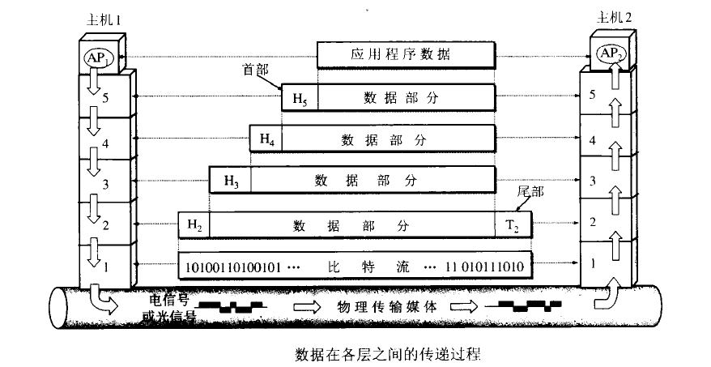
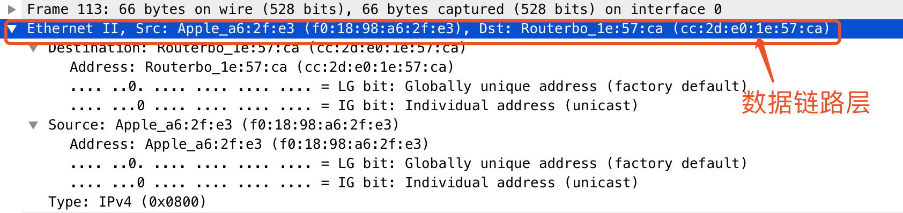

# OSI模型概念

* 应用层:客户操作浏览器(7层) GRPC协议
* 表示层:SSL\TSL转换
* 会话层:概念层session 
* 传输层：
* 网络层: 路由器;IP协议保证广域网中数据传输 INTERNET
* 数据链路层: 网桥，交换机;局域网中通过MAC地址链接到相应的交换机、路由器将报文传输到另外一个主机上
* 物理层: 网卡、网线、集线器、中继器、调制解调器等介质

1. 集线器是物理层设备,采用广播的形式来传输信息。
2. 交换机就是用来进行报文交换的机器。多为链路层设备(二层交换机)，能够进行地址学习，采用存储转发的形式来交换报文.。
3. 路由器的一个作用是连通不同的网络，另一个作用是选择信息传送的线路。选择通畅快捷的近路，能大大提高通信速度，减轻网络系统通信负荷，节约网络系统资源，提高网络系统畅通率。 

### 交换机的工作原理

交换机拥有一条很高带宽的内部总线和内部交换矩阵。交换机的所有的端口都挂接在这条总线上，控制电路收到数据包以后，处理端口会查找内存中的地址对照表以确定目的MAC（网卡的硬件地址）的NIC（网卡）挂接在哪个端口上，通过内部交换矩阵迅速将数据包传送到目的端口，目的MAC若不存在则广播到所有的端口，接收端口回应后交换机会“学习”新的地址，并把它添加入内部MAC地址表中。 
使用交换机也可以把网络“分段”，通过对照MAC地址表，交换机只允许必要的网络流量通过交换机。通过交换机的过滤和转发，可以有效的隔离广播风暴，减少误包和错包的出现，避免共享冲突。 
交换机在同一时刻可进行多个端口对之间的数据传输。每一端口都可视为独立的网段，连接在其上的网络设备独自享有全部的带宽，无须同其他设备竞争使用。当节点A向节点D发送数据时，节点B可同时向节点C发送数据，而且这两个传输都享有网络的全部带宽，都有着自己的虚拟连接。
总之，交换机是一种基于MAC地址识别，能完成封装转发数据包功能的网络设备。交换机可以"学习"MAC地址，并把其存放在内部地址表中，通过在数据帧的始发者和目标接收者之间建立临时的交换路径，使数据帧直接由源地址到达目的地址。

### 集线器

集线器的英文称为“Hub”。集线器的主要功能是对接收到的信号进行再生整形放大，以扩大网络的传输距离，同时把所有节点集中在以它为中心的节点上。
它 工作于OSI(开放系统互联参考模型)参考模型第一层，即“物理层”。
集线器与网卡、网线等传输介质一样，属于局域网中的基础设备，采用 CSMA/CD（即带冲突检测的载波监听多路访问技术)介质访问控制机制。
集线器每个接口简单的收发比特，收到1就转发1，收到0就转发0，不进行碰撞检 测。
集线器属于纯硬件网络底层设备，基本上不具有类似于交换机的"智能记忆"能力和"学习"能力。它也不具备交换机所具有的MAC地址表，所以它发送数据 时都是没有针对性的，而是采用广播方式发送。
也就是说当它要向某节点发送数据时，不是直接把数据发送到目的节点，而是把数据包发送到与集线器相连的所有节 点。
HUB是一个多端口的转发器，当以HUB为中心设备时，网络中某条线路产生了故障，并不影响其它线路的工作。所以HUB在局域网中得到了广泛的应用。 大多数的时候它用在星型与树型网络拓扑结构中。

### 集线器的交换机的区别

首先说HUB,也就是集线器。它的作用可以简单的理解为将一些机器连接起来组成一个局域网。而交换机（又名交换式集线器）作用与集线器大体相同。但是两者在性能上有区别：集线器采用的式共享带宽的工作方式，而交换机是独享带宽。这样在机器很多或数据量很大时，两者将会有比较明显的。

* 工作位置不同。集线器工作在物理层，而交换机工作在数据链路层。
* 工作方式不同。集线器是一种广播方式，当集线器的某个端口工作时其他端口都能收听到信息。交换机工作时端口互不影响。
* 带宽不同。集线器是所有端口共享一条带宽，在同一时刻只能有两个端口传输数据；而交换机每个端口独占一条带宽。
* 性能不同。交换机以MAC地址进行寻址，有一定额外的寻址开销；集线器以广播方式传输数据，流量小时性能下降不明显，适用于共享总线的局域网。

### 路由器与交换机的区别

总的来说，路由器与交换机的主要区别体现在以下几个方面：
* 工作层次不同。最初的的交换机是工作在数据链路层，而路由器一开始就设计工作在网络层。由于交换机工作在数据链路层，所以它的工作原理比较简单，而路由器工作在网络层，可以得到更多的协议信息，路由器可以做出更加智能的转发决策。
* 数据转发所依据的对象不同。交换机是利用物理地址或者说MAC地址来确定转发数据的目的地址。而路由器则是利用IP地址来确定数据转发的地址。IP地址是在软件中实现的，描述的是设备所在的网络。MAC地址通常是硬件自带的，由网卡生产商来分配的，而且已经固化到了网卡中去，一般来说是不可更改的。而IP地址则通常由网络管理员或系统自动分配。
* 传统的交换机只能分割冲突域，不能分割广播域；而路由器可以分割广播域。由交换机连接的网段仍属于同一个广播域，广播数据包会在交换机连接的所有网段上传播，在某些情况下会导致通信拥挤和安全漏洞。连接到路由器上的网段会被分配成不同的广播域，广播数据不会穿过路由器。虽然第三层以上交换机具有VLAN功能，也可以分割广播域，但是各子广播域之间是不能通信交流的，它们之间的交流仍然需要路由器。
* 交换机负责同一个网段的通信，而路由器负责不同网段的通信。路由器提供了防火墙的服务。路由器仅仅转发特定地址的数据包，不传送不支持路由协议的数据包传送和未知目标网络数据包的传送，从而可以防止广播风暴。

### 各层的作用

##### 物理层：比特

在OSI参考模型中，物理层（Physical Layer）是参考模型的最低层。物理层的作用是实现相邻计算机节点之间比特流的透明传送，尽可能屏蔽掉具体传输介质和物理设备的差异。
“透明传送比特流”表示经实际电路传送后的比特流没有发生变化，对传送的比特流来说，这个电路好像是看不见的。

主要定义物理设备标准，如网线的接口类型、光纤的接口类型、各种传输介质的传输速率等。它的主要作用是传输比特流（就是由1、0转化为电流强弱来进行传输,到达目的地后在转化为1、0，也就是我们常说的数模转换与模数转换）。这一层的数据叫做比特。 　　

物理层(physical layer)：在物理层上所传数据的单位是比特。物理层的任务就是透明地传送比特流。

##### 数据链路层：帧

数据链路层（Data Link Layer）是OSI模型的第二层，负责建立和管理节点间的链路。该层的主要功能是：通过各种控制协议，将有差错的物理信道变为无差错的、能可靠传输数据帧的数据链路。在计算机网络中由于各种干扰的存在，物理链路是不可靠的。因此，这一层的主要功能是在物理层提供的比特流的基础上，通过差错控制、流量控制方法，使有差错的物理线路变为无差错的数据链路，即提供可靠的通过物理介质传输数据的方法。数据链路层的具体工作是接收来自物理层的位流形式的数据，并封装成帧，传送到上一层；同样，也将来自上层的数据帧，拆装为位流形式的数据转发到物理层；并且，还负责处理接收端发回的确认帧的信息，以便提供可靠的数据传输。

定义了如何让格式化数据以进行传输，以及如何让控制对物理介质的访问。这一层通常还提供错误检测和纠正，以确保数据的可靠传输。 　

数据链路层(data link layer)：常简称为链路层，我们知道，两个主机之间的数据传输，总是在一段一段的链路上传送的，也就是说，在两个相邻结点之间传送数据是直接传送的(点对点)，这时就需要使用专门的链路层的协议。

在两个相邻结点之间传送数据时，数据链路层将网络层交下来的IP数据报组装成帧(framing)，在两个相邻结点之间的链路上“透明”地传送帧中的数据。

每一帧包括数据和必要的控制信息(如同步信息、地址信息、差错控制等)。典型的帧长是几百字节到一千多字节。

注：”透明”是一个很重要的术语。它表示，某一个实际存在的事物看起来却好像不存在一样。”在数据链路层透明传送数据”表示无力什么样的比特组合的数据都能够通过这个数据链路层。因此，对所传送的数据来说，这些数据就“看不见”数据链路层。或者说，数据链路层对这些数据来说是透明的。 
1. 在接收数据时，控制信息使接收端能知道一个帧从哪个比特开始和到哪个比特结束。这样，数据链路层在收到一个帧后，就可从中提取出数据部分，上交给网络层。 
2. 控制信息还使接收端能检测到所收到的帧中有无差错。如发现有差错，数据链路层就简单地丢弃这个出了差错的帧，以免继续传送下去白白浪费网络资源。如需改正错误，就由运输层的TCP协议来完成。

##### 网络层 ：数据报

网络层（Network Layer）是OSI模型的第三层，它是OSI参考模型中最复杂的一层。它在下两层的基础上向资源子网提供服务。其主要任务是：通过路由选择算法，为报文或分组通过通信子网选择最适当的路径。具体地说，数据链路层的数据在这一层被转换为数据包，然后通过路径选择、分段组合、顺 序、进/出路由等控制，将信息从一个网络设备传送到另一个网络设备。一般地，数据链路层是解决同一网络内节点之间的通信，而网络层主要解决不同子网间的通信。例如在广域网之间通信时，必然会遇到路由（即两节点间可能有多条路径）选择问题。 

在位于不同地理位置的网络中的两个主机系统之间提供连接和路径选择。Internet的发展使得从世界各站点访问信息的用户数大大增加，而网络层正是管理这种连接的层。 

网络层(network layer)主要包括以下两个任务：
1. 负责为分组交换网上的不同主机提供通信服务。在发送数据时，网络层把运输层产生的报文段或用户数据报封装成分组或包进行传送。在TCP/IP体系中，由于网络层使用IP协议，因此分组也叫做IP数据报，或简称为数据报。
2. 选中合适的路由，使源主机运输层所传下来的分组，能够通过网络中的路由器找到目的主机。

协议：IP,ICMP,IGMP,ARP,RARP

##### 传输层：报文段/用户数据报

传输层（Transport Layer）是OSI模型的第4层。因此该层是通信子网和资源子网的接口和桥梁，起到承上启下的作用。该层的主要任务是：向用户提供可靠的端到端的差错和流量控制，保证报文的正确传输。传输层的作用是向高层屏蔽下层数据通信的细节，即向用户透明地传送报文。该层常见的协议：TCP/IP中的TCP协议和UDP协议。传输层提供会话层和网络层之间的传输服务，这种服务从会话层获得数据，并在必要时，对数据进行分割。然后，传输层将数据传递到网络层，并确保数据能正确无误地传送到网络层。因此，传输层负责提供两节点之间数据的可靠传送，当两节点的联系确定之后，传输层则负责监督工作。综上，传输层的主要功能如下：监控服务质量。

定义了一些传输数据的协议和端口号（WWW端口80等），如： 
* TCP（transmission control protocol –传输控制协议，传输效率低，可靠性强，用于传输可靠性要求高，数据量大的数据） 
* UDP（user datagram protocol–用户数据报协议，与TCP特性恰恰相反，用于传输可靠性要求不高，数据量小的数据，如QQ聊天数据就是通过这种方式传输的）。 主要是将从下层接收的数据进行分段和传输，到达目的地址后再进行重组。常常把这一层数据叫做段。 　

运输层(transport layer)：负责向两个主机中进程之间的通信提供服务。由于一个主机可同时运行多个进程，因此运输层有复用和分用的功能
* 复用，就是多个应用层进程可同时使用下面运输层的服务。
* 分用，就是把收到的信息分别交付给上面应用层中相应的进程。

运输层主要使用以下两种协议： 

1. 传输控制协议TCP(Transmission Control Protocol)：面向连接的，数据传输的单位是报文段，能够提供可靠的交付。 
2. 用户数据包协议UDP(User Datagram Protocol)：无连接的，数据传输的单位是用户数据报，不保证提供可靠的交付，只能提供“尽最大努力交付”。

##### 会话层

会话层（Session Layer）是OSI模型的第5层，是用户应用程序和网络之间的接口，主要任务是：向两个实体的表示层提供建立和使用连接的方法。将不同实体之间的表示层 的连接称为会话。因此会话层的任务就是组织和协调两个会话进程之间的通信，并对数据交换进行管理。 用户可以按照半双工、单工和全双工的方式建立会话。当建立会话时，用户必须提供他们想要连接的远程地址。而这些地址与MAC（介质访问控制子层）地址或网络层的逻辑地址不同，它们是为用户专门设计的，更便于用户记忆。

通过运输层（端口号：传输端口与接收端口）建立数据传输的通路。主要在你的系统之间发起会话或者接受会话请求（设备之间需要互相认识可以是IP也可以是MAC或者是主机名） 　　

##### 表示层

表示层（Presentation Layer）是OSI模型的第六层，它对来自应用层的命令和数据进行解释，对各种语法赋予相应的含义，并按照一定的格式传送给会话层。其主要功能是“处理用户信息的表示问题，如编码、数据格式转换和加密解密”等。

可确保一个系统的应用层所发送的信息可以被另一个系统的应用层读取。例如，PC程序与另一台计算机进行通信，其中一台计算机使用扩展二一十进制交换码（EBCDIC），而另一台则使用美国信息交换标准码（ASCII）来表示相同的字符。如有必要，表示层会通过使用一种通格式来实现多种数据格式之间的转换。 　　

##### 应用层：报文

应用层（Application Layer）是OSI参考模型的最高层，它是计算机用户，以及各种应用程序和网络之间的接口，其功能是直接向用户提供服务，完成用户希望在网络上完成的各种工作。它在其他6层工作的基础上，负责完成网络中应用程序与网络操作系统之间的联系，建立与结束使用者之间的联系，并完成网络用户提出的各种网络服务及 应用所需的监督、管理和服务等各种协议。此外，该层还负责协调各个应用程序间的工作。

应用层(application layer)：是体系结构中的最高。直接为用户的应用进程（例如电子邮件、文件传输和终端仿真）提供服务。

在因特网中的应用层协议很多，如支持万维网应用的HTTP协议，支持电子邮件的SMTP协议，支持文件传送的FTP协议，DNS，POP3，SNMP，Telnet等等。

### 七层协议和四层协议

### 路由表

路由表是指路由器或者其他互联网网络设备上存储的一张路由信息表，该表中存有到达特定网络终端的路径，在某些情况下，还有一些与这些路径相关的度量。路由器的主要工作就是为经过路由器的每个数据包寻找一条最佳的传输路径，并将该数据有效地传送到目的站点。由此可见，选择最佳路径的策略即路由算法是路由器的关键所在。为了完成这项工作，在路由器中保存着各种传输路径的相关数据——路由表（Routing Table），供路由选择时使用，表中包含的信息决定了数据转发的策略。路由表可以是由系统管理员固定设置好的，也可以由系统动态修改，可以由路由器自动调整，也可以由主机控制。

* 静态路由表：由系统管理员事先设置好固定的路由表称之为静态（static）路由表，一般是在系统安装时就根据网络的配置情况预先设定的，它不会随未来网络结构的改变而改变。
* 动态路由表：动态（Dynamic）路由表是路由器根据网络系统的运行情况而自动调整的路由表。路由器根据路由选择协议（Routing Protocol）提供的功能，自动学习和记忆网络运行情况，在需要时自动计算数据传输的最佳路径。

路由器通常依靠所建立及维护的路由表来决定如何转发。路由表能力是指路由表内所容纳路由表项数量的极限。路由表中的表项内容包括：

* destination mask pre costdestination：目的地址，用来标识IP包的目的地址或者目的网络。
* mask：网络掩码，与目的地址一起标识目的主机或者路由器所在的网段的地址。
* pre：标识路由加入IP路由表的优先级。可能到达一个目的地有多条路由，但是优先级的存在让他们先选择优先级高的路由进行利用。
* cost：路由开销，当到达一个目的地的多个路由优先级相同时，路由开销最小的将成为最优路由。
* interface：输出接口，说明IP包将从该路由器哪个接口转发。 nexthop：下一跳IP地址，说明IP包所经过的下一个路由器。

报文头部详解：

bit：网络传输的都是二进制数据BIT流

frame:数据链路层

我们用wareshark抓包工具来查看

### 张各层协议图

### 网络协议图

### 对网络分层的理解

许多所谓的网络课程都是从教你记住OSI模型中的每一个层的名字和这个模型中包含的每一个协议开始的。
这样做是不必要的。甚至第5层和第6层是完全可以忽略的。 国际标准组织(ISO)制定了OSI模型。
这个模型把网络通信的工作分为7层。1至4层被认为是低层，这些层与数据移动密切相关。5至7层是高层，包含 应用程序级的数据。
每一层负责一项具体的工作，然后把数据传送到下一层。 物理层(也即OSI模型中的第一层)在课堂上经常是被忽略的。它看起来似乎很简单。但是，这一层的某些方面有时需要特别留意。
物理层实际上就是布线、光纤、网卡和其它用来把两台网络通信设备连接在一起的东西。甚至一个信鸽也可以被认为是一个1层设备(参见RFC 1149)。
网络故障的排除经常涉及到1层问题。我们不能忘记用五类线在整个一层楼进行连接的传奇故事。由于办公室的椅子经常从电缆线上压过，导致网络连接出现断断续续的情况。
遗憾的是，这种故障是很常见的，而且排除这种故障需要耗费很长时间。 第2层是以太网等协议。最重要的是应该理解网桥是什么。交换机可以看成网桥，人们现在都这样称呼它。
网桥都在2层工作，仅关注以太网上的MAC地址。如果你在谈论有关MAC地址、交换机或者网卡和驱动程序，你就是在第2层的范畴。集线器属于第1层的领域，因为它们只是电子设备，没有2层的知识。
第2层的相关问题在本网络讲座中有自己的一部分，因此现在先不详细讨论这个问题的细节。现在只需要知道第2层把数据帧转换成二进制位供1层处理就可以了。在往下讲之间，你应该回过头来重新阅读一下上面的内容，因为经验不足的网络管理员经常混淆2层和3层的区别。 
如果你在谈论一个IP地址，那么你是在处理第3层的问题，这是“数据包”问题，而不是第2层的“帧”。IP是第3层问题的一部分，此外还有一些路由协议和 地址解析协议(ARP)。
有关路由的一切事情都在第3层处理。地址解析和路由是3层的重要目的。 第4层是处理信息的传输层。第4层的 数据单元也称作数据包（packets）。
但是，当你谈论TCP等具体的协议时又有特殊的叫法，TCP的数据单元称为“ 段（segments）”而UDP的数据单元称为“ 数据报（datagrams）”。
这个层负责获取全部信息，因此，它必须跟踪数据单元碎片、乱序到达的数据包和其它在传输过程中可能发生的危险。理解第4层的另一种方法是，第4层提供端对端的通信管理。
像TCP等一些协议非常善于保证通信的可靠性。有些协议并不在乎一些数据包是否丢失，UDP协议就是一个主要例子。 第5层和第6层的功能。
有一些应用程序和协议在5层和6层。但是，对于理解网络问题来说，谈论这些问题没有任何益处。请大家注意，第7层是“一切”。7层称作“应用层”，是专门用于应用程序的。
如果你的程序需要一种具体格式的数据，你可以发明一些你希望能够把数据发送到目的地的格式，并且创建一个第7层协议。 SMTP、DNS和FTP都是7层协议。
学习OSI模型中最重要的事情是它实际代表什么意思。

https://blog.csdn.net/yaopeng_2005/article/details/7064869
