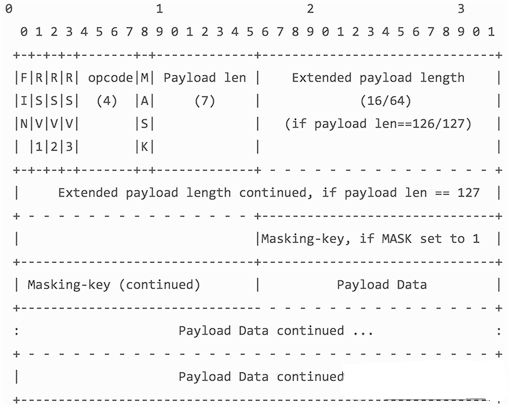
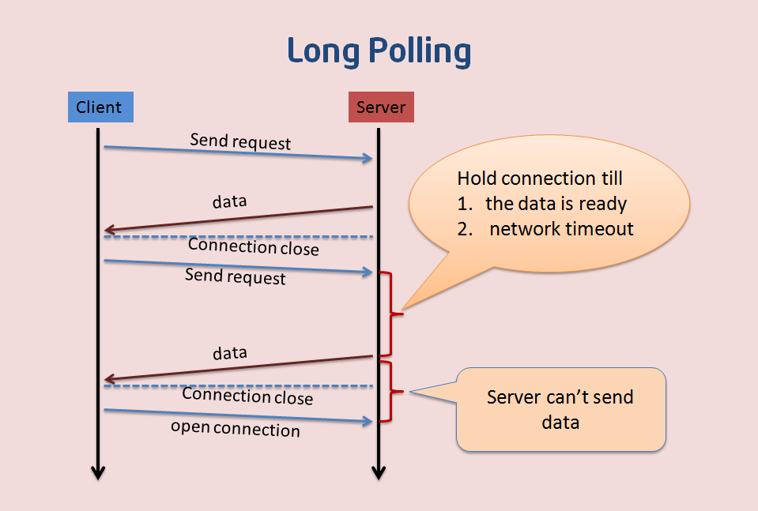
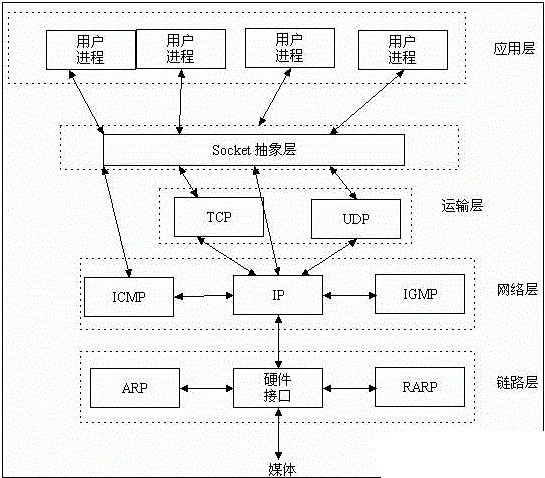

# WebSocket

## 什么是Socket？什么是WebSocket？

对于第1次听说WebSocket技术的人来说，两者有什么区别？websocket是仅仅将socket的概念移植到浏览器中的实现吗？

我们知道，在网络中的两个应用程序（进程）需要全双工相互通信（全双工即双方可同时向对方发送消息），需要用到的就是socket，它能够提供端对端通信，对于程序员来讲，他只需要在某个应用程序的一端（暂且称之为客户端）创建一个socket实例并且提供它所要连接一端（暂且称之为服务端）的IP地址和端口，而另外一端（服务端）创建另一个socket并绑定本地端口进行监听，然后客户端进行连接服务端，服务端接受连接之后双方建立了一个端对端的TCP连接，在该连接上就可以双向通讯了，而且一旦建立这个连接之后，通信双方就没有客户端服务端之分了，提供的就是端对端通信了。我们可以采取这种方式构建一个桌面版的im程序，让不同主机上的用户发送消息。从本质上来说，socket并不是一个新的协议，它只是为了便于程序员进行网络编程而对tcp/ip协议族通信机制的一种封装。

websocket是html5规范中的一个部分，它借鉴了socket这种思想，为web应用程序客户端和服务端之间（注意是客户端服务端）提供了一种全双工通信机制。同时，它又是一种新的应用层协议，websocket协议是为了提供web应用程序和服务端全双工通信而专门制定的一种应用层协议，通常它表示为：ws://echo.websocket.org/?encoding=text HTTP/1.1，可以看到除了前面的协议名和http不同之外，它的表示地址就是传统的url地址。

可以看到，websocket并不是简单地将socket这一概念在浏览器环境中的移植。

WebSocket是HTML5出的东西（协议），也就是说HTTP协议没有变化，或者说没关系，但HTTP是不支持持久连接的（长连接，循环连接的不算）首先HTTP有1.1、1.0、2.0、3.0之说，但是Websocket其实是一个新协议，跟HTTP协议基本没有关系，只是为了兼容现有浏览器的握手规范而已，也就是说它是HTTP协议上的一种补充。它们之间的关系可以通过这样一张图理解,有交集，但是并不是全部。


## Websocket是什么样的协议，具体有什么优点

首先，Websocket是一个持久化的协议，相对于HTTP这种非持久的协议来说。

HTTP的生命周期通过Request来界定，也就是一个Request 一个Response，那么在HTTP1.0中，这次HTTP请求就结束了。在HTTP1.1中进行了改进，使得有一个keep-alive，也就是说，在一个HTTP连接中，可以发送多个Request，接收多个Response。
但是请记住 Request = Response ， 在HTTP中永远是这样，也就是说一个request只能有一个response。而且这个response也是被动的，不能主动发起。

Websocket是基于HTTP协议的，或者说借用了HTTP的协议来完成一部分握手。在握手阶段是一样的，首先我们来看个典型的Websocket握手。

```http
GET /chat HTTP/1.1
Host: server.example.com
Upgrade: websocket
Connection: Upgrade
Sec-WebSocket-Key: x3JJHMbDL1EzLkh9GBhXDw==
Sec-WebSocket-Protocol: chat, superchat
Sec-WebSocket-Version: 13
Origin: http://example.com

```

熟悉HTTP的童鞋可能发现了，这段类似HTTP协议的握手请求中，多了几个东西。
我会顺便讲解下作用。

```http
Upgrade: websocket
Connection: Upgrade
```

上面这个就是Websocket的核心了，告诉Nginx等服务器： “注意啦，我发起的是Websocket协议，快点帮我找到对应的处理器处理~不是那个老土的HTTP”。
```http
Sec-WebSocket-Key: x3JJHMbDL1EzLkh9GBhXDw==
Sec-WebSocket-Protocol: chat, superchat
Sec-WebSocket-Version: 13
```

Sec-WebSocket-Key 是一个Base64 encode的值，这个是浏览器随机生成的，告诉服务器：“不要忽悠我，我要验证你是不是真的是Websocket助理。”

Sec-WebSocket-Version 是告诉服务器所使用的Websocket Draft（协议版本），在最初的时候，Websocket协议还在 Draft 阶段，各种奇奇怪怪的协议都有，而且还有很多期奇奇怪怪不同的东西，什么Firefox和Chrome用的不是一个版本之类的，当初Websocket协议太多可是一个大难题。不过现在还好，已经定下来啦。

然后服务器会返回下列东西，表示已经接受到请求， 成功建立Websocket啦！

```http
HTTP/1.1 101 Switching Protocols
Upgrade: websocket
Connection: Upgrade
Sec-WebSocket-Accept: HSmrc0sMlYUkAGmm5OPpG2HaGWk=
Sec-WebSocket-Protocol: chat

```


```http
Upgrade: websocket
Connection: Upgrade
```

*Upgrade: websocket Connection: Upgrade* 依然是固定的，告诉客户端即将升级的是Websocket协议，而不是mozillasocket，lurnarsocket或者shitsocket。
然后，Sec-WebSocket-Accept 这个则是经过服务器确认，并且加密过后的 Sec-WebSocket-Key。

至此，HTTP已经完成它所有工作了，接下来就是完全按照Websocket协议进行了。


他解决了HTTP的这几个难题。

首先，被动性，当服务器完成协议升级后（HTTP->Websocket），服务端就可以主动推送信息给客户端啦。
所以上面的情景可以做如下修改。

只需要经过一次HTTP请求，就可以做到源源不断的信息传送了。
（在程序设计中，这种设计叫做回调，即：你有信息了再来通知我，而不是我傻乎乎的每次跑来问你）
这样的协议解决了上面同步有延迟，而且还非常消耗资源的这种情况。
那么为什么他会解决服务器上消耗资源的问题呢？其实我们所用的程序是要经过两层代理的，
即HTTP协议在Nginx等服务器的解析下，然后再传送给相应的 web server来处理。
简单地说，我们有一个非常快速的接线员（Nginx），他负责把问题转交给相应的客服（web server）。
本身接线员基本上速度是足够的，但是每次都卡在客服（web server）了，
老有客服处理速度太慢。，导致客服不够。
Websocket就解决了这样一个难题，建立后，
可以直接跟接线员建立持久连接，有信息的时候客服想办法通知接线员，
然后接线员在统一转交给客户。这样就可以解决客服处理速度过慢的问题了。
同时，在传统的方式上，要不断的建立，关闭HTTP协议，由于HTTP是非状态性的，
每次都要重新传输identity info（鉴别信息），来告诉服务端你是谁。虽然接线员很快速，但是每次都要听这么一堆，
效率也会有所下降的，同时还得不断把这些信息转交给客服，不但浪费客服的处理时间，
而且还会在网路传输中消耗过多的流量/时间。但是Websocket只需要一次HTTP握手，
所以说整个通讯过程是建立在一次连接/状态中，也就避免了HTTP的非状态性，服务端会一直知道你的信息，
直到你关闭请求，这样就解决了接线员要反复解析HTTP协议，还要查看identity info的信息。
同时由客户主动询问，转换为服务器（推送）有信息的时候就发送（当然客户端还是等主动发送信息过来的。。），
没有信息的时候就交给接线员（Nginx），不需要占用本身速度就慢的客服（web server）了

## 技术概览

在 WebSocket API，浏览器和服务器只需要要做一个握手的动作，然后，浏览器和服务器之间就形成了一条快速通道。两者之间就直接可以数据互相传送，改变了原有的B/S模式。

WebSocket技术应用的典型架构：


WebSocket的技术原理：


浏览器端的websocket 发起的请求一般是：

```js
// javacsript
  var ws = new WebSocket("ws://127.0.0.1:4000");
  ws.onopen = function(){
    console.log("succeed");
  };
  ws.onerror = function(){
    console.log(“error”);
  };
  ws.onmessage = function(e){
  console.log(e); 
  }
```

当 new 一个 websocket 对象之后，就会向服务器发送一个 get 请求：


这个请求是对摸个服务器的端口发送的，一般的话，会预先在服务器将一个socket 绑定到一个端口上，客户端和服务器端在这个预定的端口上通信（我这里绑定的就是 4000 端口，默认情况下，websocke 使用 80 端口）。

然后，在服务器端的socket监听到这个packet 之后就生成一个新的 socket，将发送过来的数据中的 Sec-WebSocket-Key 解析出来，然后按照把“Sec-WebSocket-Ke”加上一个魔幻字符串“258EAFA5-E914-47DA-95CA-C5AB0DC85B11”。使用SHA-1加密，之后进行BASE-64编码，将结果做为“Sec-WebSocket-Accept”头的值，返回给客户端。

客户端收到这个之后，就会将 通信协议 upgrade 到 websocket 协议：


然后就会在这个持久的通道下进行通信，包括浏览器的询问，服务器的push，双方是在一个全双工的状态下相互通信。

## WebSocket 通信协议

如上述的例子：切换后的websocket 协议中的 数据传输帧的格式(此时不再使用html协议) 官方文档给出的说明：



直接看这个，谁都会有点头大: 我画了一幅图来简单的解释这个 frame 的结构：


各字段的解释：

```text
FIN              1bit 表示信息的最后一帧，flag，也就是标记符
RSV 1-3        1bit each 以后备用的 默认都为 0
Opcode         4bit 帧类型，
Mask              1bit 掩码，是否加密数据，默认必须置为1 
Payload len   7bit 数据的长度，当这个7 bit的数据 == 126 时，后面的2 个字节也是表示数     据长度，当它 == 127 时，后面的 8 个字节表示数据长度
Masking-key      1 or 4 bit 掩码
Payload data  playload len  bytes 数据
```

所以我们这里的代码，通过判断 Playload len的值，来用 substr 截取 Masking-key 和 PlayloadData。

根据掩码解析数据的方法是：

```
for( i = 0; i < data.length ; i++){
   orginalData += data[i]  ^  maskingKey[i mod 4]; 
}
```

001 指的是 opcode 官方的解释：


可以设置 opcode的值，来告诉浏览器这个frame的数据属性。

## HTTP与WebSocket的关系

[HTTPRFC2616协议](https://tools.ietf.org/html/rfc2616)和 [WebSocket协议RFC6455](https://tools.ietf.org/html/rfc6455)

#### HTTP的消息

一个HTTP消息可能是request或者response消息，两种类型的消息都是由开始行（start-line），零个或多个header域，一个表示header域结束的空行（也就是，一个以CRLF为前缀的空行），一个可能为空的消息主体（message-body）。一个合格的HTTP客户端不应该在消息头或者尾添加多余的CRLF，服务端也会忽略这些字符。

header的值不包括任何前导或后续的LWS（线性空白），线性空白可能会出现在域值（filed-value）的第一个非空白字符之前或最后一个非空白字符之后。前导或后续的LWS可能会被移除而不会改变域值的语意。任何出现在filed-content之间的LWS可能会被一个SP（空格）代替。header域的顺序不重要，但建议把常用的header放在前边（协议里这么说的）。

#### HTTP的Request消息
RFC2616中这样定义HTTP Request 消息：

```text
Request = Request-Line
          *(( general-header 
            | request-header（跟本次请求相关的一些header）
            | entity-header ) CRLF)（跟本次请求相关的一些header）
          CRLF
          [ message-body ]
```

一个HTTP的request消息以一个请求行开始，从第二行开始是header，接下来是一个空行，表示header结束，最后是消息体。

请求行的定义如下：

```text
//请求行的定义
Request-Line = Method SP Request-URL SP HTTP-Version CRLF
 
//方法的定义
Method = "OPTIONS" | "GET" | "HEAD"  |"POST" |"PUT" |"DELETE" |"TRACE" |"CONNECT"  | extension-method
 
//资源地址的定义
Request-URI   ="*" | absoluteURI | abs_path | authotity（CONNECT）
```

Request消息中使用的header可以是general-header或者request-header，request-header（后边会讲解）。其中有一个比较特殊的就是Host，Host会与reuqest Uri一起来作为Request消息的接收者判断请求资源的条件。

请求资源组织方法如下：

* 如果Request-URI是绝对地址（absoluteURI），这时请求里的主机存在于Request-URI里。任何出现在请求里Host头域值应当被忽略；
* 假如Request-URI不是绝对地址（absoluteURI），并且请求包括一个Host头域，则主机由该Host头域值决定；
* 假如由规则１或规则２定义的主机是一个无效的主机，则应当以一个400（错误请求）错误消息返回。

#### HTTP的Response消息

响应消息跟请求消息几乎一模一样，定义如下：

```text
Response      = Status-Line              
                *(( general-header        
                 | response-header       
                 | entity-header ) CRLF)  
                CRLF
                [ message-body ]
```

可以看到，除了header不使用request-header之外，只有第一行不同，响应消息的第一行是状态行，其中就包含大名鼎鼎的返回码。

Status-Line的内容首先是协议的版本号，然后跟着返回码，最后是解释的内容，它们之间各有一个空格分隔，行的末尾以一个回车换行符作为结束。

定义如下：

    Status-Line = HTTP-Version SP Status-Code SP Reason-Phrase CRLF


#### HTTP的返回码

返回码是一个3位数，第一位定义的返回码的类别，总共有5个类别，它们是：

```text
- 1xx: Informational - Request received, continuing process
 
- 2xx: Success - The action was successfully received,
  understood, and accepted
 
- 3xx: Redirection - Further action must be taken in order to
  complete the request
 
- 4xx: Client Error - The request contains bad syntax or cannot
  be fulfilled
 
- 5xx: Server Error - The server failed to fulfill an apparently
  valid request
```

RFC2616中接着又给出了一系列返回码的扩展，这些都是我们平时会用到的，但是那些只是示例，HTTP1.1不强制通信各方遵守这些扩展的返回码，通信各方在返回码的实现上只需要遵守以上边定义的这5种类别的定义，意思就是，返回码的第一位要严格按照文档中所述的来，其他的随便定义。

任何人接收到一个不认识的返回码xyz，都可以把它当做x00来对待。对于不认识的返回码的响应消息，不可以缓存。

#### HTTP的Header

RFC2616中定义了4种header类型，在通信各方都认可的情况下，请求头可以被扩展的（可信的扩展只能等到协议的版本更新），如果接收者收到了一个不认识的请求头，这个头将会被当做实体头。4种头类型如下。

1）通用头（General Header Fields）：可用于request，也可用于response的头，但不可作为实体头，只能作为消息的头。

```text
general-header = Cache-Control            ; Section 14.9
              | Connection               ; Section 14.10
              | Date                     ; Section 14.18
              | Pragma                   ; Section 14.32
              | Trailer                  ; Section 14.40
              | Transfer-Encoding        ; Section 14.41
              | Upgrade                  ; Section 14.42
              | Via                      ; Section 14.45
              | Warning                  ; Section 14.46
```

2）请求头（Request Header Fields）：被请求发起端用来改变请求行为的头。

```text
request-header = Accept                   ; Section 14.1
               | Accept-Charset           ; Section 14.2
               | Accept-Encoding          ; Section 14.3
               | Accept-Language          ; Section 14.4
               | Authorization            ; Section 14.8
               | Expect                   ; Section 14.20
               | From                     ; Section 14.22
               | Host                     ; Section 14.23
               | If-Match                 ; Section 14.24
               | If-Modified-Since        ; Section 14.25
               | If-None-Match            ; Section 14.26
               | If-Range                 ; Section 14.27
               | If-Unmodified-Since      ; Section 14.28
               | Max-Forwards             ; Section 14.31
               | Proxy-Authorization      ; Section 14.34
               | Range                    ; Section 14.35
               | Referer                  ; Section 14.36
               | TE                       ; Section 14.39
               | User-Agent               ; Section 14.43
```

3）响应头（Response Header Fields）：被服务器用来对资源进行进一步的说明。

```text
response-header = Accept-Ranges           ; Section 14.5
                | Age                     ; Section 14.6
                | ETag                    ; Section 14.19
                | Location                ; Section 14.30
                | Proxy-Authenticate      ; Section 14.33
                | Retry-After             ; Section 14.37
                | Server                  ; Section 14.38
                | Vary                    ; Section 14.44
                | WWW-Authenticate        ; Section 14.47
```

4）实体头（Entity Header Fields）：如果消息带有消息体，实体头用来作为元信息；如果没有消息体，就是为了描述请求的资源的信息。

```text
entity-header  = Allow                    ; Section 14.7
               | Content-Encoding         ; Section 14.11
               | Content-Language         ; Section 14.12
               | Content-Length           ; Section 14.13
               | Content-Location         ; Section 14.14
               | Content-MD5              ; Section 14.15
               | Content-Range            ; Section 14.16
               | Content-Type             ; Section 14.17
               | Expires                  ; Section 14.21
               | Last-Modified            ; Section 14.29
               | extension-header
```
#### HTTP的消息体（Message Body）和实体主体（Entity Body）

如果有Transfer-Encoding头，那么消息体解码完了就是实体主体，如果没有Transfer-Encoding头，消息体就是实体主体。

RFC2616中是这样定义的：

```text
message-body = entity-body
             | <entity-body encoded as per Transfer-Encoding>
```
在request消息中，消息头中含有Content-Length或者Transfer-Encoding，标识会有一个消息体跟在后边。如果请求的方法不应该含有消息体（如OPTION），那么request消息一定不能含有消息体，即使客户端发送过去，服务器也不会读取消息体。

在response消息中，是否存在消息体由请求方法和返回码来共同决定。像1xx，204，304不会带有消息体。

#### HTTP的消息体的长度    

消息体长度的确定有一下几个规则，它们顺序执行：

* 所有不应该返回内容的Response消息都不应该带有任何的消息体，消息会在第一个空行就被认为是终止了；
* 如果消息头含有Transfer-Encoding，且它的值不是identity，那么消息体的长度会使用chunked方式解码来确定，直到连接终止；
* 如果消息头中有Content-Length，那么它就代表了entity-length和transfer-length。如果同时含有Transfer-Encoding，则entity-length和transfer-length可能不会相等，那么Content-Length会被忽略；
* 如果消息的媒体类型是multipart/byteranges，并且transfer-length也没有指定，那么传输长度由这个媒体自己定义。通常是收发双发定义好了格式， HTTP1.1客户端请求里如果出现Range头域并且带有多个字节范围（byte-range）指示符，这就意味着客户端能解析multipart/byteranges响应；
* 如果是Response消息，也可以由服务器来断开连接，作为消息体结束。

从消息体中得到实体主体，它的类型由两个header来定义，Content-Type和Content-Encoding（通常用来做压缩）。如果有实体主体，则必须有Content-Type,如果没有，接收方就需要猜测，猜不出来就是用application/octet-stream。


#### HTTP连接

HTTP1.1的连接默认使用持续连接（persistent connection），持续连接指的是，有时是客户端会需要在短时间内向服务端请求大量的相关的资源，如果不是持续连接，那么每个资源都要建立一个新的连接，HTTP底层使用的是TCP，那么每次都要使用三次握手建立TCP连接，将造成极大的资源浪费。

持续连接可以带来很多的好处：

```text
1）使用更少的TCP连接，对通信各方的压力更小；
2）可以使用管道（pipeline）来传输信息，这样请求方不需要等待结果就可以发送下一条信息，对于单个的TCP的使用更充分；
3）流量更小；
4）顺序请求的延时更小；
5）不需要重新建立TCP连接就可以传送error，关闭连接等信息。
```

#### WebSocket协议

只从RFC发布的时间看来，WebSocket要晚近很多，HTTP 1.1是1999年，WebSocket则是12年之后了。
WebSocket协议的开篇就说，本协议的目的是为了解决基于浏览器的程序需要拉取资源时必须发起多个HTTP请求和长时间的轮训的问题而创建的。

WebSocket协议还很年轻，RFC文档（RFC 6455：The WebSocket Protocol）相比HTTP的发布时间也很短，它的诞生是为了创建一种「双向通信」的协议，来作为HTTP协议的一个替代者。那么首先看一下它和HTTP（或者HTTP的长连接）的区别。

#### 为什么要用WebSocket来替代HTTP

WebSocket的目的就是解决传统Web网络传输中的双向通信的问题，HTTP1.1默认使用持久连接（persistent connection），在一个TCP连接上也可以传输多个Request/Response消息对，但是HTTP的基本模型还是一个Request对应一个Response。

以IM聊天系统为例，客户端要向服务器传送数据，同时服务器也需要实时的向客户端传送信息，一个聊天系统就是典型的双向通信。

要实现Web端双向通信，一般会使用这样几种解决方案：

1. 轮询（polling）：轮询就会造成对网络和通信双方的资源的浪费，且非实时；
2. 长轮询：客户端发送一个超时时间很长的Request，服务器hold住这个连接，在有新数据到达时返回Response，相比#1，占用的网络带宽少了，其他类似；
3. 长连接：其实有些人对长连接的概念是模糊不清的，我这里讲的其实是HTTP的长连接（1）。如果你使用Socket来建立TCP的长连接（2），那么，这个长连接（2）跟我们这里要讨论的WebSocket是一样的，实际上TCP长连接就是WebSocket的基础，但是如果是HTTP的长连接，本质上还是Request/Response消息对，仍然会造成资源的浪费、实时性不强等问题。


#### WebSocket协议基础

WebSocket的目的是取代HTTP在双向通信场景下的使用，而且它的实现方式有些也是基于HTTP的（WS的默认端口是80和443）。现有的网络环境（客户端、服务器、网络中间人、代理等）对HTTP都有很好的支持，所以这样做可以充分利用现有的HTTP的基础设施，有点向下兼容的意味。

简单来讲，WS协议有两部分组成：握手和数据传输。

###### 握手（handshake）

出于兼容性的考虑，WS的握手使用HTTP来实现（此文档中提到未来有可能会使用专用的端口和方法来实现握手），客户端的握手消息就是一个「普通的，带有Upgrade头的，HTTP Request消息」。所以这一个小节到内容大部分都来自于RFC2616，这里只是它的一种应用形式，下面是RFC6455文档中给出的一个客户端握手消息示例：

```text
GET /chat HTTP/1.1            //1
Host: server.example.com   //2
Upgrade: websocket            //3
Connection: Upgrade            //4
Sec-WebSocket-Key: dGhlIHNhbXBsZSBub25jZQ==            //5
Origin: [url=http://example.com]http://example.com[/url]            //6
Sec-WebSocket-Protocol: chat, superchat            //7
Sec-WebSocket-Version: 13            //8
```

可以看到，前两行跟HTTP的Request的起始行一模一样，而真正在WS的握手过程中起到作用的是下面几个header域：

* Upgrade：upgrade是HTTP1.1中用于定义转换协议的header域。它表示，如果服务器支持的话，客户端希望使用现有的「网络层」已经建立好的这个「连接（此处是TCP连接）」，切换到另外一个「应用层」（此处是WebSocket）协议；
* Connection：HTTP1.1中规定Upgrade只能应用在「直接连接」中，所以带有Upgrade头的HTTP1.1消息必须含有Connection头，因为Connection头的意义就是，任何接收到此消息的人（往往是代理服务器）都要在转发此消息之前处理掉Connection中指定的域（不转发Upgrade域）。如果客户端和服务器之间是通过代理连接的，那么在发送这个握手消息之前首先要发送CONNECT消息来建立直接连接；
* Sec-WebSocket-＊：第7行标识了客户端支持的子协议的列表（关于子协议会在下面介绍），第8行标识了客户端支持的WS协议的版本列表，第5行用来发送给服务器使用（服务器会使用此字段组装成另一个key值放在握手返回信息里发送客户端）；
* Origin：作安全使用，防止跨站攻击，浏览器一般会使用这个来标识原始域。

如果服务器接受了这个请求，可能会发送如下这样的返回信息，这是一个标准的HTTP的Response消息。101表示服务器收到了客户端切换协议的请求，并且同意切换到此协议。

RFC2616规定只有切换到的协议「比HTTP1.1更好」的时候才能同意切换：

```text
HTTP/1.1 101 Switching Protocols //1
Upgrade: websocket. //2
Connection: Upgrade. //3
Sec-WebSocket-Accept: s3pPLMBiTxaQ9kYGzzhZRbK+xOo=  //4
Sec-WebSocket-Protocol: chat. //5
```

###### WebSocket协议Uri

ws协议默认使用80端口，wss协议默认使用443端口：

```text
ws-URI = "ws:" "//" host [ ":" port ] path [ "?" query ]
wss-URI = "wss:" "//" host [ ":" port ] path [ "?" query ]
 
host = <host, defined in [RFC3986], Section 3.2.2>
port = <port, defined in [RFC3986], Section 3.2.3>
path = <path-abempty, defined in [RFC3986], Section 3.3>
query = <query, defined in [RFC3986], Section 3.4>
```

**注：wss协议是WebSocket使用SSL/TLS加密后的协议，类似天HTTP和HTTPS的关系。**

###### 在客户端发送握手之前要做的一些小事

在握手之前，客户端首先要先建立连接，一个客户端对于一个相同的目标地址（通常是域名或者IP地址，不是资源地址）同一时刻只能有一个处于CONNECTING状态（就是正在建立连接）的连接。

从建立连接到发送握手消息这个过程大致是这样的：

1. 客户端检查输入的Uri是否合法。
2. 客户端判断，如果当前已有指向此目标地址（IP地址）的连接（A）仍处于CONNECTING状态，需要等待这个连接（A）建立成功，或者建立失败之后才能继续建立新的连接：
   * PS：如果当前连接是处于代理的网络环境中，无法判断IP地址是否相同，则认为每一个Host地址为一个单独的目标地址，同时客户端应当限制同时处于CONNECTING状态的连接数；
   * PPS：这样可以防止一部分的DDOS攻击；
   *  PPPS：客户端并不限制同时处于「已成功」状态的连接数，但是如果一个客户端「持有大量已成功状态的连接的」，服务器或许会拒绝此客户端请求的新连接。
3. 如果客户端处于一个代理环境中，它首先要请求它的代理来建立一个到达目标地址的TCP连接：

例如，如果客户端处于代理环境中，它想要连接某目标地址的80端口，它可能要收现发送以下消息：
   * CONNECT example.com:80 HTTP/1.1
   * Host: example.com
   
如果客户端没有处于代理环境中，它就要首先建立一个到达目标地址的直接的TCP连接。

如果上一步中的TCP连接建立失败，则此WebSocket连接失败。如果协议是wss，则在上一步建立的TCP连接之上，使用TSL发送握手信息。如果失败，则此WebSocket连接失败；如果成功，则以后的所有数据都要通过此TSL通道进行发送。

###### 对于客户端握手信息的一些小要求

客户端握手信息的要求：

* 握手必须是RFC2616中定义的Request消息
* 此Request消息的方法必须是GET，HTTP版本必须大于1.1 ：
  - 以下是某WS的Uri对应的Request消息：
  - ws://example.com/chat
  - GET /chat HTTP/1.1
* 此Request消息中Request-URI部分（RFC2616中的概念）所定义的资型必须和WS协议的Uri中定义的资源相同。
* 此Request消息中必须含有Host头域，其内容必须和WS的Uri中定义的相同。
* 此Request消息必须包含Upgrade头域，其内容必须包含websocket关键字。
* 此Request消息必须包含Connection头域，其内容必须包含Upgrade指令。
* 此Request消息必须包含Sec-WebSocket-Key头域，其内容是一个Base64编码的16位随机字符。
* 如果客户端是浏览器，此Request消息必须包含Origin头域，其内容是参考RFC6454。
* 此Request消息必须包含Sec-WebSocket-Version头域，在此协议中定义的版本号是13。
* 此Request消息可能包含Sec-WebSocket-Protocol头域，其意义如上文中所述。
* 此Request消息可能包含Sec-WebSocket-Extensions头域，客户端和服务器可以使用此header来进行一些功能的扩展。
* 此Request消息可能包含任何合法的头域。如RFC2616中定义的那些。

###### 在客户端接收到Response握手消息之后要做的一些事情

接收到Response握手消息之后：

* 如果返回的返回码不是101，则按照RFC2616进行处理。如果是101，进行下一步，开始解析header域，所有header域的值不区分大小写；
* 判断是否含有Upgrade头，且内容包含websocket；
* 判断是否含有Connection头，且内容包含Upgrade；
* 判断是否含有Sec-WebSocket-Accept头，其内容在下面介绍；
* 如果含有Sec-WebSocket-Extensions头，要判断是否之前的Request握手带有此内容，如果没有，则连接失败；
* 如果含有Sec-WebSocket-Protocol头，要判断是否之前的Request握手带有此协议，如果没有，则连接失败。

###### 服务端的概念
服务端指的是所有参与处理WebSocket消息的基础设施，比如如果某服务器使用Nginx（A）来处理WebSocket，然后把处理后的消息传给响应的服务器（B），那么A和B都是这里要讨论的服务端的范畴。

###### 接受了客户端的连接请求，服务端要做的一些事情

如果请求是HTTPS，则首先要使用TLS进行握手，如果失败，则关闭连接，如果成功，则之后的数据都通过此通道进行发送。

之后服务端可以进行一些客户端验证步骤（包括对客户端header域的验证），如果需要，则按照RFC2616来进行错误码的返回。

如果一切都成功，则返回成功的Response握手消息。

###### 服务端发送的成功的Response握手

此握手消息是一个标准的HTTP Response消息，同时它包含了以下几个部分：

* 状态行（如上一篇RFC2616中所述）；
* Upgrade头域，内容为websocket；
* Connection头域，内容为Upgrade；
* Sec-WebSocket-Accept头域，其内容的生成步骤：
  - a. 首先将Sec-WebSocket-Key的内容加上字符串258EAFA5-E914-47DA-95CA-C5AB0DC85B11（一个UUID）；
  - b. 将#1中生成的字符串进行SHA1编码；
  - c. 将#2中生成的字符串进行Base64编码。
* Sec-WebSocket-Protocol头域（可选）；
* Sec-WebSocket-Extensions头域（可选）。

一旦这个握手发出去，服务端就认为此WebSocket连接已经建立成功，处于OPEN状态。它就可以开始发送数据了。


###### WebSocket的一些扩展

Sec-WebSocket-Version可以被通信双方用来支持更多的协议的扩展，RFC6455中定义的值为13，WebSocket的客户端和服务端可能回自定义更多的版本号来支持更多的功能。其使用方法如上文所述。

###### 发送数据
WebSocket中所有发送的数据使用帧的形式发送。客户端发送的数据帧都要经过掩码处理，服务端发送的所有数据帧都不能经过掩码处理。否则对方需要发送关闭帧。

一个帧包含一个帧类型的标识码，一个负载长度，和负载。负载包括扩展内容和应用内容。
###### 帧类型

帧类型是由一个4位长的叫Opcode的值表示，任何WebSocket的通信方收到一个位置的帧类型，都要以连接失败的方式断开此连接。

RFC6455中定义的帧类型如下所示：

1. Opcode == 0 继续：表示此帧是一个继续帧，需要拼接在上一个收到的帧之后，来组成一个完整的消息。由于这种解析特性，非控制帧的发送和接收必须是相同的顺序。
2. Opcode == 1 文本帧。
3. Opcode == 2 二进制帧。
4. Opcode == 3 - 7 未来使用（非控制帧）。
5. Opcode == 8 关闭连接（控制帧）：此帧可能会包含内容，以表示关闭连接的原因。通信的某一方发送此帧来关闭WebSocket连接，收到此帧的一方如果之前没有发送此帧，则需要发送一个同样的关闭帧以确认关闭。如果双方同时发送此帧，则双方都需要发送回应的关闭帧。理想情况服务端在确认WebSocket连接关闭后，关闭相应的TCP连接，而客户端需要等待服务端关闭此TCP连接，但客户端在某些情况下也可以关闭TCP连接。
6. Opcode == 9 Ping：类似于心跳，一方收到Ping，应当立即发送Pong作为响应。
7. Opcode == 10 Pong：如果通信一方并没有发送Ping，但是收到了Pong，并不要求它返回任何信息。Pong帧的内容应当和收到的Ping相同。可能会出现一方收到很多的Ping，但是只需要响应最近的那一次就可以了。
8. Opcode == 11 - 15 未来使用（控制帧）。

###### 帧的格式

具体的每一项代表什么意思在这里就不做详细的阐述了。


###### 小结一下

以上说了这么多，其实Http和WebSocket的关系通过下图就能简单的理解了：


#### 与HTTP比较

同样作为应用层的协议，WebSocket在现代的软件开发中被越来越多的实践，和HTTP有很多相似的地方，这里将它们简单的做一个纯个人、非权威的比较。

###### 相同点
* 都是基于TCP的应用层协议；
* 都使用Request/Response模型进行连接的建立；
* 在连接的建立过程中对错误的处理方式相同，在这个阶段WS可能返回和HTTP相同的返回码；
* 都可以在网络中传输数据。

###### 不同点

* WS使用HTTP来建立连接，但是定义了一系列新的header域，这些域在HTTP中并不会使用；
* WS的连接不能通过中间人来转发，它必须是一个直接连接；
* WS连接建立之后，通信双方都可以在任何时刻向另一方发送数据；
* WS连接建立之后，数据的传输使用帧来传递，不再需要Request消息；
* WS的数据帧有序。

#### 为什么引入WebSocket协议

Browser已经支持http协议，为什么还要开发一种新的WebSocket协议呢？我们知道http协议是一种单向的网络协议，在建立连接后，它只允许Browser/UA（UserAgent）向WebServer发出请求资源后，WebServer才能返回相应的数据。而WebServer不能主动的推送数据给Browser/UA，当初这么设计http协议也是有原因的，假设WebServer能主动的推送数据给Browser/UA，那Browser/UA就太容易受到攻击，一些广告商也会主动的把一些广告信息在不经意间强行的传输给客户端，这不能不说是一个灾难。那么单向的http协议给现在的网站或Web应用程序开发带来了哪些问题呢？

让我们来看一个案例，现在假设我们想开发一个基于Web的应用程序去获取当前Web服务器的实时数据，例如股票的实时行情，火车票的剩余票数等等，这就需要Browser/UA与WebServer端之间反复的进行http通信，Browser不断的发送Get请求，去获取当前的实时数据。下面介绍几种常见的方式：

###### Polling


这种方式就是通过Browser/UA定时的向Web服务器发送http的Get请求，服务器收到请求后，就把最新的数据发回给客户端（Browser/UA），Browser/UA得到数据后，就将其显示出来，然后再定期的重复这一过程。虽然这样可以满足需求，但是也仍然存在一些问题，例如在某段时间内Web服务器端没有更新的数据，但是Browser/UA仍然需要定时的发送Get请求过来询问，那么Web服务器就把以前的老数据再传送过来，Browser/UA把这些没有变化的数据再显示出来，这样显然既浪费了网络带宽，又浪费了CPU的利用率。如果说把Browser发送Get请求的周期调大一些，就可以缓解这一问题，但是如果在Web服务器端的数据更新很快时，这样又不能保证Web应用程序获取数据的实时性。

######  Long Polling



上面介绍了Polling遇到的问题，现在介绍一下LongPolling，它是对Polling的一种改进。

Browser/UA发送Get请求到Web服务器，这时Web服务器可以做两件事情，第一，如果服务器端有新的数据需要传送，就立即把数据发回给Browser/UA，Browser/UA收到数据后，立即再发送Get请求给Web Server；第二，如果服务器端没有新的数据需要发送，这里与Polling方法不同的是，服务器不是立即发送回应给Browser/UA，而是把这个请求保持住，等待有新的数据到来时，再来响应这个请求；当然了，如果服务器的数据长期没有更新，一段时间后，这个Get请求就会超时，Browser/UA收到超时消息后，再立即发送一个新的Get请求给服务器。然后依次循环这个过程。

这种方式虽然在某种程度上减小了网络带宽和CPU利用率等问题，但是仍然存在缺陷，例如假设服务器端的数据更新速率较快，服务器在传送一个数据包给Browser后必须等待Browser的下一个Get请求到来，才能传递第二个更新的数据包给Browser，那么这样的话，Browser显示实时数据最快的时间为2×RTT（往返时间），另外在网络拥塞的情况下，这个应该是不能让用户接受的。另外，由于http数据包的头部数据量往往很大（通常有400多个字节），但是真正被服务器需要的数据却很少（有时只有10个字节左右），这样的数据包在网络上周期性的传输，难免对网络带宽是一种浪费。

通过上面的分析可知，要是在Browser能有一种新的网络协议，能支持客户端和服务器端的双向通信，而且协议的头部又不那么庞大就好了。WebSocket就是肩负这样一个使命登上舞台的。

#### 技术对比

HTTP协议是非持久化的，单向的网络协议，在建立连接后只允许浏览器向服务器发出请求后，服务器才能返回相应的数据。当需要即时通讯时，通过轮询在特定的时间间隔（如1秒），由浏览器向服务器发送Request请求，然后将最新的数据返回给浏览器。
这样的方法最明显的缺点就是需要不断的发送请求，而且通常HTTP request的Header是非常长的，为了传输一个很小的数据 需要付出巨大的代价，是很不合算的，占用了很多的宽带。这种方式即浪费带宽（HTTP HEAD 是比较大的），又消耗服务器 CPU 占用（没有信息也要接受请求）。


而是用 WebSocket 技术，则会大幅降低上面提到的消耗，如下图所示。


## WebSocket与Socket的关系

* Socket 和 WebSocket 有哪些区别和联系？
* WebSocket 和 HTML5 是什么关系？
* 必须在浏览器中才能使用 WebSocket 吗？
* WebSocket 能和 Socket 一样传输 raw 数据么？
* WebSocket 和 Socket 相比会多耗费流量么？

#### WebSocket 与 TCP

从 OSI 模型图中可以看出，HTTP、WebSocket 等应用层协议，都是基于 TCP 协议来传输数据的，我们可以把这些高级协议理解成对 TCP 的封装。

既然大家都使用 TCP 协议，那么大家的连接和断开，都要遵循 TCP 协议中的三次握手和四次握手 ，只是在连接之后发送的内容不同，或者是断开的时间不同。


对于 WebSocket 来说，它必须依赖 HTTP 协议进行一次握手 ，握手成功后，数据就直接从 TCP 通道传输，与 HTTP 无关了。

### 再来看看Socket

Socket可以有很多意思，和IT较相关的本意大致是指在端到端的一个连接中，这两个端叫做Socket。对于IT从业者来说，它往往指的是TCP/IP网络环境中的两个连接端，大多数的API提供者（如操作系统，JDK）往往会提供基于这种概念的接口，所以对于开发者来说也往往是在说一种编程概念。同时，操作系统中进程间通信也有Socket的概念，但这个Socket就不是基于网络传输层的协议了。

###### Unix中的Socket


操作系统中也有使用到Socket这个概念用来进行进程间通信，它和通常说的基于TCP/IP的Socket概念十分相似，代表了在操作系统中传输数据的两方，只是它不再基于网络协议，而是操作系统本身的文件系统。

###### 网络中的Socket

通常所说的Socket API，是指操作系统中（也可能不是操作系统）提供的对于传输层（TCP/UDP）抽象的接口。现行的Socket API大致都是遵循了BSD Socket规范（包括Windows）。这里称规范其实不太准确，规范其实是POSIX，但BSD Unix中对于Socket的实现被广为使用，所以成为了实际的规范。如果你要使用HTTP来构建服务，那么就不需要关心Socket，如果你想基于TCP/IP来构建服务，那么Socket可能就是你会接触到的API。


从上图中可以看到，HTTP是基于传输层的TCP协议的，而Socket API也是，所以只是从使用上说，可以认为Socket和HTTP类似（但一个是成文的互联网协议，一个是一直沿用的一种编程概念），是对于传输层协议的另一种直接使用，因为按照设计，网络对用户的接口都应该在应用层。

###### Socket名称的由来

和很多其他Internet上的事物一样，Socket这个名称来自于大名鼎鼎的ARPANET（Advanced Research Projects Agency），早期ARPANET中的Socket指的是一个源或者目的地址——大致就是今天我们所说的IP地址和端口号。最早的时候一个Socket指的是一个40位的数字（RFC33中说明了此用法，但在RFC36中并没有明确地说使用40位数字来标识一个地址），其中前32为指向的地址（socket number，大致相当于IP），后8位为发送数据的源（link，大致相当于端口号）。对他们的叫法有很多的版本，这里列举的并不严谨。

###### 端口号的野史

随着ARPANET的发展，后来（RFC433，Socket Number List）socket number被明确地定义为一个40位的数字，其中后8位被用来制定某个特定的应用使用（比如1是Telnet）。这8位数有很多名字：link、socket name、AEN（another eight number，看到这个名字我也是醉了），工程师逗逼起来也是挺拼的。

后来在Internet的规范制定中，才真正的用起了port number这个词。至于为什么端口号是16位的，我想可能有两个原因，一是对于当时的工程师来说，如果每个端口号来标识一个程序，65535个端口号也差不多够用了。二可能是为了对齐吧，_!!。

###### Socket原本的意思

在上边提到的历史中使用到的Socket，包括TCP文档中使用到的Socket，其实指的是网络传输中的一端，是一个虚拟化的概念。

#### Socket 与 WebSocket 的关系

正如上节所述：Socket 其实并不是一个协议，它工作在 OSI 模型会话层（第5层），是为了方便大家直接使用更底层协议（一般是 TCP 或 UDP ）而存在的一个抽象层。

最早的一套 Socket API 是 Berkeley sockets ，采用 C 语言实现。它是 Socket 的事实标准，POSIX sockets 是基于它构建的，多种编程语言都遵循这套 API，在 JAVA、Python 中都能看到这套 API 的影子。

下面摘录一段更容易理解的文字（来自 http和socket之长连接和短连接区别）：

Socket是应用层与TCP/IP协议族通信的中间软件抽象层，它是一组接口。在设计模式中，Socket其实就是一个门面模式，它把复杂的TCP/IP协议族隐藏在Socket接口后面，对用户来说，一组简单的接口就是全部，让Socket去组织数据，以符合指定的协议。

主机 A 的应用程序要能和主机 B 的应用程序通信，必须通过 Socket 建立连接，而建立 Socket 连接必须需要底层 TCP/IP 协议来建立 TCP 连接。建立 TCP 连接需要底层 IP 协议来寻址网络中的主机。我们知道网络层使用的 IP 协议可以帮助我们根据 IP 地址来找到目标主机，但是一台主机上可能运行着多个应用程序，如何才能与指定的应用程序通信就要通过 TCP 或 UPD 的地址也就是端口号来指定。这样就可以通过一个 Socket 实例唯一代表一个主机上的一个应用程序的通信链路了。




而 WebSocket 则不同，它是一个完整的 应用层协议，包含一套标准的 API。

所以，从使用上来说，WebSocket 更易用，而 Socket 更灵活。
