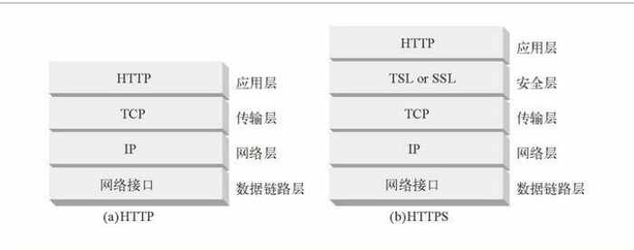
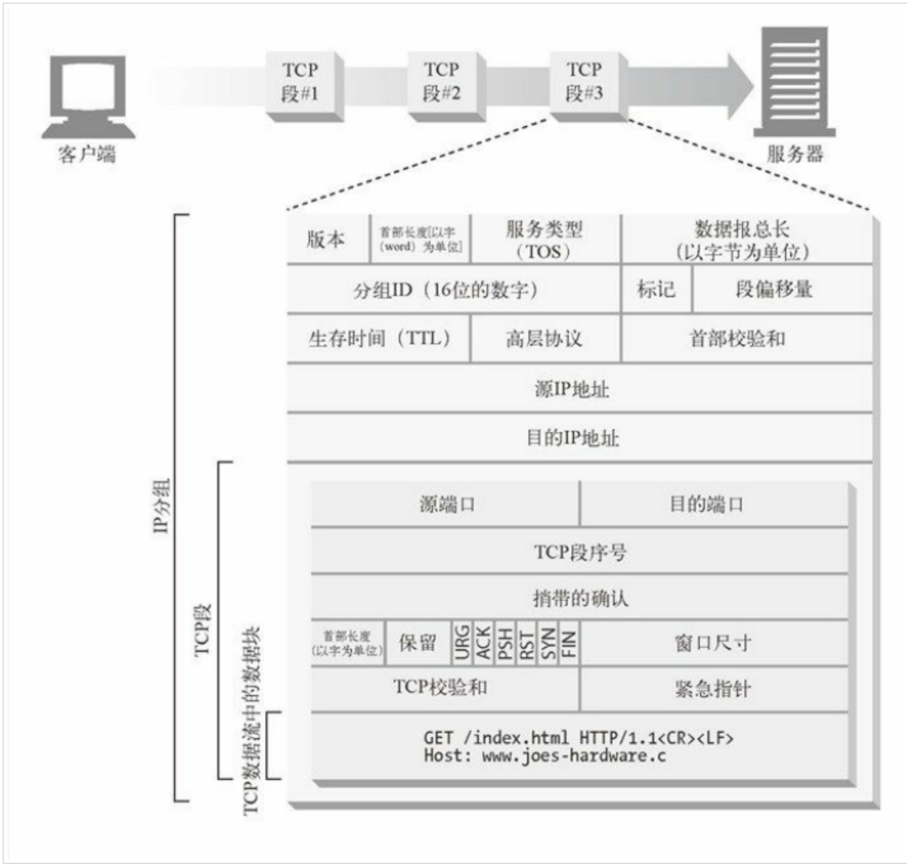
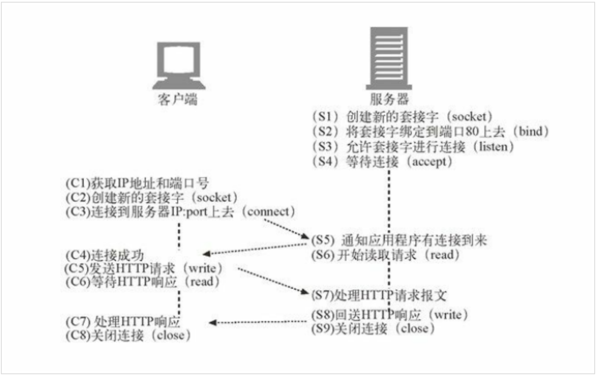
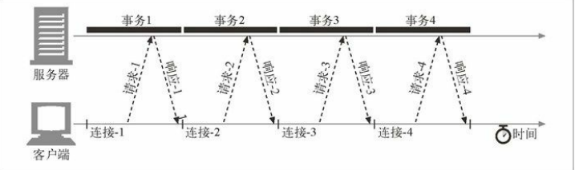
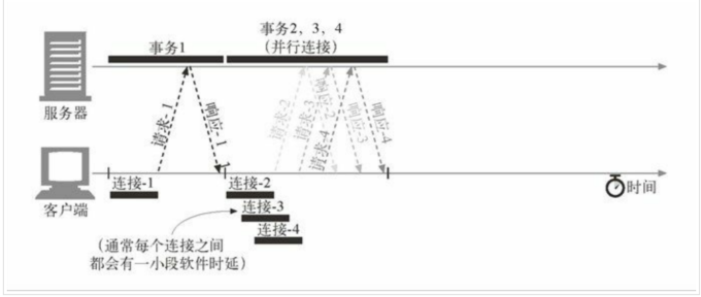

# HTTP是如何使用TCP连接

## TCP 连接的基本知识

#### TCP 是可靠的数据管道

TCP 会按序、无差错地承载 HTTP 数据，TCP 为 HTTP 提供了一条可靠的比特传输管道。从 TCP 连接一端填入的字节会从另一端 以原有的顺序、正确地传送出来。

#### TCP 流是分段的、由 IP 分组传送

TCP 的数据是通过名为 IP 分组（或 IP 数据报）的小数据块来发送的。

这样的话，如图HTTP 就是“HTTP over TCP over IP”这个“协议栈”中的最顶层了。其安全版本 HTTPS 就是在 HTTP 和 TCP 之间插入了一个（称为 TLS 或 SSL 的）密码加密层(安全层)，就是在图中的右半部分。

HTTP 要传送一条报文时，会以流的形式将报文数据的内容通过一条打开的 TCP 连接按 序传输。TCP 收到数据流之后，会将数据流砍成被称作段的小数据块，并将段封装在 IP 分组中，通过因特网进行传输，如下图中大家看到的内容：

每个 TCP 段都是由 IP 分组承载，从一个 IP 地址发送到另一个 IP 地址的。

而每个 IP 分组中都包括：

* 一个 IP 分组首部（通常为 20 字节）；
* 一个 TCP 段首部（通常为 20 字节）；
* 一个 TCP 数据块（0 个或多个字节）。

IP 首部包含了源和目的 IP 地址、长度和其他一些标记。TCP 段的首部包含了 TCP 端口 号、TCP 控制标记，以及用于数据排序和完整性检查的一些数字值。

#### 保持 TCP 连接的持续不间断地运行

在任意时刻计算机都可以有几条 TCP 连接处于打开状态。TCP 是通过端口号来保持所有 这些连接的正确运行的。 端口号和雇员使用的电话分机号很类似。

这就和我之前举得例子是一样的，公司的总机和你自己的座机一样，公司的总机号码能将你接到前台，而分机号 可以将你接到正确的雇员位置一样，IP 地址可以将你连接到正确的计算机，而端口号则 可以将你连接到正确的应用程序上去。TCP 连接是通过 4 个值来识别的：

源IP 地址、源端口号、目的IP 地址、目的端口号

这 4 个值一起唯一地定义了一条连接。两条不同的 TCP 连接不能拥有 4 个完全相同的地 址组件值（但不同连接的部分组件可以拥有相同的值）。

这里需要我们注意的是，有些连接共享了相同的目的端口号，有些连接使用了相同的源 IP 地址，有些使用了相同的目的 IP 地址，但没有两个不同连接所有的 4 个值都一样。

#### TCP 套接字

操作系统提供了一些操纵其 TCP 连接的工具。为了更具体地说明问题，我们来看一个 TCP 编程接口，这些套接字我就不一一介绍了，我给大家一个表格，大家可以理解一下

套接字API调用描 述s = socket()创建一个新的、未命名、未关联的套接字bind(s,)向套接字赋一个本地端口号和接口connect(s, )创建一条连接本地套接字与远程主机及端口的连接listen(s,…)标识一个本地套接字，使其可以合法接受连接s2 = accept(s)等待某人建立一条到本地端口的连接

套接字 API 允许用户创建 TCP 的端点数据结构，将这些端点与远程服务器的 TCP 端点进 行连接，并对数据流进行读写。TCP API 隐藏了所有底层网络协议的握手细节，以及 TCP 数据流与 IP 分组之间的分段和重装细节。

#### TCP 客户端和服务器是如何通过 TCP 套接字接口进行通信的

上图中说明了可以怎样通过套接字 API 来凸显客户端和服务器在实现 HTTP 事务时所应执行的步骤。

## TCP 连接的握手

TCP 连接握手需要经过以下几个步骤。 如图所示：

1. 请求新的 TCP 连接时，客户端要向服务器发送一个小的 TCP 分组（通常是 40 ～ 60 个字节）。这个分组中设置了一个特殊的 SYN 标记，说明这是一个连接请求。
2. 如果服务器接受了连接，就会对一些连接参数进行计算，并向客户端回送一个 TCP 分组，这个分组中的 SYN 和 ACK 标记都被置位，说明连接请求已被接受。
3. 最后，客户端向服务器回送一条确认信息，通知它连接已成功建立

我们永远不会看到这些分组——这些分组都由 TCP/IP 软件管理，对其是不可见 的。HTTP 程序员看到的只是创建 TCP 连接时存在的时延。

在这里我们需要注意的就是 TCP 连接的握手时延，通常 HTTP 事务都不会交换太多数据，此时，SYN/SYN+ACK 握手（参见图中的 a 段 和图中的 b 段）会产生一个可测量的时延。TCP 连接的 ACK 分组（参见图中的 c 段）通常都足够大，可以承载整个 HTTP 请求报文，而且很多 HTTP 服务器响应报文都可 以放入一个 IP 分组 中去（比如，响应是包含了装饰性图片的小型 HTML 文件，或者是对浏览器高速缓存请求产生的 304 Not Modified 响应）。

#### TCP 慢启动

TCP 数据传输的性能还取决于 TCP 连接的使用期（age）。TCP 连接会随着时间进行自 我“调谐”，起初会限制连接的最大速度，如果数据成功传输，会随着时间的推移提高传输 的速度。这种调谐被称为 TCP 慢启动（slow start），用于防止因特网的突然过载和拥 塞。

TCP 慢启动限制了一个 TCP 端点在任意时刻可以传输的分组数。简单来说，每成功接收 一个分组，发送端就有了发送另外两个分组的权限。如果某个 HTTP 事务有大量数据要发 送，是不能一次将所有分组都发送出去的。必须发送一个分组，等待确认；然后可以发送 两个分组，每个分组都必须被确认，这样就可以发送四个分组了，以此类推。这种方式被 称为“打开拥塞窗口”。

由于存在这种拥塞控制特性，所以新连接的传输速度会比已经交换过一定量数据的、“已 调谐”连接慢一些。由于已调谐连接要更快一些，所以 HTTP 中有一些可以重用现存连接 的工具。

## HTTP 连接的处理

前面我们说了 TCP 连接，我们重新来分析一下 HTTP ，之前我也说过在 HTTP 1.0的时候和1.1之后，有 Keep-Alive ，关于 Keep-Alive 不懂的请翻看前面的公众号的文章内容，接下来我分几个内容给大家讲述 HTTP 对连接上的处理。

* 并行连接1 通过多条 TCP 连接发起并发的 HTTP 请求。
* 持久连接1 重用 TCP 连接，以消除连接及关闭时延。
* 管道化连接1 通过共享的 TCP 连接发起并发的 HTTP 请求。

我们来看一下串行：

每个事务都需要（串行地建立）一条 新的连接，那么连接时延和慢启动时延就会叠加起来

并行连接就是说 HTTP 允许客户端打开多条连接，并行的去执行多个　HTTP 的事务，就会出现多条线路平行的情况。

其实并行连接并没有说是页面的传输速度，是因为多个对象同时在进展，所以，他的速度要比叠加起来，让你在感觉上快不少。

#### 持久连接

HTTP 1.1 允许 HTTP 设备在事务处理结束之后 将 TCP 连接保持在打开状态，以便为未来的 HTTP 请求重用现存的连接。在事务处理结束之后仍然保持在打开状态的 TCP 连接被称为持久连接。非持久连接会在每个事务结束之后关闭。持久连接会在不同事务之间保持打开状态，直到客户端或服务器决定将其关闭为止。

#### 管道化连接(也有人称之为管线化)

HTTP/1.1 允许在持久连接上可选地使用请求管道。这是相对于 keep-alive 连接的又一性能优化。在响应到达之前，可以将多条请求放入队列。当第一条请求通过网络流向地球另一端的服务器时，第二条和第三条请求也可以开始发送了。在高时延网络条件下，这样做可以降低网络的环回时间，提高性能。

其实管道化说白了就是 传送过程中不需先等待服务端的回应，然后又发了几条，浏览器将 HTTP 要求大批提交可大幅缩短页面的加载时间，特别是在传输延迟（lag/latency）较高的情况下（如卫星连接）。此技术之关键在于多个 HTTP 的要求消息可以同时塞入一个 TCP 分组中，所以只提交一个分组即可同时发出多个要求，借此可减少网络上多余的分组并降低线路负载。
