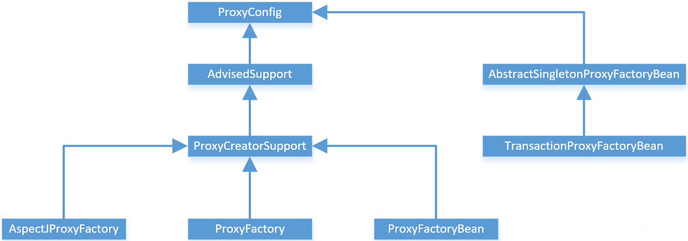
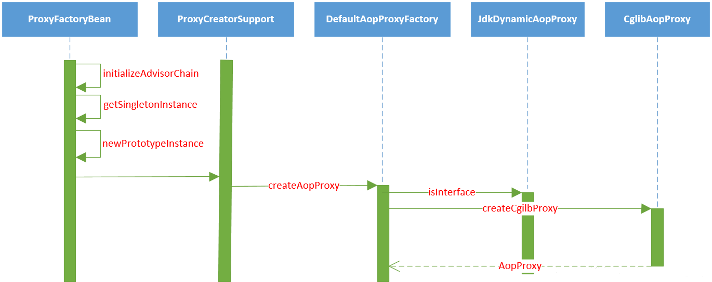
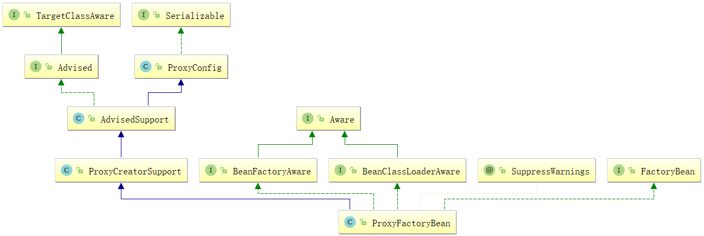
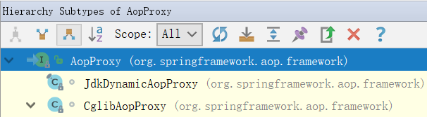

# Spring AOP的实现

## AOP的概念

AOP(Aspect Oriented Programming)，即为面向切面编程。在软件开发中，散布于应用中多处的
功能被称为横切关注点(cross-cutting concern)，通常来说，这些横切关注点从概念上是与应用的业务逻辑分离的。
比如，声明式事务、日志、安全、缓存等等，都与业务逻辑无关，可以将这些东西抽象成为模块，采用面向切面编程的方式，
通过声明方式定义这些功能用于何处，通过预编译方式和运行期动态代理实现这些模块化横切关注点程序功能进行统一维护，
从而将横切关注点与它们所影响的对象之间分离出来，就是实现解耦。

横切关注点可以被模块化为特殊的类，这些类被称为切面(aspect)。这样做有两个优点:

1. 每个关注点都集中于一个地方，而不是分散到多处代码中;
2. 服务模块更简洁，因为它们只包含主要的关注点的代码（核心业务逻辑），而次要关注点的代码（日志，事务，安全等）都被转移到切面中。

## AOP术语

#### 通知(Advice)
切面类有自己要完成的工作，切面类的工作就称为通知。通知定义了切面是做什么以及何时使用。

* "做什么"，即切面类中定义的方法是干什么的；
* "何时使用"，即5种通知类型，是在目标方法执行前，还是目标方法执行后等等；
* "何处做"，即通知定义了做什么，何时使用，但是不知道用在何处，而切点定义的就是告诉通知应该用在哪个类的哪个目标方法上，从而完美的完成横切点功能。

###### Spring切面定义了5种类型通知：

1. 前置通知(Before)：在目标方法被调用之前调用通知功能。
2. 后置通知(After)：在目标方法完成之后调用通知，不会关心方法的输出是什么。
3. 返回通知(After-returning)： 在目标方法成功执行之后调用通知。
4. 异常通知(After-throwing)：在目标方法抛出异常后调用通知。
5. 环绕通知(Around)：通知包裹了被通知的方法，在被通知的方法调用之前和之后执行自定义的行为。

#### 连接点(Join point)
在我们的应用程序中有可能有数以万计的时机可以应用通知，而这些时机就被称为连接点。

连接点是在应用执行过程中能够插入切面的一个点。这个点可以是调用方法时、抛出异常时、
甚至修改一个字段时。切面代码可以利用这些点插入到应用的正常流程之中，并添加新的行为。

连接点是一个虚概念，可以把连接点看成是切点的集合。

下面我们看看切点是神马鬼?

#### 切点(Poincut)
连接点谈的是一个飘渺的大范围，而切点是一个具体的位置，用于缩小切面所通知的连接点的范围。

前面说过，通知定义的是切面的"要做什么"和"在何时做"，是不是没有去哪里做，而切点就定义了"去何处做"。

切点的定义会匹配通知所要织入的一个或多个连接点。我们通常使用明确的类和方法名称，或者是使用
正则表达式定义所匹配的类和方法名称来指定切点。说白了，切点就是让通知找到"发泄的地方"。

#### 切面(Aspect)
切面是通知和切点的结合，通知和切点共同定义了切面的全部内容。因为通知定义的是切面的
"要做什么"和"在何时做"，而切点定义的是切面的"在何地做"。将两者结合在一起，就可以完美的
展现切面在何时，何地，做什么(功能)。

#### 引入(Introduction)
引入这个概念就比较高大尚，引入允许我们向现有的类添加新方法或属性。
主要目的是想在无需修改A的情况下，引入B的行为和状态。

#### 织入(Weaving)
织入是把切面应用到目标对象并创建新的代理对象的过程。切面在指定的连接点被织入到目标对象中。

在目标对象的生命周期里有多个点可以进行织入:

###### 编译期: 

    切面在目标类编译时被织入。需要特殊的编译器，是AspectJ的方式，不是spring的菜。

###### 类加载期: 

    切面在目标类加载到JVM时被织入。这种方式需要特殊的类加载器，它可以在目标类被引入应用之前增强该目标类的字节码。AspectJ5支持这种方式。

###### 运行期:  

    切面在应用运行的某个时刻被织入。一般情况下，在织入切面时，AOP容器会为目标对象动态的创建一个代理对象。而这正是Spring AOP的织入切面的方式。

## 各个不同的advice的拦截顺序的问题

#### 只有一个Aspect类：

* 无异常：@Around（proceed()之前的部分） → @Before → 方法执行 → @Around（proceed()之后的部分） → @After → @AfterReturning
* 有异常：@Around（proceed(之前的部分)） → @Before → 扔异常ing → @After → @AfterThrowing    （大概是因为方法没有跑完抛了异常，没有正确返回所有@Around的proceed()之后的部分和@AfterReturning两个注解的加强没有能够织入）

#### 同一个方法有多个@Aspect类拦截： 

单个Aspect肯定是和只有一个Aspect的时候的情况是一样的，但不同的Aspect里面的advice的顺序呢？？答案是不一定，像是线程一样，没有谁先谁后，除非你给他们分配优先级，同样地，在这里你也可以为@Aspect分配优先级，这样就可以决定谁先谁后了。

优先级有两种方式：

* 实现org.springframework.core.Ordered接口，实现它的getOrder()方法
* 给aspect添加@Order注解，该注解全称为：org.springframework.core.annotation.Order

不管是哪种，都是order的值越小越先执行：

#### 注意点：

* 如果在同一个 aspect 类中，针对同一个 pointcut，定义了两个相同的 advice(比如，定义了两个 @Before)，那么这两个 advice 的执行顺序是无法确定的，哪怕你给这两个 advice 添加了 @Order 这个注解，也不行。这点切记。
* 对于@Around这个advice，不管它有没有返回值，但是必须要方法内部，调用一下 pjp.proceed();否则，Controller 中的接口将没有机会被执行，从而也导致了 @Before这个advice不会被触发。

## 设计原理

本篇是以ProxyFactoryBean的配置来讲的，这个是最能体现AOP思想的一个配置方式，也是我们学习AOP一个入口。

在Spring的AOP模块中，一个主要的部分就是AopProxy代理对象的生成，而对于Spring应用，可以看到，是通过配置
和调用Spring的ProxyFactoryBean来完成这个任务的。在ProxyFactoryBean中，封装了主要代理对象的生成过程。

在这个生成过程中，可以使用JDK的Proxy和CGLIB两种方式。

以ProxyFactory的设计为中心，看下整个继承关系图：



在这个类继承关系图中，可以看到完成AOP应用的类，类说明：

* ProxyConfig： 作为共同基类，可以看成是一个数据基类，这个数据基类为ProxyFactoryBean这样的子类提供了配置属性。
* AdvisedSupport：封装了AOP对通知和通知器的相关操作，这些操作对于不同的AOP的代理对象的生成都是一样的，但对于具体的AOP代理对象的创建，AdvisedSupport把它交给它的子类们去完成。
* ProxyCreatorSupport：是其子类创建AOP代理对象的一个辅助类。
* AspectJProxyFactory：集成Spring和AspectJ的作用，适用于需要使用AspectJ的AOP应用。
* ProxyFactoryBean：Spring的AOP应用，可以在IOC中声明式配置。
* ProxyFactory：Spring的AOP应用，需要编程式使用。

## 配置ProxyFactoryBean

在分析Spring AOP的实现原理中，主要以ProxyFactoryBean的实现作为例子和实现的基本线索进行分析。这是因为
ProxyFactoryBean是在Spring IOC环境中创建AOP最底层的方法，也是最灵活的方法，Spring通过它完成了对AOP使用
的封装。以ProxyFactoryBean为实现入口，逐层深入，是快速理解Spring AOP实现的学习路径。

在了解ProxyFactoryBean的实现之前，先了解ProxyFactoryBean的配置和使用，在基于XML配置Spring的Bean时需要经历以下几个步骤：

1. 定义使用的通知器Advisor，这个通知器应该作为一个Bean来定义。这个通知器实现了对目标对象进行增强的切面行为，也就是Advice通知；
2. 定义ProxyFactoryBean：interceptorNames是指定义的通知器，可以有多个；
3. 定义target属性，需要增强的类，从源码上看只能有一个；

Spring XML关于ProxyFactoryBean使用配置：

```java
<?xml version="1.0" encoding="UTF-8"?>
<beans xmlns="http://www.springframework.org/schema/beans"
       xmlns:xsi="http://www.w3.org/2001/XMLSchema-instance"
       xmlns:context="http://www.springframework.org/schema/context"
       xmlns:aop="http://www.springframework.org/schema/aop"
       xsi:schemaLocation="http://www.springframework.org/schema/beans
       http://www.springframework.org/schema/beans/spring-beans.xsd
       http://www.springframework.org/schema/context
       http://www.springframework.org/schema/context/spring-context.xsd
       http://www.springframework.org/schema/aop
       http://www.springframework.org/schema/aop/spring-aop.xsd">
    <!-- 业务Bean -->
    <bean name="conferenceService" class="com.jpeony.spring.ConferenceServiceImpl"></bean>
 
    <!--配置Advice-->
    <bean name="logAdvice" class="com.jpeony.spring.aop.LoggerAdvice"></bean>
 
    <!--配置ProxyFactoryBean-->
    <bean name="aopMethod" class="org.springframework.aop.framework.ProxyFactoryBean">
        <!-- 指定通知器 -->
        <property name="interceptorNames">
            <list>
                <value>logAdvice</value>
            </list>
        </property>
        <!-- 需要增强的类 -->
        <property name="target" ref="conferenceService"/>
    </bean>
 
</beans>
```

定义通知器Advisor：
```java
package com.jpeony.spring.aop;
 
import org.springframework.aop.MethodBeforeAdvice;
 
import java.lang.reflect.Method;
import java.util.Arrays;
import java.util.Date;
 
public class LoggerAdvice implements MethodBeforeAdvice{
 
    @Override
    public void before(Method method, Object[] args, Object target) throws Throwable {
        System.out.println("系统日志："+(new Date())+":"+"调用了"+method.getName()+" :使用了参数"+(Arrays.toString(args)));
    }
}
```
定义Target：

```java
package com.jpeony.spring;
 
public interface ConferenceService {
    void conference();
}
```


```java
package com.jpeony.spring;
 
public class ConferenceServiceImpl implements ConferenceService {
 
    @Override
    public void conference() {
        System.out.println("开会......");
    }
 
}
```
测试类：

```java
package com.jpeony.spring;
 
import org.junit.Test;
import org.springframework.context.ApplicationContext;
import org.springframework.context.support.ClassPathXmlApplicationContext;
 
public class TestAop {
 
    @Test
    public void testAop() {
        // 根据配置文件创建IOC容器
        ApplicationContext context =
                new ClassPathXmlApplicationContext("applicationContext-aop.xml");
        // 从容器中获取Bean
        ConferenceService conferenceService = (ConferenceService) context.getBean("aopMethod");
        // 调用Bean方法
        conferenceService.conference();
    }
 
}
```

结果:
>
>

从打印结果，可以看到，成功对目标类实现了增强功能。

下面接着看ProxyFactoryBean是如何对Target对象起作用的，为何如此配置就能实现增强的效果。

## ProxyFactoryBean生成AopProxy代理对象

在Spring AOP的使用中，我们已经了解到，可以通过ProxyFactoryBean来配置目标对象和切面行为。

这个ProxyFactoryBean是一个FactoryBean，关于FactoryBean和BeanFactory说明参考：FactoryBean和BeanFactory区别。

在ProxyFactoryBean中，通过interceptorNames属性来配置已经定义好的通知器Advisor。

虽然名字叫interceptorNames，但实际上是提供AOP应用配置通知的地方。在ProxyFactoryBean中需要为
target目标对象生成Proxy代理对象，从而为AOP横切面的编织做好准备工作。 

AopProxy代理对象的生成过程：



从FactoryBean中获取对象，以getObject()方法作为入口完成的，ProxyFactoryBean需要实现FactoryBean中的
getObject()方法。对于ProxyFactoryBean来说，把需要对target目标对象增加的增强处理，都通过getObject()方法
进行封装，这些增强处理是为AOP功能实现提供服务的。

getObject()首先对通知链进行初始化，通知器链封装了一序列的拦截器，这些拦截器都要从序列中读取，然后为
代理对象的生成做好准备。在生成代理对象时，因为Spring中有singleton类型和prototype类型这两种不同的bean，
所以要对代理对象的生成做一个区分。ProxyFactoryBean的AOP实现需要依赖JDK或者CGLIB提供的Proxy特性。

ProxyFactoryBean的类图：



ProxyFactoryBean.getObject()方法源码：
```java
@Override
public Object getObject() throws BeansException {
   // 通知器链进行初始化，通知器链封装了一序列的拦截器，这些拦截器都要从序列中读取，
   // 然后为代理对象的生成做好准备。
   initializeAdvisorChain();
   // 判断是singleton还是prototype属性，选择不同的AopProxy创建实现
   if (isSingleton()) {
      return getSingletonInstance();
   }
   else {
      if (this.targetName == null) {
         logger.warn("Using non-singleton proxies with singleton targets is often undesirable. " +
               "Enable prototype proxies by setting the 'targetName' property.");
      }
      return newPrototypeInstance();
   }
}
```
ProxyFactoryBean.initializeAdvisorChain()方法源码：
```java
private synchronized void initializeAdvisorChain() throws AopConfigException, BeansException {
   if (this.advisorChainInitialized) {
      return;
   }
 
   if (!ObjectUtils.isEmpty(this.interceptorNames)) {
      if (this.beanFactory == null) {
         throw new IllegalStateException("No BeanFactory available anymore (probably due to serialization) " +
               "- cannot resolve interceptor names " + Arrays.asList(this.interceptorNames));
      }
 
      // Globals can't be last unless we specified a targetSource using the property...
      if (this.interceptorNames[this.interceptorNames.length - 1].endsWith(GLOBAL_SUFFIX) &&
            this.targetName == null && this.targetSource == EMPTY_TARGET_SOURCE) {
         throw new AopConfigException("Target required after globals");
      }
 
      // Materialize interceptor chain from bean names.
      // 这里添加Advisor链的调用，通过interceptorNames属性进行配置
      for (String name : this.interceptorNames) {
         if (logger.isTraceEnabled()) {
            logger.trace("Configuring advisor or advice '" + name + "'");
         }
 
         if (name.endsWith(GLOBAL_SUFFIX)) {
            if (!(this.beanFactory instanceof ListableBeanFactory)) {
               throw new AopConfigException(
                     "Can only use global advisors or interceptors with a ListableBeanFactory");
            }
            addGlobalAdvisor((ListableBeanFactory) this.beanFactory,
                  name.substring(0, name.length() - GLOBAL_SUFFIX.length()));
         }
 
         else {
            // If we get here, we need to add a named interceptor.
            // We must check if it's a singleton or prototype.
            // 如果程序在这里被调用，那么需要加入命名的拦截器Advice，并且需要检查Bean是singleton还是prototype类型。
            Object advice;
            // singleton类型处理
            if (this.singleton || this.beanFactory.isSingleton(name)) {
               // Add the real Advisor/Advice to the chain.
               advice = this.beanFactory.getBean(name);
            }
            else {
               // It's a prototype Advice or Advisor: replace with a prototype.
               // Avoid unnecessary creation of prototype bean just for advisor chain initialization.
              // prototype类型处理
               advice = new PrototypePlaceholderAdvisor(name);
            }
            addAdvisorOnChainCreation(advice, name);
         }
      }
   }
 
   this.advisorChainInitialized = true;
}
```
initializeAdvisorChain()方法为Proxy代理对象配置Advisor链。通过advisorChainInitialized来判断通知器链是否初始化。

如果已经初始化，就无需再初始化，直接返回；完成初始化之后，把从IOC容器中取得的通知器加入拦截器链中，这个动作由addAdvisorOnChainCreation完成。

接下来看ProxyFactoryBean.getSingletonInstance()方法源码：

```java
private synchronized Object getSingletonInstance() {
   if (this.singletonInstance == null) {
      this.targetSource = freshTargetSource();
      if (this.autodetectInterfaces && getProxiedInterfaces().length == 0 && !isProxyTargetClass()) {
         // Rely on AOP infrastructure to tell us what interfaces to proxy.
         // 根据AOP框架来判断需要代理的接口
         Class<?> targetClass = getTargetClass();
         if (targetClass == null) {
            throw new FactoryBeanNotInitializedException("Cannot determine target class for proxy");
         }
         // 设置代理对象的接口
         setInterfaces(ClassUtils.getAllInterfacesForClass(targetClass, this.proxyClassLoader));
      }
      // Initialize the shared singleton instance.
      super.setFrozen(this.freezeProxy);
      // 使用相应的动态代理技术生产AopProxy代理对象
      this.singletonInstance = getProxy(createAopProxy());
   }
   return this.singletonInstance;
}
```
getSingletonInstance()这个方法是ProxyFactoryBean生成AopProxy代理对象的调用入口。代理对象会封装对target目标

对象的调用，也即是通过createAopProxy()返回代理对象。

代理对象生成ProxyCreatorSupport.createAopProxy()方法源码：

```java
protected final synchronized AopProxy createAopProxy() {
   if (!this.active) {
      activate();
   }
   // 通过AopProxyFactory取得AopProxy，这个AopProxyFactory是在初始函数中定义的，使用DefaultAopProxyFactory。
   return getAopProxyFactory().createAopProxy(this);
}
```

具体对象生成在接口AopProxyFactory中的createAopProxy()，方法签名：
```java
AopProxy createAopProxy(AdvisedSupport config) throws AopConfigException;
```

createAopProxy方法的具体实现在DefaultAopProxyFactory中实现。

DefaultAopProxyFactory.createAopProxy()方法源码：
```java
@Override
public AopProxy createAopProxy(AdvisedSupport config) throws AopConfigException {
   if (config.isOptimize() || config.isProxyTargetClass() || hasNoUserSuppliedProxyInterfaces(config)) {
      Class<?> targetClass = config.getTargetClass();
      // 如果targetClass是接口类，使用JDK来生成Proxy
      if (targetClass == null) {
         throw new AopConfigException("TargetSource cannot determine target class: " +
               "Either an interface or a target is required for proxy creation.");
      }
      if (targetClass.isInterface() || Proxy.isProxyClass(targetClass)) {
         return new JdkDynamicAopProxy(config);
      }
      // 如果不是接口类，使用CGLIB生成Proxy
      return new ObjenesisCglibAopProxy(config);
   }
   else {
      return new JdkDynamicAopProxy(config);
   }
}
```

 该方法在AopProxy生成过程中，首先需要从AdvisedSupport对象中取得配置的目标对象，然后根据目标对象类型，

选择不同的代理对象生成方式。

    关于AopProxy代理对象的生成，需要考虑使用哪种方式生成，如果目标对象是接口类，适合用JDK动态代理生成，

否则，适合用CGLIB动态代理生成。

## JDK生成AopProxy代理对象

上面说过，AopProxy代理对象可以由JDK或CGLIB来生成，而JdkDynamicAopProxy和CglibAopProxy实现

都继承了AopProxy接口。

AopProxy继承关系图：




这里主要讨论JdkDynamicAopProxy如何生成AopProxy代理对象的。

先回顾一下ProxyFactoryBean.getSingletonInstance()方法源码：

```java
private synchronized Object getSingletonInstance() {
   if (this.singletonInstance == null) {
      this.targetSource = freshTargetSource();
      if (this.autodetectInterfaces && getProxiedInterfaces().length == 0 && !isProxyTargetClass()) {
         // Rely on AOP infrastructure to tell us what interfaces to proxy.
         Class<?> targetClass = getTargetClass();
         if (targetClass == null) {
            throw new FactoryBeanNotInitializedException("Cannot determine target class for proxy");
         }
         setInterfaces(ClassUtils.getAllInterfacesForClass(targetClass, this.proxyClassLoader));
      }
      // Initialize the shared singleton instance.
      super.setFrozen(this.freezeProxy);
      this.singletonInstance = getProxy(createAopProxy());
   }
   return this.singletonInstance;
}
```

在该法中有一个createAopProxy()，该方法具体实现在DefaultAopProxyFactory中。

DefaultAopProxyFactory.createAopProxy()方法源码：

```java
@Override
public AopProxy createAopProxy(AdvisedSupport config) throws AopConfigException {
   if (config.isOptimize() || config.isProxyTargetClass() || hasNoUserSuppliedProxyInterfaces(config)) {
      Class<?> targetClass = config.getTargetClass();
      // 如果targetClass是接口类，使用JDK来生成Proxy
      if (targetClass == null) {
         throw new AopConfigException("TargetSource cannot determine target class: " +
               "Either an interface or a target is required for proxy creation.");
      }
      if (targetClass.isInterface() || Proxy.isProxyClass(targetClass)) {
         return new JdkDynamicAopProxy(config);
      }
      // 如果不是接口类，使用CGLIB生成Proxy
      return new ObjenesisCglibAopProxy(config);
   }
   else {
      return new JdkDynamicAopProxy(config);
   }
}
```
该方法会返回一个JdkDynamicAopProxy或者CglibAopProxy对象，返回的对象会传入getProxy()方法中。

this.singletonInstance = getProxy(createAopProxy());

真正生成我们想要的AopProxy代理对象在getProxy()方法中完成。

ProxyFactoryBean.getProxy()方法源码：

```java
protected Object getProxy(AopProxy aopProxy) {
   return aopProxy.getProxy(this.proxyClassLoader);
}
```

getProxy()方法为AopProxy的一个接口方法，签名如下：
```java
Object getProxy(ClassLoader classLoader);
```

上面说过，JdkDynamicAopProxy和CglibAopProxy为具体实现，这里讨论jdk，所以看下JdkDynamicAopProxy

中的实现。

JdkDynamicAopProxy.getProxy()源码：
```java
@Override
public Object getProxy(ClassLoader classLoader) {
   if (logger.isDebugEnabled()) {
      logger.debug("Creating JDK dynamic proxy: target source is " + this.advised.getTargetSource());
   }
   Class<?>[] proxiedInterfaces = AopProxyUtils.completeProxiedInterfaces(this.advised, true);
   findDefinedEqualsAndHashCodeMethods(proxiedInterfaces);
   // 调用jdk生成proxy的地方
   return Proxy.newProxyInstance(classLoader, proxiedInterfaces, this);
}
```

生成代理对象时，需要指明三个参数，类加载器，代理接口，Proxy回调方法所在的对象。

## CGLIB生成AopProxy代理对象

关于CGLIB生成代理对象直接看CglibAopProxy关于getProxy()方法的实现，前面流程与jdk生产代理对象一样。

CglibAopProxy.getProxy()源码：

```java
@Override
public Object getProxy(ClassLoader classLoader) {
   if (logger.isDebugEnabled()) {
      logger.debug("Creating CGLIB proxy: target source is " + this.advised.getTargetSource());
   }
   // 从advised中取得在IOC容器中配置的target对象
   try {
      Class<?> rootClass = this.advised.getTargetClass();
      Assert.state(rootClass != null, "Target class must be available for creating a CGLIB proxy");
 
      Class<?> proxySuperClass = rootClass;
      if (ClassUtils.isCglibProxyClass(rootClass)) {
         proxySuperClass = rootClass.getSuperclass();
         Class<?>[] additionalInterfaces = rootClass.getInterfaces();
         for (Class<?> additionalInterface : additionalInterfaces) {
            this.advised.addInterface(additionalInterface);
         }
      }
 
      // Validate the class, writing log messages as necessary.
      // 验证代理对象的接口设置
      validateClassIfNecessary(proxySuperClass, classLoader);
 
      // Configure CGLIB Enhancer...
      // 创建并配置Cglib的Enhancer，这个Enhancer对象是Cglib的主要操作类
      Enhancer enhancer = createEnhancer();
      if (classLoader != null) {
         enhancer.setClassLoader(classLoader);
         if (classLoader instanceof SmartClassLoader &&
               ((SmartClassLoader) classLoader).isClassReloadable(proxySuperClass)) {
            enhancer.setUseCache(false);
         }
      }
      // 设置Enhancer对象，包括设置代理接口，回调方法
      // 来自advised的IOC容器配置
      enhancer.setSuperclass(proxySuperClass);
      enhancer.setInterfaces(AopProxyUtils.completeProxiedInterfaces(this.advised));
      enhancer.setNamingPolicy(SpringNamingPolicy.INSTANCE);
      enhancer.setStrategy(new ClassLoaderAwareUndeclaredThrowableStrategy(classLoader));
 
      Callback[] callbacks = getCallbacks(rootClass);
      Class<?>[] types = new Class<?>[callbacks.length];
      for (int x = 0; x < types.length; x++) {
         types[x] = callbacks[x].getClass();
      }
      // fixedInterceptorMap only populated at this point, after getCallbacks call above
      enhancer.setCallbackFilter(new ProxyCallbackFilter(
            this.advised.getConfigurationOnlyCopy(), this.fixedInterceptorMap, this.fixedInterceptorOffset));
      enhancer.setCallbackTypes(types);
 
      // Generate the proxy class and create a proxy instance.
      // 创建AopProxy代理对象
      return createProxyClassAndInstance(enhancer, callbacks);
   }
   catch (CodeGenerationException ex) {
      throw new AopConfigException("Could not generate CGLIB subclass of class [" +
            this.advised.getTargetClass() + "]: " +
            "Common causes of this problem include using a final class or a non-visible class",
            ex);
   }
   catch (IllegalArgumentException ex) {
      throw new AopConfigException("Could not generate CGLIB subclass of class [" +
            this.advised.getTargetClass() + "]: " +
            "Common causes of this problem include using a final class or a non-visible class",
            ex);
   }
   catch (Throwable ex) {
      // TargetSource.getTarget() failed
      throw new AopConfigException("Unexpected AOP exception", ex);
   }
}
```

到这里，我们生产了代理对象，通过使用AopProxy对象封装target目标对象之后，
ProxyFactoryBean的getObject()方法得到的对象就不是一个普通的Java对象了，而是一个AopProxy的代理对象。

这个时候已经不会让应用直接调用target的方法实现了，而是先被AopProxy代理对象拦截，对于不同的AopProxy
代理对象的不同生成方法，拦截入口不同。比如：JDK使用的是InvocationHandler使用的是invoke入口，
而Cglib使用的是设置好的callback回调。

可以把AOP的实现部分看成是由基础设施准备和AOP运行辅助两个部分组成，这里讨论的AopProxy代理对象的生成，
可以看成是一个静态的AOP基础设施的建立过程。通过这个准备过程，把代理对象、拦截器(通知器)这些待调用的部分
都准备好，等待着AOP运行过程中对这些基础设施的使用。

对于应用触发的AOP应用，会涉及AOP框架的运行和对AOP基础设施的使用。这些动态的运行部分，是从前面提到
的拦截器的回调入口开始的，这些拦截器调用的实现原理，和AopProxy代理对象生成一样，也是AOP实现的重要组成
部分，下篇文章重点分析Spring AOP拦截器调用的实现原理。

## spring中的AOP与AspectJ的区别

根据我看spring官方文档的理解（不出意外是最正确的答案）：

①选择spring的AOP还是AspectJ?

spring确实有自己的AOP。功能已经基本够用了，除非你的要在接口上动态代理或者方法拦截精确到getter和setter。这些都是写奇葩的需求，一般不使用。

②在使用AOP的时候，你是用xml还是注解的方式（@Aspect）？
1）如果使用xml方式，不需要任何额外的jar包。
2）如果使用@Aspect方式，你就可以在类上直接一个@Aspect就搞定，不用费事在xml里配了。但是这需要额外的jar包（ aspectjweaver.jar）。因为spring直接使用AspectJ的注解功能，注意只是使用了它 的注解功能而已。并不是核心功能 ！！！

注意到文档上还有一句很有意思的话：文档说到 是选择spring AOP还是使用full aspectJ？
什么是full aspectJ？如果你使用"full aspectJ"。就是说你可以实现基于接口的动态代理，等等强大的功能。而不仅仅是aspectj的 注-解-功-能 ！！！

如果用full AspectJ。比如说Load-Time Weaving的方式 还 需要额外的jar包 spring-instrument.jar

当然，无论是使用spring aop还是 aspectj都需要aspectjweaver.jar spring-aop.jar这两个jar包。
