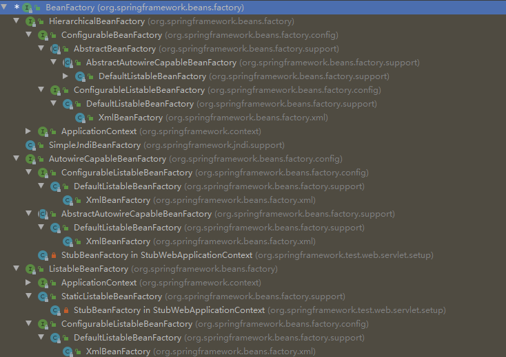
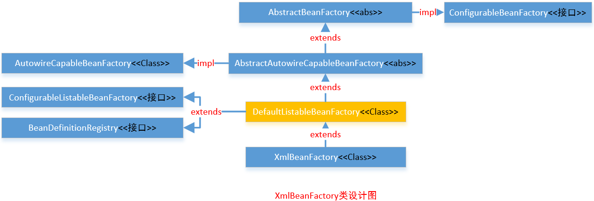

# BeanFactory体系结构分析]

BeanFactory是Spring中非常重要的一个类，搞懂了它，你就知道了bean的初始化和摧毁过程，对于深入理解IOC有很大的帮助。

    本节代码基于springboot 2.3.0
    
## BeanFactory体系结构

首先看一下使用IDEA生成的继承层次图（图中去掉了ApplicationContext的继承图）



可以看到BeanFactory下的接口主要分为四个个：

* HierarchicalBeanFactory: 该接口除了拥有BeanFactory的功能外，还提供了BeanFactory分层的机制，查找bean的时候，除了在自身BeanFactory查找外，如果没有查找到，还会在父级BeanFactory进行查找。
* SimpleJndiBeanFactory: 
* AutowireCapableBeanFactory: 能够自动装配的bean的工厂需要实现此接口
* ListableBeanFactory: 从该接口的名字就能知道，该接口除了拥有BeanFactory的功能外，该接口还有能列出factory中所有bean的实例的能力。

     关于 BeanFactory、HierarchicalBeanFactory、ListableBeanFactory详解请查[IoC容器解析](IOC.md)

## AutowireCapableBeanFactory

该接口提供了对现有bean进行自动装配的能力，设计目的不是为了用于一般的应用代码中，对于一般的应用代码应该使用BeanFactory和ListableBeanFactory。
其他框架的代码集成可以利用这个接口去装配和填充现有的bean的实例，但是Spring不会控制这些现有bean的生命周期。
你也许注意到了ApplicationContext中的getAutowireCapableBeanFactory()能获取到AutowireCapableBeanFactory的实例。
同样，也能实现BeanFactoryAware接口来接收BeanFactory（应用程序上下暴露的内部使用的BeanFactory）的实例，然后将其转换成AutowireCapableBeanFactory。

下面看一下这个接口中的静态成员变量和方法：

```java

    // 定义了bean的装配策略
	int AUTOWIRE_NO = 0;  // 不进行装配
	int AUTOWIRE_BY_NAME = 1;  // 根据名字进行装配
	int AUTOWIRE_BY_TYPE = 2;  // 根据类型进行装配
	int AUTOWIRE_CONSTRUCTOR = 3;  // 根据构造函数进行装配
	@Deprecated
	int AUTOWIRE_AUTODETECT = 4;  // Spring3.0已经过时的方法，通过省视bean来决定适当的装载策略

    //Spring5.1后增加，原始实例的后缀，例如"com.mypackage.MyClass.ORIGINAL"，强制返回给定的实例（没有代理）
	String ORIGINAL_INSTANCE_SUFFIX = ".ORIGINAL";

    // 完全创建给定类的一个新的实例，包括所有适用的BeanPostProcessor
    // 填充注解的field和方法，并且会应用所有的初始化回调函数
	<T> T createBean(Class<T> beanClass) throws BeansException;

    // 装配bean，通过应用初始化之后的回调函数和bean属性的后置处理来填充给定的bean的实例
    // 本质上是为了在创建新的实例或者反序列化实例时，填充（重新填充）实例中注解的field和方法
	void autowireBean(Object existingBean) throws BeansException;

    // 配置给定的原始bean：自动装配bean的属性，应用bean的属性值、工厂回调函数（例如setBeanName,values）
    // 同样也会应用所有bean的后置处理器
	Object configureBean(Object existingBean, String beanName) throws BeansException;

    // 使用指定的装配策略来完全创建一个新的bean的实例
	Object createBean(Class<?> beanClass, int autowireMode, boolean dependencyCheck) throws BeansException;

    // 使用指定的装配策略来实例化一个给定类新的bean的实例
    // 不会应用标准的BeanPostProcessor回调函数或者在未来执行任何bean的初始化
	Object autowire(Class<?> beanClass, int autowireMode, boolean dependencyCheck) throws BeansException;

    // 根据名字和类型来自动装配给定bean的实例的属性
    // 不会应用标准的BeanPostProcessor回调函数或者在未来执行任何bean的初始化
	void autowireBeanProperties(Object existingBean, int autowireMode, boolean dependencyCheck)
			throws BeansException;

    // 应用给定名字的bean的定义的属性值到给定的bean的实例
    // 该方法不会自动装配bean属性，仅仅应用明确定义的属性值
	void applyBeanPropertyValues(Object existingBean, String beanName) throws BeansException;

    // 初始化给定的原始的bean应用bean的属性值、工厂回调函数（例如setBeanName,values）
    // 同样也会应用所有bean的后置处理器
	Object initializeBean(Object existingBean, String beanName) throws BeansException;

    // 应用BeanPostProcessor到给定的现存的bean的实例，调用postProcessBeforeInitialization方法
	Object applyBeanPostProcessorsBeforeInitialization(Object existingBean, String beanName)
			throws BeansException;

    // 应用BeanPostProcessor到给定的现存的bean的实例，postProcessAfterInitialization
	Object applyBeanPostProcessorsAfterInitialization(Object existingBean, String beanName)
			throws BeansException;

    // 摧毁给定的bean的实例，应用DisposableBean规约和注册的DestructionAwareBeanPostProcessor
	void destroyBean(Object existingBean);

    // 解析唯一匹配给定对象类型的bean的实例，该方法是getBean(Class)的变种，只不过它还提供了匹配实例的bean的名字
	<T> NamedBeanHolder<T> resolveNamedBean(Class<T> requiredType) throws BeansException;

    // 解析给定bean的名字的实例，提供了用于暴露目标的工厂方法的依赖描述符
	Object resolveBeanByName(String name, DependencyDescriptor descriptor) throws BeansException;

    // 针对在工厂中定义的bean来解析指定的依赖
	@Nullable
	Object resolveDependency(DependencyDescriptor descriptor, @Nullable String requestingBeanName) throws BeansException;

    // 针对在工厂中定义的bean来解析指定的依赖
	@Nullable
	Object resolveDependency(DependencyDescriptor descriptor, @Nullable String requestingBeanName,
			@Nullable Set<String> autowiredBeanNames, @Nullable TypeConverter typeConverter) throws BeansException;

```

## ConfigurableBeanFactory

ConfigurableBeanFactory提供了bean工厂的配置机制（除了BeanFactory接口中的bean的工厂的客户端方法）。该BeanFactory接口不适应一般的应用代码中，应该使用BeanFactory和ListableBeanFactory。
该扩展接口仅仅用于内部框架的使用，并且是对bean工厂配置方法的特殊访问。

ConfigurableBeanFactory继承自HierarchicalBeanFactory和SingletonBeanRegistry，下面先看下SingletonBeanRegistry：

SingletonBeanRegistry是为了共享的bean的实例而定义的注册器，以统一的方式暴露单例管理机制。下面是在此接口中定义的方法：

```java
// 在bean的注册器中以给定的bean的名字将给定的现存对象注册为单例
void registerSingleton(String beanName, Object singletonObject);
// 根据给定的bean的名字来获取单例bean，可能为null
Object getSingleton(String beanName);
// 是否包含给定名字的单例bean
boolean containsSingleton(String beanName);
// 获取所有在注册器中注册的单例bean的名字
String[] getSingletonNames();
// 获取所有在注册器中注册的单例bean的数量
int getSingletonCount();
// 获取在这个注册器中使用的单例的mutex（用于外部协同）
Object getSingletonMutex();
```

需要注意的是使用registerSingleton方法注册的单例bean，不会执行任何的初始化回调函数（尤其不会调用InitializingBean的afterPropertiesSet方法），同样也不会接收任何的摧毁回调函数。如果需要接收初始化和摧毁回调函数，请注册bean的定义而不是现存的实例对象。

接下来看下ConfigurableBeanFactory中定义的方法：

```java
// 作用域
String SCOPE_SINGLETON = "singleton"; // 单例作用域
String SCOPE_PROTOTYPE = "prototype"; // 原型作用域

// 设置父级bean工厂
void setParentBeanFactory(BeanFactory parentBeanFactory) throws IllegalStateException;
// 设置bean的类加载器，默认为线程上下文类加载器
void setBeanClassLoader(@Nullable ClassLoader beanClassLoader);
// 获取bean的类加载器
@Nullable
ClassLoader getBeanClassLoader();
// 设置临时的类加载器
void setTempClassLoader(@Nullable ClassLoader tempClassLoader);
// 获取临时的类加载器
@Nullable
ClassLoader getTempClassLoader();
// 设置是否缓存bean的元数据
void setCacheBeanMetadata(boolean cacheBeanMetadata);
// 是否缓存bean的元数据
boolean isCacheBeanMetadata();
// 设置bean的表达式解析器，以统一的EL兼容样式支持#{...}这样的表达式
void setBeanExpressionResolver(@Nullable BeanExpressionResolver resolver);
// 获取bean的表达式解析器
@Nullable
BeanExpressionResolver getBeanExpressionResolver();
// 设置转换服务，用于转换属性值
void setConversionService(@Nullable ConversionService conversionService);
// 获取转换服务
@Nullable
ConversionService getConversionService();
// 添加属性编辑器注册者
void addPropertyEditorRegistrar(PropertyEditorRegistrar registrar);
// 为所有给定的属性注册自定义属性编辑器
void registerCustomEditor(Class<?> requiredType, Class<? extends PropertyEditor> propertyEditorClass);
// 使用在BeanFactory中注册的自定义编辑器来初始哈给定的属性编辑器注册者
void copyRegisteredEditorsTo(PropertyEditorRegistry registry);
// 设置类型转换器
void setTypeConverter(TypeConverter typeConverter);
// 获取类型转换器
TypeConverter getTypeConverter();
// 添加嵌入值解析器，例如注册属性
void addEmbeddedValueResolver(StringValueResolver valueResolver);
// 在BeanFactory是否有注册嵌入值解析器
boolean hasEmbeddedValueResolver();
// 解析给定的嵌入的值
@Nullable
String resolveEmbeddedValue(String value);
// 添加bean的后置处理器
void addBeanPostProcessor(BeanPostProcessor beanPostProcessor);
// 获取bean的后置处理器个数
int getBeanPostProcessorCount();
// 注册作用域
void registerScope(String scopeName, Scope scope);
// 获取注册的作用域的名字
String[] getRegisteredScopeNames();
// 获取作用域
@Nullable
Scope getRegisteredScope(String scopeName);
// 提供一个与这个工厂有关的安全访问控制上下文
AccessControlContext getAccessControlContext();
// 从给定的其他的工厂拷贝所有相关的配置。不应该包含任何bean的定义元数据
void copyConfigurationFrom(ConfigurableBeanFactory otherFactory);
// 注册别名
void registerAlias(String beanName, String alias) throws BeanDefinitionStoreException;
// 解析所有别名的目标名称和在工厂中注册的别名，将给定的StringValueResolver应用于它们
void resolveAliases(StringValueResolver valueResolver);
// 获取合并的bean的定义
BeanDefinition getMergedBeanDefinition(String beanName) throws NoSuchBeanDefinitionException;
// 给定名字的bean是否为FactoryBean
boolean isFactoryBean(String name) throws NoSuchBeanDefinitionException;
// 显式的设置指定bean的目前在创建状态
void setCurrentlyInCreation(String beanName, boolean inCreation);
// 指定的bean目前是否为在建状态
boolean isCurrentlyInCreation(String beanName);
// 注册给定bean所依赖的bean
void registerDependentBean(String beanName, String dependentBeanName);
// 获取所有依赖于指定bean的bean的名字
String[] getDependentBeans(String beanName);
// 获取所有指定bean所依赖的bean的名字
String[] getDependenciesForBean(String beanName);
// 根据bean的定义来摧毁给定的bean的实例（通常是从工厂中获取到的原型实例）
void destroyBean(String beanName, Object beanInstance);
// 在当前目标作用域中摧毁指定的作用域中的bean
void destroyScopedBean(String beanName);
// 摧毁在工厂中的所有单例bean
void destroySingletons();
```

上面的大部分方法都是获取或者设置一些配置的信息，以便协同来完成BeanFactory的配置。

#### ConfigurableListableBeanFactory

ConfigurableListableBeanFactory接口继承自ListableBeanFactory, AutowireCapableBeanFactory, ConfigurableBeanFactory。大多数具有列出能力的bean工厂都应该实现此接口。
此了这些接口的能力之外，该接口还提供了分析、修改bean的定义和单例的预先实例化的机制。这个接口不应该用于一般的客户端代码中，应该仅仅提供给内部框架使用。下面是这个接口的方法：

#### AbstractBeanFactory

AbstractBeanFactory继承自FactoryBeanRegistrySupport，实现了ConfigurableBeanFactory接口。AbstractBeanFactory是BeanFactory的抽象基础类实现，提供了完整的ConfigurableBeanFactory的能力。在这里不讨论该抽象类的实现细节，只要知道这个类是干什么的就行了，会面会有更加详细的章节来讨论。

* 单例缓存
* 别名的管理
* FactoryBean的处理
* 用于子bean定义的bean的合并
* bean的摧毁接口
* 自定义的摧毁方法
* BeanFactory的继承管理

子类需要实现的模板方法如下：

##### AbstractAutowireCapableBeanFactory

AbstractAutowireCapableBeanFactory继承自AbstractBeanFactory，实现了AutowireCapableBeanFactory接口。该抽象了实现了默认的bean的创建。

* 提供了bean的创建、属性填充、装配和初始化
* 处理运行时bean的引用，解析管理的集合、调用初始化方法等
* 支持构造器自动装配，根据类型来对属性进行装配，根据名字来对属性进行装配

## SimpleJndiBeanFactory


## 主线流程1

从接口BeanFactory到HierarchicalBeanFactory，再到ConfigurableBeanFactory，是一条主要的BeanFactory设计路径。

在这条接口设计路径中，BeanFactory定义了基本的IOC容器规范。

#### BeanFactory接口

该接口中包含了getBean()这样的IOC容器的基本方法；

#### HierarchicalBeanFactory接口

该接口继承了BeanFactory接口，增加了getParentBeanFactory()方法，使BeanFactory具备了双亲IOC的管理功能。

#### ConfigurableBeanFactory接口

该接口继承了HierarchicalBeanFactory，主要定义了一些对BeanFactory的配置功能，比如通过setParentBeanFactory()

设置双亲IOC容器，通过addBeanPostProcessor()配置Bean的后置处理器等等。通过这些接口设计的叠加，定义了

BeanFactory就是简单IOC容器的基本功能。

## 主线流程2

以ApplicationContext为核心的接口设计，为第二条接口设计路线，主要涉及接口从BeanFactory到ListableBeanFactory，

再到ApplicationContext，再到WebApplicationContext或者ConfigurableApplicationContext接口。

在这个接口体系中，ListableBeanFactory和HierarchicalBeanFactory两个接口，连接BeanFactory接口和ApplicationContext接口定义。
ListableBeanFactory细化了BeanFactory接口功能，比如getBeanDefinitionNames()获取bean数组。同时，ApplicationContext接口继承了MessageSource等，增加了很多高级特性。

## 主线流程3

这里涉及的是主要的接口关系，而具体的IOC容器都是在这些接口下实现的，比如DefaultListableBeanFactory，

这个接口间接实现了ConfigurableBeanFactory接口，从而成为一个简单IOC容器实现。可以理解为主要接口定义了

IOC的骨架，相应IOC容器去做实现。

## 主线流程4

这个接口体系以BeanFactory和ApplicationContext为核心。

BeanFactory为IOC容器最基本的接口，ApplicationContext为IOC容器的高级形态接口。

以下分别去分析BeanFactory和ApplicationContext。

## BeanFactory容器设计原理

 BeanFactory接口提供了使用IOC容器的规范。在这个基础上提供了一系列的容器实现供使用。

这里以XmlBeanFactory为例，设计关系图如下：



XmlBeanFactory源码：

```java

package org.springframework.beans.factory.xml;
import org.springframework.beans.BeansException;
import org.springframework.beans.factory.BeanFactory;
import org.springframework.beans.factory.support.DefaultListableBeanFactory;
import org.springframework.core.io.Resource;
@Deprecated
@SuppressWarnings({"serial", "all"})
public class XmlBeanFactory extends DefaultListableBeanFactory {
	private final XmlBeanDefinitionReader reader = new XmlBeanDefinitionReader(this);
	public XmlBeanFactory(Resource resource) throws BeansException {
		this(resource, null);
	}
	public XmlBeanFactory(Resource resource, BeanFactory parentBeanFactory) throws BeansException {
		super(parentBeanFactory);
		this.reader.loadBeanDefinitions(resource);
	}
}
```

#### XmlBeanFactory创建过程：

1. 基于将要读取的xml文件，构建一个Resource对象作为XmlBeanFactory的构造器参数创建XmlBeanFactory。

```java
ClassPathResource res = new ClassPathResource("beans.xml");
XmlBeanFactory xmlBeanFactory = new XmlBeanFactory(res);
```

2. 通过XmlBeanDefinitionReader的loadBeanDefinitions()调用处理从Resource中载入BeanDefinitions的过程，
   
   loadBeanDefinitions是IOC容器初始化的重要组成部分，最后IOC容器会基于BeanDefinitions完成容器初始化和
   
   依赖注入的过程，这里只是简单介绍下，以下会深入源码分析IOC容器的初始化和依赖注入细节。


#### IOC容器建立的基本步骤：

先看下通过编程式方式使用IOC容器过程:

```java
ClassPathResource res = new ClassPathResource("beans.xml");
DefaultListableBeanFactory factory = new DefaultListableBeanFactory();
XmlBeanDefinitionReader reader = new XmlBeanDefinitionReader(factory);
reader.loadBeanDefinitions(res);
```

参考代码可以看到使用IOC容器主要经历了以下几个步骤：

1）创建IOC配置文件的抽象资源，资源包含了BeanDefinition的定义信息。

2）创建一个BeanFactory，这里使用DefaultListableBeanFactory。

3）创建一个载入BeanDefinition的读取器，这里使用XmlBeanDefinitionReader来载入XML文件形式的BeanDefinition。

4）XmlBeanDefinitionReader解析资源，完成Bean的载入和注册，建立起IOC容器，这个时候就可用了。

