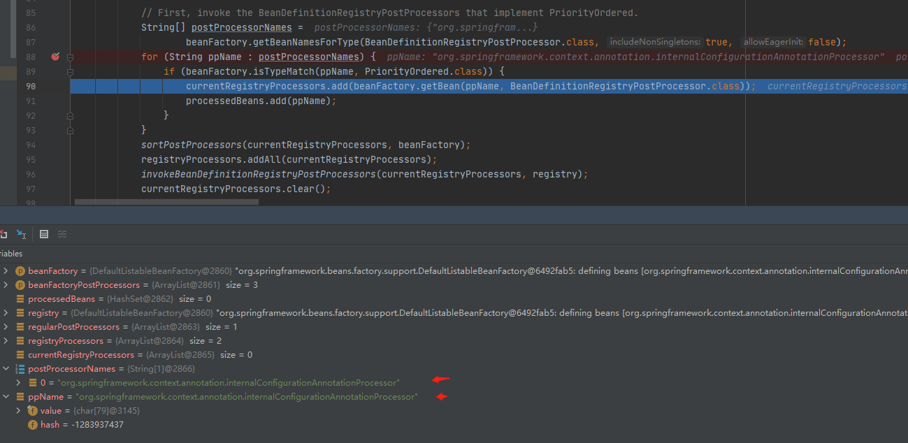
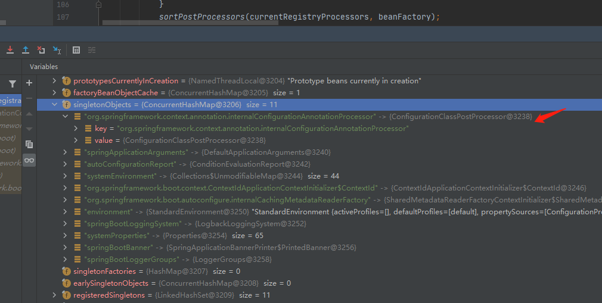
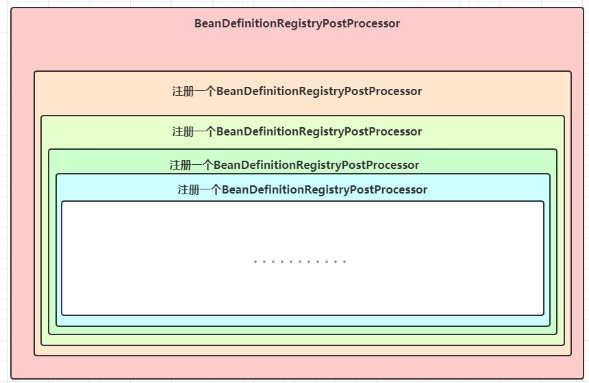

# BeanFactoryPostProcessor

    本文源码为spring5.2.9版本

回归到 **AbstractApplicationContext**的**refresh*的方法,发现和BeanFactoryPostProcessor有关的方法有两个

```java
// Allows post-processing of the bean factory in context subclasses.
postProcessBeanFactory(beanFactory);

// Invoke factory processors registered as beans in the context.
invokeBeanFactoryPostProcessors(beanFactory);
```

## postProcessBeanFactory
postProcessBeanFactory是一个无具体实现的方法，用户增强和扩展。普通spring没用相关的重写类。但是如果你使用web工程就会用到。
例如 **GenericWebApplicationContext**、 **ServletWebServerApplicationContext**、 **AnnotationConfigServletWebApplicationContext**、 **AnnotationConfigServletWebServerApplicationContext**、 **AnnotationConfigReactiveWebServerApplicationContext**


> 如果你对spring集成关系有所了解的化你会知道<br>
> AnnotationConfigServletWebServerApplicationContext extends ServletWebServerApplicationContext extends GenericWebApplicationContext<br>
>
> AnnotationConfigServletWebApplicationContext extends GenericWebApplicationContext<br>
>
> AnnotationConfigReactiveWebServerApplicationContext  extends ReactiveWebServerApplicationContext extends GenericReactiveWebApplicationContext

这里不讲关于web的知识。所以略过。你只需要知道到 postProcessBeanFactory spring是预留的扩展方法。接下来就是重点 invokeBeanFactoryPostProcessors 方法。

## invokeBeanFactoryPostProcessors

BeanFactoryPostProcessor：beanFactory的后置处理器；在BeanFactory标准初始化之后调用，来定制和修改BeanFactory的内容；所有的bean定义已经保存加载到beanFactory，但是bean的实例还未创建。

BeanDefinitionRegistryPostProcessor 是 BeanFactoryPostProcessor 的子类。

这里需要提到一点， 如果是实现BeanFactoryPostProcessor接口，那么postProcessBeanFactory里只允许对BeanDefinition里已有的注册信息进行修改而不允许新增。**这个接口更关注修改**。

而BeanDefinitionRegistryPostProcessor这个接口支持自定义beanDefinition的注册，及在标准的注册完成后，实现这个接口可以向beanDefinitionMap中注册自定义的beanDefinition，**这个接口从定义上看更多的是关注注册**。

#### 示例

```java
package io.github.firehuo.spring.service;

import org.springframework.stereotype.Component;

@Component
public class FireService {
    
    public FireService() {
        System.out.println("FireService...constructor");
    }

}
```

```java

package io.github.firehuo.spring.service;

public class OrdinaryObject {

    public OrdinaryObject() {
        System.out.println("OrdinaryObject...constructor");
    }
}

```

```java
package io.github.firehuo.spring.beanfactorypostprocessor;

import io.github.firehuo.spring.service.OrdinaryObject;
import org.springframework.beans.BeansException;
import org.springframework.beans.factory.config.ConfigurableListableBeanFactory;
import org.springframework.beans.factory.support.BeanDefinitionRegistry;
import org.springframework.beans.factory.support.BeanDefinitionRegistryPostProcessor;
import org.springframework.beans.factory.support.GenericBeanDefinition;
import org.springframework.stereotype.Component;

@Component
public class FireBeanDefinitionRegistryPostProcessor implements BeanDefinitionRegistryPostProcessor {

    @Override
    public void postProcessBeanDefinitionRegistry(BeanDefinitionRegistry registry) throws BeansException {

        System.out.println("FireBeanDefinitionRegistryPostProcessor =======");

        // 向beanDefinitionMap中注册自定义的beanDefinition对象
        GenericBeanDefinition beanDefinition = new GenericBeanDefinition();
        beanDefinition.setBeanClass(OrdinaryObject.class);
        registry.registerBeanDefinition("ordinaryObject", beanDefinition);

    }

    @Override
    public void postProcessBeanFactory(ConfigurableListableBeanFactory beanFactory) throws BeansException {

    }
}

```


```java
package io.github.firehuo.spring.beanfactorypostprocessor;

import org.springframework.beans.BeansException;
import org.springframework.beans.factory.config.BeanFactoryPostProcessor;
import org.springframework.beans.factory.config.ConfigurableListableBeanFactory;
import org.springframework.stereotype.Component;

import java.util.Arrays;

@Component
public class FireBeanFactoryPostProcessor implements BeanFactoryPostProcessor {

    @Override
    public void postProcessBeanFactory(ConfigurableListableBeanFactory beanFactory) throws BeansException {

        System.out.println("FireBeanFactoryPostProcessor...postProcessBeanFactory...");

        int count = beanFactory.getBeanDefinitionCount();
        String[] names = beanFactory.getBeanDefinitionNames();
        System.out.println("当前BeanFactory中有"+count+" 个Bean");
        System.out.println(Arrays.asList(names));

    }
}
```


> 2020-11-04 14:08:56.613  INFO 15252 --- [           main] io.github.firehuo.spring.Application     : No active profile set, falling back to default profiles: default<br>
  FireBeanDefinitionRegistryPostProcessor =======<br>
  FireBeanFactoryPostProcessor...postProcessBeanFactory...<br>
  当前BeanFactory中有42 个Bean<br>
  [org.springframework.context.annotation.internalConfigurationAnnotationProcessor, org.springframework.context.annotation.internalAutowiredAnnotationProcessor, org.springframework.context.annotation.internalCommonAnnotationProcessor, org.springframework.context.event.internalEventListenerProcessor, org.springframework.context.event.internalEventListenerFactory, application, org.springframework.boot.autoconfigure.internalCachingMetadataReaderFactory, fireBeanDefinitionRegistryPostProcessor, fireBeanFactoryPostProcessor, fireService, org.springframework.boot.autoconfigure.AutoConfigurationPackages, org.springframework.boot.autoconfigure.context.PropertyPlaceholderAutoConfiguration, propertySourcesPlaceholderConfigurer, org.springframework.boot.autoconfigure.jmx.JmxAutoConfiguration, mbeanExporter, objectNamingStrategy, mbeanServer, org.springframework.boot.autoconfigure.admin.SpringApplicationAdminJmxAutoConfiguration, springApplicationAdminRegistrar, org.springframework.boot.autoconfigure.aop.AopAutoConfiguration$ClassProxyingConfiguration, org.springframework.boot.autoconfigure.aop.AopAutoConfiguration, org.springframework.boot.autoconfigure.availability.ApplicationAvailabilityAutoConfiguration, applicationAvailability, org.springframework.boot.autoconfigure.context.ConfigurationPropertiesAutoConfiguration, org.springframework.boot.context.properties.ConfigurationPropertiesBindingPostProcessor, org.springframework.boot.context.internalConfigurationPropertiesBinderFactory, org.springframework.boot.context.internalConfigurationPropertiesBinder, org.springframework.boot.context.properties.BoundConfigurationProperties, org.springframework.boot.context.properties.ConfigurationBeanFactoryMetadata, org.springframework.boot.autoconfigure.context.LifecycleAutoConfiguration, lifecycleProcessor, spring.lifecycle-org.springframework.boot.autoconfigure.context.LifecycleProperties, org.springframework.boot.autoconfigure.info.ProjectInfoAutoConfiguration, spring.info-org.springframework.boot.autoconfigure.info.ProjectInfoProperties, org.springframework.boot.autoconfigure.task.TaskExecutionAutoConfiguration, taskExecutorBuilder, applicationTaskExecutor, spring.task.execution-org.springframework.boot.autoconfigure.task.TaskExecutionProperties, org.springframework.boot.autoconfigure.task.TaskSchedulingAutoConfiguration, taskSchedulerBuilder, spring.task.scheduling-org.springframework.boot.autoconfigure.task.TaskSchedulingProperties, ordinaryObject]<br>
  FireService...constructor<br>
  OrdinaryObject...constructor<br>
  2020-11-04 14:08:57.211  INFO 15252 --- [           main] io.github.firehuo.spring.Application     : Started Application in 1.089 seconds (JVM running for 2.005)<br>


根据启动日志可以发现**BeanDefinitionRegistryPostProcessor**的**postProcessBeanDefinitionRegistry**在**BeanFactoryPostProcessor**的**postProcessBeanFactory**方法前执行。
而BeanFactoryPostProcessor的postProcessBeanFactory方法是在FireService创建之前执行的。并且OrdinaryObject作为spring bean 进行了实例化。


#### 详解invokeBeanFactoryPostProcessors流程

进入 invokeBeanFactoryPostProcessors，我们首先会迎来第一个 if 判断，判断当前使用的工厂对象是不是 BeanDefinitionRegistry，这个判断 99% 都会返回 true，为什么呢？
除非自己继承整个工厂的顶级接口 AliasRegistry 去实现一个完全由自己设计的工厂，这个判断才会走向 else 分支。一般项目根本遇不到这种需求，所以不必深究，因此我们关注 if 分支中的逻辑就好。    

    如果你有印象可以知道这里的beanFactory是返回了一个**DefaultListableBeanFactory**，而 DefaultListableBeanFactory implements BeanDefinitionRegistry。

```java
if (beanFactory instanceof BeanDefinitionRegistry) {
      // 通常情况都会进入这块代码段执行，因此这段代码的逻辑才是研究的重点
      // ....
} else {
      // 除非改写 beanFactory，且不让它实现 BeanDefinitionRegistry，否则都不会执行这段代码
      // 一般来说，这样的改写情况少之又少，少到可以忽略不计
      // ....
}

```

然后，我们看到方法中初始化了 2 个集合：

```java
		if (beanFactory instanceof BeanDefinitionRegistry) {
			BeanDefinitionRegistry registry = (BeanDefinitionRegistry) beanFactory;
// 第一个集合存放程序员手动提供给 Spring 的 BeanFactoryPostProcessor，手动代表不是通过扫描注解得到的，而是我们自己添加进去的。后面画外题中将讲解。
			List<BeanFactoryPostProcessor> regularPostProcessors = new ArrayList<>();
// 存放执行过程中找到的 BeanDefinitionRegistryPostProcessor。
// 这些被存放的后置处理器有一个共同的特点就是都已经执行过父类接口的 postProcessBeanDefinitionRegistry，而它们被存放在 registryProcessors 集合中的原因是
// 方便之后会被 invokeBeanFactoryPostProcessors 方法调用，遍历执行子类接口 BeanFactoryPostProcessor 的 postProcessBeanFactory 方法
			List<BeanDefinitionRegistryPostProcessor> registryProcessors = new ArrayList<>();
```

接着我们遇到第一个循环。这个循环是为了循环程序员自己手动添加的后置处理器（添加的方法会后续章节阐述）。此时的FireBeanFactoryPostProcessor和FireBeanDefinitionRegistryPostProcessor还没有注册进来。所以此时不会处理。

```java
// 遍历程序员手动添加的 BeanFactory 后置处理器
			for (BeanFactoryPostProcessor postProcessor : beanFactoryPostProcessors) {
/ 如果是 BeanDefinitionRegistryPostProcessor，先调用 postProcessBeanDefinitionRegistry 方法，再放入 registryProcessors 集合
				if (postProcessor instanceof BeanDefinitionRegistryPostProcessor) {
					BeanDefinitionRegistryPostProcessor registryProcessor =
							(BeanDefinitionRegistryPostProcessor) postProcessor;
					registryProcessor.postProcessBeanDefinitionRegistry(registry);
					registryProcessors.add(registryProcessor);
				}
				else {
                // 如果只是 BeanFactoryPostProcessor，那么先放入 regularPostProcessors 集合中，
                // 等待 BeanDefinitionRegistryPostProcessor 都被找到，都执行完 postProcessBeanDefinitionRegistry 方法和 postProcessBeanFactory 方法
                // 再执行 regularPostProcessors 集合中的 BeanFactoryPostProcessor.postProcessBeanFactory
					regularPostProcessors.add(postProcessor);
				}
			}


			// Do not initialize FactoryBeans here: We need to leave all regular beans
			// uninitialized to let the bean factory post-processors apply to them!
			// Separate between BeanDefinitionRegistryPostProcessors that implement
			// PriorityOrdered, Ordered, and the rest.
			List<BeanDefinitionRegistryPostProcessor> currentRegistryProcessors = new ArrayList<>();

			// First, invoke the BeanDefinitionRegistryPostProcessors that implement PriorityOrdered.
			String[] postProcessorNames =
					beanFactory.getBeanNamesForType(BeanDefinitionRegistryPostProcessor.class, true, false);
			for (String ppName : postProcessorNames) {
// ConfigurationClassPostProcessor 实现了 PriorityOrdered 接口，isTypeMatch 返回 true，继续执行
				if (beanFactory.isTypeMatch(ppName, PriorityOrdered.class)) {
             // 执行 getBean 后，会创建 ConfigurationClassPostProcessor 的 Bean 对象，并添加到 beanFactory 的单例池 singletonObjects 中去 
                // 然后把返回的 Bean 对象放入 currentRegistryProcessors 集合中
					currentRegistryProcessors.add(beanFactory.getBean(ppName, BeanDefinitionRegistryPostProcessor.class));
					processedBeans.add(ppName);
				}
			}

```

紧接着，源码中声明并创建 List currentRegistryProcessors = new ArrayList<>();。 这个集合的作用：

* 将实现 PriorityOrdered, Ordered 以及剩余的其他 BeanDefinitionRegistryPostProcessor 分离开来
* 存放通过 beanFactory.getBean 获取并创建的 BeanDefinitionRegistryPostProcessor 的 Bean对象
* 方便对当前正要执行的一组 BeanDefinitionRegistryPostProcessor 进行必要的排序（比如按照 Ordered 接口的 getOrder 的值，或者按照 beanName 排序）

然后，ListableBeanFactory.getBeanNamesForType 这个方法返回与给定类型（包括子类）匹配的bean的名称。那么能不能找到呢？答案是肯定的。getBeanNamesForType 方法会从 beanDefinitionMap 中寻找合适的类型，然后返回对应的 beanName。




上图是当前 beanDefinitionMap 中存放着所有 beaName 及其的对应 BeanDefinition 实例，从中找到了一个符合条件的后置处理器，他的 beanName 是 "org.springframework.context.annotation.internalConfigurationAnnotationProcessor"。


至于internalConfigurationAnnotationProcessor来自于哪里可以作为一个疑问？答案在[AnnotationConfigApplicationContext(注解方式)初始化](AnnotationConfigApplicationContext.md)中。

```java
@SpringBootApplication
public class Application {

    public static void main(String[] args) {

        ConfigurableApplicationContext context = new SpringApplicationBuilder(Application.class).run(args);
        Object o = context.getBean("org.springframework.context.annotation.internalConfigurationAnnotationProcessor");
        System.out.println(o.getClass());
    }
    
}
```

我们通过getClass()方法得到这个Bean定义所代表的Java类是 org.springframework.context.annotation.ConfigurationClassPostProecssor。
它是唯一的 Spring 内置 BeanDefinitionRegistryPostProcessor 实例。

```java
public class ConfigurationClassPostProcessor implements BeanDefinitionRegistryPostProcessor,
		PriorityOrdered, ResourceLoaderAware, BeanClassLoaderAware, EnvironmentAware {

```

ConfigurationClassPostProecssor 实现 PriorityOrdered 接口，所以会进入 if 内执行代码。 
执行 getBean 后，会创建 ConfigurationClassPostProcessor 的 Bean 对象，并添加到 beanFactory 的单例池 singletonObjects 中去。然后把返回的 Bean 对象放入 currentRegistryProcessors 集合中

如下图所示，执行 getBean 之后，DefaultListableBeanFactory 的单例池中新增了一个 ConfigurationClassPostProcessor Bean对象。



ConfigurationClassPostProcessor 这个类是 Spring 初始化的时候就放置到容器里面的，他做的事情很简单，就是解析 Spring 配置类，然后扫描指定的包路径，将符合条件的类，比如@Component，@Bean注解的类，转换成 BeanDefinition，然后存放到 beanDefinitionMap 中。真正执行这些操作是在被调用 postProcessBeanDefinitionRegistry 方法时。

我们接着就来说说这个 invokeBeanDefinitionRegistryPostProcessors 方法：

```java
//currentRegistryProcessors 对currentRegistryProcessors进行排序
			sortPostProcessors(currentRegistryProcessors, beanFactory);
// registryProcessors 中存放的是所有 BeanDefinitionRegistryPostProcessor
			registryProcessors.addAll(currentRegistryProcessors);

			invokeBeanDefinitionRegistryPostProcessors(currentRegistryProcessors, registry);
// 清空当前执行的 BeanDefinitionRegistryPostProcessor，至此currentRegistryProcessors中的BeanDefinitionRegistryPostProcessor全部执行了postProcessBeanDefinitionRegistry方法。
			currentRegistryProcessors.clear();
```


```java

	private static void invokeBeanDefinitionRegistryPostProcessors(
			Collection<? extends BeanDefinitionRegistryPostProcessor> postProcessors, BeanDefinitionRegistry registry) {

		for (BeanDefinitionRegistryPostProcessor postProcessor : postProcessors) {
//触发 postProcessBeanDefinitionRegistry 方法
			postProcessor.postProcessBeanDefinitionRegistry(registry);
		}
	}
```

这个方法会遍历 BeanDefinitionRegistryPostProcessor 列表并且执行 postProcessBeanDefinitionRegistry 方法。

在首次执行时，ConfigurationClassPostProcessor.postProcessBeanDefinitionRegistry 方法完成了对项目的扫描，
在此之后，Spring容器中有值了，有了我们配置的所有的应该被 Spring 管理的类！
比如在本文实验中， FireBeanDefinitionRegistryPostProcessor 和 FireBeanFactoryPostProcessor 还有 FireService 被扫描到并放入了 beanDefinitionMap 中。

    注意此时OrdinaryObject还没有注册到beanDefinitionMap中

继续往下看，发现和上面的代码一样，唯一不同的地方就是本次寻找的是实现了Ordered 接口的 BeanDefinitionRegistryPostProcessor
```java
			// Next, invoke the BeanDefinitionRegistryPostProcessors that implement Ordered.
			postProcessorNames = beanFactory.getBeanNamesForType(BeanDefinitionRegistryPostProcessor.class, true, false);
			for (String ppName : postProcessorNames) {
				if (!processedBeans.contains(ppName) && beanFactory.isTypeMatch(ppName, Ordered.class)) {
					currentRegistryProcessors.add(beanFactory.getBean(ppName, BeanDefinitionRegistryPostProcessor.class));
					processedBeans.add(ppName);
				}
			}
			sortPostProcessors(currentRegistryProcessors, beanFactory);
			registryProcessors.addAll(currentRegistryProcessors);
			invokeBeanDefinitionRegistryPostProcessors(currentRegistryProcessors, registry);
			currentRegistryProcessors.clear();
```

这次执行时，postProcessorNames 可以获得 2 个候选,一个是 Spring 内置的 org.springframework.context.annotation.internalConfigurationAnnotationProcessor，
另一个是我们自定义的 FireBeanDefinitionRegistryPostProcessor。

processedBeans 集合存放所有已经处理过的 BeanFactoryPostProcessor 及其子类接口 BeanDefinitionRegistyPostProcessor。
ConfigurationClassPostProcessor.postProcessBeanDefinitionRegistry 已经执行过了，所以这一次不会再执行。FireBeanDefinitionRegistryPostProcessor 因为没有实现 Ordered 接口,所以本次也不会执行。

接着往下看，开始调用剩余的 BeanDefintionRegistryPostProcessor:
    
```java
			// Finally, invoke all other BeanDefinitionRegistryPostProcessors until no further ones appear.
			boolean reiterate = true;
			while (reiterate) {
				reiterate = false;
				postProcessorNames = beanFactory.getBeanNamesForType(BeanDefinitionRegistryPostProcessor.class, true, false);
				for (String ppName : postProcessorNames) {
                     // 与第二次不同，这次不需要实现 Ordered 接口
					if (!processedBeans.contains(ppName)) {
                          // 获取并创建 BeanDefinitionRegistryPostProcessor Bean对象
						currentRegistryProcessors.add(beanFactory.getBean(ppName, BeanDefinitionRegistryPostProcessor.class));
						processedBeans.add(ppName);
						reiterate = true;
					}
				}
				sortPostProcessors(currentRegistryProcessors, beanFactory);
				registryProcessors.addAll(currentRegistryProcessors);
  // 执行currentRegistryProcessors中存放的 BeanDefinitionRegistryPostProcessor Bean对象的 postProcessBeanDefinitonRegistry 方法, 
   //在这里由于执行了FireBeanDefinitionRegistryPostProcessor的postProcessBeanDefinitionRegistry方法，所以OrdinaryObject被注册到beanDefinitionMap中
				invokeBeanDefinitionRegistryPostProcessors(currentRegistryProcessors, registry);
				currentRegistryProcessors.clear();
			}


```


##### 问题：为什么要自旋？
这里之所以要“自旋”（引入while循环和reiterate变量），主要是为了解决嵌套 BeanDefinitionRegistryPostProcessor 的扫描和执行问题。
BeanDefinitionRegistryPostProcessor 是一个接口，在执行它的 postProcessBeanDefinitionRegistry 方法时，可能又注册了一些新的 BeanDefinition，
这些新的 BeanDefinition 又是 BeanDefinitionRegistryPostProcessor 类型的，这种类似于俄罗斯套娃一样，每一个里面都会进行一些注册，谁也不知道会进行多少层，故而需要一个死循环，只要有，
就一直遍历寻找，直到执行完为止！类似与下图这样：




##### 问题：为什么有三段差不多的代码？
spring 为保证不同类型，不同提供者实现的 BeanDefinitionRegistryPostProcessor 的执行顺序，而写了三段看上去差不多的代码。

执行顺序为

1. 首先执行 spring 内置的且实现了 PriorityOrdered 接口的后置处理器
2. 然后执行第三方或者程序员提供的，实现了 Ordered 接口的后置处理器
3. 最后执行第三方或者程序员提供的未处理过的后置处理器


再接着就要执行 invokeBeanFactoryPostProcessors 方法，遍历并且执行 BeanFactoryPostProcessor.postProcessBeanFactory方法。


接着首先是遍历存放在 registryProcessors 中 BeanDefinitionRegistryPostProcessor 实现类对象，并且执行还未被执行过的父类方法 postProcessBeanFactory ，且对象顺序和刚才执行 postProcessBeanDefinitonRegistry 是一样的。

```java

			// Now, invoke the postProcessBeanFactory callback of all processors handled so far.
// 按照和 postProcessBeanDefinitonRegistry 执行顺序一样的顺序执行 BeanDefinitionRegistryPostProcessor 的 postProcessBeanFactory
			invokeBeanFactoryPostProcessors(registryProcessors, beanFactory);
// 执行手动添加的 BeanFactoryPostProcessor 的 postProcessBeanFactory 方法
			invokeBeanFactoryPostProcessors(regularPostProcessors, beanFactory);
```

至此，所有 BeanDefinitionRegistryPostProcessor 对象的 postProcessBeanDefinitonRegistry 和 postProcessBeanFactory 都按顺序执行完毕！

下面的则是关于BeanFactoryPostProcessor的执行问题。

所以这里也解释了前文示例中提到的“根据启动日志可以发现**BeanDefinitionRegistryPostProcessor**的**postProcessBeanDefinitionRegistry**在**BeanFactoryPostProcessor**的**postProcessBeanFactory**方法前执行”


    注意这里FireBeanFactoryPostProcessor的postProcessBeanFactory方法还没有执行
    
#### BeanFactoryPostProcessor 的执行

进入下半场 BeanFactoryPostProcessor 的执行，首先映入眼帘的是

```java
		// Do not initialize FactoryBeans here: We need to leave all regular beans
		// uninitialized to let the bean factory post-processors apply to them!
// 首先寻找所有 BeanFactoryPostProcesssor 类
		String[] postProcessorNames =
				beanFactory.getBeanNamesForType(BeanFactoryPostProcessor.class, true, false);

		// Separate between BeanFactoryPostProcessors that implement PriorityOrdered,
		// Ordered, and the rest.
		List<BeanFactoryPostProcessor> priorityOrderedPostProcessors = new ArrayList<>();
		List<String> orderedPostProcessorNames = new ArrayList<>();
		List<String> nonOrderedPostProcessorNames = new ArrayList<>();
		for (String ppName : postProcessorNames) {
			if (processedBeans.contains(ppName)) {
				// skip - already processed in first phase above
			}
			else if (beanFactory.isTypeMatch(ppName, PriorityOrdered.class)) {
				priorityOrderedPostProcessors.add(beanFactory.getBean(ppName, BeanFactoryPostProcessor.class));
			}
			else if (beanFactory.isTypeMatch(ppName, Ordered.class)) {
				orderedPostProcessorNames.add(ppName);
			}
			else {
				nonOrderedPostProcessorNames.add(ppName);
			}
		}

		// First, invoke the BeanFactoryPostProcessors that implement PriorityOrdered.
		sortPostProcessors(priorityOrderedPostProcessors, beanFactory);
		invokeBeanFactoryPostProcessors(priorityOrderedPostProcessors, beanFactory);
```


这段代码不难理解，先寻找所有的 BeanFactoryPostProcessor 类，初始化三个集合，分别存放实现了 PriorityOrdered, Ordered 及其他剩余的 BeanFactoryPostProcessor。
如果是 processedBeans 中已经存在的，那么就会注解跳过，避免重复执行！

值得注意的是

* 如果是实现 PriorityOrdered 接口的，会直接 getBean 获取并创建实例，并将实例加入到priorityOrderedPostProcessors集合中
* 但是实现了 Ordered 接口以及剩余的，会把 beanName 存放到 orderedPostProcessorNames 和 nonOrderedPostProcessorNames 集合中，注意此时他没有进行实例化！

剩余的一点代码：

```java
		// Next, invoke the BeanFactoryPostProcessors that implement Ordered.
		List<BeanFactoryPostProcessor> orderedPostProcessors = new ArrayList<>(orderedPostProcessorNames.size());
// 遍历实现了 Ordered 的 beanName集合
		for (String postProcessorName : orderedPostProcessorNames) {
 // 通过 getBean 实例化，再添加到集合中
			orderedPostProcessors.add(beanFactory.getBean(postProcessorName, BeanFactoryPostProcessor.class));
		}
		sortPostProcessors(orderedPostProcessors, beanFactory);
		invokeBeanFactoryPostProcessors(orderedPostProcessors, beanFactory);

		// Finally, invoke all other BeanFactoryPostProcessors.
		List<BeanFactoryPostProcessor> nonOrderedPostProcessors = new ArrayList<>(nonOrderedPostProcessorNames.size());
		for (String postProcessorName : nonOrderedPostProcessorNames) {
			nonOrderedPostProcessors.add(beanFactory.getBean(postProcessorName, BeanFactoryPostProcessor.class));
		}
		invokeBeanFactoryPostProcessors(nonOrderedPostProcessors, beanFactory);

		// Clear cached merged bean definitions since the post-processors might have
		// modified the original metadata, e.g. replacing placeholders in values...
		beanFactory.clearMetadataCache();
```


## 总结


总结了几条主要规律：

* BeanDefinitionRegistryPostProcessor 早于 BeanFactoryPostProcessor 执行
* BeanDefinitionRegistryPostProcessor.postProcessBeanDefinitionRegistry -> BeanDefinitionRegistryPostProcessor.postProcessBeanFactory -> BeanFactoryPostProcessor.postProcessBeanFactory
* 程序员手动添加的 -> PriorityOrdered -> Ordered -> 剩余的
* 所有的 BeanFactoryPostProcessor 及其子类 BeanDefinitionRegistryPostProcessor 不会重复执行


## 画外题--手动添加 BeanFactoryPostProcessor

首先我们要知道，给 Spring 容器提供 BeanFactoryPostProcessor 或者 BeanDefinitionRegistryPostProcessor 的 Bean 对象的方式有两种：

* 通过加注解，让 Spring 扫描到类（把一个类交给 Spring 管理，整个类的创建过程是交给 Spring 来处理的）
* 手动添加对象到 Spring 中（自己控制对象的实例化过程，然后再交给 Spring 管理）

示例面试题，如何把一个对象提供给 Spring 管理？

1. FactoryBean 是一种方式
2. 向 BeanFactory 添加一个单例对象

```java
AnnotationConfigApplicationContext ctx = new AnnotationConfigApplicationContext();
ctx.getBeanFactory().registerSingleton("indexService", new IndexService());
ctx.register(AppConfig.class);
ctx.refresh();
ctx.getBean("indexService");
```

再回到如何手动添加 BeanFactoryPostProcessor 并提供给 Spring 管理？我们来看代码示例：

```java
public class Fire implements BeanFactoryPostProcessor {
	@Override
	public void postProcessBeanFactory(ConfigurableListableBeanFactory beanFactory) throws BeansException {
		System.out.println("Fire ------ BeanFactoryPostProcessor, 由程序员手动添加，再交给 Spring 管理的");
	}
}
```

这个类都没有加上 @Component 注解,然后我们这样操作：
```java
public class MyApplication {

	public static void main(String[] args) throws IOException {
		AnnotationConfigApplicationContext ctx = new AnnotationConfigApplicationContext();
		ctx.addBeanFactoryPostProcessor(new Fire());
		ctx.register(AppConfig.class);
		ctx.refresh();
	}
}
```


* 程序员手动添加的 ManSubY 的父类方法率先执行
* 程序员手动添加的 ManB 是直接实现 BeanFactoryPostProcessor 的类，在所有直接实现 BeanFactoryPostProcessor 的类中率先执行