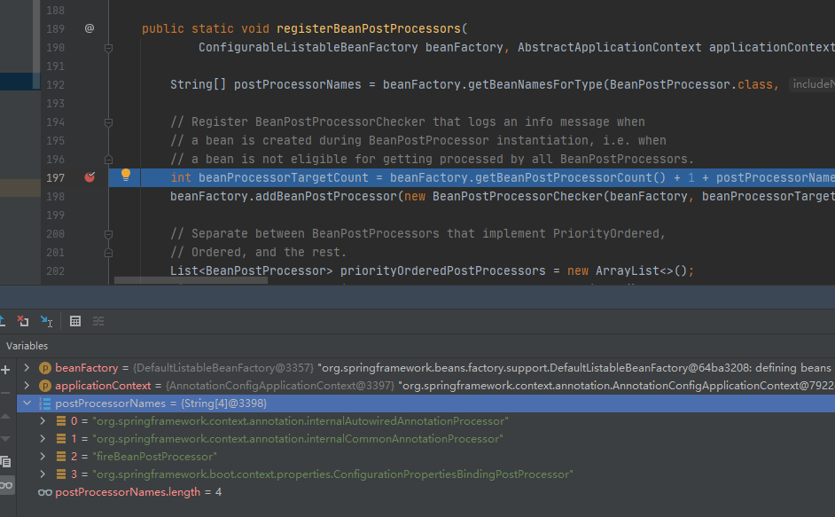

# BeanPostProcessor

    本文源码为spring5.2.9版本
    
BeanPostProcessor就是Bean的后置处理器，主要作用就是Bean实例化之后，在初始化（initialization）之前和之后调用自定义的方法 改变一些属性。
这里的initialization包含： Bean里面定义的initMethod，InitializingBean的afterPropertiesSet

此外还有一个annotation@PostConstruct和@PreDestroy，也是可以对Bean进行扩展的，但是他们的逻辑和上面的InitializingBean和自定义的initMethod的底层有一点点区别。
他们类似BeanPostProcessor，他对应的类是CommonAnnotationBeanPostProcessor。

回归到 **AbstractApplicationContext**的**refresh*的方法,发现和BeanPostProcessor有关的方法有一个。

```java

// Register bean processors that intercept bean creation.
registerBeanPostProcessors(beanFactory);

```

但是不过你之前看过refresh讲解的话，你因该知道registerBeanPostProcessors只是注册，真正的使用是在finishBeanFactoryInitialization方法中。

## 示例

``` java
@Component
public class FireService {

    public FireService() {
        System.out.println("FireService...constructor");
    }

}
```

``` java
public class OrdinaryObject {

    public OrdinaryObject() {
        System.out.println("OrdinaryObject...constructor");
    }
}

```


``` java
@Component
public class FireBeanDefinitionRegistryPostProcessor implements BeanDefinitionRegistryPostProcessor {

    @Override
    public void postProcessBeanDefinitionRegistry(BeanDefinitionRegistry registry) throws BeansException {

        System.out.println("FireBeanDefinitionRegistryPostProcessor =======");

        // 向beanDefinitionMap中注册自定义的beanDefinition对象
        GenericBeanDefinition beanDefinition = new GenericBeanDefinition();
        beanDefinition.setBeanClass(OrdinaryObject.class);
        registry.registerBeanDefinition("ordinaryObject", beanDefinition);

    }

    @Override
    public void postProcessBeanFactory(ConfigurableListableBeanFactory beanFactory) throws BeansException {

    }
}
```


``` java
@Component
public class FireBeanPostProcessor implements BeanPostProcessor {

    //前置处理器
    @Override
    public Object postProcessBeforeInitialization(Object bean, String beanName) {
        System.out.println("postProcessBeforeInitialization..." + beanName + "=>" + bean);
        return bean;
    }

    //后置处理器
    @Override
    public Object postProcessAfterInitialization(Object bean, String beanName) {
        System.out.println("postProcessAfterInitialization..." + beanName + "=>" + bean);
        return bean;
    }
}
```

#### 执行结果

> 2020-11-04 17:15:19.238  INFO 4660 --- [           main] io.github.firehuo.spring.Application     : No active profile set, falling back to default profiles: default<br>
  FireBeanDefinitionRegistryPostProcessor =======<br>
  postProcessBeforeInitialization...application=>io.github.firehuo.spring.Application$$EnhancerBySpringCGLIB$$9693e87d@6e15fe2<br>
  postProcessAfterInitialization...application=>io.github.firehuo.spring.Application$$EnhancerBySpringCGLIB$$9693e87d@6e15fe2<br>
  FireService...constructor<br>
  postProcessBeforeInitialization...fireService=>io.github.firehuo.spring.service.FireService@57ad2aa7<br>
  postProcessAfterInitialization...fireService=>io.github.firehuo.spring.service.FireService@57ad2aa7<br>
  postProcessBeforeInitialization...org.springframework.boot.autoconfigure.AutoConfigurationPackages=>org.springframework.boot.autoconfigure.AutoConfigurationPackages$BasePackages@934b6cb<br>
  postProcessAfterInitialization...org.springframework.boot.autoconfigure.AutoConfigurationPackages=>org.springframework.boot.autoconfigure.AutoConfigurationPackages$BasePackages@934b6cb<br>
  postProcessBeforeInitialization...org.springframework.boot.autoconfigure.context.PropertyPlaceholderAutoConfiguration=>org.springframework.boot.autoconfigure.context.PropertyPlaceholderAutoConfiguration@3b74ac8<br>
  postProcessAfterInitialization...org.springframework.boot.autoconfigure.context.PropertyPlaceholderAutoConfiguration=>org.springframework.boot.autoconfigure.context.PropertyPlaceholderAutoConfiguration@3b74ac8<br>
  postProcessBeforeInitialization...org.springframework.boot.autoconfigure.jmx.JmxAutoConfiguration=>org.springframework.boot.autoconfigure.jmx.JmxAutoConfiguration@6d026701<br>
  postProcessAfterInitialization...org.springframework.boot.autoconfigure.jmx.JmxAutoConfiguration=>org.springframework.boot.autoconfigure.jmx.JmxAutoConfiguration@6d026701<br>
  postProcessBeforeInitialization...objectNamingStrategy=>org.springframework.boot.autoconfigure.jmx.ParentAwareNamingStrategy@27d5a580<br>
  postProcessAfterInitialization...objectNamingStrategy=>org.springframework.boot.autoconfigure.jmx.ParentAwareNamingStrategy@27d5a580<br>
  postProcessBeforeInitialization...mbeanServer=>com.sun.jmx.mbeanserver.JmxMBeanServer@1be6f5c3<br>
  postProcessAfterInitialization...mbeanServer=>com.sun.jmx.mbeanserver.JmxMBeanServer@1be6f5c3<br>
  postProcessBeforeInitialization...mbeanExporter=>org.springframework.jmx.export.annotation.AnnotationMBeanExporter@18e36d14<br>
  postProcessAfterInitialization...mbeanExporter=>org.springframework.jmx.export.annotation.AnnotationMBeanExporter@18e36d14<br>
  postProcessBeforeInitialization...org.springframework.boot.autoconfigure.admin.SpringApplicationAdminJmxAutoConfiguration=>org.springframework.boot.autoconfigure.admin.SpringApplicationAdminJmxAutoConfiguration@13d4992d<br>
  postProcessAfterInitialization...org.springframework.boot.autoconfigure.admin.SpringApplicationAdminJmxAutoConfiguration=>org.springframework.boot.autoconfigure.admin.SpringApplicationAdminJmxAutoConfiguration@13d4992d<br>
  postProcessBeforeInitialization...springApplicationAdminRegistrar=>org.springframework.boot.admin.SpringApplicationAdminMXBeanRegistrar@176b75f7<br>
  postProcessAfterInitialization...springApplicationAdminRegistrar=>org.springframework.boot.admin.SpringApplicationAdminMXBeanRegistrar@176b75f7<br>
  postProcessBeforeInitialization...org.springframework.boot.autoconfigure.aop.AopAutoConfiguration$ClassProxyingConfiguration=>org.springframework.boot.autoconfigure.aop.AopAutoConfiguration$ClassProxyingConfiguration@479ceda0<br>
  postProcessAfterInitialization...org.springframework.boot.autoconfigure.aop.AopAutoConfiguration$ClassProxyingConfiguration=>org.springframework.boot.autoconfigure.aop.AopAutoConfiguration$ClassProxyingConfiguration@479ceda0<br>
  postProcessBeforeInitialization...org.springframework.boot.autoconfigure.aop.AopAutoConfiguration=>org.springframework.boot.autoconfigure.aop.AopAutoConfiguration@6d07a63d<br>
  postProcessAfterInitialization...org.springframework.boot.autoconfigure.aop.AopAutoConfiguration=>org.springframework.boot.autoconfigure.aop.AopAutoConfiguration@6d07a63d<br>
  postProcessBeforeInitialization...org.springframework.boot.autoconfigure.availability.ApplicationAvailabilityAutoConfiguration=>org.springframework.boot.autoconfigure.availability.ApplicationAvailabilityAutoConfiguration@571c5681<br>
  postProcessAfterInitialization...org.springframework.boot.autoconfigure.availability.ApplicationAvailabilityAutoConfiguration=>org.springframework.boot.autoconfigure.availability.ApplicationAvailabilityAutoConfiguration@571c5681<br>
  postProcessBeforeInitialization...applicationAvailability=>org.springframework.boot.availability.ApplicationAvailabilityBean@59e32960<br>
  postProcessAfterInitialization...applicationAvailability=>org.springframework.boot.availability.ApplicationAvailabilityBean@59e32960<br>
  postProcessBeforeInitialization...org.springframework.boot.autoconfigure.context.ConfigurationPropertiesAutoConfiguration=>org.springframework.boot.autoconfigure.context.ConfigurationPropertiesAutoConfiguration@5b67bb7e<br>
  postProcessAfterInitialization...org.springframework.boot.autoconfigure.context.ConfigurationPropertiesAutoConfiguration=>org.springframework.boot.autoconfigure.context.ConfigurationPropertiesAutoConfiguration@5b67bb7e<br>
  postProcessBeforeInitialization...org.springframework.boot.context.properties.BoundConfigurationProperties=>org.springframework.boot.context.properties.BoundConfigurationProperties@609db546<br>
  postProcessAfterInitialization...org.springframework.boot.context.properties.BoundConfigurationProperties=>org.springframework.boot.context.properties.BoundConfigurationProperties@609db546<br>
  postProcessBeforeInitialization...org.springframework.boot.context.properties.ConfigurationBeanFactoryMetadata=>org.springframework.boot.context.properties.ConfigurationBeanFactoryMetadata@20f5281c<br>
  postProcessAfterInitialization...org.springframework.boot.context.properties.ConfigurationBeanFactoryMetadata=>org.springframework.boot.context.properties.ConfigurationBeanFactoryMetadata@20f5281c<br>
  postProcessBeforeInitialization...org.springframework.boot.autoconfigure.context.LifecycleAutoConfiguration=>org.springframework.boot.autoconfigure.context.LifecycleAutoConfiguration@56c4278e<br>
  postProcessAfterInitialization...org.springframework.boot.autoconfigure.context.LifecycleAutoConfiguration=>org.springframework.boot.autoconfigure.context.LifecycleAutoConfiguration@56c4278e<br>
  postProcessBeforeInitialization...spring.lifecycle-org.springframework.boot.autoconfigure.context.LifecycleProperties=>org.springframework.boot.autoconfigure.context.LifecycleProperties@1e8b7643<br>
  postProcessAfterInitialization...spring.lifecycle-org.springframework.boot.autoconfigure.context.LifecycleProperties=>org.springframework.boot.autoconfigure.context.LifecycleProperties@1e8b7643<br>
  postProcessBeforeInitialization...lifecycleProcessor=>org.springframework.context.support.DefaultLifecycleProcessor@73d983ea<br>
  postProcessAfterInitialization...lifecycleProcessor=>org.springframework.context.support.DefaultLifecycleProcessor@73d983ea<br>
  postProcessBeforeInitialization...spring.info-org.springframework.boot.autoconfigure.info.ProjectInfoProperties=>org.springframework.boot.autoconfigure.info.ProjectInfoProperties@6f44a157<br>
  postProcessAfterInitialization...spring.info-org.springframework.boot.autoconfigure.info.ProjectInfoProperties=>org.springframework.boot.autoconfigure.info.ProjectInfoProperties@6f44a157<br>
  postProcessBeforeInitialization...org.springframework.boot.autoconfigure.info.ProjectInfoAutoConfiguration=>org.springframework.boot.autoconfigure.info.ProjectInfoAutoConfiguration@6bc407fd<br>
  postProcessAfterInitialization...org.springframework.boot.autoconfigure.info.ProjectInfoAutoConfiguration=>org.springframework.boot.autoconfigure.info.ProjectInfoAutoConfiguration@6bc407fd<br>
  postProcessBeforeInitialization...org.springframework.boot.autoconfigure.task.TaskExecutionAutoConfiguration=>org.springframework.boot.autoconfigure.task.TaskExecutionAutoConfiguration@291f18<br>
  postProcessAfterInitialization...org.springframework.boot.autoconfigure.task.TaskExecutionAutoConfiguration=>org.springframework.boot.autoconfigure.task.TaskExecutionAutoConfiguration@291f18<br>
  postProcessBeforeInitialization...spring.task.execution-org.springframework.boot.autoconfigure.task.TaskExecutionProperties=>org.springframework.boot.autoconfigure.task.TaskExecutionProperties@36b4091c<br>
  postProcessAfterInitialization...spring.task.execution-org.springframework.boot.autoconfigure.task.TaskExecutionProperties=>org.springframework.boot.autoconfigure.task.TaskExecutionProperties@36b4091c<br>
  postProcessBeforeInitialization...taskExecutorBuilder=>org.springframework.boot.task.TaskExecutorBuilder@6d167f58<br>
  postProcessAfterInitialization...taskExecutorBuilder=>org.springframework.boot.task.TaskExecutorBuilder@6d167f58<br>
  postProcessBeforeInitialization...org.springframework.boot.autoconfigure.task.TaskSchedulingAutoConfiguration=>org.springframework.boot.autoconfigure.task.TaskSchedulingAutoConfiguration@327bcebd<br>
  postProcessAfterInitialization...org.springframework.boot.autoconfigure.task.TaskSchedulingAutoConfiguration=>org.springframework.boot.autoconfigure.task.TaskSchedulingAutoConfiguration@327bcebd<br>
  postProcessBeforeInitialization...spring.task.scheduling-org.springframework.boot.autoconfigure.task.TaskSchedulingProperties=>org.springframework.boot.autoconfigure.task.TaskSchedulingProperties@38b27cdc<br>
  postProcessAfterInitialization...spring.task.scheduling-org.springframework.boot.autoconfigure.task.TaskSchedulingProperties=>org.springframework.boot.autoconfigure.task.TaskSchedulingProperties@38b27cdc<br>
  postProcessBeforeInitialization...taskSchedulerBuilder=>org.springframework.boot.task.TaskSchedulerBuilder@6239aba6<br>
  postProcessAfterInitialization...taskSchedulerBuilder=>org.springframework.boot.task.TaskSchedulerBuilder@6239aba6<br>
  OrdinaryObject...constructor<br>
  postProcessBeforeInitialization...ordinaryObject=>io.github.firehuo.spring.service.OrdinaryObject@3e6104fc<br>
  postProcessAfterInitialization...ordinaryObject=>io.github.firehuo.spring.service.OrdinaryObject@3e6104fc<br>
  2020-11-04 17:15:19.796  INFO 4660 --- [           main] io.github.firehuo.spring.Application     : Started Application in 1.07 seconds (JVM running for 2.009)<br>
  class org.springframework.context.annotation.ConfigurationClassPostProcessor<br>


根据输出日志可以发现，无论是FireService还是OrdinaryObject都是在调用构造函数（及实例化）之后才执行的postProcessBeforeInitialization和postProcessAfterInitialization。

进行如下改造.并执行

``` java
@Component
public class FireService implements InitializingBean {

    public FireService() {
        System.out.println("FireService...constructor");
    }

    @Override
    public void afterPropertiesSet() throws Exception {
        System.out.println("FireService...afterPropertiesSet");
    }

    @PostConstruct
    public void init(){
        System.out.println("=======FireService init======");
    }
}

```


``` java
@Component
public class FireBeanPostProcessor implements BeanPostProcessor {

    //前置处理器
    @Override
    public Object postProcessBeforeInitialization(Object bean, String beanName) {
        if ("fireService".equals(beanName)){
            System.out.println("postProcessBeforeInitialization..." + beanName + "=>" + bean);
        }

        return bean;
    }

    //后置处理器
    @Override
    public Object postProcessAfterInitialization(Object bean, String beanName) {

        if ("fireService".equals(beanName)){
            System.out.println("postProcessAfterInitialization..." + beanName + "=>" + bean);
        }
        return bean;
    }
}
```

> 2020-11-04 17:25:25.583  INFO 11192 --- [           main] io.github.firehuo.spring.Application     : No active profile set, falling back to default profiles: default<br>
  FireService...constructor<br>
  postProcessBeforeInitialization...fireService=>io.github.firehuo.spring.service.FireService@1722011b<br>
  =======FireService init======<br>
  FireService...afterPropertiesSet<br>
  postProcessAfterInitialization...fireService=>io.github.firehuo.spring.service.FireService@1722011b<br>
  2020-11-04 17:25:26.150  INFO 11192 --- [           main] io.github.firehuo.spring.Application     : Started Application in 1.054 seconds (JVM running for 2.244)<br>


## 源码详解

#### registerBeanPostProcessors

``` java
	public static void registerBeanPostProcessors(
			ConfigurableListableBeanFactory beanFactory, AbstractApplicationContext applicationContext) {

     //找出所有实现BeanPostProcessor接口的类
		String[] postProcessorNames = beanFactory.getBeanNamesForType(BeanPostProcessor.class, true, false);

		// Register BeanPostProcessorChecker that logs an info message when
		// a bean is created during BeanPostProcessor instantiation, i.e. when
		// a bean is not eligible for getting processed by all BeanPostProcessors.
// BeanPostProcessor的目标计数
		int beanProcessorTargetCount = beanFactory.getBeanPostProcessorCount() + 1 + postProcessorNames.length;
//添加BeanPostProcessorChecker(主要用于记录信息)到beanFactory中
		beanFactory.addBeanPostProcessor(new BeanPostProcessorChecker(beanFactory, beanProcessorTargetCount));
```

此时的postProcessorNames包含四个,其中我们自定义的FireBeanPostProcessor赫然在列。



继续向下。如果你看过关于[BeanFactoryPostProcessor](./BeanFactoryPostProcessor.md)的讲解的话。你会发现里面也有相似的逻辑。
定义不同的变量用于区分: 实现PriorityOrdered接口的BeanPostProcessor、实现Ordered接口的BeanPostProcessor、普通BeanPostProcessor。

``` java
		// Separate between BeanPostProcessors that implement PriorityOrdered,
		// Ordered, and the rest.
// 用于存放实现PriorityOrdered接口的BeanPostProcessor
		List<BeanPostProcessor> priorityOrderedPostProcessors = new ArrayList<>();
// 用于存放Spring内部的BeanPostProcessor
		List<BeanPostProcessor> internalPostProcessors = new ArrayList<>();
//用于存放实现Ordered接口的BeanPostProcessor的beanName
		List<String> orderedPostProcessorNames = new ArrayList<>();
//用于存放普通BeanPostProcessor的beanName
		List<String> nonOrderedPostProcessorNames = new ArrayList<>();
		for (String ppName : postProcessorNames) {
			if (beanFactory.isTypeMatch(ppName, PriorityOrdered.class)) {
				BeanPostProcessor pp = beanFactory.getBean(ppName, BeanPostProcessor.class);
				priorityOrderedPostProcessors.add(pp);
				if (pp instanceof MergedBeanDefinitionPostProcessor) {
					internalPostProcessors.add(pp);
				}
			}
			else if (beanFactory.isTypeMatch(ppName, Ordered.class)) {
				orderedPostProcessorNames.add(ppName);
			}
			else {
				nonOrderedPostProcessorNames.add(ppName);
			}
		}
```

继续

``` java
		// First, register the BeanPostProcessors that implement PriorityOrdered.
//首先, 注册实现PriorityOrdered接口的BeanPostProcessors
          //对priorityOrderedPostProcessors进行排序
		sortPostProcessors(priorityOrderedPostProcessors, beanFactory);
//注册priorityOrderedPostProcessors
		registerBeanPostProcessors(beanFactory, priorityOrderedPostProcessors);

		// Next, register the BeanPostProcessors that implement Ordered.
//接下来, 注册实现Ordered接口的BeanPostProcessors
		List<BeanPostProcessor> orderedPostProcessors = new ArrayList<>(orderedPostProcessorNames.size());
		for (String ppName : orderedPostProcessorNames) {
			BeanPostProcessor pp = beanFactory.getBean(ppName, BeanPostProcessor.class);
			orderedPostProcessors.add(pp);
			if (pp instanceof MergedBeanDefinitionPostProcessor) {
				internalPostProcessors.add(pp);
			}
		}
// 对实现Ordered的 进行排序
		sortPostProcessors(orderedPostProcessors, beanFactory);
//全部添加到beanFactory中   beanFactory.addBeanPostProcessor
		registerBeanPostProcessors(beanFactory, orderedPostProcessors);
```

    注意这里的registerBeanPostProcessors方法最终是添加到AbstractBeanFactory里的	private final List<BeanPostProcessor> beanPostProcessors = new CopyOnWriteArrayList<>();中
    
继续

``` java

		// Now, register all regular BeanPostProcessors.
//注册所有常规的BeanPostProcessors
		List<BeanPostProcessor> nonOrderedPostProcessors = new ArrayList<>(nonOrderedPostProcessorNames.size());
		for (String ppName : nonOrderedPostProcessorNames) {
			BeanPostProcessor pp = beanFactory.getBean(ppName, BeanPostProcessor.class);
			nonOrderedPostProcessors.add(pp);
			if (pp instanceof MergedBeanDefinitionPostProcessor) {
				internalPostProcessors.add(pp);
			}
		}
//全部添加到beanFactory中   beanFactory.addBeanPostProcessor
		registerBeanPostProcessors(beanFactory, nonOrderedPostProcessors);
```

``` java

		// Finally, re-register all internal BeanPostProcessors.
// 最后, 重新注册所有内部BeanPostProcessors（相当于内部的BeanPostProcessor会被移到处理器链的末尾）
		sortPostProcessors(internalPostProcessors, beanFactory);
		registerBeanPostProcessors(beanFactory, internalPostProcessors);

		// Re-register post-processor for detecting inner beans as ApplicationListeners,
		// moving it to the end of the processor chain (for picking up proxies etc).
//注册ApplicationListenerDetector 放到最后
		beanFactory.addBeanPostProcessor(new ApplicationListenerDetector(applicationContext));
```

###### 排序与注册方法

``` java
	private static void sortPostProcessors(List<?> postProcessors, ConfigurableListableBeanFactory beanFactory) {
		Comparator<Object> comparatorToUse = null;
		if (beanFactory instanceof DefaultListableBeanFactory) {
	        // 1.获取设置的比较器
	        comparatorToUse = ((DefaultListableBeanFactory) beanFactory).getDependencyComparator();
		}
		if (comparatorToUse == null) {
	        // 2.如果没有设置比较器, 则使用默认的OrderComparator
	        comparatorToUse = OrderComparator.INSTANCE;
		}
	    // 3.使用比较器对postProcessors进行排序
	    postProcessors.sort(comparatorToUse);
	}
 
	/**
	 * 遍历添加BeanPostProcessor
	 */
	private static void registerBeanPostProcessors(
			ConfigurableListableBeanFactory beanFactory, List<BeanPostProcessor> postProcessors) {
 
		for (BeanPostProcessor postProcessor : postProcessors) {
			beanFactory.addBeanPostProcessor(postProcessor);
		}
	}
 
	/**
	 * 添加BeanPostProcessor
	 * 		先移除之后再添加，顺序会放到最后
	 */
	@Override
	public void addBeanPostProcessor(BeanPostProcessor beanPostProcessor) {
		Assert.notNull(beanPostProcessor, "BeanPostProcessor must not be null");
		this.beanPostProcessors.remove(beanPostProcessor);	//先移除
		if (beanPostProcessor instanceof InstantiationAwareBeanPostProcessor) {
			this.hasInstantiationAwareBeanPostProcessors = true;
		}
		if (beanPostProcessor instanceof DestructionAwareBeanPostProcessor) {
			this.hasDestructionAwareBeanPostProcessors = true;
		}
		this.beanPostProcessors.add(beanPostProcessor);	//再添加
	}
```


#### finishBeanFactoryInitialization

这里对于finishBeanFactoryInitialization 并不是讲解全部，只是讲解关于BeanPostProcessors的部分。所以我们直接定位到AbstractAutowireCapableBeanFactory的initializeBean方法。初始化bean。
前面已经说过BeanPostProcessors作用于bean的实例化后。 初始化之前和之后都有处理。

``` java
	/**
	 * Initialize the given bean instance, applying factory callbacks
	 * as well as init methods and bean post processors.
	 * <p>Called from {@link #createBean} for traditionally defined beans,
	 * and from {@link #initializeBean} for existing bean instances.
	 * @param beanName the bean name in the factory (for debugging purposes)
	 * @param bean the new bean instance we may need to initialize
	 * @param mbd the bean definition that the bean was created with
	 * (can also be {@code null}, if given an existing bean instance)
	 * @return the initialized bean instance (potentially wrapped)
	 * @see BeanNameAware
	 * @see BeanClassLoaderAware
	 * @see BeanFactoryAware
	 * @see #applyBeanPostProcessorsBeforeInitialization
	 * @see #invokeInitMethods
	 * @see #applyBeanPostProcessorsAfterInitialization
	 */
	protected Object initializeBean(String beanName, Object bean, @Nullable RootBeanDefinition mbd) {
//首先判断 是否设置了SecurityManagers ，如果设置了，就进行相关的权限配置 和 Aware 的扩展
		if (System.getSecurityManager() != null) {
			AccessController.doPrivileged((PrivilegedAction<Object>) () -> {
				invokeAwareMethods(beanName, bean);
				return null;
			}, getAccessControlContext());
		}
		else {
//如果没有 直接进行 Aware 的扩展 ,Aware 这块就是 对相关的Bean 额外的配置一些响应的属性 
			invokeAwareMethods(beanName, bean);
		}

		Object wrappedBean = bean;
		if (mbd == null || !mbd.isSynthetic()) {
//. 判断bean 是不是应用程序自己定义的，如果不是 ，那就 遍历 运行 BeanPostProcessors 的postProcessBeforeInitialization 方法 这里有一个 getBeanPostProcessors() 方法，里面是获取所有的 实现了BeanPostProcessors 接口的类，这里是如果获取到的呢，在何时放进去的呢，下面会提到.
// 上面说到 的 注解 @PostConstruct 是在这一步运行的 ，相当于 BeanPostProcessors 的Beforxxxx 方法
			wrappedBean = applyBeanPostProcessorsBeforeInitialization(wrappedBean, beanName);
		}

		try {
//运行 invokeInitMethods ，这里有两种 ，一种是 继承了 InitializingBean ，那就实现 对应的afterPropertiesSet() 方法，或者是自定义的 InitMethod ，通过反射 去调用 上面的InitializingBean 和 自定义的initMethod 是在这一步运行
			invokeInitMethods(beanName, wrappedBean, mbd);
		}
		catch (Throwable ex) {
			throw new BeanCreationException(
					(mbd != null ? mbd.getResourceDescription() : null),
					beanName, "Invocation of init method failed", ex);
		}
		if (mbd == null || !mbd.isSynthetic()) {
//判断bean 是不是应用程序自己定义的，如果不是 ，那就 遍历 运行 BeanPostProcessors 的postProcessAfterInitialization @PreDestory是在这一步 完成
			wrappedBean = applyBeanPostProcessorsAfterInitialization(wrappedBean, beanName);
		}

		return wrappedBean;
	}
```

###### applyBeanPostProcessorsBeforeInitialization

``` java
	@Override
	public Object applyBeanPostProcessorsBeforeInitialization(Object existingBean, String beanName)
			throws BeansException {

		Object result = existingBean;
		for (BeanPostProcessor processor : getBeanPostProcessors()) {
			Object current = processor.postProcessBeforeInitialization(result, beanName);
			if (current == null) {
				return result;
			}
			result = current;
		}
		return result;
	}
```

这里的getBeanPostProcessors()就是在registerBeanPostProcessors中注册的。

###### invokeInitMethods

``` java

	protected void invokeInitMethods(String beanName, Object bean, @Nullable RootBeanDefinition mbd)
			throws Throwable {

		boolean isInitializingBean = (bean instanceof InitializingBean);
		if (isInitializingBean && (mbd == null || !mbd.isExternallyManagedInitMethod("afterPropertiesSet"))) {
			if (logger.isTraceEnabled()) {
				logger.trace("Invoking afterPropertiesSet() on bean with name '" + beanName + "'");
			}
			if (System.getSecurityManager() != null) {
				try {
					AccessController.doPrivileged((PrivilegedExceptionAction<Object>) () -> {
						((InitializingBean) bean).afterPropertiesSet();
						return null;
					}, getAccessControlContext());
				}
				catch (PrivilegedActionException pae) {
					throw pae.getException();
				}
			}
			else {
				((InitializingBean) bean).afterPropertiesSet();
			}
		}

		if (mbd != null && bean.getClass() != NullBean.class) {
			String initMethodName = mbd.getInitMethodName();
			if (StringUtils.hasLength(initMethodName) &&
					!(isInitializingBean && "afterPropertiesSet".equals(initMethodName)) &&
					!mbd.isExternallyManagedInitMethod(initMethodName)) {
// invoke 反射执行init方法
				invokeCustomInitMethod(beanName, bean, mbd);
			}
		}
	}

```


## BeanPostProcessor使用

Spring底层对BeanPostProcessor的使用：bean赋值，注入其他组件，@Autowired，生命周期注解功能，@Async等等都是利用 BeanPostProcessor来完成的。

#### ApplicationContextAwareProcessor可以帮我们给组件中注入IOC容器

#### BeanValidationPostProcessor用来做数据校验

#### InitDestroyAnnotationBeanPostProcessor用来处理PostConstruct注解和PreDestroy注解

#### AutowiredAnnotationBeanPostProcessor用来处理Autowired注解

参照[Spring依赖注入@Autowired深层原理、源码级分析](Autowired.md)

