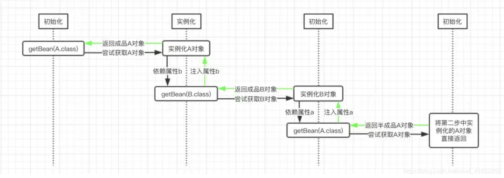
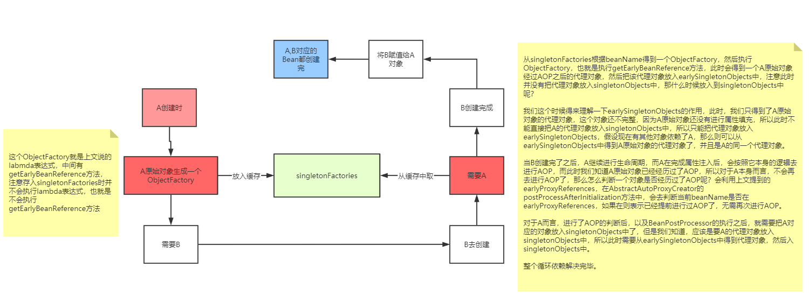

# spring 循环依赖 

在Spring中，对象的实例化是通过反射实现的，而对象的属性则是在对象实例化之后通过一定的方式设置的。

这个过程可以按照如下方式进行理解：





## 如何检测是否有循环依赖

 可以 Bean在创建的时候给其打个标记，如果递归调用回来发现正在创建中的话--->即可说明循环依赖。

## 怎么解决的

Spring的循环依赖的理论依据其实是基于Java的引用传递，当我们获取到对象的引用时，对象的field或zh属性是可以延后设置的(但是构造器必须是在获取引用之前)。

1. createBeanInstance：实例化，其实也就是 调用对象的构造方法实例化对象
2. populateBean：填充属性，这一步主要是多bean的依赖属性进行填充
3. initializeBean：调用spring xml中的init() 方法。

从上面讲述的单例bean初始化步骤我们可以知道，循环依赖主要发生在第一、第二步。也就是构造器循环依赖和field循环依赖。

那么我们要解决循环引用也应该从初始化过程着手，对于单例来说，在Spring容器整个生命周期内，有且只有一个对象，所以很容易想到这个对象应该存在Cache中，Spring为了解决单例的循环依赖问题，使用了三级缓存。


## 源码怎么实现的

``` java
public class DefaultSingletonBeanRegistry extends SimpleAliasRegistry implements SingletonBeanRegistry {

	/** Maximum number of suppressed exceptions to preserve. */
	private static final int SUPPRESSED_EXCEPTIONS_LIMIT = 100;


	/** Cache of singleton objects: bean name to bean instance. */
	private final Map<String, Object> singletonObjects = new ConcurrentHashMap<>(256);

	/** Cache of singleton factories: bean name to ObjectFactory. */
	private final Map<String, ObjectFactory<?>> singletonFactories = new HashMap<>(16);

	/** Cache of early singleton objects: bean name to bean instance. */
	private final Map<String, Object> earlySingletonObjects = new ConcurrentHashMap<>(16);

```

#### 这三级缓存分别指：

* 三级缓存singletonFactories ： 单例对象工厂的cache 
* 二级缓存earlySingletonObjects ：提前暴光的单例对象的Cache 。【用于检测循环引用，与singletonFactories互斥】
* 一级缓存singletonObjects：单例对象的cache

```java

protected  T doGetBean(final String name, @Nullable final Class requiredType,
    @Nullable final Object[] args, boolean typeCheckOnly) throws BeansException {
  
  // 尝试通过bean名称获取目标bean对象，比如这里的A对象
  Object sharedInstance = getSingleton(beanName);
 
  // 我们这里的目标对象都是单例的
  if (mbd.isSingleton()) {
    
    // 这里就尝试创建目标对象，第二个参数传的就是一个ObjectFactory类型的对象，这里是使用Java8的lamada
    // 表达式书写的，只要上面的getSingleton()方法返回值为空，则会调用这里的getSingleton()方法来创建
    // 目标对象
    sharedInstance = getSingleton(beanName, () -> {
      try {
        // 尝试创建目标对象
        return createBean(beanName, mbd, args);
      } catch (BeansException ex) {
        throw ex;
      }
    });
  }
  return (T) bean;
}
```

这里的doGetBean()方法是非常关键的一个方法（中间省略了其他代码），上面也主要有两个步骤

第一个步骤的getSingleton()方法的作用是尝试从缓存中获取目标对象，如果没有获取到，则尝试获取半成品的目标对象；如果第一个步骤没有获取到目标对象的实例，那么就进入第二个步骤

第二个步骤的getSingleton()方法的作用是尝试创建目标对象，并且为该对象注入其所依赖的属性。

这里其实就是主干逻辑，我们前面图中已经标明，在整个过程中会调用三次doGetBean()方法

第一次调用的时候会尝试获取A对象实例，此时走的是第一个getSingleton()方法，由于没有已经创建的A对象的成品或半成品，因而这里得到的是null

然后就会调用第二个getSingleton()方法，创建A对象的实例，然后递归的调用doGetBean()方法，尝试获取B对象的实例以注入到A对象中

此时由于Spring容器中也没有B对象的成品或半成品，因而还是会走到第二个getSingleton()方法，在该方法中创建B对象的实例

创建完成之后，尝试获取其所依赖的A的实例作为其属性，因而还是会递归的调用doGetBean()方法

此时需要注意的是，在前面由于已经有了一个半成品的A对象的实例，因而这个时候，再尝试获取A对象的实例的时候，会走第一个getSingleton()方法

在该方法中会得到一个半成品的A对象的实例，然后将该实例返回，并且将其注入到B对象的属性a中，此时B对象实例化完成。

然后，将实例化完成的B对象递归的返回，此时就会将该实例注入到A对象中，这样就得到了一个成品的A对象。

我们这里可以阅读上面的第一个getSingleton()方法：

```java
@Nullable
protected Object getSingleton(String beanName, boolean allowEarlyReference) {
  
  // 尝试从缓存中获取成品的目标对象，如果存在，则直接返回
  Object singletonObject = this.singletonObjects.get(beanName);
  
  // 如果缓存中不存在目标对象，则判断当前对象是否已经处于创建过程中，在前面的讲解中，第一次尝试获取A对象
  // 的实例之后，就会将A对象标记为正在创建中，因而最后再尝试获取A对象的时候，这里的if判断就会为true
  if (singletonObject == null && isSingletonCurrentlyInCreation(beanName)) {
    
    synchronized (this.singletonObjects) {
      singletonObject = this.earlySingletonObjects.get(beanName);
      if (singletonObject == null && allowEarlyReference) {
        
        // 这里的singletonFactories是一个Map，其key是bean的名称，而值是一个ObjectFactory类型的
        // 对象，这里对于A和B而言，调用图其getObject()方法返回的就是A和B对象的实例，无论是否是半成品
        ObjectFactory singletonFactory = this.singletonFactories.get(beanName);
        if (singletonFactory != null) {
          
          // 获取目标对象的实例
          singletonObject = singletonFactory.getObject();
          this.earlySingletonObjects.put(beanName, singletonObject);
          this.singletonFactories.remove(beanName);
        }
      }
    }
  }
  return singletonObject;
}
```

这里我们会存在一个问题就是A的半成品实例是如何实例化的，然后是如何将其封装为一个ObjectFactory类型的对象，并且将其放到上面的singletonFactories属性中的。

这主要是在前面的第二个getSingleton()方法中，其最终会通过其传入的第二个参数，从而调用createBean()方法，该方法的最终调用是委托给了另一个doCreateBean()方法进行的


```java
protected Object doCreateBean(final String beanName, final RootBeanDefinition mbd, final @Nullable Object[] args)
  throws BeanCreationException {
 
  // 实例化当前尝试获取的bean对象，比如A对象和B对象都是在这里实例化的
  BeanWrapper instanceWrapper = null;
  if (mbd.isSingleton()) {
    instanceWrapper = this.factoryBeanInstanceCache.remove(beanName);
  }
  if (instanceWrapper == null) {
    instanceWrapper = createBeanInstance(beanName, mbd, args);
  }
 
  // 判断Spring是否配置了支持提前暴露目标bean，也就是是否支持提前暴露半成品的bean
  boolean earlySingletonExposure = (mbd.isSingleton() && this.allowCircularReferences 
    && isSingletonCurrentlyInCreation(beanName));
  if (earlySingletonExposure) {
    
    // 如果支持，这里就会将当前生成的半成品的bean放到singletonFactories中，这个singletonFactories
    // 就是前面第一个getSingleton()方法中所使用到的singletonFactories属性，也就是说，这里就是
    // 封装半成品的bean的地方。而这里的getEarlyBeanReference()本质上是直接将放入的第三个参数，也就是
    // 目标bean直接返回
    addSingletonFactory(beanName, () -> getEarlyBeanReference(beanName, mbd, bean));
  }
 
  try {
    // 在初始化实例之后，这里就是判断当前bean是否依赖了其他的bean，如果依赖了，
    // 就会递归的调用getBean()方法尝试获取目标bean
    populateBean(beanName, mbd, instanceWrapper);
  } catch (Throwable ex) {
    // 省略...
  }
 
  return exposedObject;
}
```
到这里，Spring整个解决循环依赖问题的实现思路已经比较清楚了。对于整体过程，读者朋友只要理解两点：

Spring是通过递归的方式获取目标bean及其所依赖的bean的；

Spring实例化一个bean的时候，是分两步进行的，首先实例化目标bean，然后为其注入属性。

结合这两点，也就是说，Spring在实例化一个bean的时候，是首先递归的实例化其所依赖的所有bean，直到某个bean没有依赖其他bean，此时就会将该实例返回，然后反递归的将获取到的bean设置为各个上层bean的属性的。


这里就是解决循环依赖的关键，这段代码发生在createBeanInstance之后，也就是说单例对象此时已经被创建出来(调用了构造器)。这个对象已经被生产出来了，虽然还不完美（还没有进行初始化的第二步和第三步），但是已经能被人认出来了（根据对象引用能定位到堆中的对象），所以Spring此时将这个对象提前曝光出来让大家认识，让大家使用。

这样做有什么好处呢？让我们来分析一下“A的某个field或者setter依赖了B的实例对象，同时B的某个field或者setter依赖了A的实例对象”这种循环依赖的情况。A首先完成了初始化的第一步，并且将自己提前曝光到singletonFactories中，此时进行初始化的第二步，发现自己依赖对象B，此时就尝试去get(B)，发现B还没有被create，所以走create流程，B在初始化第一步的时候发现自己依赖了对象A，于是尝试get(A)，尝试一级缓存singletonObjects(肯定没有，因为A还没初始化完全)，尝试二级缓存earlySingletonObjects（也没有），尝试三级缓存singletonFactories，由于A通过ObjectFactory将自己提前曝光了，所以B能够通过ObjectFactory.getObject拿到A对象(虽然A还没有初始化完全，但是总比没有好呀)，B拿到A对象后顺利完成了初始化阶段1、2、3，完全初始化之后将自己放入到一级缓存singletonObjects中。此时返回A中，A此时能拿到B的对象顺利完成自己的初始化阶段2、3，最终A也完成了初始化，进去了一级缓存singletonObjects中，而且更加幸运的是，由于B拿到了A的对象引用，所以B现在hold住的A对象完成了初始化。

知道了这个原理时候，肯定就知道为啥Spring不能解决“A的构造方法中依赖了B的实例对象，同时B的构造方法中依赖了A的实例对象”这类问题了！因为加入singletonFactories三级缓存的前提是执行了构造器，所以构造器的循环依赖没法解决

## 其实用一级缓存加三级缓存就可以解决循环依赖的问题了  但是为什么要采用二级缓存了 ？

试想一下：假如对象A循环依赖B、C，也就是A与B A与C都存在循环依赖  在实例化A的时候会提前实例化B和C 在示例化B的时候，
已经提前利用三级缓存生成了A的代理类 但是由于A的属性赋值这个阶段还没结束 一级缓存还没有A 所以在实例化C的时候  
又要从三级缓存中拿代码块生成A的代理类 这这样 对我们的程序是没问题的 
因为代理类依托的原始类一直都是A 所以程序功能是没影响的  但是这样存在性能的浪费  如果我们把代码快生成的A的代理类 存放到二级缓存中  
那么C需要的时候就可以直接获取到这个类了 从而不会又执行代码块生成一个了   


## 那么为什么Spring中还需要singletonFactories呢？


这是难点，基于上面的场景想一个问题：如果A的原始对象注入给B的属性之后，A的原始对象进行了AOP产生了一个代理对象，此时就会出现，对于A而言，它的Bean对象其实应该是AOP之后的代理对象，而B的a属性对应的并不是AOP之后的代理对象，这就产生了冲突。

B依赖的A和最终的A不是同一个对象。

那么如何解决这个问题？这个问题可以说没有办法解决。

因为在一个Bean的生命周期最后，Spring提供了BeanPostProcessor可以去对Bean进行加工，这个加工不仅仅只是能修改Bean的属性值，也可以替换掉当前Bean。

```java
@Component
public class FireService {

    public FireService() {
        System.out.println("FireService...constructor");
    }
    
}

```

```java
@Component
public class FireBeanPostProcessor implements BeanPostProcessor {

    //前置处理器
    @Override
    public Object postProcessBeforeInitialization(Object bean, String beanName) {
        if ("fireService".equals(beanName)){
            System.out.println("postProcessBeforeInitialization..." + beanName + "=>" + bean);
        }

        return bean;
    }

    //后置处理器
    @Override
    public Object postProcessAfterInitialization(Object bean, String beanName) {

        if ("fireService".equals(beanName)){
            System.out.println(bean);
            FireService fireService = new FireService();
            return fireService;
        }
        return bean;
    }
}
```

所以在BeanPostProcessor中可以完全替换掉某个beanName对应的bean对象。

而BeanPostProcessor的执行在Bean的生命周期中是处于属性注入之后的，循环依赖是发生在属性注入过程中的，所以很有可能导致，注入给B对象的A对象和经历过完整生命周期之后的A对象，不是一个对象。这就是有问题的。

所以在这种情况下的循环依赖，Spring是解决不了的，因为在属性注入时，Spring也不知道A对象后续会经过哪些BeanPostProcessor以及会对A对象做什么处理。

#### Spring到底解决了哪种情况下的循环依赖

虽然上面的情况可能发生，但是肯定发生得很少，我们通常在开发过程中，不会这样去做，但是，某个beanName对应的最终对象和原始对象不是一个对象却会经常出现，这就是AOP。

AOP就是通过一个BeanPostProcessor来实现的，这个BeanPostProcessor就是AnnotationAwareAspectJAutoProxyCreator，它的父类是AbstractAutoProxyCreator，而在Spring中AOP利用的要么是JDK动态代理，要么CGLib的动态代理，所以如果给一个类中的某个方法设置了切面，那么这个类最终就需要生成一个代理对象。

一般过程就是：A类--->生成一个普通对象-->属性注入-->基于切面生成一个代理对象-->把代理对象放入singletonObjects单例池中。

而AOP可以说是Spring中除开IOC的另外一大功能，而循环依赖又是属于IOC范畴的，所以这两大功能想要并存，Spring需要特殊处理。

如何处理的，就是利用了第三级缓存singletonFactories。


首先，singletonFactories中存的是某个beanName对应的ObjectFactory，在bean的生命周期中，生成完原始对象之后，就会构造一个ObjectFactory存入singletonFactories中。
这个ObjectFactory是一个函数式接口，所以支持Lambda表达式：() -> getEarlyBeanReference(beanName, mbd, bean)


AbstractAutowireCapableBeanFactory#doCreateBean
```java

		// Eagerly cache singletons to be able to resolve circular references
		// even when triggered by lifecycle interfaces like BeanFactoryAware.
		boolean earlySingletonExposure = (mbd.isSingleton() && this.allowCircularReferences &&
				isSingletonCurrentlyInCreation(beanName));
		if (earlySingletonExposure) {
			if (logger.isTraceEnabled()) {
				logger.trace("Eagerly caching bean '" + beanName +
						"' to allow for resolving potential circular references");
			}
			addSingletonFactory(beanName, () -> getEarlyBeanReference(beanName, mbd, bean));
		}
```

上面的Lambda表达式就是一个ObjectFactory，执行该Lambda表达式就会去执行getEarlyBeanReference方法，而该方法如下：

```java
	protected Object getEarlyBeanReference(String beanName, RootBeanDefinition mbd, Object bean) {
		Object exposedObject = bean;
		if (!mbd.isSynthetic() && hasInstantiationAwareBeanPostProcessors()) {
			for (BeanPostProcessor bp : getBeanPostProcessors()) {
				if (bp instanceof SmartInstantiationAwareBeanPostProcessor) {
					SmartInstantiationAwareBeanPostProcessor ibp = (SmartInstantiationAwareBeanPostProcessor) bp;
					exposedObject = ibp.getEarlyBeanReference(exposedObject, beanName);
				}
			}
		}
		return exposedObject;
	}

```

该方法会去执行SmartInstantiationAwareBeanPostProcessor中的getEarlyBeanReference方法，而这个接口下的实现类中只有两个类实现了这个方法，一个是AbstractAutoProxyCreator，
一个是InstantiationAwareBeanPostProcessorAdapter，它的实现如下：

###### AbstractAutoProxyCreator
```java
	@Override
	public Object getEarlyBeanReference(Object bean, String beanName) {
		Object cacheKey = getCacheKey(bean.getClass(), beanName);
		this.earlyProxyReferences.put(cacheKey, bean);
		return wrapIfNecessary(bean, beanName, cacheKey);
	}
```

###### InstantiationAwareBeanPostProcessorAdapter
```java
	@Override
	public Object getEarlyBeanReference(Object bean, String beanName) throws BeansException {
		return bean;
	}
```

所以很明显，在整个Spring中，默认就只有AbstractAutoProxyCreator真正意义上实现了getEarlyBeanReference方法，而该类就是用来进行AOP的。上文提到的AnnotationAwareAspectJAutoProxyCreator的父类就是AbstractAutoProxyCreator。

那么getEarlyBeanReference方法到底在干什么？

1. 首先得到一个cachekey，cachekey就是beanName。
2. 然后把beanName和bean（这是原始对象）存入earlyProxyReferences中
3. 调用wrapIfNecessary进行AOP，得到一个代理对象。

那么，什么时候会调用getEarlyBeanReference方法呢？回到循环依赖的场景中



#### 左边文字：

这个ObjectFactory就是上文说的labmda表达式，中间有getEarlyBeanReference方法，注意存入singletonFactories时并不会执行lambda表达式，也就是不会执行getEarlyBeanReference方法
     

#### 右边文字：

从singletonFactories根据beanName得到一个ObjectFactory，然后执行ObjectFactory，也就是执行getEarlyBeanReference方法，此时会得到一个A原始对象经过AOP之后的代理对象，然后把该代理对象放入earlySingletonObjects中，注意此时并没有把代理对象放入singletonObjects中，那什么时候放入到singletonObjects中呢？

我们这个时候得来理解一下earlySingletonObjects的作用，此时，我们只得到了A原始对象的代理对象，这个对象还不完整，因为A原始对象还没有进行属性填充，所以此时不能直接把A的代理对象放入singletonObjects中，所以只能把代理对象放入earlySingletonObjects，假设现在有其他对象依赖了A，那么则可以从earlySingletonObjects中得到A原始对象的代理对象了，并且是A的同一个代理对象。

当B创建完了之后，A继续进行生命周期，而A在完成属性注入后，会按照它本身的逻辑去进行AOP，而此时我们知道A原始对象已经经历过了AOP，所以对于A本身而言，不会再去进行AOP了，那么怎么判断一个对象是否经历过了AOP呢？会利用上文提到的earlyProxyReferences，在AbstractAutoProxyCreator的postProcessAfterInitialization方法中，会去判断当前beanName是否在earlyProxyReferences，如果在则表示已经提前进行过AOP了，无需再次进行AOP。

对于A而言，进行了AOP的判断后，以及BeanPostProcessor的执行之后，就需要把A对应的对象放入singletonObjects中了，但是我们知道，应该是要A的代理对象放入singletonObjects中，所以此时需要从earlySingletonObjects中得到代理对象，然后入singletonObjects中。右边文字：
     

#### 总结
至此，总结一下三级缓存：

* singletonObjects：缓存某个beanName对应的经过了完整生命周期的bean
* earlySingletonObjects：缓存提前拿原始对象进行了AOP之后得到的代理对象，原始对象还没有进行属性注入和后续的BeanPostProcessor等生命周期
* singletonFactories：缓存的是一个ObjectFactory，主要用来去生成原始对象进行了AOP之后得到的代理对象，在每个Bean的生成过程中，都会提前暴露一个工厂，这个工厂可能用到，也可能用不到，如果没有出现循环依赖依赖本bean，那么这个工厂无用，本bean按照自己的生命周期执行，执行完后直接把本bean放入singletonObjects中即可，如果出现了循环依赖依赖了本bean，则另外那个bean执行ObjectFactory提交得到一个AOP之后的代理对象(如果有AOP的话，如果无需AOP，则直接得到一个原始对象)。
* 其实还要一个缓存，就是earlyProxyReferences，它用来记录某个原始对象是否进行过AOP了。