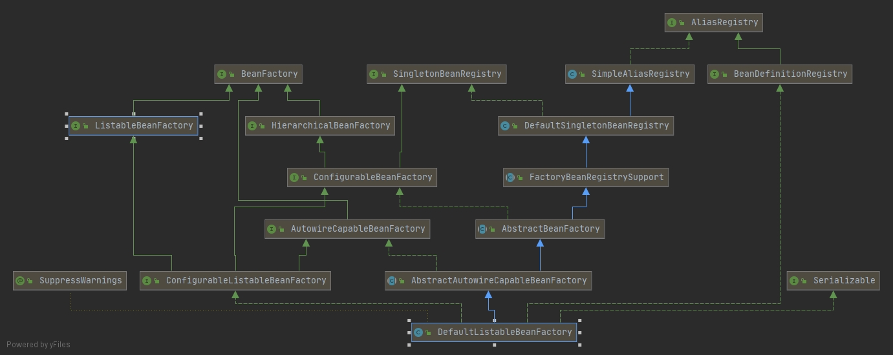

# 容器的始祖 DefaultListableBeanFactory

要说 XmlBeanFactory 就不得不先说它的父类 DefaultListableBeanFactory，因为 XmlBeanFactory 中的大部分功能实际上在 DefaultListableBeanFactory 中就已经提供好了，XmlBeanFactory 只是对 IO 流的读取做了一些定制而已。

DefaultListableBeanFactory 是一个完整的、功能成熟的 IoC 容器，如果你的需求很简单，甚至可以直接使用 DefaultListableBeanFactory，如果你的需求比较复杂，那么通过扩展 DefaultListableBeanFactory 的功能也可以达到，可以说 DefaultListableBeanFactory 是整个 Spring IoC 容器的始祖。

我们先来看一下 DefaultListableBeanFactory 的继承关系：

从这张类的关系图中可以看出，DefaultListableBeanFactory 实际上也是一个集大成者。在 Spring 中，针对 Bean 的不同操作都有不同的接口进行规范，每个接口都有自己对应的实现，最终在 DefaultListableBeanFactory 中将所有的实现汇聚到一起。从这张类的继承关系图中我们大概就能感受到 Spring 中关于类的设计是多么厉害，代码耦合度非常低。

这些类，在本系列后面的介绍中，大部分都会涉及到，现在我先大概介绍一下每个类的作用，大家先混个脸熟：

* BeanFactory：这个接口看名字就知道是一个 Bean 的工厂，BeanFactory 接口定义了各种获取 Bean 的方法、判断 Bean 是否存在、判断 Bean 是否单例等针对 Bean 的基础方法。
* ListableBeanFactory：这个接口继承自 BeanFactory，在 BeanFactory 的基础上，扩展了 Bean 的查询方法，例如根据类型获取 BeanNames、根据注解获取 BeanNames、根据 Bean 获取注解等。
* AutowireCapableBeanFactory：该接口继承自 BeanFactory，在 BeanFactory 的基础上，提供了 Bean 的创建、配置、注入、销毁等操作。有时候我们需要自己手动注入 Bean 的时候，可以考虑通过实现该接口来完成。AutowireCapableBeanFactory 在 Spring Security 中有一个重要的应用就是 ObjectPostProcessor，这个松哥将在 Spring Security 系列中和大家详细介绍。
* HierarchicalBeanFactory：该接口继承自 BeanFactory，并在 BeanFactory 基础上添加了获取 parent beanfactory 的方法。
* SingletonBeanRegistry：这个接口定义了对单例 Bean 的定义以及获取方法。
* ConfigurableBeanFactory：这个接口主要定了针对 BeanFactory 的各种配置以及销毁的方法。
* ConfigurableListableBeanFactory：这是 BeanFactory 的配置清单，这里定义了忽略的类型、接口，通过 Bean 的名称获取 BeanDefinition 、冻结 BeanDefinition 等。
* AliasRegistry：这个接口定义了对 alias 的注册、移除、判断以及查询操作。
* SimpleAliasRegistry：这个类实现了 AliasRegistry 接口并实现了它里边的方法，SimpleAliasRegistry 使用 ConcurrentHashMap 做载体，实现了对 alias 的注册、移除判断以及查询操作。
* DefaultSingletonBeanRegistry：这个类基于 Java 中的集合，对 SingletonBeanRegistry 接口进行了实现。
* FactoryBeanRegistrySupport：该类继承自 DefaultSingletonBeanRegistry，并在 DefaultSingletonBeanRegistry 的基础上，增加了获取 FactoryBean 类型、移除 FactoryBean 缓存的方法等等操作。
* AbstractBeanFactory：实现了 ConfigurableBeanFactory 接口并继承自 FactoryBeanRegistrySupport，在 AbstractBeanFactory 中对 ConfigurableBeanFactory 中定义的方法进行了实现。
* AbstractAutowireCapableBeanFactory：该类继承自 AbstractBeanFactory 并对 AutowireCapableBeanFactory 接口中定义的方法进行了落地实现。
* BeanDefinitionRegistry：这个接口继承自 AliasRegistry 接口，并增加了一系列针对 BeanDefinition 的注册、移除、查询、判断等方法。

最后的 DefaultListableBeanFactory 自然就具备了上面所有的功能。

上面的内容可能看的大家眼花缭乱，这里通过几个简单实际的例子，来带大家使用一下 DefaultListableBeanFactory 的功能，可能大家的理解就比较清晰了。

DefaultListableBeanFactory 作为一个集大成者，提供了非常多的功能，我们一个一个来看。