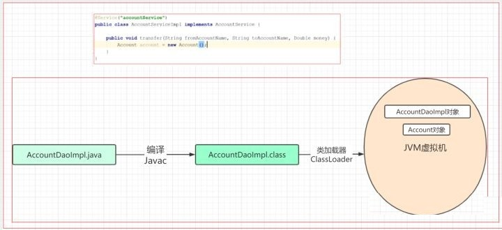
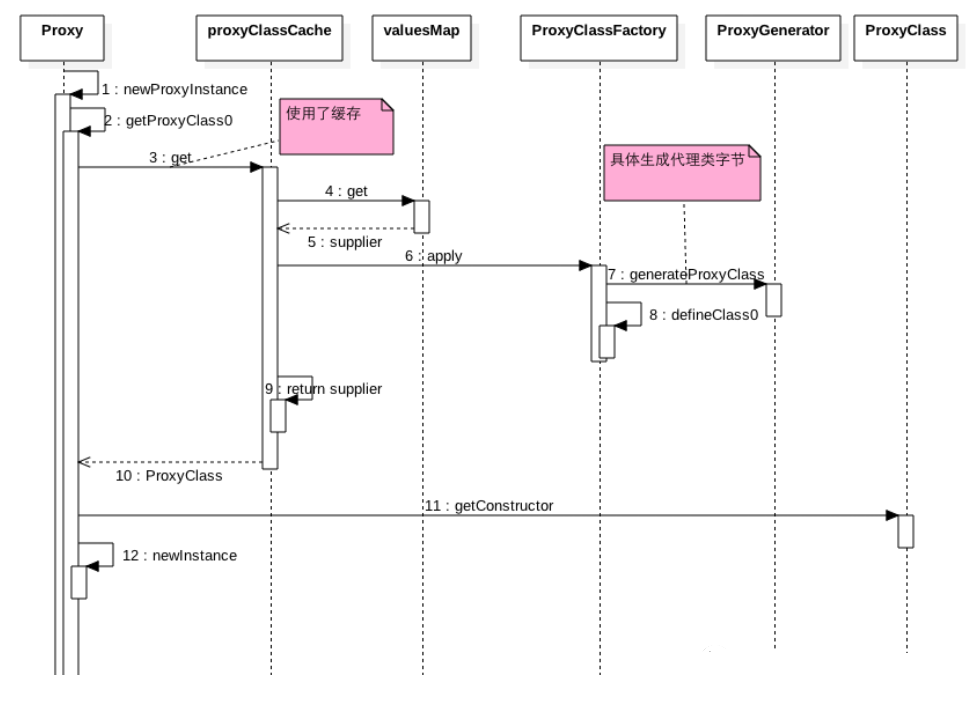
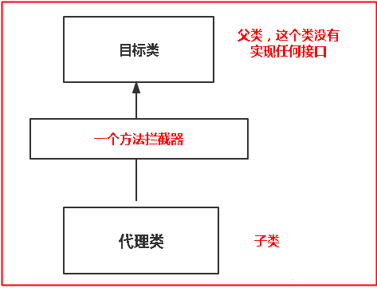
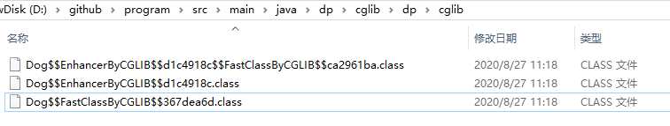
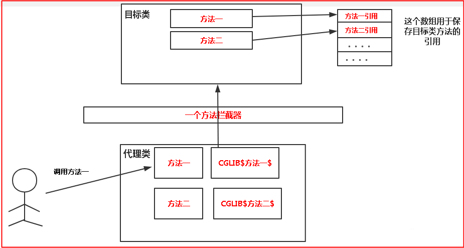

# 动态代理

先看看[代理模式](../Chapter04/Proxy.md)

## 何为动态代理？

**动态代理就是，在程序运行期，创建目标对象的代理对象，并对目标对象中的方法进行功能性增强的一种技术**。
它就是JVM中，对象方法的拦截器;在生成代理对象的过程中，目标对象不变，代理对象中的方法是目标对象方法的增强方法。
可以理解为运行期间，对象中方法的动态拦截，在拦截方法的前后执行功能操作。

代理类在程序运行期间，创建的代理对象称之为动态代理对象。这种情况下，创建的代理对象，并不是事先在Java代码中定义好的。而是在运行期间，根据我们在动态代理对象中的“指示”，动态生成的。
也就是说，你想获取哪个对象的代理，动态代理就会为你动态的生成这个对象的代理对象。

动态代理可以对被代理对象的方法进行功能增强。有了动态代理的技术，那么就可以在不修改方法源码的情况下，增强被代理对象的方法的功能，在方法执行前后做任何你想做的事情。

#### 创建代理对象的两个方法

```java
//JDK动态代理
Proxy.newProxyInstance(三个参数);
//CGLib动态代理
Enhancer.create(两个参数);
```

######  正常类创建对象的过程



###### 动态代理创建代理对象的过程


#### 两种常用的动态代理方式

###### 基于接口的动态代理
* 提供者：JDK
* 必须实现InvocationHandler接口,使用JDK官方的Proxy类创建代理对象
* 代理的目标对象必须实现接口
###### 基于类的动态代理
* 提供者：第三方 CGLib
* 使用CGLib的Enhancer类创建代理对象
* 注意：如果报 asmxxxx 异常，需要导入 asm.jar包

## JDK动态代理(jdk8)

```java
public interface IHello {
    void sayHello();
}

```

```java
public class HelloImpl implements IHello {
    @Override
    public void sayHello() {
        System.out.println("hello");
    }
}

```

```java
public class HelloInvocationHandler implements InvocationHandler {

    private Object target;

    public HelloInvocationHandler(Object target) {
        this.target = target;
    }
    
    @Override
    public Object invoke(Object proxy, Method method, Object[] args) throws Throwable {
        System.out.println("------插入前置通知代码-------------");
        // 执行相应的目标方法
        Object rs = method.invoke(target, args);
        System.out.println("------插入后置处理代码-------------");
        return rs;
    }
}

```

```java
public class HelloClient {
    public static void main(String[] args) throws NoSuchMethodException, IllegalAccessException, InvocationTargetException, InstantiationException {
        /*第一种*/
        IHello hello = new HelloImpl();
        hello.sayHello();

        // 生成$Proxy0的class文件
        //System.getProperties().put("sun.misc.ProxyGenerator.saveGeneratedFiles", "true");

        /*第二种*/

        HelloInvocationHandler helloInvocationHandler = new HelloInvocationHandler(new HelloImpl());
        IHello hello1 = (IHello) Proxy.newProxyInstance(IHello.class.getClassLoader(), new Class[]{IHello.class}, helloInvocationHandler);
        hello1.sayHello();

        /*第三种*/
        // 1、获取动态代理类
        Class proxy = Proxy.getProxyClass(IHello.class.getClassLoader(), IHello.class);
        // 2、获得代理类的构造函数，并传入参数类型InvocationHandler.class
        Constructor constructor = proxy.getConstructor(InvocationHandler.class);
        // 3、通过构造函数来创建动态代理对象，将自定义的InvocationHandler实例传入
        IHello hello2 = (IHello) constructor.newInstance(new HelloInvocationHandler(new HelloImpl()));
        hello2.sayHello();
    }
}

```

#### 深入源码分析

以Proxy.newProxyInstance()方法为切入点来剖析代理类的生成及代理方法的调用。

```java
    /**
    * loader：接口的类加载器
    8/
    @CallerSensitive
    public static Object newProxyInstance(ClassLoader loader, Class<?>[] interfaces, InvocationHandler h) throws IllegalArgumentException {
        
        // 如果h为空直接抛出空指针异常，之后所有的单纯的判断null并抛异常，都是此方法
        Objects.requireNonNull(h);
        
        // 拷贝类实现的所有接口
        final Class<?>[] intfs = interfaces.clone();
        // 获取当前系统安全接口
        final SecurityManager sm = System.getSecurityManager();
        if (sm != null) {
            // Reflection.getCallerClass返回调用该方法的方法的调用类;
            // 进行包访问权限、类加载器权限等检查
            checkProxyAccess(Reflection.getCallerClass(), loader, intfs);
        }

        /*
         * Look up or generate the designated proxy class.
         * 查找或生成指定的代理类
         */
        //1
        Class<?> cl = getProxyClass0(loader, intfs);

        /*
         * Invoke its constructor with the designated invocation handler.
         * 用指定的调用处理程序调用它的构造函数
         */
        try {
            if (sm != null) {
                checkNewProxyPermission(Reflection.getCallerClass(), cl);
            }

            //2 获取代理类的构造函数对象
            //constructorParams是类常量，作为代理类构造函数的参数类型，常量定义如下:
            //private static final Class<?>[] constructorParams = { InvocationHandler.class };
            final Constructor<?> cons = cl.getConstructor(constructorParams);
            final InvocationHandler ih = h;
            if (!Modifier.isPublic(cl.getModifiers())) {
                AccessController.doPrivileged(new PrivilegedAction<Void>() {
                    public Void run() {
                        cons.setAccessible(true);
                        return null;
                    }
                });
            }
            //3 根据代理类的构造函数对象来创建需要返回的代理类对象
            return cons.newInstance(new Object[]{h});
        } catch (IllegalAccessException|InstantiationException e) {
            throw new InternalError(e.toString(), e);
        } catch (InvocationTargetException e) {
            Throwable t = e.getCause();
            if (t instanceof RuntimeException) {
                throw (RuntimeException) t;
            } else {
                throw new InternalError(t.toString(), t);
            }
        } catch (NoSuchMethodException e) {
            throw new InternalError(e.toString(), e);
        }
    }
```

    可以大概看出Proxy.newProxyInstance封装了第二种方法中的1、2、3步。帮我们执行了生成代理类----获取构造器----生成代理对象这三步；

###### Proxy.getProxyClass0()如何生成代理类？

```java
    private static Class<?> getProxyClass0(ClassLoader loader, Class<?>... interfaces) {
        // 接口数不得超过65535个，这么大，足够使用的了
        if (interfaces.length > 65535) {
            throw new IllegalArgumentException("interface limit exceeded");
        }

        // If the proxy class defined by the given loader implementing
        // the given interfaces exists, this will simply return the cached copy;
        // otherwise, it will create the proxy class via the ProxyClassFactory
        //如果缓存中有代理类了直接返回，否则将由代理类工厂ProxyClassFactory创建代理类
        return proxyClassCache.get(loader, interfaces);
    }
```

如果缓存中没有代理类，Proxy中的ProxyClassFactory如何创建代理类？从get()方法追踪进去看看。

```java
    public V get(K key, P parameter) {
        // 检查指定类型的对象引用不为空null。当参数为null时，抛出空指针异常
        Objects.requireNonNull(parameter);

        // 清除已经被GC回收的弱引用
        expungeStaleEntries();

        // 将ClassLoader包装成CacheKey, 作为一级缓存的key
        Object cacheKey = CacheKey.valueOf(key, refQueue);

        // lazily install the 2nd level valuesMap for the particular cacheKey
        //获取得到二级缓存
        ConcurrentMap<Object, Supplier<V>> valuesMap = map.get(cacheKey);

        // 没有获取到对应的值
        if (valuesMap == null) {
            ConcurrentMap<Object, Supplier<V>> oldValuesMap
                //这里是防止并发，付给它一个新值
                = map.putIfAbsent(cacheKey, valuesMap = new ConcurrentHashMap<>());
            if (oldValuesMap != null) {
                valuesMap = oldValuesMap;
            }
        }

        // create subKey and retrieve the possible Supplier<V> stored by that subKey from valuesMap
        // 根据代理类实现的接口数组来生成二级缓存key
        Object subKey = Objects.requireNonNull(subKeyFactory.apply(key, parameter));
        Supplier<V> supplier = valuesMap.get(subKey);
        Factory factory = null;

        // 这个循环提供了轮询机制, 如果条件为假就继续重试直到条件为真为止
        while (true) {
            if (supplier != null) {
                // supplier might be a Factory or a CacheValue<V> instance
                // 在这里supplier可能是一个Factory也可能会是一个CacheValue
                // 在这里不作判断, 而是在Supplier实现类的get方法里面进行验证
                // 如果第一次的化 应该是 ProxyClassFactory
                V value = supplier.get();
                if (value != null) {
                    return value;
                }
            }
            // else no supplier in cache
            // or a supplier that returned null (could be a cleared CacheValue
            // or a Factory that wasn't successful in installing the CacheValue)

            // lazily construct a Factory
            if (factory == null) {
                 // 新建一个Factory实例作为subKey对应的值
                 // 这里引入ProxyClassFactory
                factory = new Factory(key, parameter, subKey, valuesMap);
            }

            if (supplier == null) {
                // 到这里表明subKey没有对应的值, 就将factory作为subKey的值放入
                supplier = valuesMap.putIfAbsent(subKey, factory);
                if (supplier == null) {
                    // successfully installed Factory
                    // 到这里表明成功将factory放入缓存
                    supplier = factory;
                }
                // else retry with winning supplier
                否则, 可能期间有其他线程修改了值, 那么就不再继续给subKey赋值, 而是取出来直接用
            } else {
                 // 期间可能其他线程修改了值, 那么就将原先的值替换
                if (valuesMap.replace(subKey, supplier, factory)) {
                    // successfully replaced
                    // cleared CacheEntry / unsuccessful Factory
                    // with our Factory
                    // 成功将factory替换成新的值 
                    supplier = factory;
                } else {
                    // retry with current supplier
                    // 替换失败, 继续使用原先的值
                    supplier = valuesMap.get(subKey);
                }
            }
        }
    }
```

get方法中Object subKey = Objects.requireNonNull(subKeyFactory.apply(key, parameter));

subKeyFactory调用apply，具体实现在ProxyClassFactory中完成。

ProxyClassFactory.apply()实现代理类创建。

```java
    private static final class ProxyClassFactory implements BiFunction<ClassLoader, Class<?>[], Class<?>>{
        // prefix for all proxy class names
        //  统一代理类的前缀名都以$Proxy
        private static final String proxyClassNamePrefix = "$Proxy";

        // next number to use for generation of unique proxy class names
        //使用唯一的编号给作为代理类名的一部分，如$Proxy0,$Proxy1等
        private static final AtomicLong nextUniqueNumber = new AtomicLong();

        @Override
        public Class<?> apply(ClassLoader loader, Class<?>[] interfaces) {

            Map<Class<?>, Boolean> interfaceSet = new IdentityHashMap<>(interfaces.length);
            for (Class<?> intf : interfaces) {
                /*
                 * Verify that the class loader resolves the name of this interface to the same Class object.
                 * 验证指定的类加载器(loader)加载接口所得到的Class对象(interfaceClass)是否与intf对象相同
                 */
                Class<?> interfaceClass = null;
                try {
                    interfaceClass = Class.forName(intf.getName(), false, loader);
                } catch (ClassNotFoundException e) {
                }
                if (interfaceClass != intf) {
                    throw new IllegalArgumentException(
                        intf + " is not visible from class loader");
                }
                /*
                 * Verify that the Class object actually represents an interface.
                 * 验证该Class对象是不是接口
                 */
                if (!interfaceClass.isInterface()) {
                    throw new IllegalArgumentException(
                        interfaceClass.getName() + " is not an interface");
                }
                /*
                 * Verify that this interface is not a duplicate.
                 * 验证该接口是否重复
                 */
                if (interfaceSet.put(interfaceClass, Boolean.TRUE) != null) {
                    throw new IllegalArgumentException(
                        "repeated interface: " + interfaceClass.getName());
                }
            }
             // package to define proxy class in
            //声明代理类所在包
            String proxyPkg = null;     
            int accessFlags = Modifier.PUBLIC | Modifier.FINAL;

            /*
             * Record the package of a non-public proxy interface so that the
             * proxy class will be defined in the same package.  Verify that
             * all non-public proxy interfaces are in the same package.
             * 验证所有非公共的接口在同一个包内；公共的就无需处理
             */
            for (Class<?> intf : interfaces) {
                int flags = intf.getModifiers();
                if (!Modifier.isPublic(flags)) {
                    accessFlags = Modifier.FINAL;
                    String name = intf.getName();
                    int n = name.lastIndexOf('.');
                    // 截取完整包名
                    String pkg = ((n == -1) ? "" : name.substring(0, n + 1));
                    if (proxyPkg == null) {
                        proxyPkg = pkg;
                    } else if (!pkg.equals(proxyPkg)) {
                        throw new IllegalArgumentException(
                            "non-public interfaces from different packages");
                    }
                }
            }

            if (proxyPkg == null) {
                // if no non-public proxy interfaces, use com.sun.proxy package
                //如果都是public接口，那么生成的代理类就在com.sun.proxy包下
                //如果报java.io.FileNotFoundException: com\sun\proxy\$Proxy0.class 
                //(系统找不到指定的路径。)的错误，就先在你项目中创建com.sun.proxy路径
                proxyPkg = ReflectUtil.PROXY_PACKAGE + ".";
            }

            /*
             * Choose a name for the proxy class to generate.
             * nextUniqueNumber 是一个原子类，确保多线程安全，防止类名重复，类似于：$Proxy0，$Proxy
             */
            long num = nextUniqueNumber.getAndIncrement();
            // 代理类的完全限定名，如com.sun.proxy.$Proxy0.calss
            String proxyName = proxyPkg + proxyClassNamePrefix + num;

            /*
             * Generate the specified proxy class.
             * 生成类字节码的方法（重点）
             */
            byte[] proxyClassFile = ProxyGenerator.generateProxyClass(
                proxyName, interfaces, accessFlags);
            try {
                return defineClass0(loader, proxyName,
                                    proxyClassFile, 0, proxyClassFile.length);
            } catch (ClassFormatError e) {
                /*
                 * A ClassFormatError here means that (barring bugs in the
                 * proxy class generation code) there was some other
                 * invalid aspect of the arguments supplied to the proxy
                 * class creation (such as virtual machine limitations
                 * exceeded).
                 */
                throw new IllegalArgumentException(e.toString());
            }
        }
    }
```

代理类创建真正在ProxyGenerator.generateProxyClass（）方法中，方法签名如下:

```java
    public static byte[] generateProxyClass(final String name, Class<?>[] interfaces, int accessFlags) {
        ProxyGenerator gen = new ProxyGenerator(name, interfaces, accessFlags);
        // 真正生成字节码的方法
        final byte[] classFile = gen.generateClassFile();
        // 如果saveGeneratedFiles为true 则生成字节码文件，所以在开始我们要设置这个参数
        // 当然，也可以通过返回的bytes自己输出
        if (saveGeneratedFiles) {
            java.security.AccessController.doPrivileged( new java.security.PrivilegedAction<Void>() {
                        public Void run() {
                            try {
                                int i = name.lastIndexOf('.');
                                Path path;
                                if (i > 0) {
                                    Path dir = Paths.get(name.substring(0, i).replace('.', File.separatorChar));
                                    Files.createDirectories(dir);
                                    path = dir.resolve(name.substring(i+1, name.length()) + ".class");
                                } else {
                                    path = Paths.get(name + ".class");
                                }
                                Files.write(path, classFile);
                                return null;
                            } catch (IOException e) {
                                throw new InternalError( "I/O exception saving generated file: " + e);
                            }
                        }
                    });
        }
        return classFile;
    }
```

代理类生成的最终方法是ProxyGenerator.generateClassFile()

```java

    private byte[] generateClassFile() {
        /* ============================================================
         * Step 1: Assemble ProxyMethod objects for all methods to generate proxy dispatching code for.
         * 步骤1：为所有方法生成代理调度代码，将代理方法对象集合起来。
         */
        //增加 hashcode、equals、toString方法
        addProxyMethod(hashCodeMethod, Object.class);
        addProxyMethod(equalsMethod, Object.class);
        addProxyMethod(toStringMethod, Object.class);
        // 获得所有接口中的所有方法，并将方法添加到代理方法中
        for (Class<?> intf : interfaces) {
            for (Method m : intf.getMethods()) {
                addProxyMethod(m, intf);
            }
        }
 
        /*
         * 验证方法签名相同的一组方法，返回值类型是否相同；意思就是重写方法要方法签名和返回值一样
         */
        for (List<ProxyMethod> sigmethods : proxyMethods.values()) {
            checkReturnTypes(sigmethods);
        }
 
        /* ============================================================
         * Step 2: Assemble FieldInfo and MethodInfo structs for all of fields and methods in the class we are generating.
         * 为类中的方法生成字段信息和方法信息
         */
        try {
            // 生成代理类的构造函数
            methods.add(generateConstructor());
            for (List<ProxyMethod> sigmethods : proxyMethods.values()) {
                for (ProxyMethod pm : sigmethods) {
                    // add static field for method's Method object
                    fields.add(new FieldInfo(pm.methodFieldName,
                            "Ljava/lang/reflect/Method;",
                            ACC_PRIVATE | ACC_STATIC));
                    // generate code for proxy method and add it
					// 生成代理类的代理方法
                    methods.add(pm.generateMethod());
                }
            }
            // 为代理类生成静态代码块，对一些字段进行初始化
            methods.add(generateStaticInitializer());
        } catch (IOException e) {
            throw new InternalError("unexpected I/O Exception", e);
        }
 
        if (methods.size() > 65535) {
            throw new IllegalArgumentException("method limit exceeded");
        }
        if (fields.size() > 65535) {
            throw new IllegalArgumentException("field limit exceeded");
        }
 
        /* ============================================================
         * Step 3: Write the final class file.
         * 步骤3：编写最终类文件
         */
        /*
         * Make sure that constant pool indexes are reserved for the following items before starting to write the final class file.
         * 在开始编写最终类文件之前，确保为下面的项目保留常量池索引。
         */
        cp.getClass(dotToSlash(className));
        cp.getClass(superclassName);
        for (Class<?> intf: interfaces) {
            cp.getClass(dotToSlash(intf.getName()));
        }
 
        /*
         * Disallow new constant pool additions beyond this point, since we are about to write the final constant pool table.
         * 设置只读，在这之前不允许在常量池中增加信息，因为要写常量池表
         */
        cp.setReadOnly();
 
        ByteArrayOutputStream bout = new ByteArrayOutputStream();
        DataOutputStream dout = new DataOutputStream(bout);
 
        try {
            // u4 magic;
            dout.writeInt(0xCAFEBABE);
            // u2 次要版本;
            dout.writeShort(CLASSFILE_MINOR_VERSION);
            // u2 主版本
            dout.writeShort(CLASSFILE_MAJOR_VERSION);
 
            cp.write(dout);             // (write constant pool)
 
            // u2 访问标识;
            dout.writeShort(accessFlags);
            // u2 本类名;
            dout.writeShort(cp.getClass(dotToSlash(className)));
            // u2 父类名;
            dout.writeShort(cp.getClass(superclassName));
            // u2 接口;
            dout.writeShort(interfaces.length);
            // u2 interfaces[interfaces_count];
            for (Class<?> intf : interfaces) {
                dout.writeShort(cp.getClass(
                        dotToSlash(intf.getName())));
            }
            // u2 字段;
            dout.writeShort(fields.size());
            // field_info fields[fields_count];
            for (FieldInfo f : fields) {
                f.write(dout);
            }
            // u2 方法;
            dout.writeShort(methods.size());
            // method_info methods[methods_count];
            for (MethodInfo m : methods) {
                m.write(dout);
            }
            // u2 类文件属性：对于代理类来说没有类文件属性;
            dout.writeShort(0); // (no ClassFile attributes for proxy classes)
 
        } catch (IOException e) {
            throw new InternalError("unexpected I/O Exception", e);
        }
 
        return bout.toByteArray();
    }
```

通过addProxyMethod（）添加hashcode、equals、toString方法。

```java
    private void addProxyMethod(Method var1, Class var2) {
        String var3 = var1.getName();  //方法名
        Class[] var4 = var1.getParameterTypes();   //方法参数类型数组
        Class var5 = var1.getReturnType();    //返回值类型
        Class[] var6 = var1.getExceptionTypes();   //异常类型
        String var7 = var3 + getParameterDescriptors(var4);   //方法签名
        Object var8 = (List)this.proxyMethods.get(var7);   //根据方法签名却获得proxyMethods的Value
        if(var8 != null) {    //处理多个代理接口中重复的方法的情况
            Iterator var9 = ((List)var8).iterator();
            while(var9.hasNext()) {
                ProxyGenerator.ProxyMethod var10 = (ProxyGenerator.ProxyMethod)var9.next();
                if(var5 == var10.returnType) {
                    /*归约异常类型以至于让重写的方法抛出合适的异常类型，我认为这里可能是多个接口中有相同的方法，而这些相同的方法抛出的异常类                      型又不同，所以对这些相同方法抛出的异常进行了归约*/
                    ArrayList var11 = new ArrayList();
                    collectCompatibleTypes(var6, var10.exceptionTypes, var11);
                    collectCompatibleTypes(var10.exceptionTypes, var6, var11);
                    var10.exceptionTypes = new Class[var11.size()];
                    //将ArrayList转换为Class对象数组
                    var10.exceptionTypes = (Class[])var11.toArray(var10.exceptionTypes);
                    return;
                }
            }
        } else {
            var8 = new ArrayList(3);
            this.proxyMethods.put(var7, var8);
        }    
        ((List)var8).add(new ProxyGenerator.ProxyMethod(var3, var4, var5, var6, var2, null));
       /*如果var8为空，就创建一个数组，并以方法签名为key,proxymethod对象数组为value添加到proxyMethods*/
    }
```

生成的代理对象$Proxy0.class字节码反编译：

```java
package com.sun.proxy;
 
import com.jpeony.spring.proxy.jdk.IHello;
import java.lang.reflect.InvocationHandler;
import java.lang.reflect.Method;
import java.lang.reflect.Proxy;
import java.lang.reflect.UndeclaredThrowableException;
 
public final class $Proxy0 extends Proxy
  implements IHello // 继承了Proxy类和实现IHello接口
{
  // 变量，都是private static Method  XXX
  private static Method m1;
  private static Method m3;
  private static Method m2;
  private static Method m0;
 
  // 代理类的构造函数，其参数正是是InvocationHandler实例，Proxy.newInstance方法就是通过通过这个构造函数来创建代理实例的
  public $Proxy0(InvocationHandler paramInvocationHandler)
    throws 
  {
    super(paramInvocationHandler);
  }
 
  // 以下Object中的三个方法
  public final boolean equals(Object paramObject)
    throws 
  {
    try
    {
      return ((Boolean)this.h.invoke(this, m1, new Object[] { paramObject })).booleanValue();
    }
    catch (RuntimeException localRuntimeException)
    {
      throw localRuntimeException;
    }
    catch (Throwable localThrowable)
    {
      throw new UndeclaredThrowableException(localThrowable);
    }
  }
  
  // 接口代理方法
  public final void sayHello()
    throws 
  {
    try
    {
      this.h.invoke(this, m3, null);
      return;
    }
    catch (RuntimeException localRuntimeException)
    {
      throw localRuntimeException;
    }
    catch (Throwable localThrowable)
    {
      throw new UndeclaredThrowableException(localThrowable);
    }
  }
 
  public final String toString()
    throws 
  {
    try
    {
      return ((String)this.h.invoke(this, m2, null));
    }
    catch (RuntimeException localRuntimeException)
    {
      throw localRuntimeException;
    }
    catch (Throwable localThrowable)
    {
      throw new UndeclaredThrowableException(localThrowable);
    }
  }
 
  public final int hashCode()
    throws 
  {
    try
    {
      return ((Integer)this.h.invoke(this, m0, null)).intValue();
    }
    catch (RuntimeException localRuntimeException)
    {
      throw localRuntimeException;
    }
    catch (Throwable localThrowable)
    {
      throw new UndeclaredThrowableException(localThrowable);
    }
  }
 
  // 静态代码块对变量进行一些初始化工作
  static
  {
    try
    {
	  // 这里每个方法对象 和类的实际方法绑定
      m1 = Class.forName("java.lang.Object").getMethod("equals", new Class[] { Class.forName("java.lang.Object") });
      m3 = Class.forName("com.jpeony.spring.proxy.jdk.IHello").getMethod("sayHello", new Class[0]);
      m2 = Class.forName("java.lang.Object").getMethod("toString", new Class[0]);
      m0 = Class.forName("java.lang.Object").getMethod("hashCode", new Class[0]);
      return;
    }
    catch (NoSuchMethodException localNoSuchMethodException)
    {
      throw new NoSuchMethodError(localNoSuchMethodException.getMessage());
    }
    catch (ClassNotFoundException localClassNotFoundException)
    {
      throw new NoClassDefFoundError(localClassNotFoundException.getMessage());
    }
  }
}
```

当代理对象生成后，最后由InvocationHandler的invoke()方法调用目标方法:

在动态代理中InvocationHandler是核心，每个代理实例都具有一个关联的调用处理程序(InvocationHandler)。

对代理实例调用方法时，将对方法调用进行编码并将其指派到它的调用处理程序(InvocationHandler)的invoke()方法。

所以对代理方法的调用都是通InvocationHadler的invoke来实现中，而invoke方法根据传入的代理对象，

方法和参数来决定调用代理的哪个方法。

方法签名如下:

invoke(Object Proxy，Method method，Object[] args)

从反编译源码分析调用invoke()过程:

从反编译后的源码看$Proxy0类继承了Proxy类，同时实现了IHello接口，即代理类接口，

所以才能强制将代理对象转换为IHello接口，然后调用$Proxy0中的sayHello()方法。

$Proxy0中sayHello()源码:

```java
public final void sayHello()
    throws 
  {
    try
    {
      this.h.invoke(this, m3, null);
      return;
    }
    catch (RuntimeException localRuntimeException)
    {
      throw localRuntimeException;
    }
    catch (Throwable localThrowable)
    {
      throw new UndeclaredThrowableException(localThrowable);
    }

```

this.h.invoke(this, m3, null); 

this就是$Proxy0对象；

m3就是m3 = Class.forName("com.jpeony.spring.proxy.jdk.IHello").getMethod("sayHello", new Class[0]);

即是通过全路径名，反射获取的目标对象中的真实方法加参数。

h就是Proxy类中的变量protected InvocationHandler h;

所以成功的调到了InvocationHandler中的invoke()方法，但是invoke()方法在我们自定义的MyInvocationHandler

中实现，MyInvocationHandler中的invoke()方法:

```java
@Override
    public Object invoke(Object proxy, Method method, Object[] args) throws Throwable {
        System.out.println("------插入前置通知代码-------------");
        // 执行相应的目标方法
        Object rs = method.invoke(target,args);
        System.out.println("------插入后置处理代码-------------");
        return rs;
    }
```

所以，绕了半天，终于调用到了MyInvocationHandler中的invoke()方法，从上面的this.h.invoke(this, m3, null); 

可以看出，MyInvocationHandler中invoke第一个参数为$Proxy0（代理对象），第二个参数为目标类的真实方法，

第三个参数为目标方法参数，因为sayHello()没有参数，所以是null。

到这里，我们真正的实现了通过代理调用目标对象的完全分析，至于InvocationHandler中的invoke()方法就是

最后执行了目标方法。到此完成了代理对象生成，目标方法调用。

所以，我们可以看到在打印目标方法调用输出结果前后所插入的前置和后置代码处理。

生成代理类的时序图如下



#### JDK代理的一个问题

Method invoke以下方式都可以调用

1. objec实例跟method方法的实例是同一个类
2. method是父类方法，object是子类实例

但子类方法调用父类实例是会报

> java.lang.IllegalArgumentException: object is not an instance of declaring class

## CGLIB动态代理

CGLib动态代理是代理类去继承目标类，然后重写其中目标类的方法啊，这样也可以保证代理类拥有目标类的同名方法；

看一下CGLib的基本结构，下图所示，代理类去继承目标类，每次调用代理类的方法都会被方法拦截器拦截，在拦截器中才是调用目标类的该方法的逻辑，结构还是一目了然的；



#### CGLib的基本使用

目标类（一个公开方法，另外一个用final修饰）：

```java
public class Dog {

    final public void run(String name) {
        System.out.println("狗"+name+"----run");
    }

    public void eat() {
        System.out.println("狗----eat");
    }
}
```

```java
public class MyMethodInterceptor implements MethodInterceptor {
    @Override
    public Object intercept(Object obj, Method method, Object[] args, MethodProxy methodProxy) throws Throwable {
        System.out.println("这里是对目标类进行增强！！！");
        //注意这里的方法调用，不是用反射哦！！！
        Object object = methodProxy.invokeSuper(obj, args);
        return object;
    }
}
```
1. obj: 表示增强的对象，即实现这个接口类的一个对象；
2. method: 表示要被拦截的方法；
3. args: 表示要被拦截方法的参数；
4. methodProxy: 表示要触发父类的方法对象；

```java
public class CgLibProxy {

    public static void main(String[] args) {
        //在指定目录下生成动态代理类，我们可以反编译看一下里面到底是一些什么东西
        System.setProperty(DebuggingClassWriter.DEBUG_LOCATION_PROPERTY, "D:\\github\\program\\src\\main\\java\\dp\\cglib");

        //创建Enhancer对象，类似于JDK动态代理的Proxy类，下一步就是设置几个参数
        Enhancer enhancer = new Enhancer();
        //设置目标类的字节码文件
        enhancer.setSuperclass(Dog.class);
        //设置回调函数
        enhancer.setCallback(new MyMethodInterceptor());

        //这里的creat方法就是正式创建代理类
        Dog proxyDog = (Dog)enhancer.create();
        //调用代理类的eat方法
        proxyDog.eat();
    }
}

```

> CGLIB debugging enabled, writing to 'D:\github\program\src\main\java\dp\cglib'<br>
> 这里是对目标类进行增强！！！<br>
> 狗----eat


#### 源码分析

在上面的Client代码中，通过Enhancer.create()方法创建代理对象，create()方法的源码：

```java
    public Object create() {
        classOnly = false;
        argumentTypes = null;
        return createHelper();
    }
```

该方法含义就是如果有必要就创建一个新类，并且用指定的回调对象创建一个新的对象实例，

使用的父类的参数的构造方法来实例化父类的部分。核心内容在createHelper()中，源码如下:

```java
    private Object createHelper() {
        preValidate();
        Object key = KEY_FACTORY.newInstance((superclass != null) ? superclass.getName() : null,
                ReflectUtils.getNames(interfaces),
                filter == ALL_ZERO ? null : new WeakCacheKey<CallbackFilter>(filter),
                callbackTypes,
                useFactory,
                interceptDuringConstruction,
                serialVersionUID);
        this.currentKey = key;
        Object result = super.create(key);
        return result;
    }
```

preValidate()方法校验callbackTypes、filter是否为空，以及为空时的处理。

通过newInstance()方法创建EnhancerKey对象，作为Enhancer父类AbstractClassGenerator.create()方法

注意这里**KeyFactory**的使用

创建代理对象的参数。

```java
    protected Object create(Object key) {
        try {
            ClassLoader loader = getClassLoader();
            Map<ClassLoader, ClassLoaderData> cache = CACHE;
            ClassLoaderData data = cache.get(loader);
            if (data == null) {
                synchronized (AbstractClassGenerator.class) {
                    cache = CACHE;
                    data = cache.get(loader);
                    if (data == null) {
                        Map<ClassLoader, ClassLoaderData> newCache = new WeakHashMap<ClassLoader, ClassLoaderData>(cache);
                        data = new ClassLoaderData(loader);
                        newCache.put(loader, data);
                        CACHE = newCache;
                    }
                }
            }
            this.key = key;
            Object obj = data.get(this, getUseCache());
            if (obj instanceof Class) {
                return firstInstance((Class) obj);
            }
            return nextInstance(obj);
        } catch (RuntimeException e) {
            throw e;
        } catch (Error e) {
            throw e;
        } catch (Exception e) {
            throw new CodeGenerationException(e);
        }
    }
```

真正创建代理对象方法在nextInstance()方法中，该方法为抽象类AbstractClassGenerator的一个方法，签名如下：

abstract protected Object nextInstance(Object instance) throws Exception;

在子类Enhancer中实现，实现源码如下：


```java
    protected Object nextInstance(Object instance) {
        EnhancerFactoryData data = (EnhancerFactoryData) instance;

        if (classOnly) {
            return data.generatedClass;
        }

        Class[] argumentTypes = this.argumentTypes;
        Object[] arguments = this.arguments;
        if (argumentTypes == null) {
            argumentTypes = Constants.EMPTY_CLASS_ARRAY;
            arguments = null;
        }
        return data.newInstance(argumentTypes, arguments, callbacks);
    }
```

看看data.newInstance(argumentTypes, arguments, callbacks)方法，

第一个参数为代理对象的构成器类型，第二个为代理对象构造方法参数，第三个为对应回调对象。

最后根据这些参数，通过反射生成代理对象，源码如下：

```java
        /**
         * Creates proxy instance for given argument types, and assigns the callbacks.
         * Ideally, for each proxy class, just one set of argument types should be used,
         * otherwise it would have to spend time on constructor lookup.
         * Technically, it is a re-implementation of {@link Enhancer#createUsingReflection(Class)},
         * with "cache {@link #setThreadCallbacks} and {@link #primaryConstructor}"
         *
         * @see #createUsingReflection(Class)
         * @param argumentTypes constructor argument types
         * @param arguments constructor arguments
         * @param callbacks callbacks to set for the new instance
         * @return newly created proxy
         */
        public Object newInstance(Class[] argumentTypes, Object[] arguments, Callback[] callbacks) {
            setThreadCallbacks(callbacks);
            try {
                // Explicit reference equality is added here just in case Arrays.equals does not have one
                if (primaryConstructorArgTypes == argumentTypes ||
                        Arrays.equals(primaryConstructorArgTypes, argumentTypes)) {
                    // If we have relevant Constructor instance at hand, just call it
                    // This skips "get constructors" machinery
                    return ReflectUtils.newInstance(primaryConstructor, arguments);
                }
                // Take a slow path if observing unexpected argument types
                return ReflectUtils.newInstance(generatedClass, argumentTypes, arguments);
            } finally {
                // clear thread callbacks to allow them to be gc'd
                setThreadCallbacks(null);
            }

        }
```

最后生成代理对象：



根据上面的代码我们可以知道代理类中主要有几部分组成：
1. 重写的父类方法，
2. CGLIB$eat$0这种奇怪的方法，
3. Interceptor（）方法，
4. newInstance和get/setCallback方法
5. create方法生成Target的代理类，并返回代理类的实例

#### 生成动态代理类

首先到我们指定的目录下面看一下生成的字节码文件，有三个，一个是代理类的FastClass，
一个是代理类，一个是目标类的FastClass，我们看看代理类（Dog$$EnhancerByCGLIB$$d1c4918c.class），
名字略长~后面会仔细介绍什么是FastClass，这里简单说一下，就是给每个方法编号，通过编号找到方法，这样可以避免频繁使用反射导致效率比较低，也可以叫做FastClass机制


```java
package dp.cglib;

import java.lang.reflect.*;
import net.sf.cglib.proxy.*;
import net.sf.cglib.core.*;

public class Dog$$EnhancerByCGLIB$$d1c4918c extends Dog implements Factory
{
    private boolean CGLIB$BOUND;
    private static final ThreadLocal CGLIB$THREAD_CALLBACKS;
    private static final Callback[] CGLIB$STATIC_CALLBACKS;
    private MethodInterceptor CGLIB$CALLBACK_0;
    private static final Method CGLIB$eat$0$Method;
    private static final MethodProxy CGLIB$eat$0$Proxy;
    private static final Object[] CGLIB$emptyArgs;
    private static final Method CGLIB$finalize$1$Method;
    private static final MethodProxy CGLIB$finalize$1$Proxy;
    private static final Method CGLIB$equals$2$Method;
    private static final MethodProxy CGLIB$equals$2$Proxy;
    private static final Method CGLIB$toString$3$Method;
    private static final MethodProxy CGLIB$toString$3$Proxy;
    private static final Method CGLIB$hashCode$4$Method;
    private static final MethodProxy CGLIB$hashCode$4$Proxy;
    private static final Method CGLIB$clone$5$Method;
    private static final MethodProxy CGLIB$clone$5$Proxy;
    
    static void CGLIB$STATICHOOK1() {
        CGLIB$THREAD_CALLBACKS = new ThreadLocal();
        CGLIB$emptyArgs = new Object[0];
        final Class<?> forName = Class.forName("dp.cglib.Dog$$EnhancerByCGLIB$$d1c4918c");
        final Class<?> forName2;
        final Method[] methods = ReflectUtils.findMethods(new String[] { "finalize", "()V", "equals", "(Ljava/lang/Object;)Z", "toString", "()Ljava/lang/String;", "hashCode", "()I", "clone", "()Ljava/lang/Object;" }, (forName2 = Class.forName("java.lang.Object")).getDeclaredMethods());
        CGLIB$finalize$1$Method = methods[0];
        CGLIB$finalize$1$Proxy = MethodProxy.create((Class)forName2, (Class)forName, "()V", "finalize", "CGLIB$finalize$1");
        CGLIB$equals$2$Method = methods[1];
        CGLIB$equals$2$Proxy = MethodProxy.create((Class)forName2, (Class)forName, "(Ljava/lang/Object;)Z", "equals", "CGLIB$equals$2");
        CGLIB$toString$3$Method = methods[2];
        CGLIB$toString$3$Proxy = MethodProxy.create((Class)forName2, (Class)forName, "()Ljava/lang/String;", "toString", "CGLIB$toString$3");
        CGLIB$hashCode$4$Method = methods[3];
        CGLIB$hashCode$4$Proxy = MethodProxy.create((Class)forName2, (Class)forName, "()I", "hashCode", "CGLIB$hashCode$4");
        CGLIB$clone$5$Method = methods[4];
        CGLIB$clone$5$Proxy = MethodProxy.create((Class)forName2, (Class)forName, "()Ljava/lang/Object;", "clone", "CGLIB$clone$5");
        final Class<?> forName3;
        CGLIB$eat$0$Method = ReflectUtils.findMethods(new String[] { "eat", "()V" }, (forName3 = Class.forName("dp.cglib.Dog")).getDeclaredMethods())[0];
        CGLIB$eat$0$Proxy = MethodProxy.create((Class)forName3, (Class)forName, "()V", "eat", "CGLIB$eat$0");
    }
    
    final void CGLIB$eat$0() {
        super.eat();
    }
    
    public final void eat() {
        MethodInterceptor cglib$CALLBACK_2;
        MethodInterceptor cglib$CALLBACK_0;
        if ((cglib$CALLBACK_0 = (cglib$CALLBACK_2 = this.CGLIB$CALLBACK_0)) == null) {
            CGLIB$BIND_CALLBACKS(this);
            cglib$CALLBACK_2 = (cglib$CALLBACK_0 = this.CGLIB$CALLBACK_0);
        }
        if (cglib$CALLBACK_0 != null) {
            cglib$CALLBACK_2.intercept((Object)this, Dog$$EnhancerByCGLIB$$d1c4918c.CGLIB$eat$0$Method, Dog$$EnhancerByCGLIB$$d1c4918c.CGLIB$emptyArgs, Dog$$EnhancerByCGLIB$$d1c4918c.CGLIB$eat$0$Proxy);
            return;
        }
        super.eat();
    }
    
    final void CGLIB$finalize$1() throws Throwable {
        super.finalize();
    }
    
    protected final void finalize() throws Throwable {
        MethodInterceptor cglib$CALLBACK_2;
        MethodInterceptor cglib$CALLBACK_0;
        if ((cglib$CALLBACK_0 = (cglib$CALLBACK_2 = this.CGLIB$CALLBACK_0)) == null) {
            CGLIB$BIND_CALLBACKS(this);
            cglib$CALLBACK_2 = (cglib$CALLBACK_0 = this.CGLIB$CALLBACK_0);
        }
        if (cglib$CALLBACK_0 != null) {
            cglib$CALLBACK_2.intercept((Object)this, Dog$$EnhancerByCGLIB$$d1c4918c.CGLIB$finalize$1$Method, Dog$$EnhancerByCGLIB$$d1c4918c.CGLIB$emptyArgs, Dog$$EnhancerByCGLIB$$d1c4918c.CGLIB$finalize$1$Proxy);
            return;
        }
        super.finalize();
    }
    
    final boolean CGLIB$equals$2(final Object o) {
        return super.equals(o);
    }
    
    public final boolean equals(final Object o) {
        MethodInterceptor cglib$CALLBACK_2;
        MethodInterceptor cglib$CALLBACK_0;
        if ((cglib$CALLBACK_0 = (cglib$CALLBACK_2 = this.CGLIB$CALLBACK_0)) == null) {
            CGLIB$BIND_CALLBACKS(this);
            cglib$CALLBACK_2 = (cglib$CALLBACK_0 = this.CGLIB$CALLBACK_0);
        }
        if (cglib$CALLBACK_0 != null) {
            final Object intercept = cglib$CALLBACK_2.intercept((Object)this, Dog$$EnhancerByCGLIB$$d1c4918c.CGLIB$equals$2$Method, new Object[] { o }, Dog$$EnhancerByCGLIB$$d1c4918c.CGLIB$equals$2$Proxy);
            return intercept != null && (boolean)intercept;
        }
        return super.equals(o);
    }
    
    final String CGLIB$toString$3() {
        return super.toString();
    }
    
    public final String toString() {
        MethodInterceptor cglib$CALLBACK_2;
        MethodInterceptor cglib$CALLBACK_0;
        if ((cglib$CALLBACK_0 = (cglib$CALLBACK_2 = this.CGLIB$CALLBACK_0)) == null) {
            CGLIB$BIND_CALLBACKS(this);
            cglib$CALLBACK_2 = (cglib$CALLBACK_0 = this.CGLIB$CALLBACK_0);
        }
        if (cglib$CALLBACK_0 != null) {
            return (String)cglib$CALLBACK_2.intercept((Object)this, Dog$$EnhancerByCGLIB$$d1c4918c.CGLIB$toString$3$Method, Dog$$EnhancerByCGLIB$$d1c4918c.CGLIB$emptyArgs, Dog$$EnhancerByCGLIB$$d1c4918c.CGLIB$toString$3$Proxy);
        }
        return super.toString();
    }
    
    final int CGLIB$hashCode$4() {
        return super.hashCode();
    }
    
    public final int hashCode() {
        MethodInterceptor cglib$CALLBACK_2;
        MethodInterceptor cglib$CALLBACK_0;
        if ((cglib$CALLBACK_0 = (cglib$CALLBACK_2 = this.CGLIB$CALLBACK_0)) == null) {
            CGLIB$BIND_CALLBACKS(this);
            cglib$CALLBACK_2 = (cglib$CALLBACK_0 = this.CGLIB$CALLBACK_0);
        }
        if (cglib$CALLBACK_0 != null) {
            final Object intercept = cglib$CALLBACK_2.intercept((Object)this, Dog$$EnhancerByCGLIB$$d1c4918c.CGLIB$hashCode$4$Method, Dog$$EnhancerByCGLIB$$d1c4918c.CGLIB$emptyArgs, Dog$$EnhancerByCGLIB$$d1c4918c.CGLIB$hashCode$4$Proxy);
            return (intercept == null) ? 0 : ((Number)intercept).intValue();
        }
        return super.hashCode();
    }
    
    final Object CGLIB$clone$5() throws CloneNotSupportedException {
        return super.clone();
    }
    
    protected final Object clone() throws CloneNotSupportedException {
        MethodInterceptor cglib$CALLBACK_2;
        MethodInterceptor cglib$CALLBACK_0;
        if ((cglib$CALLBACK_0 = (cglib$CALLBACK_2 = this.CGLIB$CALLBACK_0)) == null) {
            CGLIB$BIND_CALLBACKS(this);
            cglib$CALLBACK_2 = (cglib$CALLBACK_0 = this.CGLIB$CALLBACK_0);
        }
        if (cglib$CALLBACK_0 != null) {
            return cglib$CALLBACK_2.intercept((Object)this, Dog$$EnhancerByCGLIB$$d1c4918c.CGLIB$clone$5$Method, Dog$$EnhancerByCGLIB$$d1c4918c.CGLIB$emptyArgs, Dog$$EnhancerByCGLIB$$d1c4918c.CGLIB$clone$5$Proxy);
        }
        return super.clone();
    }
    
    public static MethodProxy CGLIB$findMethodProxy(final Signature signature) {
        final String string = signature.toString();
        switch (string.hashCode()) {
            case -1574182249: {
                if (string.equals("finalize()V")) {
                    return Dog$$EnhancerByCGLIB$$d1c4918c.CGLIB$finalize$1$Proxy;
                }
                break;
            }
            case -1310345955: {
                if (string.equals("eat()V")) {
                    return Dog$$EnhancerByCGLIB$$d1c4918c.CGLIB$eat$0$Proxy;
                }
                break;
            }
            case -508378822: {
                if (string.equals("clone()Ljava/lang/Object;")) {
                    return Dog$$EnhancerByCGLIB$$d1c4918c.CGLIB$clone$5$Proxy;
                }
                break;
            }
            case 1826985398: {
                if (string.equals("equals(Ljava/lang/Object;)Z")) {
                    return Dog$$EnhancerByCGLIB$$d1c4918c.CGLIB$equals$2$Proxy;
                }
                break;
            }
            case 1913648695: {
                if (string.equals("toString()Ljava/lang/String;")) {
                    return Dog$$EnhancerByCGLIB$$d1c4918c.CGLIB$toString$3$Proxy;
                }
                break;
            }
            case 1984935277: {
                if (string.equals("hashCode()I")) {
                    return Dog$$EnhancerByCGLIB$$d1c4918c.CGLIB$hashCode$4$Proxy;
                }
                break;
            }
        }
        return null;
    }
    
    public Dog$$EnhancerByCGLIB$$d1c4918c() {
        CGLIB$BIND_CALLBACKS(this);
    }
    
    public static void CGLIB$SET_THREAD_CALLBACKS(final Callback[] array) {
        Dog$$EnhancerByCGLIB$$d1c4918c.CGLIB$THREAD_CALLBACKS.set(array);
    }
    
    public static void CGLIB$SET_STATIC_CALLBACKS(final Callback[] cglib$STATIC_CALLBACKS) {
        CGLIB$STATIC_CALLBACKS = cglib$STATIC_CALLBACKS;
    }
    
    private static final void CGLIB$BIND_CALLBACKS(final Object o) {
        final Dog$$EnhancerByCGLIB$$d1c4918c dog$$EnhancerByCGLIB$$d1c4918c = (Dog$$EnhancerByCGLIB$$d1c4918c)o;
        if (!dog$$EnhancerByCGLIB$$d1c4918c.CGLIB$BOUND) {
            dog$$EnhancerByCGLIB$$d1c4918c.CGLIB$BOUND = true;
            Object o2;
            if ((o2 = Dog$$EnhancerByCGLIB$$d1c4918c.CGLIB$THREAD_CALLBACKS.get()) != null || (o2 = Dog$$EnhancerByCGLIB$$d1c4918c.CGLIB$STATIC_CALLBACKS) != null) {
                dog$$EnhancerByCGLIB$$d1c4918c.CGLIB$CALLBACK_0 = (MethodInterceptor)((Callback[])o2)[0];
            }
        }
    }
    
    public Object newInstance(final Callback[] array) {
        CGLIB$SET_THREAD_CALLBACKS(array);
        final Dog$$EnhancerByCGLIB$$d1c4918c dog$$EnhancerByCGLIB$$d1c4918c = new Dog$$EnhancerByCGLIB$$d1c4918c();
        CGLIB$SET_THREAD_CALLBACKS(null);
        return dog$$EnhancerByCGLIB$$d1c4918c;
    }
    
    public Object newInstance(final Callback callback) {
        CGLIB$SET_THREAD_CALLBACKS(new Callback[] { callback });
        final Dog$$EnhancerByCGLIB$$d1c4918c dog$$EnhancerByCGLIB$$d1c4918c = new Dog$$EnhancerByCGLIB$$d1c4918c();
        CGLIB$SET_THREAD_CALLBACKS(null);
        return dog$$EnhancerByCGLIB$$d1c4918c;
    }
    
    public Object newInstance(final Class[] array, final Object[] array2, final Callback[] array3) {
        CGLIB$SET_THREAD_CALLBACKS(array3);
        switch (array.length) {
            case 0: {
                final Dog$$EnhancerByCGLIB$$d1c4918c dog$$EnhancerByCGLIB$$d1c4918c = new Dog$$EnhancerByCGLIB$$d1c4918c();
                CGLIB$SET_THREAD_CALLBACKS(null);
                return dog$$EnhancerByCGLIB$$d1c4918c;
            }
            default: {
                throw new IllegalArgumentException("Constructor not found");
            }
        }
    }
    
    public Callback getCallback(final int n) {
        CGLIB$BIND_CALLBACKS(this);
        Object cglib$CALLBACK_0 = null;
        switch (n) {
            case 0: {
                cglib$CALLBACK_0 = this.CGLIB$CALLBACK_0;
                break;
            }
            default: {
                cglib$CALLBACK_0 = null;
                break;
            }
        }
        return (Callback)cglib$CALLBACK_0;
    }
    
    public void setCallback(final int n, final Callback callback) {
        switch (n) {
            case 0: {
                this.CGLIB$CALLBACK_0 = (MethodInterceptor)callback;
                break;
            }
        }
    }
    
    public Callback[] getCallbacks() {
        CGLIB$BIND_CALLBACKS(this);
        return new Callback[] { (Callback)this.CGLIB$CALLBACK_0 };
    }
    
    public void setCallbacks(final Callback[] array) {
        this.CGLIB$CALLBACK_0 = (MethodInterceptor)array[0];
    }
    
    static {
        CGLIB$STATICHOOK1();
    }
}

```


我们可以看到对于eat方法，在这个代理类中对应会有eat 和CGLIB$eat$0这两个方法；其中前者则是我们使用代理类时候调用的方法，后者是在方法拦截器里面调用的，
换句话来说当我们代码调用代理对象的eat方法，然后会到方法拦截器中调用intercept方法，该方法内则通过proxy.invokeSuper调用CGLIB$eat$0这个方法，
当调用代理类的eat方法时，先判断是否已经存在实现了MethodInterceptor接口的拦截对象，如果没有的话就调用CGLIB$BIND_CALLBACKS方法来获取拦截对象

CGLIB$BIND_CALLBACKS 先从CGLIB$THREAD_CALLBACKS中get拦截对象，如果获取不到的话，再从CGLIB$STATIC_CALLBACKS来获取，如果也没有则认为该方法不需要代理。

那么拦截对象是如何设置到CGLIB$THREAD_CALLBACKS 或者 CGLIB$STATIC_CALLBACKS中的呢？

在Jdk动态代理中拦截对象是在实例化代理类时由构造函数传入的，在cglib中是调用Enhancer的firstInstance方法来生成代理类实例并设置拦截对象的。


这里会有一个疑问，为什么不直接反射调用代理类生成的（CGLIB$g$0）来间接调用目标类的被拦截方法，而使用proxy的invokeSuper方法呢？
这里就涉及到了另外一个点— FastClass 。


#### FastClass机制分析

Jdk动态代理的拦截对象是通过反射的机制来调用被拦截方法的，反射的效率比较低，所以cglib采用了FastClass的机制来实现对被拦截方法的调用。
FastClass机制就是对一个类的方法建立索引，通过索引来直接调用相应的方法，下面用一个小例子来说明一下，这样比较直观：

```java
public class test10 {
    public static void main(String[] args){
        Test tt = new Test();
        Test2 fc = new Test2();
        int index = fc.getIndex("f()V");
        fc.invoke(index, tt, null);
    }
}

class Test{
    public void f(){
        System.out.println("f method");
    }
    
    public void g(){
        System.out.println("g method");
    }
}
class Test2{
    public Object invoke(int index, Object o, Object[] ol){
        Test t = (Test) o;
        switch(index){
        case 1:
            t.f();
            return null;
        case 2:
            t.g();
            return null;
        }
        return null;
    }
    
    public int getIndex(String signature){
        switch(signature.hashCode()){
        case 3078479:
            return 1;
        case 3108270:
            return 2;
        }
        return -1;
    }
}
```

上例中，Test2是Test的Fastclass，在Test2中有两个方法getIndex和invoke。在getIndex方法中对Test的每个方法建立索引，
并根据入参（方法名+方法的描述符）来返回相应的索引。Invoke根据指定的索引，以ol为入参调用对象O的方法。
这样就避免了反射调用，提高了效率。代理类（Dog$$EnhancerByCGLIB$$de793b33）中与生成Fastclass相关的代码如下：

```java
final Class<?> forName = Class.forName("dp.cglib.Dog$$EnhancerByCGLIB$$de793b33");
CGLIB$eat$0$Method = ReflectUtils.findMethods(new String[] { "eat", "()V" }, (forName3 = Class.forName("dp.cglib.Dog")).getDeclaredMethods())[0];
        CGLIB$eat$0$Proxy = MethodProxy.create((Class)forName3, (Class)forName, "()V", "eat", "CGLIB$eat$0");
```

MethodProxy中会对localClass1和localClass2进行分析并生成FastClass，
然后再使用getIndex来获取方法g 和 CGLIB$g$0的索引，具体的生成过程将在后续进行介绍，这里介绍一个关键的内部类：

```java
    private static class FastClassInfo
    {
        FastClass f1; // 目标类的fastclass
        FastClass f2;  // 代理类 的fastclass
        int i1; //目标类的eat方法的索引
        int i2; //代理类的CGLIB$eat$0方法的索引
    }
```

MethodProxy 中invokeSuper方法的代码如下：

```java
    public Object invokeSuper(Object obj, Object[] args) throws Throwable {
        try {
            init(); //真正为目标类建立索引
            FastClassInfo fci = fastClassInfo;
            return fci.f2.invoke(fci.i2, obj, args); //调用代理类FastClass中索引为i2的方法
        } catch (InvocationTargetException e) {
            throw e.getTargetException();
        }
    }
```

看init方法

```java
    private void init()
    {
        /* 
         * Using a volatile invariant allows us to initialize the FastClass and
         * method index pairs atomically.
         * 
         * Double-checked locking is safe with volatile in Java 5.  Before 1.5 this 
         * code could allow fastClassInfo to be instantiated more than once, which
         * appears to be benign.
         */
        if (fastClassInfo == null)
        {
            synchronized (initLock)
            {
                if (fastClassInfo == null)
                {
                    CreateInfo ci = createInfo;

                    FastClassInfo fci = new FastClassInfo();
                    fci.f1 = helper(ci, ci.c1);
                    fci.f2 = helper(ci, ci.c2);
                    fci.i1 = fci.f1.getIndex(sig1); //看这里是不是和小例子类似
                    fci.i2 = fci.f2.getIndex(sig2);
                    fastClassInfo = fci;
                    createInfo = null;
                }
            }
        }
    }
```


当调用invokeSuper方法时，实际上是调用代理类的CGLIB$eat$0方法，CGLIB$eat$0直接调用了目标类的eat方法。所以，在第一节示例代码中我们使用invokeSuper方法来调用被拦截的目标类方法。


#### 总结

CGLib动态代理是将继承用到了极致

这里随便画一个简单的图看看整个过程，当我们去调用方法一的时候，在代理类中会先判断是否实现了方法拦截的接口，没实现的话直接调用目标类的方法一；如果实现了那就会被方法拦截器拦截，在方法拦截器中会对目标类中所有的方法建立索引，其实大概就是将每个方法的引用保存在数组中，我们就可以根据数组的下标直接调用方法，而不是用反射；索引建立完成之后，方法拦截器内部就会调用invoke方法（这个方法在生成的FastClass中实现），在invoke方法内就是调用CGLIB$方法一$这种方法，也就是调用对应的目标类的方法一；

一般我们要添加自己的逻辑就是在方法拦截器那里。。。。




#### 调用过程如下


#### 生成代理类的时序图如下


## JDK和CGLIB动态代理区别

#### JDK动态代理

利用拦截器(拦截器必须实现InvocationHanlder)加上反射机制生成一个实现代理接口的匿名类，

在调用具体方法前调用InvokeHandler来处理。

#### CGLIB动态代理

利用ASM开源包，对代理对象类的class文件加载进来，通过修改其字节码生成子类来处理。

#### 何时使用JDK还是CGLIB？

1. 如果目标对象实现了接口，默认情况下会采用JDK的动态代理实现AOP。
2. 如果目标对象实现了接口，可以强制使用CGLIB实现AOP。
3. 如果目标对象没有实现了接口，必须采用CGLIB库，Spring会自动在JDK动态代理和CGLIB之间转换。

#### 如何强制使用CGLIB实现AOP？

1. 添加CGLIB库(aspectjrt-xxx.jar、aspectjweaver-xxx.jar、cglib-nodep-xxx.jar)
2. 在Spring配置文件中加入<aop:aspectj-autoproxy proxy-target-class="true"/>

#### JDK动态代理和CGLIB字节码生成的区别？

1. DK动态代理只能对实现了接口的类生成代理，而不能针对类。
2. CGLIB是针对类实现代理，主要是对指定的类生成一个子类，覆盖其中的方法，
并覆盖其中方法实现增强，但是因为采用的是继承，所以该类或方法最好不要声明成final，
对于final类或方法，是无法继承的。
     
#### CGlib比JDK快？

1.  使用CGLib实现动态代理，CGLib底层采用ASM字节码生成框架，使用字节码技术生成代理类，
  在jdk6之前比使用Java反射效率要高。唯一需要注意的是，CGLib不能对声明为final的方法进行代理，因为CGLib原理是动态生成被代理类的子类。
2. 在jdk6、jdk7、jdk8逐步对JDK动态代理优化之后，在调用次数较少的情况下，JDK代理效率高于CGLIB代理效率，
只有当进行大量调用的时候，jdk6和jdk7比CGLIB代理效率低一点，但是到jdk8的时候，jdk代理效率高于CGLIB代理，
总之，每一次jdk版本升级，jdk代理效率都得到提升，而CGLIB代理消息确有点跟不上步伐。

#### Spring如何选择用JDK还是CGLIB？

1. 当Bean实现接口时，Spring就会用JDK的动态代理。
2. 当Bean没有实现接口时，Spring使用CGlib是实现。
3. 可以强制使用CGlib（在spring配置中加入<aop:aspectj-autoproxy proxy-target-class="true"/>）。

#### 
