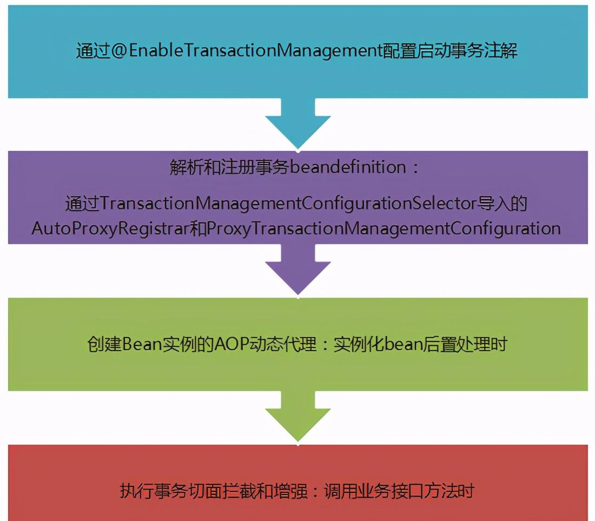

# spring事务

## 开启springboot事务支持


1. 在入口类使用注解@EnableTransactionManagement开启事务
2.  在访问数据库的service方法上添加注解@Transactional即可


## 流程图



#### TransactionManagementConfigurationSelector

``` java
public class TransactionManagementConfigurationSelector extends AdviceModeImportSelector<EnableTransactionManagement> {

	/**
	 * Returns {@link ProxyTransactionManagementConfiguration} or
	 * {@code AspectJ(Jta)TransactionManagementConfiguration} for {@code PROXY}
	 * and {@code ASPECTJ} values of {@link EnableTransactionManagement#mode()},
	 * respectively.
	 */
	@Override
	protected String[] selectImports(AdviceMode adviceMode) {
		switch (adviceMode) {
			case PROXY:
				return new String[] {AutoProxyRegistrar.class.getName(),
						ProxyTransactionManagementConfiguration.class.getName()};
			case ASPECTJ:
				return new String[] {determineTransactionAspectClass()};
			default:
				return null;
		}
	}

	private String determineTransactionAspectClass() {
		return (ClassUtils.isPresent("javax.transaction.Transactional", getClass().getClassLoader()) ?
				TransactionManagementConfigUtils.JTA_TRANSACTION_ASPECT_CONFIGURATION_CLASS_NAME :
				TransactionManagementConfigUtils.TRANSACTION_ASPECT_CONFIGURATION_CLASS_NAME);
	}

}
```

可以发现如果是PROXY 那么导入的是**AutoProxyRegistrar**和**ProxyTransactionManagementConfiguration**

如果是ASPECTJ那么就导入 **org.springframework.transaction.aspectj.AspectJJtaTransactionManagementConfiguration** 
和 **org.springframework.transaction.config.internalTransactionalEventListenerFactory**

返回去看**EnableTransactionManagement** 发现默认是**PROXY**

```java
@Target(ElementType.TYPE)
@Retention(RetentionPolicy.RUNTIME)
@Documented
@Import(TransactionManagementConfigurationSelector.class)
public @interface EnableTransactionManagement {

	/**
	 * Indicate whether subclass-based (CGLIB) proxies are to be created ({@code true}) as
	 * opposed to standard Java interface-based proxies ({@code false}). The default is
	 * {@code false}. <strong>Applicable only if {@link #mode()} is set to
	 * {@link AdviceMode#PROXY}</strong>.
	 * <p>Note that setting this attribute to {@code true} will affect <em>all</em>
	 * Spring-managed beans requiring proxying, not just those marked with
	 * {@code @Transactional}. For example, other beans marked with Spring's
	 * {@code @Async} annotation will be upgraded to subclass proxying at the same
	 * time. This approach has no negative impact in practice unless one is explicitly
	 * expecting one type of proxy vs another, e.g. in tests.
	 */
	boolean proxyTargetClass() default false;

	/**
	 * Indicate how transactional advice should be applied.
	 * <p><b>The default is {@link AdviceMode#PROXY}.</b>
	 * Please note that proxy mode allows for interception of calls through the proxy
	 * only. Local calls within the same class cannot get intercepted that way; an
	 * {@link Transactional} annotation on such a method within a local call will be
	 * ignored since Spring's interceptor does not even kick in for such a runtime
	 * scenario. For a more advanced mode of interception, consider switching this to
	 * {@link AdviceMode#ASPECTJ}.
	 */
	AdviceMode mode() default AdviceMode.PROXY;

	/**
	 * Indicate the ordering of the execution of the transaction advisor
	 * when multiple advices are applied at a specific joinpoint.
	 * <p>The default is {@link Ordered#LOWEST_PRECEDENCE}.
	 */
	int order() default Ordered.LOWEST_PRECEDENCE;

}

```


那么我们就继续看AutoProxyRegistrar和ProxyTransactionManagementConfiguration

#### AutoProxyRegistrar

负责依赖注入事务的相关属性配置和注入事务入口类（InfrastructureAdvisorAutoProxyCreator类）；

```java
public class AutoProxyRegistrar implements ImportBeanDefinitionRegistrar {

	private final Log logger = LogFactory.getLog(getClass());

	/**
	 * Register, escalate, and configure the standard auto proxy creator (APC) against the
	 * given registry. Works by finding the nearest annotation declared on the importing
	 * {@code @Configuration} class that has both {@code mode} and {@code proxyTargetClass}
	 * attributes. If {@code mode} is set to {@code PROXY}, the APC is registered; if
	 * {@code proxyTargetClass} is set to {@code true}, then the APC is forced to use
	 * subclass (CGLIB) proxying.
	 * <p>Several {@code @Enable*} annotations expose both {@code mode} and
	 * {@code proxyTargetClass} attributes. It is important to note that most of these
	 * capabilities end up sharing a {@linkplain AopConfigUtils#AUTO_PROXY_CREATOR_BEAN_NAME
	 * single APC}. For this reason, this implementation doesn't "care" exactly which
	 * annotation it finds -- as long as it exposes the right {@code mode} and
	 * {@code proxyTargetClass} attributes, the APC can be registered and configured all
	 * the same.
	 */
	@Override
	public void registerBeanDefinitions(AnnotationMetadata importingClassMetadata, BeanDefinitionRegistry registry) {
		boolean candidateFound = false;
		Set<String> annTypes = importingClassMetadata.getAnnotationTypes();
		for (String annType : annTypes) {
			AnnotationAttributes candidate = AnnotationConfigUtils.attributesFor(importingClassMetadata, annType);
			if (candidate == null) {
				continue;
			}
			Object mode = candidate.get("mode");
			Object proxyTargetClass = candidate.get("proxyTargetClass");
			if (mode != null && proxyTargetClass != null && AdviceMode.class == mode.getClass() &&
					Boolean.class == proxyTargetClass.getClass()) {
				candidateFound = true;
				if (mode == AdviceMode.PROXY) {
//注册事务AOP的入口类InfrastructureAdvisorAutoProxyCreator,实际上这个AOP入口类起不了作用
					AopConfigUtils.registerAutoProxyCreatorIfNecessary(registry);
					if ((Boolean) proxyTargetClass) {
						AopConfigUtils.forceAutoProxyCreatorToUseClassProxying(registry);
						return;
					}
				}
			}
		}
		if (!candidateFound && logger.isInfoEnabled()) {
			String name = getClass().getSimpleName();
			logger.info(String.format("%s was imported but no annotations were found " +
					"having both 'mode' and 'proxyTargetClass' attributes of type " +
					"AdviceMode and boolean respectively. This means that auto proxy " +
					"creator registration and configuration may not have occurred as " +
					"intended, and components may not be proxied as expected. Check to " +
					"ensure that %s has been @Import'ed on the same class where these " +
					"annotations are declared; otherwise remove the import of %s " +
					"altogether.", name, name, name));
		}
	}

}

```

#### ProxyTransactionManagementConfiguration

负责注入事务相关的Bean, 包括：

* 事务切面Bean(BeanFactoryTransactionAttributeSourceAdvisor)
* TransactionAttributeSource(事务配置属性bean)
* TransactionInterceptor（事务拦截器bean）；

```java
@Configuration(proxyBeanMethods = false)
@Role(BeanDefinition.ROLE_INFRASTRUCTURE)
public class ProxyTransactionManagementConfiguration extends AbstractTransactionManagementConfiguration {

   //明显是创建事务切面实例  BeanFactoryTransactionAttributeSourceAdvisor
	@Bean(name = TransactionManagementConfigUtils.TRANSACTION_ADVISOR_BEAN_NAME)
	@Role(BeanDefinition.ROLE_INFRASTRUCTURE)
	public BeanFactoryTransactionAttributeSourceAdvisor transactionAdvisor(
			TransactionAttributeSource transactionAttributeSource, TransactionInterceptor transactionInterceptor) {

		BeanFactoryTransactionAttributeSourceAdvisor advisor = new BeanFactoryTransactionAttributeSourceAdvisor();
		advisor.setTransactionAttributeSource(transactionAttributeSource);
		advisor.setAdvice(transactionInterceptor);
		if (this.enableTx != null) {
			advisor.setOrder(this.enableTx.<Integer>getNumber("order"));
		}
		return advisor;
	}

	@Bean
	@Role(BeanDefinition.ROLE_INFRASTRUCTURE)
	public TransactionAttributeSource transactionAttributeSource() {
		return new AnnotationTransactionAttributeSource();
	}


 创建事务advice TransactionInterceptor
	@Bean
	@Role(BeanDefinition.ROLE_INFRASTRUCTURE)
	public TransactionInterceptor transactionInterceptor(TransactionAttributeSource transactionAttributeSource) {
		TransactionInterceptor interceptor = new TransactionInterceptor();
		interceptor.setTransactionAttributeSource(transactionAttributeSource);
		if (this.txManager != null) {
			interceptor.setTransactionManager(this.txManager);
		}
		return interceptor;
	}

}

```

看到这就很清楚了，前者是注册AOP的入口类（这里注册的入口类依然是InfrastructureAdvisorAutoProxyCreator），
后者则是创建事务AOP的组件的实例到IOC中，到这里相信不仅仅是对于事务的零配置，而是整个SpringBoot的零配置实现原理都心中有数了。

###### TransactionInterceptor

```java
public class TransactionInterceptor extends TransactionAspectSupport implements MethodInterceptor, Serializable {

	/**
	 * Create a new TransactionInterceptor.
	 * <p>Transaction manager and transaction attributes still need to be set.
	 * @see #setTransactionManager
	 * @see #setTransactionAttributes(java.util.Properties)
	 * @see #setTransactionAttributeSource(TransactionAttributeSource)
	 */
	public TransactionInterceptor() {
	}

	/**
	 * Create a new TransactionInterceptor.
	 * @param ptm the default transaction manager to perform the actual transaction management
	 * @param tas the attribute source to be used to find transaction attributes
	 * @since 5.2.5
	 * @see #setTransactionManager
	 * @see #setTransactionAttributeSource
	 */
	public TransactionInterceptor(TransactionManager ptm, TransactionAttributeSource tas) {
		setTransactionManager(ptm);
		setTransactionAttributeSource(tas);
	}

	/**
	 * Create a new TransactionInterceptor.
	 * @param ptm the default transaction manager to perform the actual transaction management
	 * @param tas the attribute source to be used to find transaction attributes
	 * @see #setTransactionManager
	 * @see #setTransactionAttributeSource
	 * @deprecated as of 5.2.5, in favor of
	 * {@link #TransactionInterceptor(TransactionManager, TransactionAttributeSource)}
	 */
	@Deprecated
	public TransactionInterceptor(PlatformTransactionManager ptm, TransactionAttributeSource tas) {
		setTransactionManager(ptm);
		setTransactionAttributeSource(tas);
	}

	/**
	 * Create a new TransactionInterceptor.
	 * @param ptm the default transaction manager to perform the actual transaction management
	 * @param attributes the transaction attributes in properties format
	 * @see #setTransactionManager
	 * @see #setTransactionAttributes(java.util.Properties)
	 * @deprecated as of 5.2.5, in favor of {@link #setTransactionAttributes(Properties)}
	 */
	@Deprecated
	public TransactionInterceptor(PlatformTransactionManager ptm, Properties attributes) {
		setTransactionManager(ptm);
		setTransactionAttributes(attributes);
	}


	@Override
	@Nullable
	public Object invoke(MethodInvocation invocation) throws Throwable {
		// Work out the target class: may be {@code null}.
		// The TransactionAttributeSource should be passed the target class
		// as well as the method, which may be from an interface.
		Class<?> targetClass = (invocation.getThis() != null ? AopUtils.getTargetClass(invocation.getThis()) : null);

		// Adapt to TransactionAspectSupport's invokeWithinTransaction...
		return invokeWithinTransaction(invocation.getMethod(), targetClass, invocation::proceed);
	}


	//---------------------------------------------------------------------
	// Serialization support
	//---------------------------------------------------------------------

	private void writeObject(ObjectOutputStream oos) throws IOException {
		// Rely on default serialization, although this class itself doesn't carry state anyway...
		oos.defaultWriteObject();

		// Deserialize superclass fields.
		oos.writeObject(getTransactionManagerBeanName());
		oos.writeObject(getTransactionManager());
		oos.writeObject(getTransactionAttributeSource());
		oos.writeObject(getBeanFactory());
	}

	private void readObject(ObjectInputStream ois) throws IOException, ClassNotFoundException {
		// Rely on default serialization, although this class itself doesn't carry state anyway...
		ois.defaultReadObject();

		// Serialize all relevant superclass fields.
		// Superclass can't implement Serializable because it also serves as base class
		// for AspectJ aspects (which are not allowed to implement Serializable)!
		setTransactionManagerBeanName((String) ois.readObject());
		setTransactionManager((PlatformTransactionManager) ois.readObject());
		setTransactionAttributeSource((TransactionAttributeSource) ois.readObject());
		setBeanFactory((BeanFactory) ois.readObject());
	}

}

```

TransactionInterceptor实现了MethodInterceptor；代理的入口及invoke 方法

```java
	@Override
	@Nullable
	public Object invoke(MethodInvocation invocation) throws Throwable {
		// Work out the target class: may be {@code null}.
		// The TransactionAttributeSource should be passed the target class
		// as well as the method, which may be from an interface.
		Class<?> targetClass = (invocation.getThis() != null ? AopUtils.getTargetClass(invocation.getThis()) : null);

		// Adapt to TransactionAspectSupport's invokeWithinTransaction...
		return invokeWithinTransaction(invocation.getMethod(), targetClass, invocation::proceed);
	}
```

这个方法本身没做什么事，主要是调用了父类的invokeWithinTransaction方法，注意最后一个参数，传入的是一个lambda表达式，而这个表达式中的调用的方法应该不陌生，
在分析AOP调用链时，就是通过这个方法传递到下一个切面或是调用被代理实例的方法，忘记了的可以回去看看。

#### TransactionAspectSupport#invokeWithinTransaction

```java
	@Nullable
	protected Object invokeWithinTransaction(Method method, @Nullable Class<?> targetClass,
			final InvocationCallback invocation) throws Throwable {

		// If the transaction attribute is null, the method is non-transactional.
//获取事务属性类 AnnotationTransactionAttributeSource
		TransactionAttributeSource tas = getTransactionAttributeSource();
//获取方法上面有@Transactional注解的属性
		final TransactionAttribute txAttr = (tas != null ? tas.getTransactionAttribute(method, targetClass) : null);
		final TransactionManager tm = determineTransactionManager(txAttr);

//获取事务管理器
		if (this.reactiveAdapterRegistry != null && tm instanceof ReactiveTransactionManager) {
			ReactiveTransactionSupport txSupport = this.transactionSupportCache.computeIfAbsent(method, key -> {
				if (KotlinDetector.isKotlinType(method.getDeclaringClass()) && KotlinDelegate.isSuspend(method)) {
					throw new TransactionUsageException(
							"Unsupported annotated transaction on suspending function detected: " + method +
							". Use TransactionalOperator.transactional extensions instead.");
				}
				ReactiveAdapter adapter = this.reactiveAdapterRegistry.getAdapter(method.getReturnType());
				if (adapter == null) {
					throw new IllegalStateException("Cannot apply reactive transaction to non-reactive return type: " +
							method.getReturnType());
				}
				return new ReactiveTransactionSupport(adapter);
			});
			return txSupport.invokeWithinTransaction(
					method, targetClass, invocation, txAttr, (ReactiveTransactionManager) tm);
		}

		PlatformTransactionManager ptm = asPlatformTransactionManager(tm);
		final String joinpointIdentification = methodIdentification(method, targetClass, txAttr);

		if (txAttr == null || !(ptm instanceof CallbackPreferringPlatformTransactionManager)) {
			// Standard transaction demarcation with getTransaction and commit/rollback calls.
			TransactionInfo txInfo = createTransactionIfNecessary(ptm, txAttr, joinpointIdentification);

			Object retVal;
			try {
				// This is an around advice: Invoke the next interceptor in the chain.
				// This will normally result in a target object being invoked.
// 调用proceed方法
				retVal = invocation.proceedWithInvocation();
			}
			catch (Throwable ex) {
				// target invocation exception
//事务回滚
				completeTransactionAfterThrowing(txInfo, ex);
				throw ex;
			}
			finally {
				cleanupTransactionInfo(txInfo);
			}

			if (retVal != null && vavrPresent && VavrDelegate.isVavrTry(retVal)) {
				// Set rollback-only in case of Vavr failure matching our rollback rules...
				TransactionStatus status = txInfo.getTransactionStatus();
				if (status != null && txAttr != null) {
					retVal = VavrDelegate.evaluateTryFailure(retVal, txAttr, status);
				}
			}
//事务提交
			commitTransactionAfterReturning(txInfo);
			return retVal;
		}

		else {
			Object result;
			final ThrowableHolder throwableHolder = new ThrowableHolder();

			// It's a CallbackPreferringPlatformTransactionManager: pass a TransactionCallback in.
			try {
				result = ((CallbackPreferringPlatformTransactionManager) ptm).execute(txAttr, status -> {
					TransactionInfo txInfo = prepareTransactionInfo(ptm, txAttr, joinpointIdentification, status);
					try {
						Object retVal = invocation.proceedWithInvocation();
						if (retVal != null && vavrPresent && VavrDelegate.isVavrTry(retVal)) {
							// Set rollback-only in case of Vavr failure matching our rollback rules...
							retVal = VavrDelegate.evaluateTryFailure(retVal, txAttr, status);
						}
						return retVal;
					}
					catch (Throwable ex) {
						if (txAttr.rollbackOn(ex)) {
							// A RuntimeException: will lead to a rollback.
							if (ex instanceof RuntimeException) {
								throw (RuntimeException) ex;
							}
							else {
								throw new ThrowableHolderException(ex);
							}
						}
						else {
							// A normal return value: will lead to a commit.
							throwableHolder.throwable = ex;
							return null;
						}
					}
					finally {
						cleanupTransactionInfo(txInfo);
					}
				});
			}
			catch (ThrowableHolderException ex) {
				throw ex.getCause();
			}
			catch (TransactionSystemException ex2) {
				if (throwableHolder.throwable != null) {
					logger.error("Application exception overridden by commit exception", throwableHolder.throwable);
					ex2.initApplicationException(throwableHolder.throwable);
				}
				throw ex2;
			}
			catch (Throwable ex2) {
				if (throwableHolder.throwable != null) {
					logger.error("Application exception overridden by commit exception", throwableHolder.throwable);
				}
				throw ex2;
			}

			// Check result state: It might indicate a Throwable to rethrow.
			if (throwableHolder.throwable != null) {
				throw throwableHolder.throwable;
			}
			return result;
		}
	}
```

这个方法逻辑很清晰，一目了然，if里面就是对声明式事务的处理，先调用createTransactionIfNecessary方法开启事务，然后通过invocation.proceedWithInvocation调用下一个切面，
如果没有其它切面了，就是调用被代理类的方法，出现异常就回滚，否则提交事务，这就是Spring事务切面的执行过程。但是，我们主要要搞懂的就是在这些方法中是如何管理事务以及事务在多个方法之间是如何传播的。

