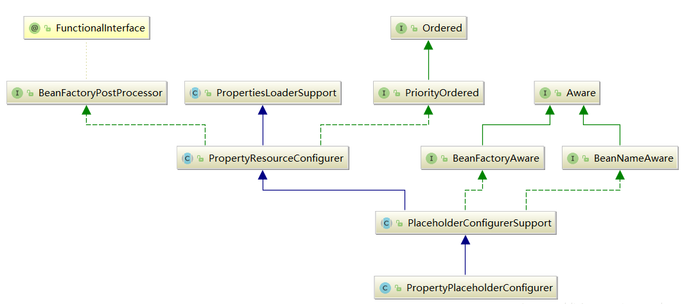

# ApplicationContext容器refresh过程

又回到这里

```java
public void refresh() throws BeansException, IllegalStateException {
    synchronized (this.startupShutdownMonitor) {
        //准备刷新的上下文 环境  
        prepareRefresh();
        //初始化BeanFactory，并进行XML文件读取  
        /* 
         * ClassPathXMLApplicationContext包含着BeanFactory所提供的一切特征，在这一步骤中将会复用 
         * BeanFactory中的配置文件读取解析及其他功能，这一步之后，ClassPathXmlApplicationContext 
         * 实际上就已经包含了BeanFactory所提供的功能，也就是可以进行Bean的提取等基础操作了。 
         */  
        ConfigurableListableBeanFactory beanFactory = obtainFreshBeanFactory();
        //对beanFactory进行各种功能填充  
        prepareBeanFactory(beanFactory);
        try {
            //子类覆盖方法做额外处理  
            /* 
             * Spring之所以强大，为世人所推崇，除了它功能上为大家提供了便利外，还有一方面是它的 
             * 完美架构，开放式的架构让使用它的程序员很容易根据业务需要扩展已经存在的功能。这种开放式 
             * 的设计在Spring中随处可见，例如在本例中就提供了一个空的函数实现postProcessBeanFactory来 
             * 方便程序猿在业务上做进一步扩展 
             */ 
            postProcessBeanFactory(beanFactory);
            //激活各种beanFactory处理器  
            invokeBeanFactoryPostProcessors(beanFactory);
            //注册拦截Bean创建的Bean处理器，这里只是注册，真正的调用实在getBean时候 
            registerBeanPostProcessors(beanFactory);
            //为上下文初始化Message源，即不同语言的消息体，国际化处理  
            initMessageSource();
            //初始化应用消息广播器，并放入“applicationEventMulticaster”bean中  
            initApplicationEventMulticaster();
            //留给子类来初始化其它的Bean  
            onRefresh();
            //在所有注册的bean中查找Listener bean，注册到消息广播器中  
            registerListeners();
            //初始化剩下的单实例（非惰性的）  
            finishBeanFactoryInitialization(beanFactory);
            //完成刷新过程，通知生命周期处理器lifecycleProcessor刷新过程，同时发出ContextRefreshEvent通知别人  
            finishRefresh();
        }
        catch (BeansException ex) {
            if (logger.isWarnEnabled()) {
                logger.warn("Exception encountered during context initialization - " +
                        "cancelling refresh attempt: " + ex);
            }
            destroyBeans();
            cancelRefresh(ex);
            throw ex;
        }
        finally {
            resetCommonCaches();
        }
    }
}
```

我们简单的分析下代码的步骤：
1. 初始化前的准备工作，例如对系统属性或者环境变量进行准备及验证。在某种情况下项目的使用需要读取某些系统变量，而这个变量的设置很可能会影响着系统的正确性，那么ClassPathXmlApplicationContext为我们提供的这个准备函数就显得非常必要，他可以在spring启动的时候提前对必须的环境变量进行存在性验证。
2. 初始化BeanFactory，并进行XML文件读取。之前提到ClassPathXmlApplicationContext包含着对BeanFactory所提供的一切特征，那么这一步中将会复用BeanFactory中的配置文件读取解析其他功能，这一步之后ClassPathXmlApplicationContext实际上就已经包含了BeanFactory所提供的功能，也就是可以进行Bean的提取等基本操作了。
3. 对BeanFactory进行各种功能填充@Qualifier和@Autowired应该是大家非常熟悉的注解了，那么这两个注解正是在这一步骤中增加支持的。
4. 子类覆盖方法做额外处理。spring之所以强大，为世人所推崇，除了它功能上为大家提供了遍历外，还有一方面是它完美的架构，开放式的架构让使用它的程序员很容易根据业务需要扩展已经存在的功能。这种开放式的设计在spring中随处可见，例如本利中就提供了一个空的函数实现postProcessBeanFactory来方便程序员在业务上做进一步的扩展。
5. 激活各种BeanFactory处理器
6. 注册拦截bean创建的bean处理器，这里只是注册，真正的调用是在getBean时候
7. 为上下文初始化Message源，及对不同语言的小西天进行国际化处理
8. 初始化应用消息广播器，并放入“applicationEventMulticaster”bean中
9. 留给子类来初始化其他的bean
10. 在所有注册的bean中查找listener bean，注册到消息广播器中
11. 初始化剩下的单实例（非惰性的）
12. 完成刷新过程，通知生命周期处理器lifecycleProcessor刷新过程，同时发出ContextRefreshEvent通知别人。

接下来我们就详细的讲解每一个过程

## prepareRefresh刷新上下文的准备工作

```java
/**
 * 准备刷新上下文环境，设置它的启动日期和活动标志，以及执行任何属性源的初始化。
 * Prepare this context for refreshing, setting its startup date and
 * active flag as well as performing any initialization of property sources.
 */
protected void prepareRefresh() {
    this.startupDate = System.currentTimeMillis();
    this.closed.set(false);
    this.active.set(true);

    // 在上下文环境中初始化任何占位符属性源。(空的方法,留给子类覆盖)
    initPropertySources();

    // 验证需要的属性文件是否都已放入环境中
    getEnvironment().validateRequiredProperties();

    // 允许收集早期的应用程序事件，一旦有了多播器，就可以发布……
    this.earlyApplicationEvents = new LinkedHashSet<>();
}
```

## obtainFreshBeanFactory->读取xml并初始化BeanFactory

前面文章有详细讲解

## 功能扩展

如上图所示prepareBeanFactory(beanFactory)就是在功能上扩展的方法，而在进入这个方法前spring已经完成了对配置的解析，接下来我们详细分析下次函数，进入方法体：

```java
protected void prepareBeanFactory(ConfigurableListableBeanFactory beanFactory) {
    // Tell the internal bean factory to use the context's class loader etc.
    //设置beanFactory的classLoader为当前context的classloader  
    beanFactory.setBeanClassLoader(getClassLoader());
    //设置beanFactory的表达式语言处理器，Spring3增加了表达式语言的支持，  
    //默认可以使用#{bean.xxx}的形式来调用相关属性值  
    beanFactory.setBeanExpressionResolver(new StandardBeanExpressionResolver(beanFactory.getBeanClassLoader()));
    //为beanFactory增加了一个的propertyEditor，这个主要是对bean的属性等设置管理的一个工具
    beanFactory.addPropertyEditorRegistrar(new ResourceEditorRegistrar(this, getEnvironment()));

    // Configure the bean factory with context callbacks.
    beanFactory.addBeanPostProcessor(new ApplicationContextAwareProcessor(this));
    //设置了几个忽略自动装配的接口
    beanFactory.ignoreDependencyInterface(EnvironmentAware.class);
    beanFactory.ignoreDependencyInterface(EmbeddedValueResolverAware.class);
    beanFactory.ignoreDependencyInterface(ResourceLoaderAware.class);
    beanFactory.ignoreDependencyInterface(ApplicationEventPublisherAware.class);
    beanFactory.ignoreDependencyInterface(MessageSourceAware.class);
    beanFactory.ignoreDependencyInterface(ApplicationContextAware.class);

    // BeanFactory interface not registered as resolvable type in a plain factory.
    // MessageSource registered (and found for autowiring) as a bean.
    //设置了几个自动装配的特殊规则
    beanFactory.registerResolvableDependency(BeanFactory.class, beanFactory);
    beanFactory.registerResolvableDependency(ResourceLoader.class, this);
    beanFactory.registerResolvableDependency(ApplicationEventPublisher.class, this);
    beanFactory.registerResolvableDependency(ApplicationContext.class, this);

    // Register early post-processor for detecting inner beans as ApplicationListeners.
    beanFactory.addBeanPostProcessor(new ApplicationListenerDetector(this));

    // Detect a LoadTimeWeaver and prepare for weaving, if found.
    //增加对AspectJ的支持 
    if (beanFactory.containsBean(LOAD_TIME_WEAVER_BEAN_NAME)) {
        beanFactory.addBeanPostProcessor(new LoadTimeWeaverAwareProcessor(beanFactory));
        // Set a temporary ClassLoader for type matching.
        beanFactory.setTempClassLoader(new ContextTypeMatchClassLoader(beanFactory.getBeanClassLoader()));
    }

    // Register default environment beans.
    //添加默认的系统环境bean  
    if (!beanFactory.containsLocalBean(ENVIRONMENT_BEAN_NAME)) {
        beanFactory.registerSingleton(ENVIRONMENT_BEAN_NAME, getEnvironment());
    }
    if (!beanFactory.containsLocalBean(SYSTEM_PROPERTIES_BEAN_NAME)) {
        beanFactory.registerSingleton(SYSTEM_PROPERTIES_BEAN_NAME, getEnvironment().getSystemProperties());
    }
    if (!beanFactory.containsLocalBean(SYSTEM_ENVIRONMENT_BEAN_NAME)) {
        beanFactory.registerSingleton(SYSTEM_ENVIRONMENT_BEAN_NAME, getEnvironment().getSystemEnvironment());
    }
}
```

详细分析下代码发现上面函数主要是在以下方法进行了扩展：
1. 对SPEL语言的支持
2. 增加对属性编辑器的支持
3. 增加对一些内置类的支持，如EnvironmentAware、MessageSourceAware的注入
4. 设置了依赖功能可忽略的接口
5. 注册一些固定依赖的属性
6. 增加了AspectJ的支持
7. 将相关环境变量及属性以单例模式注册 

#### 增加对SPEL语言的支持

Spring表达式语言全称为“Spring Expression Language”，缩写为“SpEL”，类似于Struts 2x中使用的OGNL语言，SpEL是单独模块，只依赖于core模块，不依赖于其他模块，可以单独使用。
SpEL使用#{…}作为定界符，所有在大框号中的字符都将被认为是SpEL，使用格式如下：

```java
<util:properties id="database" location="classpath:db.properties">  
</util:properties>  
<bean id="dbcp" class="org.apache.commons.dbcp.BasicDataSource">  
  <property name="username" value="#{database.user}"></property>  
  <property name="password" value="#{database.pwd}"></property>  
  <property name="driverClassName" value="#{database.driver}"></property>  
  <property name="url" value="#{database.url}"></property>  
</bean>
```

上面只是列举了其中最简单的使用方式，SpEL功能非常强大，使用好可以大大提高开发效率。在源码中通过代码beanFactory.setBeanExpressionResolver(new StandardBeanExpressionResolver())，注册语言解析器，就可以对SpEL进行解析了，那么之后是在什么地方调用这个解析器的呢？
之前说beanFactory中说过Spring在bean进行初始化的时候会有属性填充的一步，而在这一步中Spring会调用AbstractAutowireCapabelBeanFactory类的applyPropertyValues来进行属性值得解析。同时这个步骤中一般通过AbstractBeanFactory中的evaluateBeanDefinitionString方法进行SpEL解析，方法代码如下：

```java
protected Object evaluateBeanDefinitionString(String value, BeanDefinition beanDefinition) {  
    if (this.beanExpressionResolver == null) {  
        return value;  
    }  
    Scope scope = (beanDefinition != null ? getRegisteredScope(beanDefinition.getScope()) : null);  
    return this.beanExpressionResolver.evaluate(value, new BeanExpressionContext(this, scope));  
}
```

## BeanFactory的后处理

BeanFactory作为spring中容器功能的基础，用于存放所有已经加载的bean，为例保证程序上的高可扩展性，spring针对BeanFactory做了大量的扩展，比如我们熟悉的PostProcessor就是在这里实现的。接下来我们就深入分析下BeanFactory后处理

#### 激活注册的BeanFactoryPostProcessor

在正式介绍BeanFactoryPostProcessor的后处理前我们先简单的了解下其用法，BeanFactoryPostProcessor接口跟BeanPostProcessor类似，都可以对bean的定义（配置元数据）进行处理，也就是说spring IoC容器允许BeanFactoryPostProcessor在容器实际实例化任何其他的bean之前读取配置元数据，并可能修改他。也可以配置多个BeanFactoryPostProcessor，可以通过order属性来控制BeanFactoryPostProcessor的执行顺序（此属性必须当BeanFactoryPostProcessor实现了Ordered的接口时才可以赊账，因此在实现BeanFactoryPostProcessor时应该考虑实现Ordered接口）。
如果想改变世纪的bean实例（例如从配置元数据创建的对象），那最好使用BeanPostProcessor。同样的BeanFactoryPostProcessor的作用域范围是容器级别的，它只是和你所使用的容器有关。如果你在容器中定义了一个BeanFactoryPostProcessor，它仅仅对此容器中的bean进行后置处理。BeanFactoryPostProcessor不会对定义在另一个容器中的bean进行后置处理，即使这两个容器都在同一层次上。在spring中存在对于BeanFactoryPostProcessor的典型应用，如PropertyPlaceholderConfigurer。

#### BeanFactoryPostProcessor的典型应用：PropertyPlaceholderConfigurer
```java
<bean id="userHandler" class="org.springframework.beans.factory.config.PropertyPlaceholderConfigurer">
    <property name="locations">
        <list>
            <value>classpath:bean.properties</value>
        </list>
    </property>
</bean>
```
在这个bean中指定了配置文件的位置。其实还是有个问题，这个userHandler只不过是spring框架管理的一个bean，并没有被别的bean或者对象引用，spring的beanFactory是怎么知道这个需要从这个bean中获取配置信息呢？我们看下PropertyPlaceholderConfigurer这个类的层次结构，如下图： 



从上图中我们可以看到PropertyPlaceholderConfigurer间接的继承了BeanFactoryPostProcessor接口，这是一个很特别的接口，当spring加载任何实现了这个接口的bean的配置时，都会在bean工厂载入所有bean的配置之后执行postProcessBeanFactory方法。在PropertyResourceConfigurer类中实现了postProcessBeanFactory方法，在方法中先后调用了mergeProperties、convertProperties、processProperties这三个方法，分别得到配置，将得到的配置转换为合适的类型，最后将配置内容告知BeanFactory。
正是通过实现BeanFactoryPostProcessor接口，BeanFactory会在实例化任何bean之前获得配置信息，从而能够正确的解析bean描述文件中的变量引用。

```java
public void postProcessBeanFactory(ConfigurableListableBeanFactory beanFactory) throws BeansException {
    try {
        Properties mergedProps = this.mergeProperties();
        this.convertProperties(mergedProps);
        this.processProperties(beanFactory, mergedProps);
    } catch (IOException var3) {
        throw new BeanInitializationException("Could not load properties", var3);
    }
}
```

#### 自定义BeanFactoryPostProcessor

编写实现了BeanFactoryPostProcessor接口的MyBeanFactoryPostProcessor的容器后处理器，如下代码：

```java
public class MyBeanFactoryPostProcessor implements BeanFactoryPostProcessor {
    public void postProcessBeanFactory(ConfigurableListableBeanFactory beanFactory) throws BeansException {
        System.out.println("对容器进行后处理。。。。");
    }
}
```

然后在配置文件中注册这个bean，如下：
```java
<bean id="myPost" class="com.yhl.myspring.demo.applicationcontext.MyBeanFactoryPostProcessor"></bean>
```
最后编写测试代码：
```java
public class Test {
    public static void main(String[] args) {
        ApplicationContext context = new ClassPathXmlApplicationContext("applicationContext.xml");

        User user = (User)context.getBean("user");
        System.out.println(user.getName());

    }
}
```
## 激活BeanFactoryPostProcessor(invokeBeanFactoryPostProcessors)

在了解BeanFactoryPostProcessor的用法后我们便可以深入的研究BeanFactoryPostProcessor的调用过程了，其是在方法invokeBeanFactoryPostProcessors(beanFactory)中实现的，进入到方法内部：
```java
	/**
	 * Instantiate and invoke all registered BeanFactoryPostProcessor beans,
	 * respecting explicit order if given.
	 * <p>Must be called before singleton instantiation.
	 */
	protected void invokeBeanFactoryPostProcessors(ConfigurableListableBeanFactory beanFactory) {

        // 1.getBeanFactoryPostProcessors(): 拿到当前应用上下文beanFactoryPostProcessors变量中的值
          // 2.invokeBeanFactoryPostProcessors: 实例化并调用所有已注册的BeanFactoryPostProcessor
		PostProcessorRegistrationDelegate.invokeBeanFactoryPostProcessors(beanFactory, getBeanFactoryPostProcessors());

		// Detect a LoadTimeWeaver and prepare for weaving, if found in the meantime
		// (e.g. through an @Bean method registered by ConfigurationClassPostProcessor)
		if (beanFactory.getTempClassLoader() == null && beanFactory.containsBean(LOAD_TIME_WEAVER_BEAN_NAME)) {
			beanFactory.addBeanPostProcessor(new LoadTimeWeaverAwareProcessor(beanFactory));
			beanFactory.setTempClassLoader(new ContextTypeMatchClassLoader(beanFactory.getBeanClassLoader()));
		}
	}
```

#### getBeanFactoryPostProcessors


​	
``` java

	/**
	 * Return the list of BeanFactoryPostProcessors that will get applied
	 * to the internal BeanFactory.
	 */
	public List<BeanFactoryPostProcessor> getBeanFactoryPostProcessors() {
		return this.beanFactoryPostProcessors;
	}
```
这边 getBeanFactoryPostProcessors() 会拿到当前应用上下文中已经注册的 BeanFactoryPostProcessor，在默认情况下，this.beanFactoryPostProcessors 是返回空的。

但是在SpringApplication.prepareContext()中会有一个添加,而且prepareContext比refresh()先执行

```java
//1
applyInitializers(context);

//2
		if (this.lazyInitialization) {
			context.addBeanFactoryPostProcessor(new LazyInitializationBeanFactoryPostProcessor());
		}
```

如何添加自定义 BeanFactoryPostProcessor 到 this.beanFactoryPostProcessors 变量中了？

深入进入上面方法applyInitializers(context)中，最后会进入ApplicationContextInitializer<C extends ConfigurableApplicationContext> 接口中。接口说明如下

    用于在刷新之前初始化Spring ConfigurableApplicationContext。
    通常在需要对应用程序上下文进行一些编程初始化的Web应用程序中使用。 例如，注册属性源或针对上下文环境激活配置文件。 请参见ContextLoader和FrameworkServlet支持，分别声明“ contextInitializerClasses”上下文参数和init参数。
    鼓励ApplicationContextInitializer处理器检测是否已实现Spring的Ordered接口或是否存在@Order注释，并在调用之前对实例进行相应的排序。

在这就可以通过实现ApplicationContextInitializer来添加BeanFactoryPostProcessor。

``` java

@Component
public class UserService {

}

@Component
public class UserExtService {

}

@Component
public class UserServiceBeanFactoryPostProcessor implements BeanFactoryPostProcessor {

    @Override
    public void postProcessBeanFactory(ConfigurableListableBeanFactory beanFactory) throws BeansException {

        BeanDefinition userServiceBeanDefinition = beanFactory.getBeanDefinition("userService");

        userServiceBeanDefinition.setBeanClassName("userExtService");

    }
}

public class UserServiceInit implements ApplicationContextInitializer<ConfigurableApplicationContext> {

    @Override
    public void initialize(ConfigurableApplicationContext applicationContext) {
        UserServiceBeanFactoryPostProcessor firstBeanDefinitionRegistryPostProcessor = new UserServiceBeanFactoryPostProcessor();
        // 将自定义的firstBeanDefinitionRegistryPostProcessor添加到应用上下文中
        applicationContext.addBeanFactoryPostProcessor(firstBeanDefinitionRegistryPostProcessor);
        // ...自定义操作
        System.out.println("SpringApplicationContextInitializer#initialize");
    }
}


@SpringBootApplication
public class Application {

    public static void main(String[] args) {

        ConfigurableApplicationContext context = new SpringApplicationBuilder(Application.class)
                .initializers(new UserServiceInit())
                .run(args);
    }
}
```


``` java

```

``` java

```
#### invokeBeanFactoryPostProcessors

```java
public static void invokeBeanFactoryPostProcessors(ConfigurableListableBeanFactory beanFactory, List<BeanFactoryPostProcessor> beanFactoryPostProcessors) {

    // Invoke BeanDefinitionRegistryPostProcessors first, if any.
    // 1、首先调用BeanDefinitionRegistryPostProcessors
    Set<String> processedBeans = new HashSet<>();

    // 1.判断beanFactory是否为BeanDefinitionRegistry，beanFactory为DefaultListableBeanFactory,而DefaultListableBeanFactory实现了BeanDefinitionRegistry接口，因此这边为true
    if (beanFactory instanceof BeanDefinitionRegistry) {
        BeanDefinitionRegistry registry = (BeanDefinitionRegistry) beanFactory;
        // 定义BeanFactoryPostProcessor 用于存放普通的BeanFactoryPostProcessor
        List<BeanFactoryPostProcessor> regularPostProcessors = new ArrayList<>();
        // 定义BeanDefinitionRegistryPostProcessor集合 用于存放BeanDefinitionRegistryPostProcessor
        List<BeanDefinitionRegistryPostProcessor> registryProcessors = new ArrayList<>();

        // 循环手动注册的beanFactoryPostProcessors，将BeanDefinitionRegistryPostProcessor和普通BeanFactoryPostProcessor区分开
        for (BeanFactoryPostProcessor postProcessor : beanFactoryPostProcessors) {
            // 如果是BeanDefinitionRegistryPostProcessor的实例话,则调用其postProcessBeanDefinitionRegistry方法,对bean进行注册操作
            if (postProcessor instanceof BeanDefinitionRegistryPostProcessor) {
                // 如果是BeanDefinitionRegistryPostProcessor类型,则直接调用其postProcessBeanDefinitionRegistry
                BeanDefinitionRegistryPostProcessor registryProcessor = (BeanDefinitionRegistryPostProcessor) postProcessor;
                registryProcessor.postProcessBeanDefinitionRegistry(registry);
                registryProcessors.add(registryProcessor);
            }
            else {
                 // 否则则将其当做普通的BeanFactoryPostProcessor处理,直接加入regularPostProcessors集合,以备后续处理
                regularPostProcessors.add(postProcessor);
            }
        }

        // Do not initialize FactoryBeans here: We need to leave all regular beans
        // uninitialized to let the bean factory post-processors apply to them!
        // Separate between BeanDefinitionRegistryPostProcessors that implement
        // PriorityOrdered, Ordered, and the rest.
        // 用于保存本次要执行的BeanDefinitionRegistryPostProcesso
        List<BeanDefinitionRegistryPostProcessor> currentRegistryProcessors = new ArrayList<>();

        // First, invoke the BeanDefinitionRegistryPostProcessors that implement PriorityOrdered.
        // 首先调用实现了PriorityOrdered(有限排序接口)的BeanDefinitionRegistryPostProcessors，找出所有实现BeanDefinitionRegistryPostProcessor接口的Bean的beanName
        String[] postProcessorNames = beanFactory.getBeanNamesForType(BeanDefinitionRegistryPostProcessor.class, true, false);
        for (String ppName : postProcessorNames) {
            if (beanFactory.isTypeMatch(ppName, PriorityOrdered.class)) {
                 //  获取ppName对应的bean实例, 添加到currentRegistryProcessors中
                currentRegistryProcessors.add(beanFactory.getBean(ppName, BeanDefinitionRegistryPostProcessor.class));
                // 将要被执行的加入processedBeans，避免后续重复执行
                processedBeans.add(ppName);
            }
        }
        // 排序
        sortPostProcessors(currentRegistryProcessors, beanFactory);
        // 加入registryProcessors集合
        registryProcessors.addAll(currentRegistryProcessors);
        // 调用所有实现了PriorityOrdered的的BeanDefinitionRegistryPostProcessors的postProcessBeanDefinitionRegistry方法,注册bean
        invokeBeanDefinitionRegistryPostProcessors(currentRegistryProcessors, registry);
        // 清空currentRegistryProcessors,以备下次使用
        currentRegistryProcessors.clear();

        // Next, invoke the BeanDefinitionRegistryPostProcessors that implement Ordered.
        // 其次,调用实现了Ordered(普通排序接口)的BeanDefinitionRegistryPostProcessors
        postProcessorNames = beanFactory.getBeanNamesForType(BeanDefinitionRegistryPostProcessor.class, true, false);
        for (String ppName : postProcessorNames) {
            if (!processedBeans.contains(ppName) && beanFactory.isTypeMatch(ppName, Ordered.class)) {
                currentRegistryProcessors.add(beanFactory.getBean(ppName, BeanDefinitionRegistryPostProcessor.class));
                processedBeans.add(ppName);
            }
        }
        // 排序
        sortPostProcessors(currentRegistryProcessors, beanFactory);
        // 加入registryProcessors集合
        registryProcessors.addAll(currentRegistryProcessors);
        // 调用所有实现了PriorityOrdered的的BeanDefinitionRegistryPostProcessors的postProcessBeanDefinitionRegistry方法,注册bean
        invokeBeanDefinitionRegistryPostProcessors(currentRegistryProcessors, registry);
        // 清空currentRegistryProcessors,以备下次使用
        currentRegistryProcessors.clear();

        // Finally, invoke all other BeanDefinitionRegistryPostProcessors until no further ones appear.
        // 最后,调用其他的BeanDefinitionRegistryPostProcessors
        boolean reiterate = true;
        while (reiterate) {
            reiterate = false;
            postProcessorNames = beanFactory.getBeanNamesForType(BeanDefinitionRegistryPostProcessor.class, true, false);
            for (String ppName : postProcessorNames) {
                if (!processedBeans.contains(ppName)) {
                    currentRegistryProcessors.add(beanFactory.getBean(ppName, BeanDefinitionRegistryPostProcessor.class));
                    processedBeans.add(ppName);
                    reiterate = true;
                }
            }
            // 排序
            sortPostProcessors(currentRegistryProcessors, beanFactory);
            // 加入registryProcessors集合
            registryProcessors.addAll(currentRegistryProcessors);
            // 调用其他的BeanDefinitionRegistryPostProcessors的postProcessBeanDefinitionRegistry方法,注册bean
            invokeBeanDefinitionRegistryPostProcessors(currentRegistryProcessors, registry);
            // 清空currentRegistryProcessors,以备下次使用
            currentRegistryProcessors.clear();
        }

        // Now, invoke the postProcessBeanFactory callback of all processors handled so far.
        // 调用所有BeanDefinitionRegistryPostProcessor(包括手动注册和通过配置文件注册)
        // 和BeanFactoryPostProcessor(只有手动注册)的回调函数-->postProcessBeanFactory
        invokeBeanFactoryPostProcessors(registryProcessors, beanFactory);
        invokeBeanFactoryPostProcessors(regularPostProcessors, beanFactory);
    }

    // 2、如果不是BeanDefinitionRegistry的实例,那么直接调用其回调函数即可-->postProcessBeanFactory
    else {
        // Invoke factory processors registered with the context instance.
        invokeBeanFactoryPostProcessors(beanFactoryPostProcessors, beanFactory);
    }

    // Do not initialize FactoryBeans here: We need to leave all regular beans
    // uninitialized to let the bean factory post-processors apply to them!
    // 3、上面的代码已经处理完了所有的BeanDefinitionRegistryPostProcessors和手动注册的BeanFactoryPostProcessor
    // 接下来要处理通过配置文件注册的BeanFactoryPostProcessor
    // 首先获取所有的BeanFactoryPostProcessor(注意:这里获取的集合会包含BeanDefinitionRegistryPostProcessors)
    String[] postProcessorNames = beanFactory.getBeanNamesForType(BeanFactoryPostProcessor.class, true, false);

    // Separate between BeanFactoryPostProcessors that implement PriorityOrdered, Ordered, and the rest.
    // 这里,将实现了PriorityOrdered,Ordered的处理器和其他的处理器区分开来,分别进行处理
    // PriorityOrdered有序处理器
    List<BeanFactoryPostProcessor> priorityOrderedPostProcessors = new ArrayList<>();
    // Ordered有序处理器
    List<String> orderedPostProcessorNames = new ArrayList<>();
    // 无序处理器
    List<String> nonOrderedPostProcessorNames = new ArrayList<>();
    for (String ppName : postProcessorNames) {
        // 判断processedBeans是否包含当前处理器(processedBeans中的处理器已经被处理过);如果包含,则不做任何处理
        if (processedBeans.contains(ppName)) {
            // skip - already processed in first phase above
        }
        else if (beanFactory.isTypeMatch(ppName, PriorityOrdered.class)) {
            // 加入到PriorityOrdered有序处理器集合
            priorityOrderedPostProcessors.add(beanFactory.getBean(ppName, BeanFactoryPostProcessor.class));
        }
        else if (beanFactory.isTypeMatch(ppName, Ordered.class)) {
            // 加入到Ordered有序处理器集合
            orderedPostProcessorNames.add(ppName);
        }
        else {
            // 加入到无序处理器集合
            nonOrderedPostProcessorNames.add(ppName);
        }
    }

    // First, invoke the BeanFactoryPostProcessors that implement PriorityOrdered.
    // 首先调用实现了PriorityOrdered接口的处理器
    sortPostProcessors(priorityOrderedPostProcessors, beanFactory);
    invokeBeanFactoryPostProcessors(priorityOrderedPostProcessors, beanFactory);

    // Next, invoke the BeanFactoryPostProcessors that implement Ordered.
    // 其次,调用实现了Ordered接口的处理器
    List<BeanFactoryPostProcessor> orderedPostProcessors = new ArrayList<>();
    for (String postProcessorName : orderedPostProcessorNames) {
        orderedPostProcessors.add(beanFactory.getBean(postProcessorName, BeanFactoryPostProcessor.class));
    }
    sortPostProcessors(orderedPostProcessors, beanFactory);
    invokeBeanFactoryPostProcessors(orderedPostProcessors, beanFactory);

    // Finally, invoke all other BeanFactoryPostProcessors.
    // 最后,调用无序处理器
    List<BeanFactoryPostProcessor> nonOrderedPostProcessors = new ArrayList<>();
    for (String postProcessorName : nonOrderedPostProcessorNames) {
        nonOrderedPostProcessors.add(beanFactory.getBean(postProcessorName, BeanFactoryPostProcessor.class));
    }
    invokeBeanFactoryPostProcessors(nonOrderedPostProcessors, beanFactory);

    // Clear cached merged bean definitions since the post-processors might have
    // modified the original metadata, e.g. replacing placeholders in values...
    // 清理元数据
    beanFactory.clearMetadataCache();
}
```

循环遍历  BeanFactoryPostProcessor 中的 postProcessBeanFactory 方法
```java
private static void invokeBeanFactoryPostProcessors(
        Collection<? extends BeanFactoryPostProcessor> postProcessors, ConfigurableListableBeanFactory beanFactory) {

    for (BeanFactoryPostProcessor postProcessor : postProcessors) {
        postProcessor.postProcessBeanFactory(beanFactory);
    }
}
```

## 注册BeanPostProcessor(registerBeanPostProcessors)

在上文中提到了BeanFactoryPostProcessor的调用，接下来我们就探索下BeanPostProcessor。但这里并不是调用，而是注册，真正的调用其实是在bean的实例化阶段进行的，这是一个很重要的步骤，也是很多功能BeanFactory不知道的重要原因。spring中大部分功能都是通过后处理器的方式进行扩展的，这是spring框架的一个特写，但是在BeanFactory中其实并没有实现后处理器的自动注册，所以在调用的时候如果没有进行手动注册其实是不能使用的。但是ApplicationContext中却添加了自动注册功能，如自定义一个后处理器：

```java
public class MyInstantiationAwareBeanPostProcessor implements InstantiationAwareBeanPostProcessor {
    public Object postProcessBeforeInstantiation(Class<?> beanClass, String beanName) throws BeansException {
        System.out.println("befor");
        return null;
    }
}
```
然后在配置文件中添加bean的配置：
```java
<bean class="com.yhl.myspring.demo.applicationcontext.MyInstantiationAwareBeanPostProcessor"/>
```

这样的话再使用BeanFactory的方式进行加载的bean在加载时不会有任何改变的，而在使用ApplicationContext方式获取的bean时就会打印出“before”，而这个特性就是咋registryBeanPostProcessor方法中完成的。
我们继续深入分析registryBeanPostProcessors的方法实现：
```java
protected void registerBeanPostProcessors(ConfigurableListableBeanFactory beanFactory) {
    PostProcessorRegistrationDelegate.registerBeanPostProcessors(beanFactory, this);
}
public static void registerBeanPostProcessors(
        ConfigurableListableBeanFactory beanFactory, AbstractApplicationContext applicationContext) {

    String[] postProcessorNames = beanFactory.getBeanNamesForType(BeanPostProcessor.class, true, false);

    /* 
     * BeanPostProcessorChecker是一个普通的信息打印，可能会有些情况当spring的配置中的后
     * 处理器还没有被注册就已经开了bean的初始化，这时就会打印出BeanPostProcessorChecker中
     * 设定的信息
     */
    int beanProcessorTargetCount = beanFactory.getBeanPostProcessorCount() + 1 + postProcessorNames.length;
    beanFactory.addBeanPostProcessor(new BeanPostProcessorChecker(beanFactory, beanProcessorTargetCount));

    //使用PriorityOrdered来保证顺序
    List<BeanPostProcessor> priorityOrderedPostProcessors = new ArrayList<>();
    List<BeanPostProcessor> internalPostProcessors = new ArrayList<>();
    //使用Ordered来保证顺序
    List<String> orderedPostProcessorNames = new ArrayList<>();
    //无序BeanPostProcessor
    List<String> nonOrderedPostProcessorNames = new ArrayList<>();
    for (String ppName : postProcessorNames) {
        if (beanFactory.isTypeMatch(ppName, PriorityOrdered.class)) {
            BeanPostProcessor pp = beanFactory.getBean(ppName, BeanPostProcessor.class);
            priorityOrderedPostProcessors.add(pp);
            if (pp instanceof MergedBeanDefinitionPostProcessor) {
                internalPostProcessors.add(pp);
            }
        }
        else if (beanFactory.isTypeMatch(ppName, Ordered.class)) {
            orderedPostProcessorNames.add(ppName);
        }
        else {
            nonOrderedPostProcessorNames.add(ppName);
        }
    }

    //第一步，注册所有实现了PriorityOrdered的BeanPostProcessor
    sortPostProcessors(priorityOrderedPostProcessors, beanFactory);
    registerBeanPostProcessors(beanFactory, priorityOrderedPostProcessors);

    //注册实现了Ordered的BeanPostProcessor
    List<BeanPostProcessor> orderedPostProcessors = new ArrayList<>();
    for (String ppName : orderedPostProcessorNames) {
        BeanPostProcessor pp = beanFactory.getBean(ppName, BeanPostProcessor.class);
        orderedPostProcessors.add(pp);
        if (pp instanceof MergedBeanDefinitionPostProcessor) {
            internalPostProcessors.add(pp);
        }
    }
    sortPostProcessors(orderedPostProcessors, beanFactory);
    registerBeanPostProcessors(beanFactory, orderedPostProcessors);

    //注册所有的无序的BeanPostProcessor
    List<BeanPostProcessor> nonOrderedPostProcessors = new ArrayList<>();
    for (String ppName : nonOrderedPostProcessorNames) {
        BeanPostProcessor pp = beanFactory.getBean(ppName, BeanPostProcessor.class);
        nonOrderedPostProcessors.add(pp);
        if (pp instanceof MergedBeanDefinitionPostProcessor) {
            internalPostProcessors.add(pp);
        }
    }
    registerBeanPostProcessors(beanFactory, nonOrderedPostProcessors);

    //注册所有的内部BeanFactoryProcessor
    sortPostProcessors(internalPostProcessors, beanFactory);
    registerBeanPostProcessors(beanFactory, internalPostProcessors);

    // Re-register post-processor for detecting inner beans as ApplicationListeners,
    //添加ApplicationListener探测器
    beanFactory.addBeanPostProcessor(new ApplicationListenerDetector(applicationContext));
}
```

我们可以看到先从容器中获取所有类型为 BeanPostProcessor.class 的Bean的name数组，然后通过 BeanPostProcessor pp = beanFactory.getBean(ppName, BeanPostProcessor.class); 获取Bean的实例，最后通过 registerBeanPostProcessors(beanFactory, orderedPostProcessors);将获取到的BeanPostProcessor实例添加到容器的属性中，如下
```java
private static void registerBeanPostProcessors(
        ConfigurableListableBeanFactory beanFactory, List<BeanPostProcessor> postProcessors) {

    for (BeanPostProcessor postProcessor : postProcessors) {
        beanFactory.addBeanPostProcessor(postProcessor);
    }
}

@Override
public void addBeanPostProcessor(BeanPostProcessor beanPostProcessor) {
    Assert.notNull(beanPostProcessor, "BeanPostProcessor must not be null");
    // Remove from old position, if any
    this.beanPostProcessors.remove(beanPostProcessor);
    // Track whether it is instantiation/destruction aware
    if (beanPostProcessor instanceof InstantiationAwareBeanPostProcessor) {
        this.hasInstantiationAwareBeanPostProcessors = true;
    }
    if (beanPostProcessor instanceof DestructionAwareBeanPostProcessor) {
        this.hasDestructionAwareBeanPostProcessors = true;
    }
    // Add to end of list
    this.beanPostProcessors.add(beanPostProcessor);
}
```
可以看到将 beanPostProcessor 实例添加到容器的 beanPostProcessors 属性中


#### 例子

我们通常在使用 Mybatis + Spring 时，经常用到的 org.mybatis.spring.mapper.MapperScannerConfigurer 就是一个BeanDefinitionRegistryPostProcessor。MapperScannerConfigurer 
在 postProcessBeanDefinitionRegistry 方法中进行了一些操作，主要是：扫描 basePackage 指定的目录，将该目录下的类（通常是 DAO/MAPPER 接口）封装成 BeanDefinition 并加载到 BeanFactory 中。
因此，我们可以看到我们项目中的 DAO（MAPPER）接口，通常都没有使用注解或 XML 的方式注册到 Spring 容器，但是我们还是可以在 Service 服务中，使用 @Autowire 注解来将其注入到 Service 中，就是因为这个原因。


## 初始化Message资源

不是很重要

## 初始事件广播器(initApplicationEventMulticaster)

初始化ApplicationEventMulticaster是在方法initApplicationEventMulticaster()中实现的，进入到方法体，如下：

```java
protected void initApplicationEventMulticaster() {
    ConfigurableListableBeanFactory beanFactory = getBeanFactory();
    // 1、默认使用内置的事件广播器,如果有的话.
    // 我们可以在配置文件中配置Spring事件广播器或者自定义事件广播器
    // 例如: <bean id="applicationEventMulticaster" class="org.springframework.context.event.SimpleApplicationEventMulticaster"></bean>
    if (beanFactory.containsLocalBean(APPLICATION_EVENT_MULTICASTER_BEAN_NAME)) {
        this.applicationEventMulticaster = beanFactory.getBean(APPLICATION_EVENT_MULTICASTER_BEAN_NAME, ApplicationEventMulticaster.class);
    }
    // 2、否则,新建一个事件广播器,SimpleApplicationEventMulticaster是spring的默认事件广播器
    else {
        this.applicationEventMulticaster = new SimpleApplicationEventMulticaster(beanFactory);
        beanFactory.registerSingleton(APPLICATION_EVENT_MULTICASTER_BEAN_NAME, this.applicationEventMulticaster);
    }
}
```

通过源码可以看到其实现逻辑与initMessageSource基本相同，其步骤如下：
1. 查找是否有name为applicationEventMulticaster的bean，如果有放到容器里，如果没有，初始化一个系统默认的SimpleApplicationEventMulticaster放入容器
2. 查找手动设置的applicationListeners，添加到applicationEventMulticaster里
3. 查找定义的类型为ApplicationListener的bean，设置到applicationEventMulticaster
4. 初始化完成、对earlyApplicationEvents里的事件进行通知（此容器仅仅是广播器未建立的时候保存通知信息，一旦容器建立完成，以后均直接通知）
5. 在系统操作时候，遇到的各种bean的通知事件进行通知

可以看到的是applicationEventMulticaster是一个标准的观察者模式，对于他内部的监听者applicationListeners，每次事件到来都会一一获取通知。

## onRefresh

## 注册监听器(registerListeners)
```java
protected void registerListeners() {
    // Register statically specified listeners first.
    // 首先,注册指定的静态事件监听器,在spring boot中有应用
    for (ApplicationListener<?> listener : getApplicationListeners()) {
        getApplicationEventMulticaster().addApplicationListener(listener);
    }

    // Do not initialize FactoryBeans here: We need to leave all regular beans
    // uninitialized to let post-processors apply to them!
    // 其次,注册普通的事件监听器
    String[] listenerBeanNames = getBeanNamesForType(ApplicationListener.class, true, false);
    for (String listenerBeanName : listenerBeanNames) {
        getApplicationEventMulticaster().addApplicationListenerBean(listenerBeanName);
    }

    // Publish early application events now that we finally have a multicaster...
    // 如果有早期事件的话,在这里进行事件广播
    // 因为前期SimpleApplicationEventMulticaster尚未注册，无法发布事件，
    // 因此早期的事件会先存放在earlyApplicationEvents集合中，这里把它们取出来进行发布
    // 所以早期事件的发布时间节点是早于其他事件的
    Set<ApplicationEvent> earlyEventsToProcess = this.earlyApplicationEvents;
    // 早期事件广播器是一个Set<ApplicationEvent>集合,保存了无法发布的早期事件,当SimpleApplicationEventMulticaster
    // 创建完之后随即进行发布,同事也要将其保存的事件释放
    this.earlyApplicationEvents = null;
    if (earlyEventsToProcess != null) {
        for (ApplicationEvent earlyEvent : earlyEventsToProcess) {
            getApplicationEventMulticaster().multicastEvent(earlyEvent);
        }
    }
}
```

我们来看一下Spring的事件监昕的简单用法

#### 定义监听事件

```java
public class TestEvent extends ApplicationonEvent { 
    public String msg;
    public TestEvent (Object source ) {
        super (source );
    }
    public TestEvent (Object source , String msg ) { 
        super(source);
        this.msg = msg ; 
    }
    public void print () { 
        System.out.println(msg) ;
    }
}
```

#### 定义监昕器
```java
public class TestListener implement ApplicationListener { 
    public void onApplicationEvent (ApplicationEvent event ) { 
        if (event instanceof TestEvent ) { 
            TestEvent testEvent = (TestEvent) event ;
            testEvent print () ;
        }
    }
}
```
#### 添加配置文件
```java
<bean id=” testListener” class=” com.test.event.TestListener ” />
```

####
```java
@Test
public void MyAopTest() {
    ApplicationContext ac = new ClassPathXmlApplicationContext("spring-aop.xml");
    TestEvent event = new TestEvent (“hello” ,”msg”) ;
    context.publishEvent(event);
}
```

#### 源码分析
```java
protected void publishEvent(Object event, ResolvableType eventType) {
    Assert.notNull(event, "Event must not be null");
    if (logger.isTraceEnabled()) {
        logger.trace("Publishing event in " + getDisplayName() + ": " + event);
    }

    // Decorate event as an ApplicationEvent if necessary
    ApplicationEvent applicationEvent;
    //支持两种事件1、直接继承ApplicationEvent，2、其他时间，会被包装为PayloadApplicationEvent，可以使用getPayload获取真实的通知内容
    if (event instanceof ApplicationEvent) {
        applicationEvent = (ApplicationEvent) event;
    }
    else {
        applicationEvent = new PayloadApplicationEvent<Object>(this, event);
        if (eventType == null) {
            eventType = ((PayloadApplicationEvent)applicationEvent).getResolvableType();
        }
    }

    // Multicast right now if possible - or lazily once the multicaster is initialized
    if (this.earlyApplicationEvents != null) {
        //如果有预制行添加到预制行，预制行在执行一次后被置为null，以后都是直接执行
        this.earlyApplicationEvents.add(applicationEvent);
    }
    else {
        //广播event事件
        getApplicationEventMulticaster().multicastEvent(applicationEvent, eventType);
    }

    // Publish event via parent context as well...
    //父bean同样广播
    if (this.parent != null) {
        if (this.parent instanceof AbstractApplicationContext) {
            ((AbstractApplicationContext) this.parent).publishEvent(event, eventType);
        }
        else {
            this.parent.publishEvent(event);
        }
    }
}
```

查找所有的监听者，依次遍历，如果有线程池，利用线程池进行发送，如果没有则直接发送，如果针对比较大的并发量，我们应该采用线程池模式，将发送通知和真正的业务逻辑进行分离
```java
public void multicastEvent(final ApplicationEvent event, ResolvableType eventType) {
    ResolvableType type = (eventType != null ? eventType : resolveDefaultEventType(event));
    for (final ApplicationListener<?> listener : getApplicationListeners(event, type)) {
        Executor executor = getTaskExecutor();
        if (executor != null) {
            executor.execute(new Runnable() {
                @Override
                public void run() {
                    invokeListener(listener, event);
                }
            });
        }
        else {
            invokeListener(listener, event);
        }
    }
}
```

调用invokeListener
```java
protected void invokeListener(ApplicationListener listener, ApplicationEvent event) {
    ErrorHandler errorHandler = getErrorHandler();
    if (errorHandler != null) {
        try {
            listener.onApplicationEvent(event);
        }
        catch (Throwable err) {
            errorHandler.handleError(err);
        }
    }
    else {
        try {
            listener.onApplicationEvent(event);
        }
        catch (ClassCastException ex) {
            // Possibly a lambda-defined listener which we could not resolve the generic event type for
            LogFactory.getLog(getClass()).debug("Non-matching event type for listener: " + listener, ex);
        }
    }
}
```

## 初始化其他的单例Bean(非延迟加载的)
前面章节已有详细讲解

## finishRefresh

完成刷新过程,通知生命周期处理器lifecycleProcessor刷新过程,同时发出ContextRefreshEvent通知
```java
protected void finishRefresh() {
    // Clear context-level resource caches (such as ASM metadata from scanning).
    // 清空资源缓存
    clearResourceCaches();

    // Initialize lifecycle processor for this context.
    // 初始化生命周期处理器
    initLifecycleProcessor();

    // Propagate refresh to lifecycle processor first.
    // 调用生命周期处理器的onRefresh方法
    getLifecycleProcessor().onRefresh();

    // Publish the final event.
    // 推送容器刷新事件
    publishEvent(new ContextRefreshedEvent(this));

    // Participate in LiveBeansView MBean, if active.
    LiveBeansView.registerApplicationContext(this);
}
```

