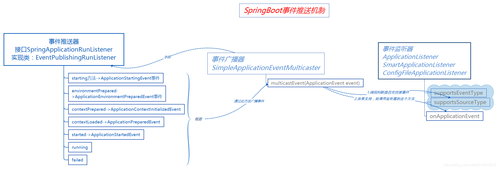

# SpringBoot的启动流程

## new SpringApplication(Application.class)

跟踪代码到

```java
	public SpringApplication(ResourceLoader resourceLoader, Class<?>... primarySources) {
         //使用的资源加载器
		this.resourceLoader = resourceLoader;
          //主要的bean资源 primarySources【在这里是启动类所在的.class】,不能为null,如果为null，抛异常
		Assert.notNull(primarySources, "PrimarySources must not be null");
        //获取所有的主配置类//启动类的实例数组转化成list，放在LinkedHashSet集合中
		this.primarySources = new LinkedHashSet<>(Arrays.asList(primarySources));
        //确定项目的启动类型，这也是springboot的强大之处
//springboot1.5 只有两种类型：web环境和非web环境， springboot2.0 有三种应用类型：WebApplicationType  NONE：不需要再web容器的环境下运行，也就是普通的工程 
//SERVLET：基于servlet的Web项目 REACTIVE：响应式web应用reactive web Spring5版本的新特性
		this.webApplicationType = WebApplicationType.deduceFromClasspath();

//每一个initailizer都是一个实现了ApplicationContextInitializer接口的实例。 
//ApplicationContextInitializer是Spring IOC容器中提供的一个接口： void initialize(C applicationContext);
//这个方法它会在ConfigurableApplicationContext的refresh()方法调用之前被调用（prepareContext方法中调用）,做一些容器的初始化工作。
		setInitializers((Collection) getSpringFactoriesInstances(ApplicationContextInitializer.class));

 //Springboot整个生命周期在完成一个阶段的时候都会通过事件推送器(EventPublishingRunListener)产生一个事件(ApplicationEvent)，
//然后再遍历每个监听器(ApplicationListener)以匹配事件对象，这是一种典型的观察者设计模式的实现具体事件推送原理请看：sb事件推送机制图
		setListeners((Collection) getSpringFactoriesInstances(ApplicationListener.class));
//指定main函数启动所在的类，即启动类BootApplication.class
		this.mainApplicationClass = deduceMainApplicationClass();
	}
```

我们来大概的看下ApplicationListener的一些实现类以及他们具体的功能简介


这些监听器的实现类都是在spring.factories文件中配置好的，代码中通过getSpringFactoriesInstances方法获取，这种机制叫做SPI机制：通过本地的注册发现获取到具体的实现类，轻松可插拔。


SpringBoot默认情况下提供了两个spring.factories文件，分别是：

    spring-boot-2.0.2.RELEASE.jar
    spring-boot-autoconfigure-2.0.2.RELEASE.jar
    
概括来说在创建SpringApplication实例的时候，sb会加载一些初始化和启动的参数与类，如同跑步比赛时的等待发令枪的阶段；


## run方法

#### run方法整体流程简述

```java
	/**
	 * Run the Spring application, creating and refreshing a new
	 * {@link ApplicationContext}.
	 * @param args the application arguments (usually passed from a Java main method)
	 * @return a running {@link ApplicationContext}
	 */
	public ConfigurableApplicationContext run(String... args) {

//StopWatch: 简单的秒表，允许定时的一些任务，公开每个指定任务的总运行时间和运行时间。这个对象的设计不是线程安全的，没有使用同步。SpringApplication是在单线程环境下，使用安全。
		StopWatch stopWatch = new StopWatch();
// 设置当前启动的时间为系统时间startTimeMillis = System.currentTimeMillis();
		stopWatch.start();
// 创建一个应用上下文引用
		ConfigurableApplicationContext context = null;
	// 异常收集，报告启动异常
		Collection<SpringBootExceptionReporter> exceptionReporters = new ArrayList<>();
//系统设置headless模式（一种缺乏显示设备、键盘或鼠标的环境下，比如服务器）， 通过属性：java.awt.headless=true控制
		configureHeadlessProperty();

//获取事件推送监器，负责产生事件，并调用支某类持事件的监听器 事件推送原理看 事件推送原理图
		SpringApplicationRunListeners listeners = getRunListeners(args);

//发布一个启动事件(ApplicationStartingEvent)，通过上述方法调用支持此事件的监听器
		listeners.starting();
		try {
// 提供对用于运行SpringApplication的参数的访问。取默认实现
			ApplicationArguments applicationArguments = new DefaultApplicationArguments(args);

//构建容器环境，这里加载配置文件
			ConfigurableEnvironment environment = prepareEnvironment(listeners, applicationArguments);

	// 对环境中一些bean忽略配置
			configureIgnoreBeanInfo(environment);
	// 对环境中一些bean忽略配置
			Banner printedBanner = printBanner(environment);
	// 创建容器
			context = createApplicationContext();
			exceptionReporters = getSpringFactoriesInstances(SpringBootExceptionReporter.class,
					new Class[] { ConfigurableApplicationContext.class }, context);

 // 准备应用程序上下文追踪源码prepareContext（）进去我们可以发现容器准备阶段做了下面的事情：
// 容器设置配置环境，并且监听容器，初始化容器，记录启动日志
 // 将给定的singleton对象添加到此工厂的singleton缓存中。
// 将bean加载到应用程序上下文中。
			prepareContext(context, environment, listeners, applicationArguments, printedBanner);
			refreshContext(context);
			afterRefresh(context, applicationArguments);

// stopwatch 的作用就是记录启动消耗的时间，和开始启动的时间等信息记录下来
			stopWatch.stop();
			if (this.logStartupInfo) {
				new StartupInfoLogger(this.mainApplicationClass).logStarted(getApplicationLog(), stopWatch);
			}
		// 发布一个已启动的事件
			listeners.started(context);
			callRunners(context, applicationArguments);
		}
		catch (Throwable ex) {
			handleRunFailure(context, ex, exceptionReporters, listeners);
			throw new IllegalStateException(ex);
		}

		try {
// 发布一个运行中的事件
			listeners.running(context);
		}
		catch (Throwable ex) {

// 启动异常，里面会发布一个失败的事件
			handleRunFailure(context, ex, exceptionReporters, null);
			throw new IllegalStateException(ex);
		}
		return context;
	}
```

#### 监听器的配置与加载

让我们忽略 Spring Boot 计 时和统计的辅助功能，直接来看 SpringApplicationRunListeners获取和使用 SpringApplicationRunL isteners可以理解为一个 SpringApplicationRunListener的容器，
它将 SpringApplicationRunListener 的集合以构造方法传入，并赋值给其 listeners成员变量，然后提供了针对 listeners 成员变量的各种遍历操作方法，
比如，遍历集合并调用对应的 starting、started、 running 等方法。

```java
	private SpringApplicationRunListeners getRunListeners(String[] args) {
//构造 Class 数组
		Class<?>[] types = new Class<?>[] { SpringApplication.class, String[].class };
//调用 SpringAppl icat ionRunL isteners 构造方法
		return new SpringApplicationRunListeners(logger,
				getSpringFactoriesInstances(SpringApplicationRunListener.class, types, this, args));
	}
```

SpringApplicationRunListeners 构 造 方 法 的 第 二 个 参 数 便 是 SpringApplicationRunListener 的 集 合 ，
 SpringApplication 中 调 用 构 造 方 法 时 该 参 数 是 通 过getSpringFactoriesInstances 方法获取的，代码如下。
 


```java
	private <T> Collection<T> getSpringFactoriesInstances(Class<T> type, Class<?>[] parameterTypes, Object... args) {
		ClassLoader classLoader = getClassLoader();
		// Use names and ensure unique to protect against duplicates
//加 META- TNE/sprina. factori es 中对应监听器的配并将结果存 set 中(去重)
		Set<String> names = new LinkedHashSet<>(SpringFactoriesLoader.loadFactoryNames(type, classLoader));
		List<T> instances = createSpringFactoriesInstances(type, parameterTypes, classLoader, args, names);
		AnnotationAwareOrderComparator.sort(instances);
		return instances;
	}
```

通过方法名便可得知，getSpringFactoriesInstances 是用来获取 factories 配置文件中的注册类，并进行实例化操作。

关于通过 SpringFactoriesLoader 获取 META-INF/spring.factories 中对应的配置，前面章节已经多次提到，这里不再赘述。

SpringApplicationRunListener 的注册配置位于 spring-boot 项目中的 spring.factories 文件内，Spring Boot 默认仅有- -个监听器进行了注册，关于其功能后面会专门讲到。


我们继续看实例化监听器的方法 createSpringFactoriesInstances 的源代码。

```java
	private <T> List<T> createSpringFactoriesInstances(Class<T> type, Class<?>[] parameterTypes,
			ClassLoader classLoader, Object[] args, Set<String> names) {
		List<T> instances = new ArrayList<>(names.size());
		for (String name : names) {
			try {
				Class<?> instanceClass = ClassUtils.forName(name, classLoader);
				Assert.isAssignable(type, instanceClass);
//获取有参构造器
				Constructor<?> constructor = instanceClass.getDeclaredConstructor(parameterTypes);
				T instance = (T) BeanUtils.instantiateClass(constructor, args);
				instances.add(instance);
			}
			catch (Throwable ex) {
				throw new IllegalArgumentException("Cannot instantiate " + type + " : " + name, ex);
			}
		}
		return instances;
	}
```

在上面的代码中，实例化监听器时需要有一-个默认的构造方法， 且构造方法的参数为Class<?>[ ] parameterTypes。我们向上追踪该参数的来源，会发现该参数的值为 Class 数组 ，
 数 组 的 内 容 依 次 为 SpringApplication.class 和 String[ ].class 。 也 就 是 说 ，SpringApplicationRunL istener 的实现类必须有默认的构造方法，
 且构造方法的参数必须依次为 SpringApplication 和 String[ ]类型。

#### SpringApplicationRunListener 源码解析

接口 SpringApplicationRunListener 是 SpringApplication 的 run 方法监听器。上节提到了SpringApplicationRunListener 通过 SpringFactoriesL oader 加载，并且必须声明一个公共构造函数，该函数接收 SpringApplication 实例和 String[ ]的参数，而且每次运行都会创建一个新的实例。

SpringApplicationRunListener 提供了-系列的方法，用户可以通过回调这些方法，在启动各个流程时加入指定的逻辑处理。下面我们对照源代码和注释来了解一下该接口都定义了哪些待实现的方法及功能。


#### 实现类 EventPublishingRunListener

EventPublishingRunL istener 是 SpringBoot 中针对 SpringApplicationRunListener 接口的唯内建实现EventPublishingRunL istener使用内置的SimpleApplicationEventMulticaster来广播在上下文刷新之前触发的事件。

默认情况下，Spring Boot在初始化过程中触发的事件也是交由EventPublishingRunListener来代理实现的。EventPublishingRunListener 的构造方法如下。

```java

```

Spring Boot 完成基本的初始化之后，会遍历 SpringApplication 的所有 ApplicationListener实 例 ， 并 将 它 们 与 SimpleApplicationEventMulticaster 进 行 关 联 ， 方 便SimpleApplicationEvent-Multicaster 后续将事件传递给所有的监听器。

EventPublishingRunListener 针对不同的事件提供了不同的处理方法，但它们的处理流程基本相同。


#### 事件推送原理

启动过程中分多个阶段或者说是多个步骤，每完成一步就会产生一个事件，并调用对应事件的监听器，这是一种标准的观察者模式，这在启动的过程中有很好的扩展性，下面我们来看看sb的事件推送原理：



###### 构建容器环境

在：run方法中的ConfigurableEnvironment environment = prepareEnvironment(listeners, applicationArguments);是准备环境，里面会加载配置文件；

```java
	private ConfigurableEnvironment prepareEnvironment(SpringApplicationRunListeners listeners,
			ApplicationArguments applicationArguments) {
		// Create and configure the environment
         // 创建一个配置环境，根据前面定义的应用类型定义不同的环境
		ConfigurableEnvironment environment = getOrCreateEnvironment();
// 将配置参数设置到配置环境中
		configureEnvironment(environment, applicationArguments.getSourceArgs());

		ConfigurationPropertySources.attach(environment);
//发布一个环境装载成功的事件（ApplicationEnvironmentPreparedEvent），并调用支持此事件的监听器 这其中就有配置文件加载监听器（ConfigFileApplicationListener）
		listeners.environmentPrepared(environment);
	// 将配置环境绑定到应用程序
		bindToSpringApplication(environment);
		if (!this.isCustomEnvironment) {
			environment = new EnvironmentConverter(getClassLoader()).convertEnvironmentIfNecessary(environment,
					deduceEnvironmentClass());
		}
		ConfigurationPropertySources.attach(environment);
		return environment;
	}
```

ConfigFileApplicationListener 代码有删减 加载了application.yml配置文件

```java

public class ConfigFileApplicationListener implements EnvironmentPostProcessor, SmartApplicationListener, Ordered {

	private static final String DEFAULT_PROPERTIES = "defaultProperties";

	// Note the order is from least to most specific (last one wins)
	private static final String DEFAULT_SEARCH_LOCATIONS = "classpath:/,classpath:/config/,file:./,file:./config/*/,file:./config/";

	private static final String DEFAULT_NAMES = "application";

	private static final Set<String> NO_SEARCH_NAMES = Collections.singleton(null);

	private static final Bindable<String[]> STRING_ARRAY = Bindable.of(String[].class);

	private static final Bindable<List<String>> STRING_LIST = Bindable.listOf(String.class);

	private static final Set<String> LOAD_FILTERED_PROPERTY;

	static {
		Set<String> filteredProperties = new HashSet<>();
		filteredProperties.add("spring.profiles.active");
		filteredProperties.add("spring.profiles.include");
		LOAD_FILTERED_PROPERTY = Collections.unmodifiableSet(filteredProperties);
	}

	/**
	 * The "active profiles" property name.
	 */
	public static final String ACTIVE_PROFILES_PROPERTY = "spring.profiles.active";

	/**
	 * The "includes profiles" property name.
	 */
	public static final String INCLUDE_PROFILES_PROPERTY = "spring.profiles.include";

	/**
	 * The "config name" property name.
	 */
	public static final String CONFIG_NAME_PROPERTY = "spring.config.name";

	/**
	 * The "config location" property name.
	 */
	public static final String CONFIG_LOCATION_PROPERTY = "spring.config.location";

	/**
	 * The "config additional location" property name.
	 */
	public static final String CONFIG_ADDITIONAL_LOCATION_PROPERTY = "spring.config.additional-location";


	@Override
	public void onApplicationEvent(ApplicationEvent event) {
		if (event instanceof ApplicationEnvironmentPreparedEvent) {
			onApplicationEnvironmentPreparedEvent((ApplicationEnvironmentPreparedEvent) event);
		}
		if (event instanceof ApplicationPreparedEvent) {
			onApplicationPreparedEvent(event);
		}
	}

	private void onApplicationEnvironmentPreparedEvent(ApplicationEnvironmentPreparedEvent event) {
		List<EnvironmentPostProcessor> postProcessors = loadPostProcessors();
		postProcessors.add(this);
		AnnotationAwareOrderComparator.sort(postProcessors);
		for (EnvironmentPostProcessor postProcessor : postProcessors) {
			postProcessor.postProcessEnvironment(event.getEnvironment(), event.getSpringApplication());
		}
	}


}

```

## prepareContext

```java
	private void prepareContext(ConfigurableApplicationContext context, ConfigurableEnvironment environment,
			SpringApplicationRunListeners listeners, ApplicationArguments applicationArguments, Banner printedBanner) {
		context.setEnvironment(environment);
		postProcessApplicationContext(context);
		applyInitializers(context);
		listeners.contextPrepared(context);
		if (this.logStartupInfo) {
			logStartupInfo(context.getParent() == null);
			logStartupProfileInfo(context);
		}
		// Add boot specific singleton beans
		ConfigurableListableBeanFactory beanFactory = context.getBeanFactory();
		beanFactory.registerSingleton("springApplicationArguments", applicationArguments);
		if (printedBanner != null) {
			beanFactory.registerSingleton("springBootBanner", printedBanner);
		}
		if (beanFactory instanceof DefaultListableBeanFactory) {
			((DefaultListableBeanFactory) beanFactory)
					.setAllowBeanDefinitionOverriding(this.allowBeanDefinitionOverriding);
		}
		if (this.lazyInitialization) {
			context.addBeanFactoryPostProcessor(new LazyInitializationBeanFactoryPostProcessor());
		}
		// Load the sources
//这里的sources就是获取的 new SpringApplication(Application.class) 中的Application.class
		Set<Object> sources = getAllSources();
		Assert.notEmpty(sources, "Sources must not be empty");
		load(context, sources.toArray(new Object[0]));
		listeners.contextLoaded(context);
	}
```

load 方法

```java
	/**
	 * Load beans into the application context.
	 * @param context the context to load beans into
	 * @param sources the sources to load
	 */
	protected void load(ApplicationContext context, Object[] sources) {
		if (logger.isDebugEnabled()) {
			logger.debug("Loading source " + StringUtils.arrayToCommaDelimitedString(sources));
		}
		BeanDefinitionLoader loader = createBeanDefinitionLoader(getBeanDefinitionRegistry(context), sources);
		if (this.beanNameGenerator != null) {
			loader.setBeanNameGenerator(this.beanNameGenerator);
		}
		if (this.resourceLoader != null) {
			loader.setResourceLoader(this.resourceLoader);
		}
		if (this.environment != null) {
			loader.setEnvironment(this.environment);
		}
		loader.load();
	}
```


```java
	protected BeanDefinitionLoader createBeanDefinitionLoader(BeanDefinitionRegistry registry, Object[] sources) {
		return new BeanDefinitionLoader(registry, sources);
	}

```

可以看到再这里将启动文件加载到了BeanDefinition中（这里表述不准确）

## @SpringBootApplication

启动类（或者配置类）已经加载完成了，那么接下来就是处理这个类。根据默认的的规则，一般我们只需要处理一个@SpringBootApplication注解。这个是源头

```java
@Target(ElementType.TYPE)
@Retention(RetentionPolicy.RUNTIME)
@Documented
@Inherited
@SpringBootConfiguration
@EnableAutoConfiguration
@ComponentScan(excludeFilters = { @Filter(type = FilterType.CUSTOM, classes = TypeExcludeFilter.class),
		@Filter(type = FilterType.CUSTOM, classes = AutoConfigurationExcludeFilter.class) })
public @interface SpringBootApplication {
```

实际上重要的只有三个Annotation：

* @Configuration（@SpringBootConfiguration里面还是应用了@Configuration）
* @EnableAutoConfiguration
* @ComponentScan

@Configuration的作用上面我们已经知道了，被注解的类将成为一个bean配置类。

@ComponentScan的作用就是自动扫描并加载符合条件的组件，比如@Component和@Repository等，最终将这些bean定义加载到spring容器中。

@EnableAutoConfiguration 这个注解的功能很重要，借助@Import的支持，收集和注册依赖包中相关的bean定义。

```java
@Target(ElementType.TYPE)
@Retention(RetentionPolicy.RUNTIME)
@Documented
@Inherited
@AutoConfigurationPackage
@Import(AutoConfigurationImportSelector.class)
public @interface EnableAutoConfiguration {
```

如上源码，@EnableAutoConfiguration注解引入了@AutoConfigurationPackage和@Import这两个注解。@AutoConfigurationPackage的作用就是自动配置的包，@Import导入需要自动配置的组件。

进入@AutoConfigurationPackage，发现也是引入了@Import注解

```java
@Target(ElementType.TYPE)
@Retention(RetentionPolicy.RUNTIME)
@Documented
@Inherited
@Import(AutoConfigurationPackages.Registrar.class)
public @interface AutoConfigurationPackage {
```


```java
static class Registrar implements ImportBeanDefinitionRegistrar, DeterminableImports {
        Registrar() {
        }

        public void registerBeanDefinitions(AnnotationMetadata metadata, BeanDefinitionRegistry registry) {
            AutoConfigurationPackages.register(registry, new String[]{(new AutoConfigurationPackages.PackageImport(metadata)).getPackageName()});
        }

        public Set<Object> determineImports(AnnotationMetadata metadata) {
            return Collections.singleton(new AutoConfigurationPackages.PackageImport(metadata));
        }
    }
```

new AutoConfigurationPackages.PackageImport(metadata)).getPackageName()

new AutoConfigurationPackages.PackageImport(metadata)

这两句代码的作用就是加载启动类所在的包下的主类与子类的所有组件注册到spring容器，这就是前文所说的springboot默认扫描启动类所在的包下的主类与子类的所有组件。

 

那问题又来了，要搜集并注册到spring容器的那些beans来自哪里？

进入 AutoConfigurationImportSelector类，

```java
public class AutoConfigurationImportSelector implements DeferredImportSelector, BeanClassLoaderAware,
		ResourceLoaderAware, BeanFactoryAware, EnvironmentAware, Ordered {


	@Override
	public String[] selectImports(AnnotationMetadata annotationMetadata) {
		if (!isEnabled(annotationMetadata)) {
			return NO_IMPORTS;
		}
		AutoConfigurationEntry autoConfigurationEntry = getAutoConfigurationEntry(annotationMetadata);
		return StringUtils.toStringArray(autoConfigurationEntry.getConfigurations());
	}

...

	/**
	 * Return the auto-configuration class names that should be considered. By default
	 * this method will load candidates using {@link SpringFactoriesLoader} with
	 * {@link #getSpringFactoriesLoaderFactoryClass()}.
	 * @param metadata the source metadata
	 * @param attributes the {@link #getAttributes(AnnotationMetadata) annotation
	 * attributes}
	 * @return a list of candidate configurations
	 */
	protected List<String> getCandidateConfigurations(AnnotationMetadata metadata, AnnotationAttributes attributes) {
		List<String> configurations = SpringFactoriesLoader.loadFactoryNames(getSpringFactoriesLoaderFactoryClass(),
				getBeanClassLoader());
		Assert.notEmpty(configurations, "No auto configuration classes found in META-INF/spring.factories. If you "
				+ "are using a custom packaging, make sure that file is correct.");
		return configurations;
	}

...

```
SpringFactoriesLoader.loadFactoryNames方法调用loadSpringFactories方法从所有的jar包中读取META-INF/spring.factories文件信息。

```java
	private static Map<String, List<String>> loadSpringFactories(@Nullable ClassLoader classLoader) {
		MultiValueMap<String, String> result = cache.get(classLoader);
		if (result != null) {
			return result;
		}

		try {
			Enumeration<URL> urls = (classLoader != null ?
					classLoader.getResources(FACTORIES_RESOURCE_LOCATION) :
					ClassLoader.getSystemResources(FACTORIES_RESOURCE_LOCATION));
			result = new LinkedMultiValueMap<>();
			while (urls.hasMoreElements()) {
				URL url = urls.nextElement();
				UrlResource resource = new UrlResource(url);
				Properties properties = PropertiesLoaderUtils.loadProperties(resource);
				for (Map.Entry<?, ?> entry : properties.entrySet()) {
					String factoryTypeName = ((String) entry.getKey()).trim();
					for (String factoryImplementationName : StringUtils.commaDelimitedListToStringArray((String) entry.getValue())) {
						result.add(factoryTypeName, factoryImplementationName.trim());
					}
				}
			}
			cache.put(classLoader, result);
			return result;
		}
		catch (IOException ex) {
			throw new IllegalArgumentException("Unable to load factories from location [" +
					FACTORIES_RESOURCE_LOCATION + "]", ex);
		}
	}
```

spring.factories文件内容，其中有一个key为org.springframework.boot.autoconfigure.EnableAutoConfiguration的值定义了需要自动配置的bean，通过读取这个配置获取一组@Configuration类。

每个xxxAutoConfiguration都是一个基于java的bean配置类。实际上，这些xxxAutoConfiguratio不是所有都会被加载，会根据xxxAutoConfiguration上的@ConditionalOnClass等条件判断是否加载。

```java

```


```java

```


```java

```


```java

```
