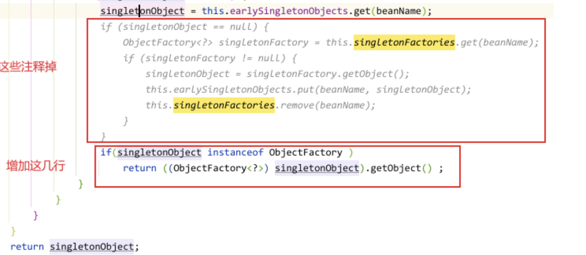

# 三级缓存

什么是三级缓存

首先要说清楚，spring是做什么用的。spring最核心的功能，控制反转，依赖注入。名词不解释，本人对名词的理解也有限。白话说，就是内置bean容器，为上层应用提供bean的生命周期管理。

也就是大家要写代码时，例如Java中，写一个@Autowired，就可以完成自动注入，不需要自己去new对象。这有什么好处呢？应用里引入redis的时候，只需要写一个redisTemplate就行了。

这是个人的一点肤浅理解，未必正确，各位看官一听就行。

那么spring如何为代码中使用redisTemplate的地方，注入对应的对象呢？这个地方大家应该都可以想明白，创建一个redisTemplate对象，给所有需要注入的地方使用，也就是单例模式。

这个实现大家都可以想到，用一个集合把对象存起来，最好是使用Map<String,Object>这样一个集合，根据名字搜索时很快。没错，spring就是这样做的（这里我们忽略类型查找）。

在DefaultSingletonBeanRegistry类中有三个变量，是spring bean容器的三级缓存（一二三的顺序先忽略），就是下面代码片段中的三个map变量：


public class DefaultSingletonBeanRegistry extends SimpleAliasRegistry implements SingletonBeanRegistry {

    /** Maximum number of suppressed exceptions to preserve. */
    private static final int SUPPRESSED_EXCEPTIONS_LIMIT = 100;


    /** Cache of singleton objects: bean name to bean instance. */
    private final Map<String, Object> singletonObjects = new ConcurrentHashMap<>(256);
    
    /** Cache of singleton factories: bean name to ObjectFactory. */
    private final Map<String, ObjectFactory<?>> singletonFactories = new HashMap<>(16);
    
    /** Cache of early singleton objects: bean name to bean instance. */
    private final Map<String, Object> earlySingletonObjects = new ConcurrentHashMap<>(16);


各位看官看到了吧，这就是三级缓存。

等等等等，存个对象，无非用名字一搜，一个map就够了啊，为什么会有三缓存呢？差点溜过去吧 ^_^ 。我们一点一点来，先不说为什么有三级缓存，先说这个：

为什么会有二级缓存

明明一个map就完事了，为什么还要有二级缓存呢？百度上文章 一大把，说得很明确，为了解决循环依赖。什么是循环依赖？老铁，这个自行百度吧。

这里要说明一点，spring解决不了构造方法参数的循环依赖，A的构造方法里调用了B的方法，B的构造方法里调用了A的方法，谁也解决不了。

能解决的，只是类成员变量（具有set方法）的循环依赖。A里有B，B里有A，并且各自都有set方法。如何解决呢？

spring将创建对象的过程分成了几步（不在本文讨论范围内），大概就是先执行构造方法，完成实例化，然后对类成员进行赋值，完成初始化。

只有彻底完成初始化，成为可用对象时，才放到一级缓存中。

按照这个步骤，当创建A时，先把A放到二级缓存里，发现A依赖B，在缓存里搜索B，没有，那就创建B，创建B的过程中发现依赖A，在缓存里查找，嘿找到了！给B里的成员变量A赋值，

顺利完成B对象的创建并放到一级缓存里，回过头来给A里的成员变量B赋值，顺利完成A对象的创建，圆满成功！

等等等等，就这？这不和其他文章一样么？只说明了二级缓存的作用，没有说明为什么要使用二级缓存，换句话说，没有说明，只用一级缓存，为什么不能解决循环依赖？

好吧，又差点溜过去。

只用一级缓存，解决不了循环依赖么？不是不能解决，而是有弊端，还请列位上眼：

按照这个步骤（上面说的spring分步创建对象的步骤），当创建A时，先把A放到一级缓存里，发现A依赖B，在缓存里搜索B，没有，那就创建B，创建B的过程中发现依赖A，在缓存里查找，嘿找到了！给B里的成员变量A赋值，顺利完成B对象的创建并放到一级缓存里，回过头来给A里的成员变量B赋值，顺利完成A对象的创建。

这一级缓存，不也解决了循环依赖问题了，和刚才的描述有啥差异么？！

有没有差异，列位仔细看，刚才的描述里，可是以“圆满成功”结尾的啊，这里没有，难道它不圆满？还真不圆满，而且列位都能想到：

把A放到一级缓存里了，如果在完成初始化之前，有人来拿走A调用了一下，可能就NPP了啊，咱优秀的程序员可不能这么干啊。

咱得给他补补：

嘿这样，咱给A弄个标记，让来拿对象的人知道，这个对象是不完整的，不能用。那好说啊，一个true/false就解决了。但是不行啊，这个变量放哪呢？嗯把A包装一层，在一级缓存里放一个

Wrapper对象，Wrapper里有一个标记，有一个引用类型，就OK了啊。哦不对，这样会造成所有人来拿对象的时候，都要判断一下。。。太麻烦了，咱优秀的程序员，可不能这么干。

对啊，再弄个二级缓存不就行了，把没创建完成的对象，先放到二级缓存里，直到创建完成了，才放到一级缓存中，二级缓存，就是专门解决循环依赖使用，如果类型A没有发生循环依赖，

那它的创建过程就是：实例化，放到二级缓存，初始化，放到一级缓存，完事。

如果类型A与B发生了循环依赖，那它的创建过程就是：实例化A，放到二级缓存，实例化B，放到二级缓存，初始化B（从二级缓存拿到A的引用），将B放到一级缓存，初始化A，将A放到一级缓存，完事！

其他人该怎么用还是怎么用，完全不影响。这样才符合咱优秀程序员的风格嘛！

就这样，即解决了循环依赖，又照顾了代码简洁，以及性能，这就是二级缓存的诞生之路。

为什么会有三级缓存

先说个结论，三级缓存就是给AOP动态代理准备的，为了编码整洁，为了集成方便，spring为AOP准备了三级缓存，是一种“框架化编程”的结果，是优秀代码。

> 如果创建的Bean有对应的代理，那其他对象注入时，注入的应该是对应的代理对象；但是Spring无法提前知道这个对象是不是有循环依赖的情况，而正常情况下（没有循环依赖情况），Spring都是在创建好完成品Bean之后才创建对应的代理。这时候Spring有两个选择：
>
> 不管有没有循环依赖，都提前创建好代理对象，并将代理对象放入缓存，出现循环依赖时，其他对象直接就可以取到代理对象并注入。
> 不提前创建好代理对象，在出现循环依赖被其他对象注入时，才实时生成代理对象。这样在没有循环依赖`的情况下，Bean就可以按着Spring设计原则的步骤来创建。
> Spring选择了第二种方式，那怎么做到提前曝光对象而又不生成代理呢？
> Spring就是在对象外面包一层ObjectFactory，提前曝光的是ObjectFactory对象，在被注入时才在ObjectFactory.getObject方式内实时生成代理对象，并将生成好的代理对象放入到第二级缓存Map<String, Object> earlySingletonObjects。
> addSingletonFactory(beanName, () -> getEarlyBeanReference(beanName, mbd, bean));

没错，Spring bean工厂的动态代理，就是在这个地方，利用这个ObjectFactory实现的。很多文章这样写，spring有两个选择，选择了第二种。

“那选择第二种，就必须使用三级缓存？二级缓存就不行吗？嘿我不是和你杠，我就是想弄明白。”

那我们一起来看一下，三级缓存都是在哪使用到了。通过查找代码，除了几处安全put、remove元素之外，只在一处使用了三级缓存中的元素，见下面方法：

```java
@Nullable
    protected Object getSingleton(String beanName, boolean allowEarlyReference) {
        Object singletonObject = this.singletonObjects.get(beanName);
        if (singletonObject == null && this.isSingletonCurrentlyInCreation(beanName)) {
            singletonObject = this.earlySingletonObjects.get(beanName);
            if (singletonObject == null && allowEarlyReference) {
                synchronized(this.singletonObjects) {
                    singletonObject = this.singletonObjects.get(beanName);
                    if (singletonObject == null) {
                        singletonObject = this.earlySingletonObjects.get(beanName);
                        if (singletonObject == null) {
                            ObjectFactory<?> singletonFactory = (ObjectFactory)this.singletonFactories.get(beanName); //这里是唯一使用三级缓存的地方
                            if (singletonFactory != null) {
                                singletonObject = singletonFactory.getObject();
                                this.earlySingletonObjects.put(beanName, singletonObject);
                                this.singletonFactories.remove(beanName);
                            }
                        }
                    }
                }
            }
        }

        return singletonObject;
    }
```


 上面代码也很明了，先查找一级缓存，没有就查找二级缓存，还没有，查找三级缓存。我们用二级缓存，能完成这个功能吗？

答案是能。

来重新看三级缓存的定义

 ```java
 //一级
 private final Map<String, Object> singletonObjects = new ConcurrentHashMap(256);
 //三级
     private final Map<String, ObjectFactory<?>> singletonFactories = new HashMap(16);
 //二级
     private final Map<String, Object> earlySingletonObjects = new ConcurrentHashMap(16);
 ```


 都是Map，虽然三级缓存中不能放二级缓存的元素，但是二级缓存却可以放三级缓存的元素。

OK，替换方案，它不就来了嘛：

删除三级缓存，将所有对三级缓存的put\remove，替换成二级缓存，对应的逻辑进行微调。重点只在一处地方，就是刚才图中的getSingleton方法。

在这个方法里，查找二级缓存时，如果取出来的对象是ObjectFactory类型，那么就需要再调用一次getObject方法



 是不是有点熟悉？和FactoryBean类似了。

这个方案，嗯，有点不圆满，如果用户真的需要存一个ObjectFactory对象，咋办呢？可以准备一个Set，把我们自己放进去的ObjectFactory，做个记录嘛，然后拿的时候，比对一下。就解决了啊！是的，这样是可以解决的。而我们引入的这个Set，那不就是三级缓存么？所以，还是为了制造优秀代码，spring引入了三级缓存。

我刚才还多了一嘴，说三级缓存就是为了给AOP准备的。诸位上眼，来看看鄙人收集的证据：

1、哪里对三级缓存进行put操作

只有一个方法，只有一个方法，只有一个方法啊，对三级缓存进行了put操作，就是下面图里的代码：

```java
protected void addSingletonFactory(String beanName, ObjectFactory<?> singletonFactory) {
        Assert.notNull(singletonFactory, "Singleton factory must not be null");
        synchronized(this.singletonObjects) {
            if (!this.singletonObjects.containsKey(beanName)) {
                this.singletonFactories.put(beanName, singletonFactory); //唯一put的地方
                this.earlySingletonObjects.remove(beanName);
                this.registeredSingletons.add(beanName);
            }

        }
    }
```


 顺藤摸瓜，这个方法，又恰好只在一个地方被调用，就是doCreateBean里，看证据：

```java
if (earlySingletonExposure) {
			if (logger.isTraceEnabled()) {
				logger.trace("Eagerly caching bean '" + beanName +
						"' to allow for resolving potential circular references");
			}
			addSingletonFactory(beanName, () -> getEarlyBeanReference(beanName, mbd, bean));
		}
```


  也就是说，完成实例化，立马放入三级缓存。我们再看这个getEarlyBeanReference方法：

 ```java
 protected Object getEarlyBeanReference(String beanName, RootBeanDefinition mbd, Object bean) {
 		Object exposedObject = bean;
 		if (!mbd.isSynthetic() && hasInstantiationAwareBeanPostProcessors()) {
 			for (SmartInstantiationAwareBeanPostProcessor bp : getBeanPostProcessorCache().smartInstantiationAware) {
 				exposedObject = bp.getEarlyBeanReference(exposedObject, beanName);
 			}
 		}
 		return exposedObject;
 	}
 ```


  它调用了一个BeanPostProcessor的getEarlyBeanReference方法，再找这个方法的具体实现：


  只有两个类实现了这个方法，Instanxxxxx这个类还是个空方法。那么，可以肯定，这个方法就是给AbstractAutoProxyCreator准备的了：

 

```java
 public Object getEarlyBeanReference(Object bean, String beanName) {
        Object cacheKey = this.getCacheKey(bean.getClass(), beanName);
        this.earlyProxyReferences.put(cacheKey, bean);
        return this.wrapIfNecessary(bean, beanName, cacheKey);
    }
```


再看一下wrapIfNecessary方法：

  

```java
protected Object wrapIfNecessary(Object bean, String beanName, Object cacheKey) {
        if (StringUtils.hasLength(beanName) && this.targetSourcedBeans.contains(beanName)) {
            return bean;
        } else if (Boolean.FALSE.equals(this.advisedBeans.get(cacheKey))) {
            return bean;
        } else if (!this.isInfrastructureClass(bean.getClass()) && !this.shouldSkip(bean.getClass(), beanName)) {
            Object[] specificInterceptors = this.getAdvicesAndAdvisorsForBean(bean.getClass(), beanName, (TargetSource)null);
            if (specificInterceptors != DO_NOT_PROXY) {
                this.advisedBeans.put(cacheKey, Boolean.TRUE);
              //这里创建代理对象
                Object proxy = this.createProxy(bean.getClass(), beanName, specificInterceptors, new SingletonTargetSource(bean));
                this.proxyTypes.put(cacheKey, proxy.getClass());
                return proxy;
            } else {
                this.advisedBeans.put(cacheKey, Boolean.FALSE);
                return bean;
            }
        } else {
            this.advisedBeans.put(cacheKey, Boolean.FALSE);
            return bean;
        }
    }
```


上面连续的两张图，可以看到，为什么都说三级缓存是给动态代理准备的了。而且，spring的三级缓存，就是给AOP动态代理用的，确认无疑。

总结

spring的三级缓存真的必要吗？通过上面的探讨，可以发现，二级缓存加其他措施，也是可以实现的。然而spring是一个框架，框架更要考虑如何优雅的集成其他组件。

通过我们的分析可以看到，spring仅通过一个接口，就支撑了AOP组件，甚至spring根本不关心，你是要进行动态代理，还是要进行其他操作，spring只是提供了这么一种方式，一个机会，让其他组件可以在bean实例化完成之后，彻底初始化之前，对bean做一些操作。而当前AOP这种操作，恰好就是产生了一个动态代理对象，来替换原对象。所以大家都说，三级缓存，是为了解决动态代理问题。

然而做的开发者，大家一定要理解更深一层的原因，为什么spring要引入三级缓存，是二级缓存真的办不了吗？这样才能加深理解，才能彻底弄明白，有助于大家技术能力的提升。
