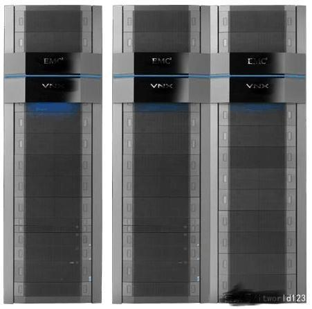
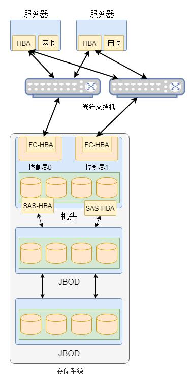
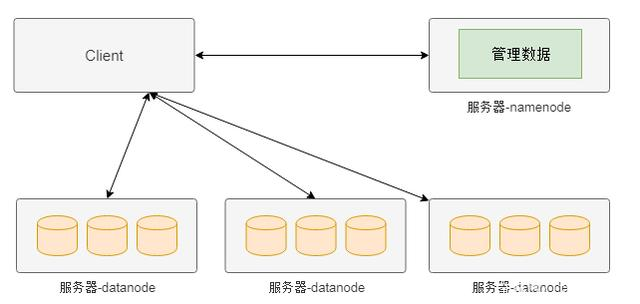
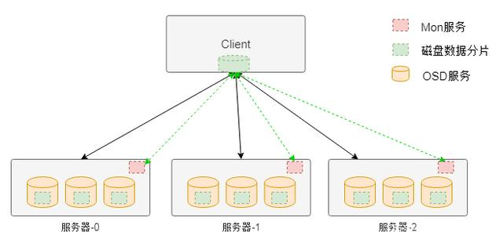

# 常见分布式存储架构

分布式存储是相对于集中式存储来说的，在介绍分布式存储之前，我们先看看什么是集中式存储。不久之前，企业级的存储设备都是集中式存储。所谓集中式存储，从概念上可以看出来是具有集中性的，也就是整个存储是集中在一个系统中的。但集中式存储并不是一个单独的设备，而是集中在一套系统当中的多个设备。以EMC公司的存储为例，整个存储系统可能需要几个机柜来存放。

### 集中式存储基本架构

集中式存储系统中包含很多组件，除了核心的机头（控制器）、磁盘阵列（JBOD）和交换机等设备外，还有管理设备等辅助设备。如图2是一个集中式存储的基本逻辑示意图。

在集中式存储中通常包含一个机头，这个是存储系统中最为核心的部件。通常在机头中有包含两个控制器，这两个控制器实现互备的作用，避免硬件故障导致整个存储系统的不可用。在该机头中通常包含前端端口和后端端口，前端端口用户为服务器提供存储服务，而后端端口用于扩充存储系统的容量。通过后端端口机头可以连接更多的存储设备，从而形成一个非常大的存储资源池。

机头中是整个存储系统的核心部件，整个存储系统的高级功能都在其中实现。控制器中的软件实现对磁盘的管理，将磁盘抽象化为存储资源池，然后划分为LUN提供给服务器使用。

对于中低端的存储系统通常只有一个机头，但对于高端存储通常会存在多个机头。例如EMC和华为等存储厂商的机头数量可以达到256个。从这方面来看，其实集中式存储系统正在向分布式存储方面演化。

接下来我们介绍分布式存储。其实分布式存储是一个非常大的概念，其包含的种类也非常繁多。除了传统意义上的分布式文件系统、分布式块存储和分布式对象存储外，还包括分布式数据库和分布式缓存等。
**本文局限在分布式文件系统等传统意义上的存储架构，对于数据库等不做介绍。**

### 中间控制节点架构（HDFS）

分布式存储最早是由谷歌提出的，其目的是通过廉价的服务器来提供使用与大规模，高并发场景下的Web访问问题。如图3是模仿谷歌的GFS的分布式存储（HDFS）的简化的模型。在该系统的整个架构中将服务器分为两种类型，一种名为namenode，这种类型的节点负责管理管理数据（元数据），另外一种名为datanode，这种类型的服务器负责实际数据的管理。

上图分布式存储中，如果客户端需要从某个文件读取数据，首先从namenode获取该文件的位置（具体在哪个datanode），然后从该位置获取具体的数据。在该架构中namenode通常是主备部署，而datanode则是由大量节点构成一个集群。由于元数据的访问频度和访问量相对数据都要小很多，因此namenode通常不会成为性能瓶颈，而datanode集群可以分散客户端的请求。因此，通过这种分布式存储架构可以通过横向扩展datanode的数量来增加承载能力，也即实现了动态横向扩展的能力。

### 完全无中心架构---计算模式（Ceph）

如图是Ceph存储系统的架构，在该架构中与HDFS不同的地方在于该架构中没有中心节点。客户端是通过一个设备映射关系
计算出来其写入数据的位置，这样客户端可以直接与存储节点通信，从而避免中心节点的性能瓶颈。

在Ceph存储系统架构中核心组件有Mon服务、OSD服务和MDS服务等。对于块存储类型只需要Mon服务、OSD服务和客户端的软件即可。其中Mon服务用于维护存储系统的硬件逻辑关系，主要是服务器和硬盘等在线信息。Mon服务通过集群的方式保证其服务的可用性。OSD服务用于实现对磁盘的管理，实现真正的数据读写，通常一个磁盘对应一个OSD服务。

客户端访问存储的大致流程是，客户端在启动后会首先从Mon服务拉取存储资源布局信息，然后根据该布局信息和写入数据的名称等信息计算出期望数据的位置（包含具体的物理服务器信息和磁盘信息），然后该位置信息直接通信，读取或者写入数据。

### 完全无中心架构---一致性哈希（Swift）

与Ceph的通过计算方式获得数据位置的方式不同，另外一种方式是通过一致性哈希的方式获得数据位置。一致性哈希的方式就是将设备做成一个哈希环，然后根据数据名称计算出的哈希值映射到哈希环的某个位置，从而实现数据的定位。
