# Hystrix

## Hystrix是什么

Hystrix是什么？官方给出的解释是：“In a distributed environment, inevitably some of the many service dependencies will fail.  Hystrix is a library that helps you control the interactions between these distributed services by adding latency tolerance and fault tolerance logic.  Hystrix does this by isolating points of access between the services, stopping cascading failures across them, and providing fallback options, all of which improve your system overall resiliency.”

译文：“在分布式环境中，某些服务之间的依赖失败是不可避免的。Hystrix作为一个类库，通过提供延迟控制和容错逻辑，帮助我们保证（个人认为control翻译成“保证”比“控制”更好一些）这些分布式服务之间的交互过程。Hystrix 通过“服务隔离”、阻止服务依赖导致的级联失败、并提供fallback处理，以提高我们系统的整体健壮性”。大体的意思是，通过hystrix提供的“服务隔离”、“容错处理”、“服务熔断”等方式保证了分布式环境下相互依赖的服务之间的健壮性。

Hystrix是Netflix开源的一个限流熔断的项目、主要有以下功能:

* 隔离（线程池隔离和信号量隔离）：限制调用分布式服务的资源使用，某一个调用的服务出现问题不会影响其他服务调用。
* 优雅的降级机制：超时降级、资源不足时(线程或信号量)降级，降级后可以配合降级接口返回托底数据。
* 融断：当失败率达到阀值自动触发降级(如因网络故障/超时造成的失败率高)，熔断器触发的快速失败会进行快速恢复。
* 缓存：提供了请求缓存、请求合并实现。支持实时监控、报警、控制（修改配置）

#### 服务熔断
服务熔断的作用类似于我们家用的保险丝，当某服务出现不可用或响应超时的情况时，为了防止整个系统出现雪崩，暂时停止对该服务的调用。

#### 服务降级
服务降级是从整个系统的负荷情况出发和考虑的，对某些负荷会比较高的情况，为了预防某些功能（业务场景）出现负荷过载或者响应慢的情况，在其内部暂时舍弃对一些非核心的接口和数据的请求，而直接返回一个提前准备好的fallback（退路）错误处理信息。这样，虽然提供的是一个有损的服务，但却保证了整个系统的稳定性和可用性。

#### 熔断VS降级
###### 相同点：

目标一致 都是从可用性和可靠性出发，为了防止系统崩溃；

用户体验类似 最终都让用户体验到的是某些功能暂时不可用；

###### 不同点：

触发原因不同 服务熔断一般是某个服务（下游服务）故障引起，而服务降级一般是从整体负荷考虑； 

#### 服务熔断与降级之间存在本质的区别：

###### 主动与被动的区别

主动与被动，主要体现在执行过程中，是否存在人为的主动干预，“服务熔断”是通过配置规则对下游服务进行健壮性分析而做出的被动熔断操作，不考虑是否为关键链路；“服务降级”是工作人员根据目前的运行状况执行的主动降级策略，用于保证主链路业务不受影响，

###### 执行动机不同

执行动机的不同主要表现在“服务熔断”通过对下游服务的健壮性统计分析而做出的为了保证上游服务业务正常进行及资源使用的安全；“服务降级”是为了保证主链路业务不被边缘链路干扰而做出的决策，类似于“剪枝”的过程。

## 超时

超时（又称为 timeout）。服务响应的时间(RT)是我们在开发过程中衡量一个服务吞吐的主要指标，通常通过90线、95线、99线等规则进行对服务进行考量。在开发过程中，大家一定要非常非常关注每一个接口的RT，一般对于一个正常业务接口的请求，非高峰期情况下要求在100ms以内，高峰期情况下不能超过300ms,如果不在这个范围内的自身业务接口，就需要对这些接口进行合理的优化，除非有一些特殊接口，如依赖外部接口（其他公司的开源接口），这种严重依赖下游RT的接口可以选择通过做本地缓存的方式进行优化，如果无法做本地缓存只能只待下游提供方了（扯远了~）。
如果RT时间特别长会带来的后果是什么呢？大家可以想一下，对于java开发的服务来说，真正处理请求的是JVM（它不在本文讨论范围内），JVM是搭建在物理机上的一个容器平台，用来解析并执行java字节码文件，以实现对java的支持（早期java跨平台的主要因素），那么jvm启动后就像其他的应用程序一样是操作系统的一个进程，操作系统对于每一个进程在启动时都会分配一定的系统资源和可扩展资源限制（如：文件句柄数、CPU配额等），也就是说如果一个进行被分配的资源被全部占用时，新的请求就需要等待被占用资源的释放或者直接在操作系统层面被reject掉。
回到我们要讨论的RT，如果RT时间过长，那么直接导致每个请求占用的系统资源时间同样变长了，那么在服务接收了一定数量的请求后，其他请求就会被阻塞，此时严重影响了服务吞吐能力。所以，大家在做研发时一定要关注每一个接口的RT时间，切记不要忽略RT的抖动。RT的抖动可能暗示着服务存在着潜在风险。

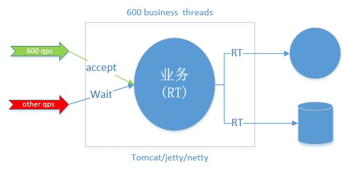

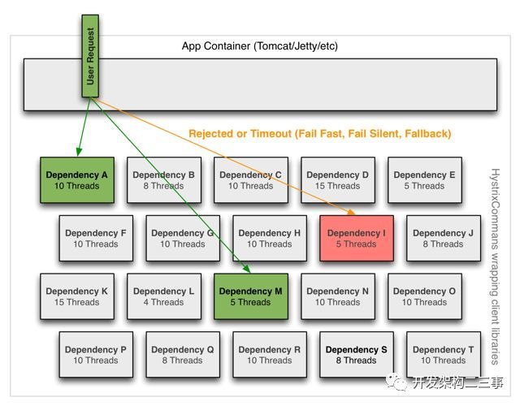

## 资源隔离

在“超时”一节中我们聊到了资源使用问题，对，每一个进程的启动都将使用系统资源（文件句柄、CPU、IO、磁盘等）。上述资源都对于系统来说都是非常稀缺的资源，合理分配和利用操作系统的资源对于使用者来说是一个非常大的挑战。在以往的服务体系结构中，一个服务启动后，所有的“请求”共用整个服务被分配的所有资源，比如：Thread资源：

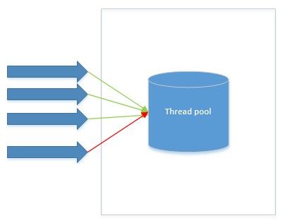

这种共享资源的方式带来很大问题，前文说道请求超时就是一个比较好的例子，当服务A对服务B存在依赖调用时，如果服务B业务处理存在大量超时，就会增加服务A中该接口占用大量的系统资源而没有及时进行释放，使得其他接口无法正常获取到系统资源而被阻塞，如果阻塞时间超过系统设置的超时时间则直接影响到了用户请求未被处理。针对上述问题，能够更合理的分配资源，hystrix提供了如何将资源进行隔离的方案：线程池隔离和信号量隔离。线程池隔离：即通过为每个下游配置一个固定配额的线程池，当服务调用下游时使用该线程池中的线程执行下游服务的调用，使用后再归还线程池，如果该下游服务出现超时或者不稳定状态时，上游服务将只占用仅有的配置的线程池数量，从而起到隔离作用。如下图4：

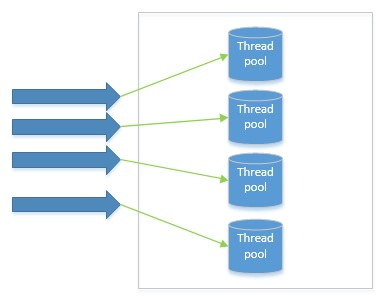

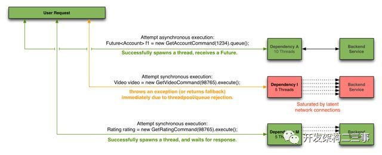 

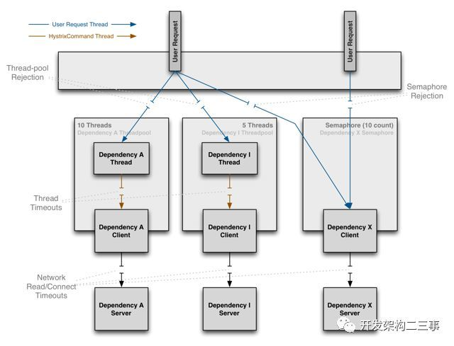

## Hystrix能做什么

Hystrix能做什么?要从其能够解决的问题才能够了解。

在复杂的分布式环境中，应用服务之间存在着错综复杂的依赖关系，依赖关系之间不可避免的会存在不稳定情况，如果主应用不与这些不稳定的外部依赖关系进行隔离，就存在被这些问题拖垮的风险。

例如：一个服务对下游服务存在30个依赖关系，下游每个服务稳定性保证99.99%（4个9，对于一般的公司已经是非常好的状态），那么对于30个 99.99%的服务来说组合起来，对于上游服务A来说其稳定性只能达到99.7%，如果有10亿次请求，那么就会存在300万次失败（现实中往往情况会更糟）。健康状况下服务依赖关系如下：


当存在一个下游依赖出现故障时，依赖状态如下
 

 
此时将间接导致上游服务的不可用，用户请求失败。随着时间的推移，失败的用户请越来越多，堆积在上游服务请求链路中
 
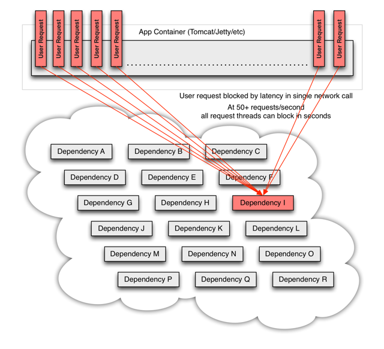 

随着堆积的异常请求越来越多，到时上游服务处理请求的资源被完全占用，最终将导致上游服务的不可用。高并发情况下，一个单一的后端依赖服务的延迟将导致所有服务器实例瞬间达到饱和。任何的这种通过网络或者客户端类库访问的应用都将是产生失败的风险点。
比访问失败更糟糕的是，这些应用程序将导致请求的延迟增加，资源被占用，新的请求被加入到队列，最后将导致全系统的级联失败。


当使用第三方客户端类库——“黑盒子”时，其所有的实现细节、网络和资源配置都被隐藏在内部，且配置不尽相同时，我们根本无法对其变更进行实时监控时，将大大加重上述问题的最终结果。

这些象征着失败和延迟现象需要进行管理和隔离，以保证单一的失败依赖关系不会拖垮整个服务。

为此Hystrix做了如下事情：

1. 防止任何单一依赖关系使用整个应用的全部用户线程资源（例如：tomcat）
2. 降低负载、快速失败代替排队等待
3. 提供失败处理程序（fallback）以保证用户请求正常返回
4. 使用熔断技术（例如：隔板模式、泳道模式和断路器模式）以限制单一依赖关系带来的负面影响
5. 通过近实时的度量统计、监控、告警，优化time-to-discovery（没想好具体怎么翻译：“及时发现问题”），大意应该是以保证hystrix能够及时发现出现问题的依赖关系。


## Hystrix怎样实现它的目标

为了实现上述的目标，hystrix做了如下方案：

1. 将所有的外部调用或者依赖项封装成一个HystrixCommand或者HystrixObservableCommand对象，并让 *Command对象分别在隔离的线程中执行。
2. 允许用户为每一个command定义自定义的超时时间阈值，根据不同的依赖项定义用户自定义阈值，可以在某种程度上提高99.5线。
3. 为每一个依赖项维护一个小的线程池（或者信号量），如果它满了，则对于该依赖项的新的请求将立即被拒绝，而不是进行排队等待资源的释放。
4. 度量统计请求“成功数”、“失败数”、“超时数”以及“线程池拒绝数”等指标
5. 如果对于某一个依赖项调用错误率超过阈值，则可以手动或者自动触发断路器断开一段时间（简称：熔断）。
6. 当请求报错、超时、被拒绝或者熔断时，执行错误处理程序（fallback）
7. 近实时的监控指标和配置的变更

当我们使用hystrix来包装下游依赖项后，上图中的显示的架构图变成了下面图所示，每一个依赖项彼此之间隔离，当出现延迟时并受资源的限制，并且在依赖项出现错误时，
能够决定响应是否通过容错处理程序（fallback）进行处理并返回结果。

 

## 执行过程（熔断原理）

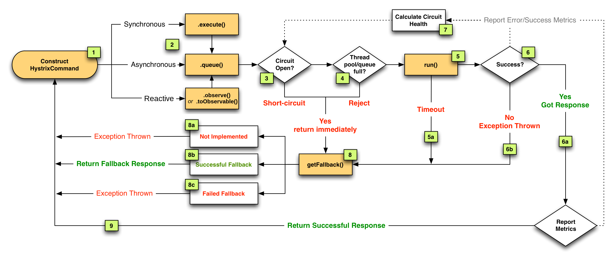

#### ResponseCache 

首先，Response Cache功能，官方解释是：“如果针对某个command的Cache功能启用，任何请求在发起真正请求（调用熔断处理）之前，都将进行缓存命中判断，如果缓存命中，则返回缓存Response结果”。从描述中我们可以得出，该结果的返回需要依赖“Request Cache”功能的开启，至于RC功能将单独用一篇文章进行描述。
在进行RC判断之后，如果没有命中缓存，则调用CircuitBreaker进行判断进行Circuit健康检查。

#### Hystrix主要有4种调用方式：
* toObservable() 方法 ：未做订阅，只是返回一个Observable 。
* observe() 方法 ：调用 #toObservable() 方法，并向 Observable 注册 rx.subjects.ReplaySubject 发起订阅。
* queue() 方法 ：调用 #toObservable() 方法的基础上，调用：Observable#toBlocking() 和 BlockingObservable#toFuture() 返回 Future 对象
* execute() 方法 ：调用 #queue() 方法的基础上，调用 Future#get() 方法，同步返回 #run() 的执行结果。

#### 主要的执行逻辑：
     
1. 每次调用创建一个新的HystrixCommand,把依赖调用封装在run()方法中.（其实后面有一个ResponseCache Available判断过程）
2. 执行execute()/queue做同步或异步调用.
3. 判断熔断器(circuit-breaker)是否打开,如果打开跳到步骤8,进行降级策略,如果关闭进入步骤.
4. 判断线程池/队列/信号量是否跑满，如果跑满进入降级步骤8,否则继续后续步骤. 
5. 调用HystrixCommand的run方法.运行依赖逻辑,依赖逻辑调用超时,进入步骤8.
6. 判断逻辑是否调用成功。返回成功调用结果；调用出错，进入步骤8.
7. 计算熔断器状态,所有的运行状态(成功, 失败, 拒绝,超时)上报给熔断器，用于统计从而判断熔断器状态.
8. getFallback()降级逻辑。以下四种情况将触发getFallback调用：
   * run()方法抛出非HystrixBadRequestException异常。
   * run()方法调用超时
   * 熔断器开启拦截调用
   * 线程池/队列/信号量是否跑满<br>
   没有实现getFallback的Command将直接抛出异常，fallback降级逻辑调用成功直接返回，降级逻辑调用失败抛出异常.
9. 返回执行成功结果

###### CircuitBreaker

如果CircuitBreaker处于断开状态，则直接fast-fail调用fallback进入错误处理程序。如果CircuitBreaker处于关闭状态，则继续向下执行。其实在整个过程中还存在一个中间状态——half open（半开）。当CircuitBreaker处于半开状态时，
将允许一个或者部分请求进行“尝试”执行下游调用，如果调用成功则将断路器进行关闭，否则进行断开。整个过程可以归纳成如下图

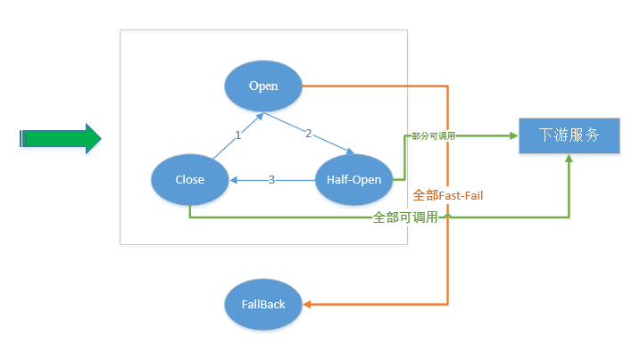 

上图中主要描述了Hystrix断路器运行时的三个状态：打开、关闭、半开。并描述了每个状态下对于Request请求是否可以被执行的相关内容。接下来，向大家描述一下三个状态如何进行切换（即图中1、2、3）的，即什么条件下断路器才会进行状态的切换，以及切换条件的数据如何进行收集。

首先，断路器切换条件—下游服务调用执行状态（Successes（成功数）、Failures（失败数）、Rejections（拒绝数）、timeouts（超时数）），也就是说断路器的切换由上述四个指标共同决定。这里只解释一下Rejections（拒绝数），大家千万不要认为是所有的拒绝数量，切记只包含在CircuitBreaker关闭状态下线程池或者信号量满了的时候的拒绝数，不包含处于打开状态或者半开状态下的计数。

其次，断路器如何进行监控指标的数据收集，以及如何处罚状态变更？在这一节主要向大家进行简单的概述，在实现一节带着大家通过阅读源码来了解Hystrix 断路器内部如何进行数据收集。此处，只需要大家能够理解断路器在不断接收到监控数据后，通过自身Hystrix配置判断条件是否满足，如果满足则进行断开操作。
  
 
  
执行过程：

1. 判断通过断路器的流量是否满足了某个阈值（配置属性）
2. 判断该command的执行错误率是否超出了某个阈值（配置属性）
3. 如果满足了上述两个条件，则断路器处于打开状态
4. 当断路器处于“打开”状态时，所有针对于该command的执行都将被短路
5. 在某个固定时间段后（配置属性），断路器处于“半开”状态，并且接下来的一个请求被允许通过断路器，被执行，如果请求失败，断路器重新回到打开状态并且持续一个新的固定时间段（配置属性），如果请求成功，则断路器变成“关闭”状态。

这里简单介绍一下四个指标的统计过程：

1. Hystrix 断路器会按照用户的配置信息（总的时间区间/BucketsNum数量）设置每个Buckets的监控时间区间
2. 每个Bucket内部存储四个指标（成功数、失败数、超时数、拒绝数），这四个指标仅为该Bucket所覆盖的时间区间内的统计数据
3. 执行到下一个时间区间时，创建新的bucket，并将该时间区间的数据记录到对应的指标上。
4. 当Bucket数量==用户设置的Buckets数量时，将第一个Bucket进行舍弃操作，并创建新的Bucket。即任何一个时间点断路器内部最多存在BucketsNum个Bucket。

###### Hystrix熔断相关配置

* hystrix.command.default.circuitBreaker.enabled: 默认值true;该属性主要用于控制断路器功能是否生效，是否能够在断路器打开状态下路请求的执行。
* hystrix.command.default.circuitBreaker.requestVolumeThreshold: 默认值 20；该属性主要表示在一个监控窗口内能够触发断路器打开的最小请求量阈值。听着很绕口是吧 ，意思就是如果监控最小窗口为1s，那么在这一秒内只有请求量超过这个阈值时，才进行错误率的判断，如果没有超过这个阈值，那么将永远都不会以触发熔断
* hystrix.command.default.circuitBreaker.sleepWindowInMilliseconds： 默认值 5000；该属性表示断路器打开后，直接执行拒绝请求时间段，在此时间区间内，任何请求都将被直接Fast-Fail。只有当过了该时间段后，circuitBreaker就进入了“半开”状态，才允许一个请求通过尝试执行下游调用。如果该请求在执行过程中失败了，则circuitBreaker进入“打开”状态，如果成功了，则直接进入“关闭”。
* hystrix.command.default.circuitBreaker.errorThresholdPercentage： 默认值 50；  该属性表示熔断触发条件，即触发熔断时错误百分比。一旦打到这个触发比例，断路器就进入“打开”状态，但前提是，需要整体的请求流量能够满足设置的容量——requestVolumeThreshold。
* hystrix.command.default.circuitBreaker.forceClosed | forceOpen  ： 默认值 false；两个属性是相互斥的两个属性，分别表示：强制处于“打开”状态、强制处于“关闭”状态，当设置成强制“打开状态”时，所有的请求将被直接Fast-Fail，阻断所有请求。当设置成强制“关闭”状态时，表示Hystrix将忽略所有的错误。
* metrics.rollingStats.timeInMilliseconds： 该属性主要用来设置熔断监控的时间区间，整个熔断过程将实时统计每个时间区间内的监控数据。并计算该时间区间内的错误率（errorPercentage），如果错误率达到用户设置的阈值，则断路器将进行熔断处理，以此实现断路器熔断功能。在这里大家有时很容易产生一个疑问，这个时间区间时连续的吗？回答是：不是连续的，整个hystrix对于时间区间控制为rolling（旋转的），如下图所示:
                                                                                                  
    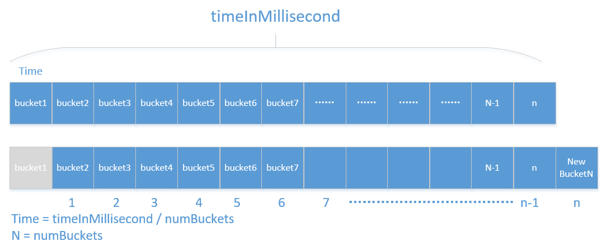   
                        
当系统时钟通过一个Time时，就会判断n == numBuckets是否相等，如果相等，则第一个Bucket将被舍弃，同时创建一个新的Bucket，将这个Time时间内的所有维度在该Bucket内进行计数统计。

* metrics.rollingStats.numBuckets: 该属性表示的上文中提到的Bucket数量                     
                          

##  熔断器原理分析

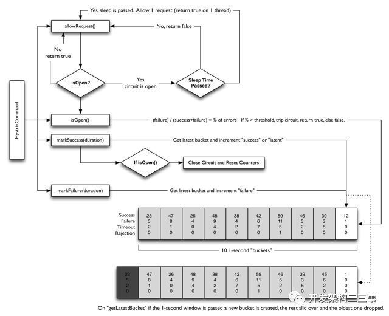

熔断器部分主要依赖两点，状态变化和滑动窗口+bucket的统计机制

1. 通过HystrixCommandProperties.circuitBreakerRequestVolumeThreshold())设置临界值
2. HystrixCommandProperties.circuitBreakerErrorThresholdPercentage():允许错误超过临界值的百分比
3. Then the circuit-breaker transitions from CLOSED to OPEN.
4. While it is open, it short-circuits all requests made against that circuit-breaker.
5. After some amount of time (HystrixCommandProperties.circuitBreakerSleepWindowInMilliseconds()), the next single request is let through (this is the HALF-OPEN state). If the request fails, the circuit-breaker returns to the OPEN state for the duration of the sleep window. If the request succeeds, the circuit-breaker transitions to CLOSED and the logic in 1. takes over again.

基于滑动窗口和桶来实现。滑动窗口相当于一个时间窗，在这个时间窗中会有很多请求进入，如果每进入一个请求就统计一次这个时间窗的请求总数会有较低的性能，所以将这个时间窗口分成 十份，每份是一个桶，时间窗滑动到每个桶结束点时就统计一下这个桶内的请求数，就可以统计出整个窗口的请求数了。bucket(桶)一般是窗口的N分之一。


## 整个Hystrix的流程图：

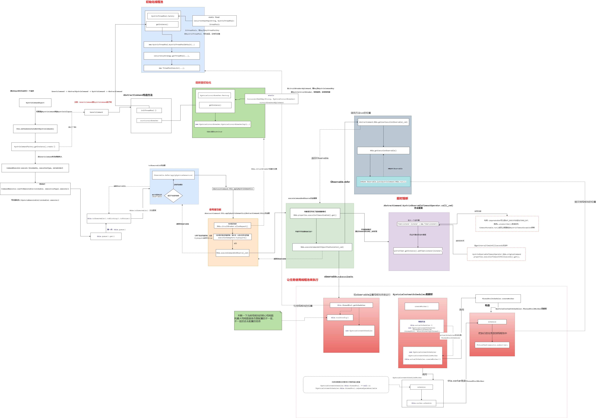

## 全局配置

```
hystrix:
  command: #用于控制HystrixCommand的行为
    default:
      execution:
        isolation:
          strategy: THREAD #控制HystrixCommand的隔离策略，THREAD->线程池隔离策略(默认)，SEMAPHORE->信号量隔离策略
          thread:
            timeoutInMilliseconds: 1000 #配置HystrixCommand执行的超时时间，执行超过该时间会进行服务降级处理
            interruptOnTimeout: true #配置HystrixCommand执行超时的时候是否要中断
            interruptOnCancel: true #配置HystrixCommand执行被取消的时候是否要中断
          timeout:
            enabled: true #配置HystrixCommand的执行是否启用超时时间
          semaphore:
            maxConcurrentRequests: 10 #当使用信号量隔离策略时，用来控制并发量的大小，超过该并发量的请求会被拒绝
      fallback:
        enabled: true #用于控制是否启用服务降级
      circuitBreaker: #用于控制HystrixCircuitBreaker的行为
        enabled: true #用于控制断路器是否跟踪健康状况以及熔断请求
        requestVolumeThreshold: 20 #超过该请求数的请求会被拒绝
        forceOpen: false #强制打开断路器，拒绝所有请求
        forceClosed: false #强制关闭断路器，接收所有请求
      requestCache:
        enabled: true #用于控制是否开启请求缓存
  collapser: #用于控制HystrixCollapser的执行行为
    default:
      maxRequestsInBatch: 100 #控制一次合并请求合并的最大请求数
      timerDelayinMilliseconds: 10 #控制多少毫秒内的请求会被合并成一个
      requestCache:
        enabled: true #控制合并请求是否开启缓存
  threadpool: #用于控制HystrixCommand执行所在线程池的行为
    default:
      coreSize: 10 #线程池的核心线程数
      maximumSize: 10 #线程池的最大线程数，超过该线程数的请求会被拒绝
      maxQueueSize: -1 #用于设置线程池的最大队列大小，-1采用SynchronousQueue，其他正数采用LinkedBlockingQueue
      queueSizeRejectionThreshold: 5 #用于设置线程池队列的拒绝阀值，由于LinkedBlockingQueue不能动态改版大小，使用时需要用该参数来控制线程数
```

> 实例配置只需要将全局配置中的default换成与之对应的key即可。

```
hystrix:
  command:
    HystrixComandKey: #将default换成HystrixComrnandKey
      execution:
        isolation:
          strategy: THREAD
  collapser:
    HystrixCollapserKey: #将default换成HystrixCollapserKey
      maxRequestsInBatch: 100
  threadpool:
    HystrixThreadPoolKey: #将default换成HystrixThreadPoolKey
      coreSize: 10
```

配置文件中相关key的说明

HystrixComandKey对应@HystrixCommand中的commandKey属性；

HystrixCollapserKey对应@HystrixCollapser注解中的collapserKey属性；

HystrixThreadPoolKey对应@HystrixCommand中的threadPoolKey属性。

#### 配置的优先级
  
> 配置文件的优先级 > java代码的配置方式 > netflix自定义的配置方式


在1.2.5版本的HystrixFeignConfiguration中
默认值为true在1.3.1版本的HystrixFeignConfiguration中默认值为false

feign.hystrix.enabled = true
可以启用它。


Spring cloud 启动断路器（@EnableCircuitBreaker）后可能会报如下错误

```
NoClassDefFoundError: com/netflix/hystrix/exception/HystrixRuntimeException
```

解决办法修改如下版本
```
<dependency>-->
            <groupId>com.netflix.hystrix</groupId>
            <artifactId>hystrix-core</artifactId>
            <version>1.5.12</version>
        </dependency>
```


```
ribbon:
  MaxAutoRetries: 1 #最大重试次数，当Eureka中可以找到服务，但是服务连不上时将会重试
  MaxAutoRetriesNextServer: 1 #切换实例的重试次数
  OkToRetryOnAllOperations: true # 对所有的操作请求都进行重试，如果是get则可以，如果是post,put等操作没有实现幂等的情况下是很危险的
  ConnectTimeout: 250 #请求连接的超时时间
  ReadTimeout: 1000 #请求处理的超时时间
```

根据上面的参数计算重试的次数：

MaxAutoRetries+MaxAutoRetriesNextServer+(MaxAutoRetries *MaxAutoRetriesNextServer)

即重试3次 则一共产生4次调用 。

如果在重试期间，时间超过了hystrix的超时时间，便会立即执行熔断，fallback。所以要根据上面配置的参数计算hystrix的超时时间，使得在重试期间不能达到hystrix的超时时间，不然重试机制就会没有意义 

先说明一下，不要用下面这种公式来配置hystrix的超时时间，不要，不要，重要的事情说3次：

hystrix超时时间的计算： (1 + MaxAutoRetries + MaxAutoRetriesNextServer) * ReadTimeout 即按照以上的配置 hystrix的超时时间应该配置为 （1+1+1）*3=9秒

正确的计算公式：

ReadTimeout+（MaxAutoRetries * ReadTimeout），如果配置的有：MaxAutoRetriesNextServer这个属性，看下面例子：

这个hystrix的超时时间怎么配置：

ReadTimeout+（MaxAutoRetries * ReadTimeout）+ ReadTimeout+（MaxAutoRetries * ReadTimeout）= 4000ms

那么hystrix的超时时间为：>4000ms

如果MaxAutoRetriesNextServer=1，就加1个：

ReadTimeout+（MaxAutoRetries * ReadTimeout）+ ReadTimeout+（MaxAutoRetries * ReadTimeout）= 4000ms

如果MaxAutoRetriesNextServer=2，就加2个：

ReadTimeout+（MaxAutoRetries * ReadTimeout）+ ReadTimeout+（MaxAutoRetries * ReadTimeout）+ ReadTimeout+（MaxAutoRetries * ReadTimeout）= 6000ms

先算出所有ribbon的超时时间+重试时间的总和，那么hystrix的超时时间大于总和，就可以保证ribbon在重试过程中不会被hystrix熔断。

当ribbon超时后且hystrix没有超时，便会采取重试机制。当OkToRetryOnAllOperations设置为false时，只会对get请求进行重试。如果设置为true，便会对所有的请求进行重试，如果是put或post等写操作，如果服务器接口没做幂等性，会产生不好的结果，所以OkToRetryOnAllOperations慎用。如果不配置ribbon的重试次数，默认会重试一次 。


一、生产环境线程池的配置的问题
    生产环境里面，一个是线程池的大小怎么设置，timeout时长如果设置不合理的话，会出现很多问题
        1.超时时间太短低于服务的平均响应时间，正常的功能都无法执行。
        2.超时时间太长，浪费系统资源，影响系统的性能
二、如何才能获取线程池合适的配置
    接口访问量的不同也导致了线程池配置的不同
    在生产环境中部署一个短路器，一开始需要将一些关键配置设置的大一些，比如Timeout超时时长，线程池大小，或信号量容量（这是Hystrix资源隔离的两种方式：线程池和信号量），然后逐渐优化这些配置，直到在一个生产系统中运作良好
        1.一开始先不要设置Timeout超时时长，默认就是1000ms，也就是1s
        2.一开始也不要设置线程池大小，默认就是10
        3.直接部署Hystrix到生产环境，如果运行的很良好，那么就让它这样运行好了
        4.让Hystrix应用，24小时运行在生产环境中
        5.依赖标准的监控和报警机制来捕获到系统的异常运行情况
        6.在24小时之后，看一下调用延迟的占比，以及流量，来计算出让短路器生效的最小的配置数字
        7.直接对Hystrix配置进行热修改，然后继续在Hystrix Dashboard上监控
        8.看看修改配置后的系统表现有没有改善

三、配置经验
    下面是根据系统表现优化和调整线程池大小，队列大小，信号量容量，以及timeout超时时间的经验：
        1.假设对一个依赖服务的高峰调用QPS是每秒30次一开始如果默认的线程池大小是10。
        2.我们想的是，理想情况下，每秒的高峰访问次数 * 99%的访问延时 + buffer = 30 * 0.2 + 4 = 10线程，10个线程每秒处理30次访问应该足够了，每个线程处理3次访问
        3.此时，我们合理的timeout设置应该为300ms，也就是99.5%的访问延时，计算方法是，因为判断每次访问延时最多在250ms（TP99如果是200ms的话），再加一次重试时间50ms，就是300ms，感觉也应该足够了
        4.因为如果timeout设置的太多了，比如400ms，比如如果实际上，在高峰期，还有网络情况较差的时候，可能每次调用要耗费350ms，也就是达到了最长的访问时长
        5.那么每个线程处理2个请求，就会执行700ms，然后处理第三个请求的时候，就超过1秒钟了，此时会导致线程池全部被占满，都在处理请求。这个时候下一秒的30个请求再进来了，那么就会导致线程池已满，拒绝请求的情况，就会调用fallback降级机制
        6.因此对于短路器来说，timeout超时一般应该设置成TP99.5，比如设置成300ms，那么可以确保说，10个线程，每个线程处理3个访问，每个访问最多就允许执行300ms，过时就timeout了。这样才能保证说每个线程都在1s内执行完，才不会导致线程池被占满，然后后续的请求过来大量的reject
        7.对于线程池大小来说，一般应该控制在10个左右，20个以内，最少5个，不要太多，也不要太少。大家可能会想，每秒的高峰访问次数是30次，如果是300次，甚至是3000次，30000次呢？？？30000 * 0.2 = 6000 + buffer = 6100，一个服务器内一个线程池给6000个线程把。如果你一个依赖服务占据的线程数量太多的话，会导致其他的依赖服务对应的线程池里没有资源可以用了
            6000 / 20 = 300台虚拟机也是ok的
            虚拟机，4个cpu core，4G内存，虚拟机，300台
            物理机，十几个cpu core，几十个G的内存，5~8个虚拟机，300个虚拟机 = 50台物理机


    你要真的说是，你的公司服务的用户量，或者数据量，或者请求量，真要是到了每秒几万的QPS，3万QPS，60 * 3 = 180万访问量，1800，1亿8千，1亿，10个小时，10亿的访问量
    app，系统几十台服务器去支撑，我觉得很正常QPS每秒在几千都算多的了

 

PS：Hystrix资源隔离线程池有一个配置，A、B线程池都有有20个线程，但某一时刻A线程池访问较多，B线程池20个线程并未全部使用，可以配置让A借用B线程池的线程

