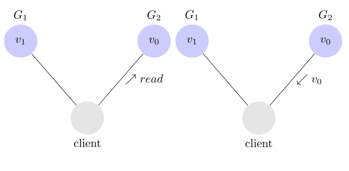

# CAP

## CAP 定理的含义

分布式系统（distributed system）正变得越来越重要，大型网站几乎都是分布式的。

分布式系统的最大难点，就是各个节点的状态如何同步。CAP 定理是这方面的基本定理，也是理解分布式系统的起点。

本文介绍该定理。它其实很好懂，而且是显而易见的。

## 一、分布式系统的三个指标


1998年，加州大学的计算机科学家 Eric Brewer 提出，分布式系统有三个指标。

```text
Consistency
Availability
Partition tolerance
```

它们的第一个字母分别是 C、A、P。

Eric Brewer 说，这三个指标不可能同时做到。这个结论就叫做 CAP 定理。

## 二、Partition tolerance

先看 Partition tolerance，中文叫做"分区容错"。

大多数分布式系统都分布在多个子网络。每个子网络就叫做一个区（partition）。
分区容错的意思是，区间通信可能失败。
比如，一台服务器放在中国，另一台服务器放在美国，这就是两个区，它们之间可能无法通信。


上图中，G1 和 G2 是两台跨区的服务器。G1 向 G2 发送一条消息，G2 可能无法收到。
系统设计的时候，必须考虑到这种情况。

一般来说，分区容错无法避免，因此可以认为 CAP 的 P 总是成立。
CAP 定理告诉我们，剩下的 C 和 A 无法同时做到。

## 三、Consistency

Consistency 中文叫做"一致性"。
意思是，写操作之后的读操作，必须返回该值。举例来说，某条记录是 v0，用户向 G1 发起一个写操作，将其改为 v1。


接下来，用户的读操作就会得到 v1。这就叫一致性


问题是，用户有可能向 G2 发起读操作，由于 G2 的值没有发生变化，因此返回的是 v0。G1 和 G2 读操作的结果不一致，这就不满足一致性了。



为了让 G2 也能变为 v1，就要在 G1 写操作的时候，让 G1 向 G2 发送一条消息，要求 G2 也改成 v1。


这样的话，用户向 G2 发起读操作，也能得到 v1。


## 四、Availability

Availability 中文叫做"可用性"，意思是只要收到用户的请求，服务器就必须给出回应。

用户可以选择向 G1 或 G2 发起读操作。不管是哪台服务器，只要收到请求，就必须告诉用户，到底是 v0 还是 v1，否则就不满足可用性。

## 五、Consistency 和 Availability 的矛盾

一致性和可用性，为什么不可能同时成立？答案很简单，因为可能通信失败（即出现分区容错）。

如果保证 G2 的一致性，那么 G1 必须在写操作时，锁定 G2 的读操作和写操作。只有数据同步后，才能重新开放读写。锁定期间，G2 不能读写，没有可用性不。

如果保证 G2 的可用性，那么势必不能锁定 G2，所以一致性不成立。

综上所述，G2 无法同时做到一致性和可用性。系统设计时只能选择一个目标。如果追求一致性，那么无法保证所有节点的可用性；如果追求所有节点的可用性，那就没法做到一致性。

## 六 


#### RDBMS(mysql/oracle/sqlServer)>ACID

A(Atomicity)原子性

C(Consistency)一致性

I(Isolation)独立性

D(Durability)持久性


#### NOSQL(redis/mongdb)========>CAP

C(Consistency)强一致性

A(Availability)可用性

P(Partition tolerance)分区容错性

最多只能同时较号的满足两个

CAP理论的核心是：一个分布式系统不可能同时满足一致性、可用性、和分区容错行这三个需求，因此，根据CAP原理将NoSQL数据库分成了满足CA原则、满足CP原则和满足AP原则三大类；

CA-单点集群，满足一致性，可用性的系统，通常在可扩展性上不太强大。

CP-满足一致性，分区容错的系统，通常性能不是特别高

AP-满足可用性，分区容错性的系统，通常可能对一致性要求低一些

###### CAP的3进2
CAP理论就是说在分布式存储系统中，最多只能实现上面的两点。而由于当前的网络硬件肯定会出现延时丢包等问题，所以分区容错性是我们必须要实现的。
所以我们只能在一致性和可用性之间进行权衡，没有NoSQL系统能同时保证这三点。


