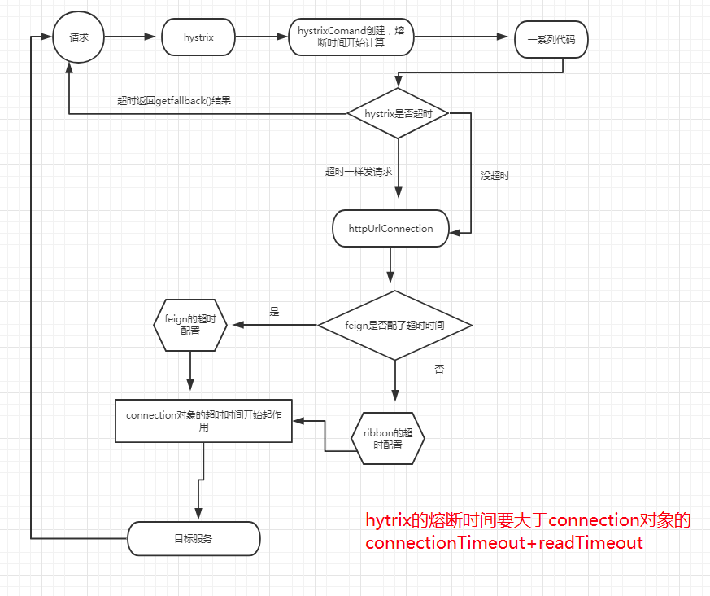

# feign


Feign是一个声明式的Web服务客户端。这使得Web服务客户端的写入更加方便 要使用Feign创建一个界面并对其进行注释。它具有可插拔注释支持，包括Feign注释和JAX-RS注释。Feign还支持可插拔编码器和解码器。
Spring Cloud添加了对Spring MVC注释的支持，并在Spring Web中使用默认使用的HttpMessageConverters。Spring Cloud集成Ribbon和Eureka以在使用Feign时提供负载均衡的http客户端。

### feign核心类介绍

* feign.Feign.Builder 设置发送http请求的相关参数，比如http客户端，重试策略，编解码，超时时间等等
* feign.Contract.Default 解析接口方法的元数据，构建http请求模板
* feign.Client 发送http请求客户端，默认实现feign.Client.Default，使用的是java.net包实现的
* Retryer 重试，默认实现feign.Retryer.Default，超时延迟100ms开始重试，每隔1s重试一次，重试4次
* Options 超时时间，默认连接超时10s，读超时60s
* feign.codec.Encoder 编码器
* feign.codec.Decoder 解码器
* RequestInterceptor 请求拦截器，可以在发送http请求之前执行此拦截器
* feign.Contract 接口以及方法元数据解析器

以上参数都可以自己扩展

* HardCodedTarget 定于目标接口和url
* ReflectiveFeign 生成动态代理类，基于jdk的动态代理实现
* feign.InvocationHandlerFactory.Default 接口方法统一拦截器创建工厂
* FeignInvocationHandler 接口统一方法拦截器
* ParseHandlersByName 解析接口方法元数据
* SynchronousMethodHandler.Factory 接口方法的拦截器创建工厂
* SynchronousMethodHandler 接口方法的拦截器，真正拦截的核心，这里真正发起http请求，处理返回结果

## 

1. 通过feign.Feign.Builder为我们设置http请求的相关参数，比如http客户端，重试策略，编解码，超时时间，这里都是面向接口编程实现的，我们很容易的进行扩展，比如http客户端，可以使用java原生的实现，也可以使用apache httpclient，亦可以使用okHttpClient，自己喜欢就好，其他属性亦是如此，由此看出feign的设计具有非常好的可扩展性。
2. ReflectiveFeign内部使用了jdk的动态代理为目标接口生成了一个动态代理类，这里会生成一个InvocationHandler(jdk动态代理原理)统一的方法拦截器，同时为接口的每个方法生成一个SynchronousMethodHandler拦截器，并解析方法上的 元数据，生成一个http请求模板。
3. 当发起方法调用的时候，被统一的方法拦截器FeignInvocationHandler拦截，再根据不同的方法委托给不同的SynchronousMethodHandler拦截器处理。
4. 根据每次方法调用的入参生成http请求模板，如果设置了http请求拦截器，则先经历拦截器的处理，再发起真正的http请求，得到结果后会根据方法放入返回值进行反序列化，最后返回给调用方。
5. 如果发生了异常，会根据重试策略进行重试。

feign也整合了Hystrix，实现熔断降级的功能，其实也很简单，上面的分析我们知道了feign在方法调用的时候会经过统一方法拦截器FeignInvocationHandler的处理，而HystrixFeign则是使用了HystrixInvocationHandler代替，在方法调用的时候进行Hystrix的封装，这里需要特别说明下：

* Hystrix有超时时间，feign本身也有超时时间，正常来说Hystrix的超时间要大于feign的超时时间，如果是小于的话，Hytrix已经超时了，feign再等待就已经没有意义了。
* 再则就是feign超时的话会触发重试操作，此时要是Hytrix发生超时异常返回了，但这并不会切断feign的继续操作，什么意思呢？假设Hytrix的超时时间为1s，feign设置的超时时间为2s，而真正业务操作需要耗时3s，这时Hytrix超时异常返回，而后feign也会发生超时异常，但是feign会根据超时策略继续进行重试操作，并不会因为Hytrix的中断而中断。
所以Hytrix的超时时间一般要大于feign的总超时时间，如这个例子中要设置2 * 5(默认重试次数4 + 1)=10s，公式就是Hytrix的超时间=feign的超时时间 乘以 (feign的重试次数 + 1)


## spring-cloud-feign

#### 开启@EnableFeignClients注解到底给我们做了什么事情呢？

1. 扫描EnableFeignClients注解上的配置信息，注册默认的配置类，这个配置类是对所有feignclient的都是生效的，即为全局的配置。
2. 扫描带有@FeignClient注解的接口，并注册配置类（此时的配置类针对当前feignclient生效）和FeignClientFactoryBean，此bean实现了FactoryBean接口，我们知道spring有两种类型的bean对象，一种是普通的bean，另一种则是工厂bean（FactoryBean），它返回的其实是getObject方法返回的对象（更多关于FactoryBean的相关信息请查看spring官方文档）。getObject方法就是集成原生feign的核心方法，当spring注入feignclient接口时，getObject方法会被调用，得到接口的代理类。

> 备注：在FeignClient指定配置类时，切记不要被spring容器扫描到，不然会对全局生效。

#### 自动加载配置类

自动加载配置类FeignAutoConfiguration，FeignClientsConfiguration，FeignRibbonClientAutoConfiguration，
这三个类为feign提供了所有的配置类，默认情况下所加载的类情况：

* feign.Feign.Builder 当引入了Hytrix并开启参数feign.hystrix.enabled=true后，则会加载feign.hystrix.HystrixFeign.Builder，此时feign就具备降级熔断的功能了。
* feign.Client 此实现类的加载分两种情况：
   * 使用url方式：feign.Client.Default，使用java原生的方式（java.net包）发起http请求，也可以自己扩展。
   * 使用name方式：LoadBalancerFeignClient，集成了ribbon，实现服务发现与负载均衡，但是真正发起http请求还是java原生的方式
   * 此处是一扩展点，当我们引入ApacheHttpClient时，http客户端就会使用apache的httpClient；当我们引入OkHttpClient时，http客户端就会使用okhttp3.OkHttpClient。
* feign.Retryer 默认Retryer.NEVER_RETRY，不进行重试，这里也可以自己实现Retryer接口实现自己的重试策略，但是feign在集成了ribbon的情况下，最好保持默认不进行重试，因为ribbon也会有重试策略，如果feign也开启重试，容易产生混乱；其实在低版本中spring-cloud-feing重试默认并不是NEVER_RETRY，可能spring-cloud-feing也意识到这样做的问题，所以在D版中改成NEVER_RETRY了。
* feign.Request.Options 默认设置连接超时时间是10，读超时时间是60s。这里也可以更改，分两种情况：
   * 使用url方式：必须通过这个参数来设置，才生效
  
```
@Configuration
public class MyConfig {
    @Bean
    public Request.Options options(){
        Request.Options o = new Options(1000, 1000);
        return o;
    }
}
```

然后在注解上@FeignClient指定：

```
@FeignClient(name="",url="",configuration= {MyConfig.class})

```
注意此类不能被spring容器扫描到，否则会对全局生效。你也可以通过注解@EnableFeignClients来全局指定

```
@EnableFeignClients(defaultConfiguration=MyConfig.class)

```

   * 使用name方式：此时已经集成了ribbon，可以使用以下配置来设置，如果你此时也配置了Options，以下配置会被覆盖
   
```
# 对所有的feignclient生效
ribbon.ReadTimeout=10000
ribbon.ConnectTimeout=2000

# 对指定的feignclien生效
[feignclientName].ribbon.ReadTimeout=10000
[feignclientName].ribbon.ConnectTimeout=2000
```

如果开启Hytrix，hytrix也有超时时间设置，但是hytrix是封装在feign基础之上的，上文已有分析。

```
hystrix.command.default.execution.isolation.thread.timeoutInMilliseconds=10000
```

你也可以关闭hytrix的超时时间
```
hystrix.command.default.execution.timeout.enabled=false

```

* feign.codec.Decoder 解码器，默认使用了HttpMessageConverters来实现
* feign.codec.Encoder 编码器，默认使用了HttpMessageConverters来实现
* feign.Contract 默认提供springmvc的注解解析，支持@RequestMapping，@RequestBody，@RequestParam，@PathVariable

最后三种也是spring-cloud-feign替换原生feign的默认实现，对springMVC的相关支持


 Options对象经过getClientConfig(options, clientName) 方法，就从10s的连接时间变成了1s,60s的读取时间也变成了1s,上面源码分析可以知道：

如果我们配置了feign的超时时间，那么就会以我们配置的时间为准，如果没有配置，那么就取ribbon的超时时间，2者只能有一个生效，而ribbon默认超时时间是1秒

feign或者ribbon所配置的超时时间，最终都是在HttpUrlConnection中生效

那么，我们如何修改feign的配置时间呢？

```
@Configuration
public class Config {
    @Bean
    public Request.Options feignRequestOptions() {
        Request.Options options = new Request.Options(2000, TimeUnit.MILLISECONDS,
                2000, TimeUnit.MILLISECONDS,
                true);

        return  options;
    }

}
```

Hystrix的熔断时间要大于Feign或Ribbon的connectTimeout+readTimeout

feign的超时时间如果要在application.yml中配置，改如何配置呢：

```
feign:
  hystrix:
    enabled: true
  client:
    config:
      default:
        #连接到目标的时间，此处会收到注册中心启动中的影响。设置为3秒钟，如果注册中心有明显的不在线，基本是毫秒级熔断拒绝
        connectTimeout: 3000
        #获取目标连接后执行的最长时间，设置为32秒，即服务最长时
        readTimeout: 32000
```

 那么有人要问了，如果feign和ribbon同时配置，那么以谁的为准
 
  最后总结：
 
 hystrix的熔断时间配置通过yml配置没法生效，可以通过配置类的方法来修改，feign的超时时间可以通过代码或者yml配置，ribbon的超时时间可以通过yml来配置
 
 feign和ribbon的超时时间只能二选一，只要feign的超时时间配置了，就以feign的为准，hystrix的超时时间要大于feign/riboon的connectTimeout+readTimeout的和
 
 
 最后一张图来总结：
 





目前的学习和测试结果来看：

单纯的 Ribbon + Hystrix 搭配使用时，配置是最灵活的，两者没有相互干涉，可以自由定义 commandKey 来实现超时时间的配置

Feign + Hystrix 搭配时，由于 Feign 封装了 Hystrix 所需的 commandKey，我们不能自定义，所以同一个 FeignClient 下的服务接口不能方便的统一配置，如果有相应的业务需求，或许只能对每个特殊的接口方法做独立的超时配置（找到新方法的话再回来更新）

Zuul + Hystrix 搭配时，和上述的情况相反，能对不同服务实例做不同的超时配置，但不能再细化到服务下的具体接口方法