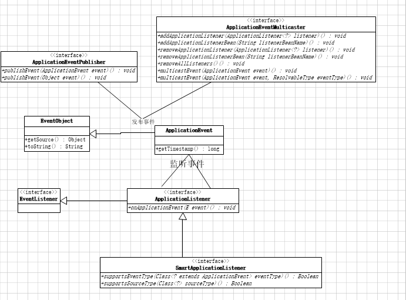

# ZUUL

```yaml

#网关
zuul:
  ribbon:
    eager-load:
      enabled: true #zuul饥饿加载
  host:
    max-total-connections: 200
    max-per-route-connections: 20
    #以下两个配置也是解决zuul超时的
    #和使用ribbon.ReadTimeout的区别是，如果路由配置使用service-id的方式，那么ribbon.ReadTimeout生效，如果使用url的方式，此配置生效
    connect-timeout-millis: 10000
    socket-timeout-millis: 10000
 
#配置Ribbon的超时时间
ribbon:
  ReadTimeout: 10000
  ConnectTimeout: 10000
#  MaxAutoRetries: 1
#  MaxAutoRetriesNextServer: 1
 
hystrix:
  command:
    default:
      execution:
        isolation:
          strategy: SEMAPHORE
          #配置hystrix的超时时间
          thread:
            timeoutInMilliseconds: 20000
```
访问的时候提示错误：

```text
The Hystrix timeout of 20000ms for the command uaa-service is set lower than the combination of the Ribbon read and connect timeout, 40000ms.
```

分析：

Ribbon 总超时时间计算公式如下：

```text
ribbonTimeout = (RibbonReadTimeout + RibbonConnectTimeout) * (MaxAutoRetries + 1) * (MaxAutoRetriesNextServer + 1)
```

其中，MaxAutoRetries 默认为0，MaxAutoRetriesNextServer 默认为1，所以我这里的具体值为：（10000+10000）*（0+1）*（1+1）=40000。

而 Hystrix 超时时间为 20000 < 40000，从逻辑上来讲，hystrixTimeout 要大于 ribbonTimeout，否则 hystrix 熔断了以后，ribbon 的重试就都没有意义了。


为什么不自己是手动重新加载Locator.dorefresh？非要用事件去刷新？这牵扯到内部的zuul内部组件的工作流程，不仅仅是Locator本身的一个变量，具体想要了解的还得去看源码。下面我们就来分析下zuul的源码看看为什么要这样做？
要讲清楚zuul的事件驱动模型，还得知道spring的事件驱动模型，因为zuul的实现正是利用了spring的事件驱动模型实现的。下面看看spring提供的事件模型图：



在zuul中有这样一个实现了ApplicationListener的监听器ZuulRefreshListener ，代码如下

```
private static class ZuulRefreshListener implements ApplicationListener<ApplicationEvent> {

        @Autowired
        private ZuulHandlerMapping zuulHandlerMapping;

        private HeartbeatMonitor heartbeatMonitor = new HeartbeatMonitor();

        @Override
        public void onApplicationEvent(ApplicationEvent event) {
            if (event instanceof ContextRefreshedEvent
                    || event instanceof RefreshScopeRefreshedEvent
                    || event instanceof RoutesRefreshedEvent) {
                this.zuulHandlerMapping.setDirty(true);
            }
            else if (event instanceof HeartbeatEvent) {
                if (this.heartbeatMonitor.update(((HeartbeatEvent) event).getValue())) {
                    this.zuulHandlerMapping.setDirty(true);
                }
            }
        }

    }
```

由此可知在发生ContextRefreshedEvent和RoutesRefreshedEvent事件时会执行this.zuulHandlerMapping.setDirty(true);

```
public void setDirty(boolean dirty) {
        this.dirty = dirty;
        if (this.routeLocator instanceof RefreshableRouteLocator) {
            ((RefreshableRouteLocator) this.routeLocator).refresh();
        }
    }


```

这样在spring容器启动完成后就刷新了路由规则。因此我们如果要主动刷新路由规则，只需要发布一个RoutesRefreshedEvent事件即可，代码如下

```
public void refreshRoute() {
        RoutesRefreshedEvent routesRefreshedEvent = new RoutesRefreshedEvent(routeLocator);
        this.publisher.publishEvent(routesRefreshedEvent);
        logger.info("刷新了路由规则......");
    }
```


我们知道spring-cloud-zuul是依赖springMVC来注册路由的，而springMVC又是在建立在servlet之上的），在servlet3.0之前使用的是thread per connection方式处理请求，就是每一个请求需要servlet容器为其分配一个线程来处理，直到响应完用户请求，才被释放回容器线程池，如果后端业务处理比较耗时，那么这个线程将会被一直阻塞，不能干其他事情，如果耗时请求比较多时，servlet容器线程将被耗尽，也就无法处理新的请求了，所以Netflix还专门开发了一个熔断的组件Hystrix 来保护这样的服务，防止其因后端的一些慢服务耗尽资源，造成服务不可用。
不过在servlet3.0出来之后支持异步servlet了，可以把业务操作放到独立的线程池里面去，
这样可以尽快释放servlet线程，springMVC本身也支持异步servlet了

