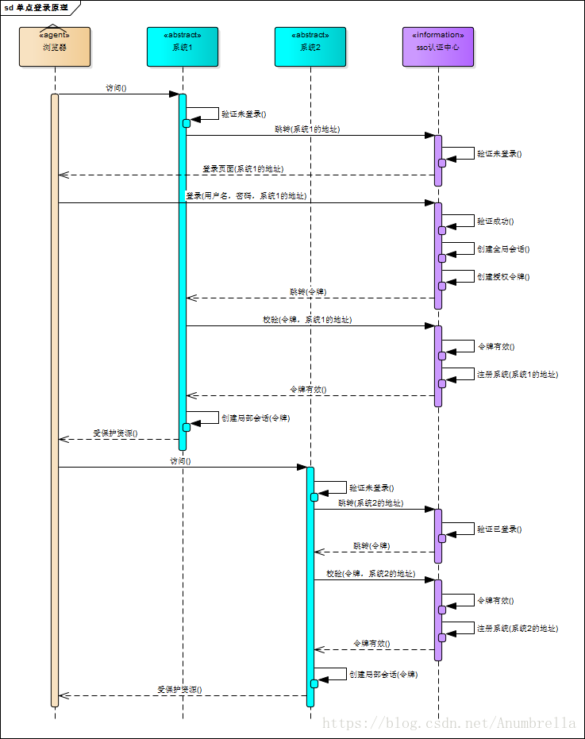
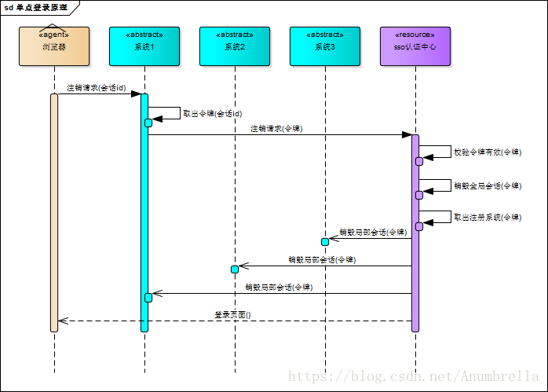
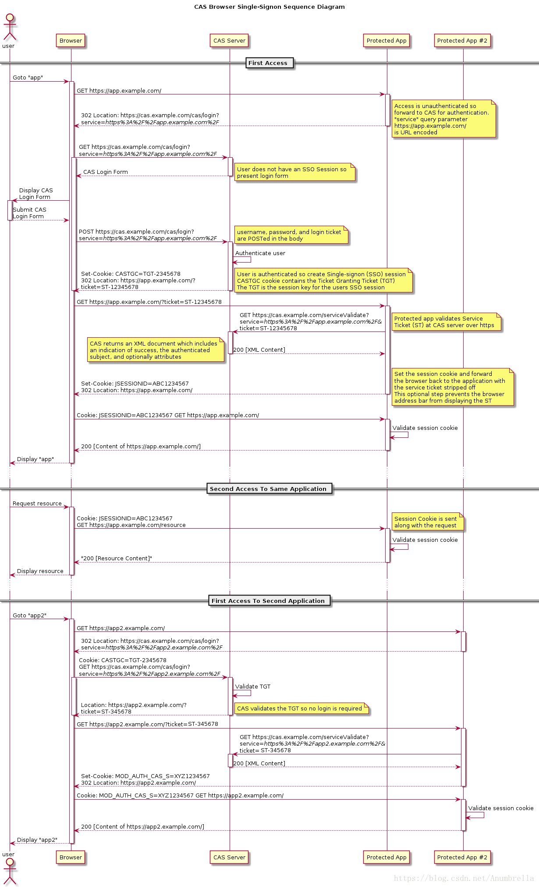
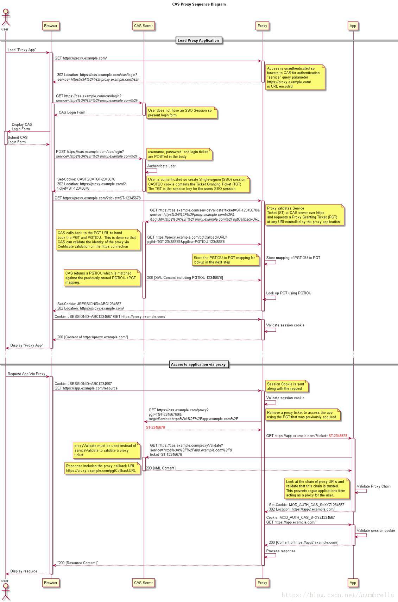

# 初识SSO

## 一、初识CAS
   首先我们来说一下CAS，CAS全称为Central Authentication Service即中央认证服务，是一个企业多语言单点登录的解决方案，并努力去成为一个身份验证和授权需求的综合平台。
   
   CAS是由Yale大学发起的一个企业级的、开源的项目，旨在为Web应用系统提供一种可靠的单点登录解决方法（属于 Web SSO ）。
   
   CAS协议至少涉及三方：客户端Web浏览器，请求身份验证的Web应用程序和CAS服务器。 它也可能涉及后端服务，如数据库服务器，它没有自己的HTTP接口，但与Web应用程序进行通信。

#### 主要特征：

* 多种的协议的支持，包括CAS (v1、v2、v3)、SAML(v1、v2)、OAuth、OpenID、OpenID Connect和WS-Federation Passive Requestor
     
* 多种认证机制，可以通过JAAS，LDAP，RDBMS，X.509，Radius，SPNEGO，JWT，Remote，Trusted，BASIC，Apache Shiro，MongoDB，Pac4J等进行身份验证
     
* 可以通过WS-FED，Facebook，Twitter，SAML IdP，OpenID，OpenID Connect，CAS等代理委派认证
     
* 多种形式的授权包括ABAC, Time/Date, REST, Internet2’s Grouper等
     
* 同时也支持HAZELCAST、EHCache、JPA、MycCache、Apache IGITE、MangGDB、ReDIS、DimoDoB、Couchbase等实现高可用多个集群部署
     
* 各种丰富的客户端，像常见的Java、Python、Node、PHP、C#、Perl等等

## SSO简介

单点登录（ Single Sign-On , 简称 SSO ）是多个相关但独立的软件系统访问控制的一个属性。通过使用该属性，用户登录与单个ID和密码来访问所连接的一个或多个系统，而不使用不同的用户名或密码，或在某些配置中无缝登录在每个系统上，它是比较流行的服务于企业业务整合的一种解决方案。总结一句话，SSO 使得在多个应用系统中，用户只需要 **登录一次 **就可以访问所有相互信任的应用系统。

举个栗子：阿里巴巴旗下的淘宝网，你在浏览器里登录了，打开阿里云或者天猫就会发现可以不用在登录了，这里就是使用了SSO。

在SSO体系中，主要包括三部分：

1. User （多个）
2. Web 应用（多个）
3. SSO 认证中心（ 1 个）

而SSO的实现基本核心原则如下：

* 所有的登录都在 SSO 认证中心进行
* SSO 认证中心通过一些方法来告诉 Web 应用当前访问用户究竟是不是已通过认证的用户
* SSO 认证中心和所有的 Web 应用建立一种信任关系， SSO 认证中心对用户身份正确性的判断会通过某种方法告之 Web 应用，而且判断结果必须被 Web 应用信任。

## SSO原理

#### 登录
上面介绍我们知道，在SSO中有一个独立的认证中心，只有认证中心能接受用户的用户名密码等安全信息，其他系统不提供登录入口，只接受认证中心的间接授权。那其他的系统如何访问受保护的资源？这里就是通过认证中心间接授权通过令牌来实现，当SSO验证了用户信息的正确性后，就会创建授权令牌，在接下来的跳转过程中，授权令牌作为参数发送给各个子系统，子系统拿到令牌，即得到了授权，可以借此创建局部会话，局部会话登录方式与单系统的登录方式相同。

上面是一张SSO登录原理图，下面我们来分析一下具体的流程：

1. 首先用户访问系统1受保护的资源，系统1发现未登陆，跳转至SSO认证中心，并将自己的参数传递过去
2. SSO认证中心发现用户未登录，将用户引导至登录页面
3. 用户输入用户名和密码提交至SSO认证中心
4. SSO认证中心校验用户信息，创建用户与SSO认证中心之间的会话，称为全局会话，同时创建授权令牌
5. SSO认证中心带着令牌跳转会最初的请求地址（系统1）
6. 系统1拿到令牌，去SSO认证中心校验令牌是否有效
7. SSO认证中心校验令牌，返回有效，注册系统1的地址
8. 系统1使用该令牌创建与用户的会话，称为局部会话，返回给用户受保护资源
9. 用户访问系统2受保护的资源
10. 系统2发现用户未登录，跳转至SSO认证中心，并将自己的地址作为参数传递过去
11. SSO认证中心发现用户已登录，跳转回系统2的地址，并附上令牌
12. 系统2拿到令牌，去SSO认证中心校验令牌是否有效
13. SSO认证中心校验令牌，返回有效，注册系统2地址
14. 系统2使用该令牌创建与用户的局部会话，返回给用户受保护资源

用户登录成功之后，会与SSO认证中心及各个子系统建立会话，用户与SSO认证中心建立的会话称为全局会话，用户与各个子系统建立的会话称为局部会话，局部会话建立之后，用户访问子系统受保护资源将不再通过SSO认证中心，全局会话与局部会话有如下约束关系：

* 局部会话存在，全局会话一定存在
* 全局会话存在，局部会话不一定存在
* 全局会话销毁，局部会话必须销毁

#### 注销

既然有登陆那么就自然有注销，单点登录也要单点注销，在一个子系统中注销，所有子系统的会话都将被销毁。原理图如下：

SSO认证中心一直监听全局会话的状态，一旦全局会话销毁，监听器将通知所有注册系统执行注销操作

同样的我们也来分析一下具体的流程：

1. 用户向系统1发起注销请求
2. 系统1根据用户与系统1建立的会话id拿到令牌，向SSO认证中心发起注销请求
3. SSO认证中心校验令牌有效，销毁全局会话，同时取出所有用此令牌注册的系统地址
4. SSO认证中心向所有注册系统发起注销请求
5. 各注册系统接收SSO认证中心的注销请求，销毁局部会话
6. SSO认证中心引导用户至登录页面

## CAS 的基本原理

在上面的文章中，我们介绍过，在CAS的结构中主要分两部分，一部分是CAS Server，另一部分是CAS Client。
     
CAS Server：CAS Server 负责完成对用户的认证工作 , 需要独立部署 , CAS Server 会处理用户名 / 密码等凭证(Credentials)。
     
CAS Client：负责处理对客户端受保护资源的访问请求，需要对请求方进行身份认证时，重定向到 CAS Server 进行认证。（原则上，客户端应用不再接受任何的用户名密码等 Credentials ）。

#### CAS协议

CAS协议是一个简单而强大的基于票据的协议，它涉及一个或多个客户端和一台服务器。即在CAS中，通过TGT(Ticket Granting Ticket)来获取 ST(Service Ticket)，通过ST来访问具体服务。

其中主要的关键概念：

* TGT（Ticket Granting Ticket）是存储在TGCcookie中的代表用户的SSO会话。
* 该ST（Service Ticket），作为参数在GET方法的URL中，代表由CAS服务器授予访问CASified应用程序（包含CAS客户端的应用程序）具体用户的权限。

###### CAS基本协议模式

结合官方的流程图，我们可以知道，CAS中的单点登录流程：

我们可以发现这里的流程与上面SSO执行的基本是一致，只是CAS协议流程图中，更加清楚的指定了我们在访问过程当中的各种情况，在SSO中令牌也是我们在CAS中的ST(Service Ticket)。

首先用户访问受保护的资源，权限没有认证，所以会把请求的URL以参数跳转到CAS认证中心，CAS认证中心发现没有SSO session，所以弹出登录页面，输入用户信息，提交到CAS认证中心进行信息的认证，如果信息正确，CAS认证中心就会创建一个SSO session和CASTGC cookie，这个CASTGC cookie包含了TGT，而用户session则以TGT为key创建，同时服务端会分发一个ST返回给用户。用户拿到了ST后，访问带参数ST的资源地址，同时应用将ST发送给CAS认证中心，CAS认证中心对ST进行校验，同时判断相应的cookie（包含TGT）是否正确（通过先前设定的key），判断ST是否是有效的，结果会返回一个包含成功信息的XML给应用。应用在建立相应的session和cookie跳转到浏览器，用户再通过浏览器带cookie去应用访问受保护的资源地址，cookie和后端session验证成功便可以成功访问到信息。

第二次访问应用时，浏览器就会携带相应的cookie信息，后台session验证用户是否登录，与一般单系统应用登录模式一样。

当我们访问其他的应用，与前面的步骤也是基本相同，首先用户访问受保护的资源，跳转回浏览器，浏览器含有先前登录的CASTGC cookie，CASTGC cookie包含了TGT并发送到CAS认证中心，CAS认证中心校验TGT是否有效，如果有效分发浏览器一个带ST参数的资源地址URL，应用程序拿到ST后，再发送给CAS认证中心，如果认证了ST有效后，结果会返回一个包含成功信息的XML给应用。同样的步骤，应用在建立相应的session和cookie跳转到浏览器，用户再通过浏览器带cookie去应用访问受保护的资源地址，验证session成功便可以成功访问到信息。

###### CAS代理模式

CAS协议的最强大的功能之一就是CAS服务可以作为另一个CAS服务的代理的能力，传输用户身份。

同样的我们还是结合官方的流程图来分析：

**加载代理应用**

首先用户访问代理地址，权限没有认证，所以会把请求的URL以参数跳转到CAS认证中心，CAS认证中心发现没有SSO session，所以弹出登录页面，输入用户信息，提交到CAS认证中心进行信息的认证，如果信息正确，CAS认证中心就会创建一个SSO session——CASTGC cookie，这个CASTGC cookie包含了TGT，这个TGT作为一个用户session，它会分发一个ST返回给用户。用户拿到了ST后，访问带参数ST的代理地址，代理地址将ST发送给CAS认证中心并且带一个pgtUrl，这是请求一个PGT的回调URL。CAS认证中通过调用回调PGT URL将TGT和PGTIOU传递给代理地址，代理地址匹配存储PGTIOU和PGT并执行下一步，然后CAS返回一个PGTIOU给代理匹配刚刚存储是PGTIOU与PGT是否一致。后面就通过PGTIOU查找PGT，然后代理地址在建立相应的session cookie跳转到浏览器，用户再通过浏览器带cookie去访问代理地址。

*通过代理访问应用*

通过代理访问应用，在浏览器中通过携带相应的cookie去访问代理，然后验证session cookie的有效性，然后再代理地址通过PGT跳转到CAS认证中心，认证中心再通过代理地址访问应用，相同的步骤，应用发送ST给CAS认证中心，检验proxy ticket是否有效，如何有效返回给应用一个XML信息。在应用中查询代理URL是否可信赖，阻止代理用户非法的行为。然后应用再建立相应的session cookie跳转到代理地址，代理地址再带cookie去访问应用，并验证是否正确。如果正确，则应用响应代理地址的请求，代理地址再把请求发送给用户。

## CAS术语概念

#### CAS 系统中的票据： TGC、TGT 、 ST 、 PGT 、 PGTIOU 、 PT 。
(1)、TGC（ticket-granting cookie）
授权的票据证明，由 CAS Server 通过 SSL 方式发送给终端用户，存放用户身份认证凭证的Cookie，在浏览器和CAS Server间通讯时使用，并且只能基于安全通道传输（Https），是CAS Server用来明确用户身份的凭证。

(2)、TGT（Ticket Grangting Ticket）
TGT是CAS为用户签发的登录票据，拥有了TGT，用户就可以证明自己在CAS成功登录过。TGT封装了Cookie值以及此Cookie值对应的用户信息。用户在CAS认证成功后，CAS生成Cookie（叫TGC），写入浏览器，同时生成一个TGT对象，放入自己的缓存，TGT对象的ID就是Cookie的值。当HTTP再次请求到来时，如果传过来的有CAS生成的Cookie，则CAS以此Cookie值为key查询缓存中有无TGT ，如果有的话，则说明用户之前登录过，如果没有，则用户需要重新登录。

(3)、ST（Service Ticket）
ST是CAS为用户签发的访问某一service的票据。用户访问service时，service发现用户没有ST，则要求用户去CAS获取ST。用户向CAS发出获取ST的请求，如果用户的请求中包含Cookie，则CAS会以此Cookie值为key查询缓存中有无TGT，如果存在TGT，则用此TGT签发一个ST，返回给用户。用户凭借ST去访问service，service拿ST去CAS验证，验证通过后，允许用户访问资源。

(4)、PGT（Proxy Granting Ticket）
Proxy Service的代理凭据。用户通过CAS成功登录某一Proxy Service后，CAS生成一个PGT对象，缓存在CAS本地，同时将PGT的值（一个UUID字符串）回传给Proxy Service，并保存在Proxy Service里。Proxy Service拿到PGT后，就可以为Target Service（back-end service）做代理，为其申请PT。

(5)、PGTIOU（Proxy Granting Ticket I Owe You）
PGTIOU是CAS协议中定义的一种附加票据，它增强了传输、获取PGT的安全性。
PGT的传输与获取的过程：Proxy Service调用CAS的serviceValidate接口验证ST成功后，CAS首先会访问pgtUrl指向的Https URL，将生成的 PGT及PGTIOU传输给proxy service，proxy service会以PGTIOU为key，PGT为value，将其存储在Map中；然后CAS会生成验证ST成功的XML消息，返回给Proxy Service，XML消息中含有PGTIOU，proxy service收到XML消息后，会从中解析出PGTIOU的值，然后以其为key，在Map中找出PGT的值，赋值给代表用户信息的Assertion对象的pgtId，同时在Map中将其删除。

(6)、PT（Proxy Ticket）
PT是用户访问Target Service（back-end service）的票据。如果用户访问的是一个Web应用，则Web应用会要求浏览器提供ST，浏览器就会用Cookie去CAS获取一个ST，然后就可以访问这个Web应用了。如果用户访问的不是一个Web应用，而是一个C/S结构的应用，因为C/S结构的应用得不到Cookie，所以用户不能自己去CAS获取ST，而是通过访问proxy service的接口，凭借proxy service的PGT去获取一个PT，然后才能访问到此应用。

#### TGT、ST、PGT、PT之间关系
ST是TGT签发的。用户在CAS上认证成功后，CAS生成TGT，用TGT签发一个ST，ST的ticketGrantingTicket属性值是TGT对象，然后把ST的值redirect到客户应用。
PGT是ST签发的。用户凭借ST去访问Proxy service，Proxy service去CAS验证ST（同时传递PgtUrl参数给CAS），如果ST验证成功，则CAS用ST签发一个PGT，PGT对象里的ticketGrantingTicket是签发ST的TGT对象。
PT是PGT签发的。Proxy service代理back-end service去CAS获取PT的时候，CAS根据传来的pgt参数，获取到PGT对象，然后调用其grantServiceTicket方法，生成一个PT对象。
#### 其他概念
KDC(Key Distribution Center)----------密钥发放中心；

Authentication Service (AS) --------- 认证服务，索取Crendential ，发放 TGT；

Ticket-Granting Service (TGS) --------- 票据授权服务，索取TGT ，发放ST。
