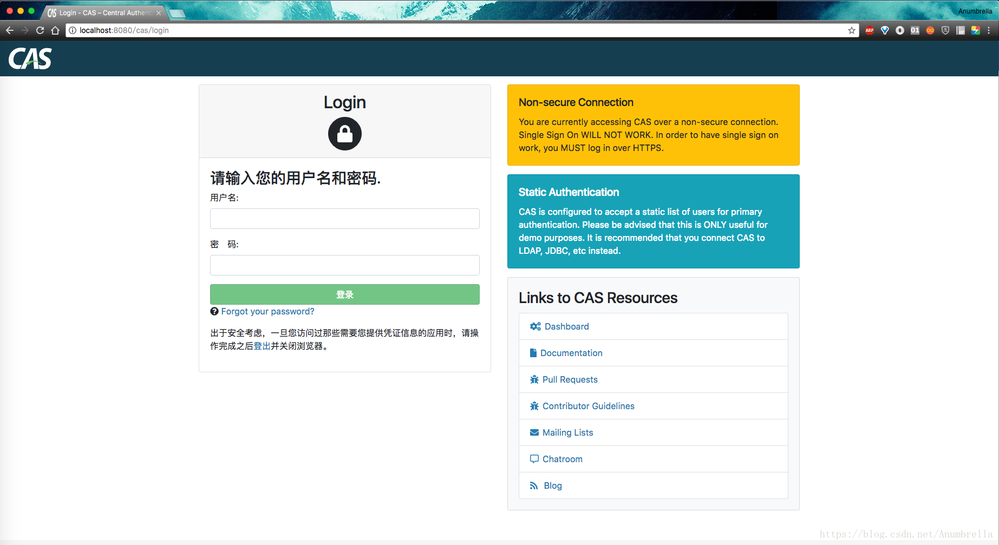
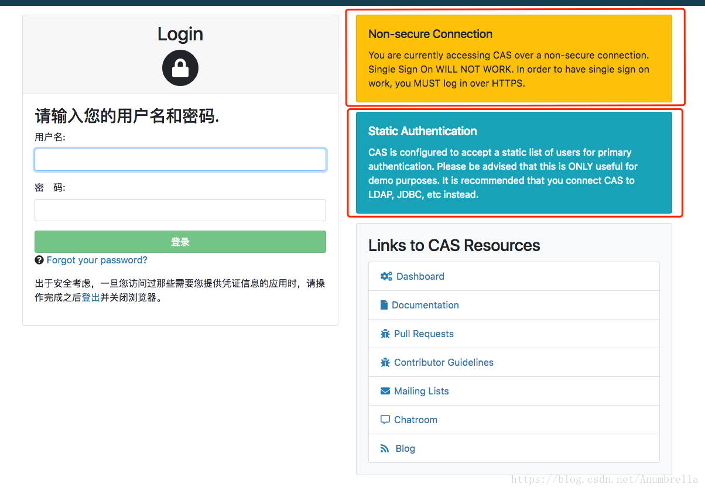

# 搭建基础服务

参考文章: https://blog.csdn.net/Anumbrella/article/details/81045885

## 搭建CAS基础服务

#### 准备
首先CAS官方文档地址：https://apereo.github.io/cas/5.3.x/index.html，在后面我们可能随时会用到。

然后我们从Geting Started开始，在文档里面告诉我们部署CAS，推荐我们使用WAR Overlay method的方法，利用覆盖机制来组合CAS原始工件和本地自定义方法来达到自定义CAS的要求。

    It is recommended to build and deploy CAS locally using the WAR Overlay method. 
    This approach does not require the adopter to explicitly download any version of CAS, 
    but rather utilizes the overlay mechanism to combine CAS original artifacts and local 
    customizations to further ease future upgrades and maintenance.
官方给了两种编译方式，一种是Maven、另一种是Gradle，这里使用Maven安装部署。

具体的详情可以参考：https://apereo.github.io/cas/5.3.x/installation/Maven-Overlay-Installation.html

在开始之前，我们需要配置好电脑环境，笔者当前的环境为：

* JDK 1.8
* Maven 3.5.3
* Tomcat 8.5（官方推荐Tomcat至少要8版本以上）
    
#### 下载代码打包

我们需要下载打包成WAR的代码架子，地址为： https://github.com/apereo/cas-overlay-template。

这里我们使用的CAS当前版本5.3.x，因为6.x是基于Gradle和JDK11的。然后我们进入代码根目录下打开pom.xml文件，添加国内的maven镜像源地址，加快下载包的速度，因为CAS需要的包有点多，并且很大，如果为原来的地址，速度非常慢。

```xml
    <repositories>
        <!--添加国内镜像源地址-->
        <repository>
            <id>maven-ali</id>
            <url>http://maven.aliyun.com/nexus/content/groups/public//</url>
            <releases>
                <enabled>true</enabled>
            </releases>
            <snapshots>
                <enabled>true</enabled>
                <updatePolicy>always</updatePolicy>
                <checksumPolicy>fail</checksumPolicy>
            </snapshots>
        </repository>
    </repositories>

```

更改pom.xml文件后，我们到项目的跟目录下，执行mvn clean package命令，接着就会去下载相应的jar包。

当执行完毕后，我们便可在项目根目录下的target目录下发现生成的cas.war包。然后我们将其放入Tomcat目录下的webapps下面。接着在浏览器里访问http://localhost:8080/cas/login，可以发现CAS出现登录界面。



默认账号：casuser 默认密码：Mellon 目前的配置仅有这一个用户。输入用户名和密码，登录成功！

这样我们就完成了CAS的登录过程，基本的CAS服务搭建就实现了。

我们在登录界面可以发现，弹出了两个提示框，如下图红框所圈：



我们仔细阅读可以发现，这里主要说了：

    一、我们的登录不是安全的，并没有使用HTTPS协议，这里我们使用了HTTP。
    
    二、提示我们这里用户验证方式是静态文件写死的，指定就是我们的用户名和密码（casuser/Mellon）,这个只适合demo使用。
    
接下来我们就主要围绕这两点来解决问题。

## 配置证书

#### 生成证书

接下来我们便开始解决这两个问题，首先是HTTPS，我们知道使用HTTPS是需要证书的，所以接下来我们便制作一个证书。

使用JDK自带的工具keytool
      
    PS C:\Users\fire> keytool -genkey -alias caskeystore -keypass 123456 -keyalg RSA -keystore thekeystore
    输入密钥库口令:
    再次输入新口令:
    您的名字与姓氏是什么?
      [Unknown]:  passport.fire.com
    您的组织单位名称是什么?
      [Unknown]:  fire
    您的组织名称是什么?
      [Unknown]:  fire
    您所在的城市或区域名称是什么?
      [Unknown]:  fire
    您所在的省/市/自治区名称是什么?
      [Unknown]:  fire
    该单位的双字母国家/地区代码是什么?
      [Unknown]:  cn
    CN=passport.fire.com, OU=fire, O=fire, L=fire, ST=fire, C=cn是否正确?
      [否]:  y
      
    PS C:\Users\fire> ls
    
    
        目录: C:\Users\fire
    
    
    Mode                LastWriteTime         Length Name
    ----                -------------         ------ ----
    -a----        2020/3/26     15:45           2235 thekeystore
    


首先输入密钥库口令，然后在输入名字与姓氏时为为具体路由地址，就是待会CAS认证服务器的地址（这里以passport.fire.com为例），
而其余的根据具体情况填写即可，然后就会在当前目录下生成证书。

    注意：-keypass 123456 应该和密钥库口令保持一直否则tomcat会报 Caused by: java.security.UnrecoverableKeyException: Cannot recover key

下面是另一种方式

    PS C:\Users\fire> keytool -genkey -alias caskeystore  -keyalg RSA -keystore firekeystore
    输入密钥库口令:
    再次输入新口令:
    您的名字与姓氏是什么?
      [Unknown]:  password.fire.com
    您的组织单位名称是什么?
      [Unknown]:  fire
    您的组织名称是什么?
      [Unknown]:  fire
    您所在的城市或区域名称是什么?
      [Unknown]:  fire
    您所在的省/市/自治区名称是什么?
      [Unknown]:  fire
    该单位的双字母国家/地区代码是什么?
      [Unknown]:  cn
    CN=password.fire.com, OU=fire, O=fire, L=fire, ST=fire, C=cn是否正确?
      [否]:  y
    
    输入 <caskeystore> 的密钥口令
            (如果和密钥库口令相同, 按回车):
    再次输入新口令:
    
    Warning:
    JKS 密钥库使用专用格式。建议使用 "keytool -importkeystore -srckeystore firekeystore -destkeystore firekeystore -deststor
    etype pkcs12" 迁移到行业标准格式 PKCS12。

密钥库口令应该和<caskeystore> 的密钥口令 一致


#### 导出数字证书

    PS C:\Users\fire> keytool -export -alias caskeystore -keystore thekeystore -rfc -file cas.crt
    输入密钥库口令:
    存储在文件 <cas.crt> 中的证书

    Warning:
    JKS 密钥库使用专用格式。建议使用 "keytool -importkeystore -srckeystore thekeystore -destkeystore thekeystore -deststoretype pkcs12" 迁移到行业标准格式 PKCS12。
 
    PS C:\Users\fire> ls


        目录: C:\Users\liuyi27


    Mode                LastWriteTime         Length Name
    -a----        2020/3/26     15:52           1266 cas.crt
    -a----        2020/3/26     15:45           2235 thekeystore

    
    
    
输入先前的密钥库口令，然后在当前目录下生成具体的cas.crt数字证书

#### 将数字证书导入jdk下的jre里

###### windows

    keytool -import -alias caskeystore -keystore %JAVA_HOME%\jre\lib\security\cacerts -file cas.crt -trustcacerts -storepass changeit
    
###### Unix

    sudo keytool -import -alias caskeystore -keystore $JAVA_HOME/jre/lib/security/cacerts -file cas.crt -trustcacerts -storepass changeit
    
这里导入JDK时需要默认密码changeit，在命令中已经配置好了。如果没有该密码，则会报java.io.IOException: Keystore was tampered with, or password was incorrect错误。

    PS C:\Users\fire> keytool -import -alias caskeystore -keystore D:\Java\jdk1.8.0_161\jre\lib\security\cacerts -file cas.crt -trustcacerts -storepass changeit
    所有者: CN=passport.fire.com, OU=fire, O=fire, L=fire, ST=fire, C=cn
    发布者: CN=passport.fire.com, OU=fire, O=fire, L=fire, ST=fire, C=cn
    序列号: 2e8ca677
    有效期为 Thu Mar 26 15:45:54 CST 2020 至 Wed Jun 24 15:45:54 CST 2020
    证书指纹:
             MD5:  C4:6E:6F:A9:B9:21:50:59:52:42:D1:EB:EC:51:83:05
             SHA1: 14:B8:CB:ED:1D:69:10:83:7A:F6:0F:E2:9C:48:BB:BA:92:16:6F:34
             SHA256: 08:07:18:D6:B9:B9:E5:E0:37:2B:EF:1C:0C:7E:87:69:9F:23:2D:96:0E:5A:90:60:11:76:EB:9E:C1:54:A5:B3
    签名算法名称: SHA256withRSA
    主体公共密钥算法: 2048 位 RSA 密钥
    版本: 3
    
    扩展:
    
    #1: ObjectId: 2.5.29.14 Criticality=false
    SubjectKeyIdentifier [
    KeyIdentifier [
    0000: 11 7A 98 FE 3C 69 C8 55   F9 96 D0 94 5D 2E 7B 52  .z..<i.U....]..R
    0010: D9 DE 45 46                                        ..EF
    ]
    ]
    
    是否信任此证书? [否]:  y
    证书已添加到密钥库中


    注意：

    1、出现以下错误是因为已经生成过一次证书，别名 <caskeystore> 已经存在。

    C:\Users\lenovo>keytool -genkey -alias caskeystore -keypass 123456 -keyalg RSA -keystore thekeystore
    输入密钥库口令:
    keytool 错误: java.lang.Exception: 未生成密钥对, 别名 <caskeystore> 已经存在

    解决办法：删除caskeystore即可

    2、出现以下错误是因为已经导入过一次证书，别名 <caskeystore> 已经存在。

    C:\Users\lenovo>keytool -import -alias caskeystore -keystore %JAVA_HOME%\jre\lib\security\cacerts -file cas.crt -trustcacerts -storepass changeit
    keytool 错误: java.lang.Exception: 证书未导入, 别名 <caskeystore> 已经存在

    解决办法：执行以下命令：

    keytool -delete -alias caskeystore -keystore %JAVA_HOME%\jre\lib\security\cacerts -storepass changeit

#### 配置DNS(修改host)

这里我的CAS服务端是部署在本地的，所以需要做一个本地映射。

127.0.0.1       passport.fire.com

#### 配置Tomcat

编辑Tomcat目录Conf下的server.xml文件。

将8443的端口配置文件打开，配置如下（添加前面刚刚生成的keystore的地址和密匙）：

```xml
    <Connector port="8443" protocol="org.apache.coyote.http11.Http11NioProtocol"
               maxThreads="150" SSLEnabled="true">
        <SSLHostConfig>
            <Certificate certificateKeystoreFile="/Users/anumbrella/keystore/thekeystore"
                         type="RSA" certificateKeystoreType="JKS" certificateKeystorePassword="123456"/>
        </SSLHostConfig>
    </Connector>

    or

    <Connector port="8443" protocol="org.apache.coyote.http11.Http11NioProtocol"
               maxThreads="150" SSLEnabled="true">
        <SSLHostConfig>
		    <!--
            <Certificate certificateKeystoreFile="conf/localhost-rsa.jks"
                         type="RSA" />
			-->
			<Certificate certificateKeystoreFile="C:\Users\liuyi27\firekeystore"
			             certificateKeystoreType="JKS"
                         certificateKeystorePassword="firehuo"
                         type="RSA" />
        </SSLHostConfig>
    </Connector>

```

## 更改配置

我们知道cas-overlay-template是采用配置覆盖的策略来进行自定义的，因此我们可以通过覆盖或者继承某些类重写某些方法实现自定义的需求。将我们先前的cas.war解压，或者直接去Tomcat下webapps目录下面，打开WEB-INF目录下的classes里面的application.properties文件。

可以看到该文件就是对CAS认证服务器的配置，我们现在要自定义，打开我们的项目，新建src/main/resources文件夹，同时将刚才的application.properties文件复制到该目录下。

现在我们就可以通过配置application.properties文件来实现对CAS服务器的自定义。

除了上面我们刚刚在Tomcat里面配置证书，我们还可以直接将证书配置到CAS服务信息里面，打开application.properties文件，我们可以发现在开头有配置信息如下：


https://blog.csdn.net/Anumbrella/article/details/81045885

