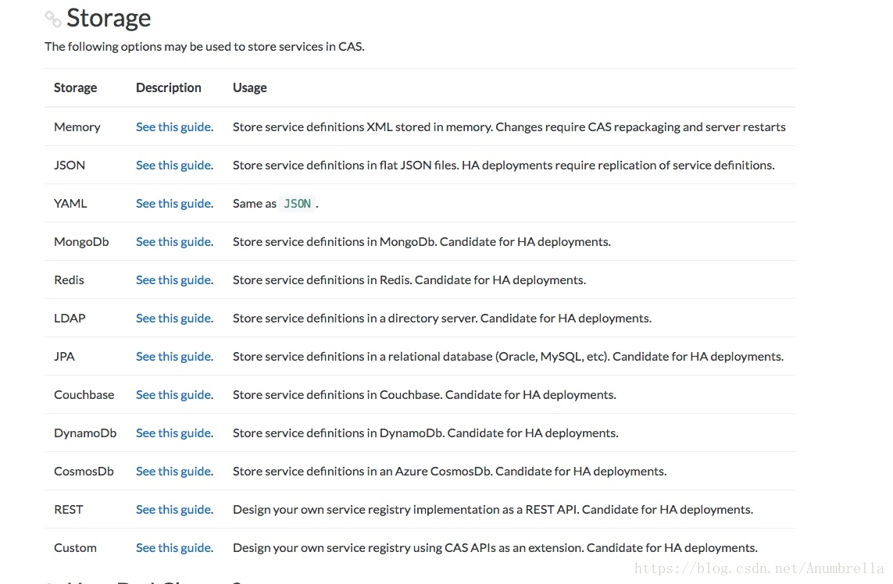

# Service配置及管理

  首先我们要明白CAS中的Service的概念是什么，
我们在第一节就讲解了在CAS系统中，
主要分为三部分，User、Web应用、SSO认证中心。
User就是我们普通用户，Web应用就是需要接入SSO认证中心的应用也就是这里的Service，
而SSO认证中心就是CAS服务端。

  简单来说就是CAS分为服务端和客户端
，而Service就是指具体的多个客户端（CAS Clients）。

  而这里的服务管理（Service Management）就是CAS服务管理工具允许CAS服务器管理员声明和配置哪些服务（Service，CAS客户端）可以在哪些方面使用CAS。
服务管理工具的核心组件是服务注册表，它存储一个或多个注册服务。

  接下来先介绍我们的第一个知识点——Service配置！

## Service配置

  我们刚刚提及到在CAS中，
服务管理工具中的服务注册表当中存储着一个或多个注册服务，
而这些Service中包含着各个行为的元数据，通过配置这些数据我们可以控制这些Service的行为。

主要行为包括一些几点：

* 授权服务 - 控制哪些服务可以参与CAS SSO会话。
* 强制身份验证 - 为强制身份验证提供管理控制。
* 属性发布 - 为服务提供用户详细信息以进行授权和个性化。
* 代理控制 - 通过授予/拒绝代理身份验证功能进一步限制授权服务。
* 主题控制 - 定义用于特定服务的备用CAS主题。

在Service中配置属性主要包括以下这些信息：


上图介绍了一些在Service中常用的配置项，
对于各个配置属性的含义可以参考具体文档，服务配置。

在这些配置中，比较常使用的主要是：

服务访问策略——(accessStrategy)，具体可以查看：[服务策略配置](https://apereo.github.io/cas/5.3.x/installation/Configuring-Service-Access-Strategy.html)。

服务属性配置——(properties)，具体查看：[服务属性配置](https://apereo.github.io/cas/5.3.x/installation/Configuring-Service-Custom-Properties.html)。

服务到期政策——(expirationPolicy)，具体查看：[服务到期配置](https://apereo.github.io/cas/5.3.x/installation/Configuring-Service-Expiration-Policy.html)。

对CAS元数据的配置信息有了大致的了解后，我们需要配置其存储方式，
就像我们前面介绍的多种认证方式一样，用户信息提供了多种方式，
这里的Service存储方式也是提供了多种的解决方案。



推荐使用JSON、YAML、MongoDb、Redis、JPA这几种方式来存储使用，这里也将使用这几种方式来介绍。

#### JSON

这种方式也是CAS默认初始化使用的，注册表在应用程序上下文初始化时从JSON配置文件中读取服务定义，期望在配置的目录位置内找到JSON文件。

首先添加依赖包：

```xml
<dependency>
    <groupId>org.apereo.cas</groupId>
    <artifactId>cas-server-support-json-service-registry</artifactId>
    <version>${cas.version}</version>
</dependency>

```
在resources/services文件夹下面新建web-10000001.json，具体内容如下：

```json
{
  "@class" : "org.apereo.cas.services.RegexRegisteredService",
  "serviceId" : "^(https|imaps|http)://.*",
  "name" : "web",
  "id" : 10000001,
  "evaluationOrder" : 10
}
```
*注意:* Json文件名字规则为${name}-${id}.json，id必须为Json文件内容中的id一致。

Json文件解释：

* @class：必须为org.apereo.cas.services.RegisteredService的实现类，对其他属性进行一个json反射对象，常用的有RegexRegisteredService，匹配策略为id的正则表达式
* serviceId：唯一的服务id
* name： 服务名称，会显示在默认登录页
* id：全局唯一标志
* description：服务描述，会显示在默认登录页
* evaluationOrder： 匹配争取时的执行循序，最好是比1大的数字

因为在CAS服务中，默认是提供了默认的Service配置项，所以如果添加的Json配置没起作用，可以尝试注释掉默认启动Json，在pom.xml文件里面进行配置，如下：

```xml
<plugin>
                <groupId>org.apache.maven.plugins</groupId>
                <artifactId>maven-war-plugin</artifactId>
                <version>2.6</version>
                <configuration>
                    <warName>cas</warName>
                    <failOnMissingWebXml>false</failOnMissingWebXml>
                    <recompressZippedFiles>false</recompressZippedFiles>
                    <archive>
                        <compress>false</compress>
                        <manifestFile>${manifestFileToUse}</manifestFile>
                    </archive>
                    <overlays>
                        <overlay>
                            <groupId>org.apereo.cas</groupId>
                            <artifactId>cas-server-webapp${app.server}</artifactId>
                        </overlay>
                    </overlays>
                    <dependentWarExcludes>
                        <!--让war包下的json不初始化-->
                        **/services/*.json
                    </dependentWarExcludes>
                </configuration>
            </plugin>
```

然后在配置文件application.properties下添加配置：

```yaml
cas:
  serviceRegistry: # Service Registry(服务注册)
    initFromJson: true #开启识别Json文件，默认false
    #watcherEnabled: true #自动扫描服务配置，默认开启
    schedule:
      repeatInterval: 120000 #120秒扫描一遍
      startDelay: 15000 #延迟15秒开启
    json:  # Json配置
      location: classpath:/services
  authn:
    accept:
      users: casuser::Mellon
```

#### Jpa

最后介绍一下Jpa这种方式，通过Java持久层API来实现数据保存到数据库，
可以是Mysql、Oracle、SQL Service这种方式可能使用的比较多一些。

同样的先添加依赖：

```xml
<dependency>
    <groupId>org.apereo.cas</groupId>
    <artifactId>cas-server-support-jpa-service-registry</artifactId>
    <version>${cas.version}</version>
</dependency>

```
添加配置信息：

```yaml
cas:
  serviceRegistry: # Service Registry(服务注册)
    initFromJson: false #开启识别Json文件，默认false
    #watcherEnabled: true #自动扫描服务配置，默认开启
    schedule:
      repeatInterval: 120000 #120秒扫描一遍
      startDelay: 15000 #延迟15秒开启
    json:  # Json配置
      location: classpath:/services
    jpa: # Jpa配置
      user: root
      password: 123
      driverClass: com.mysql.jdbc.Driver
      url: jdbc:mysql://127.0.0.1:3306/cas?
      dialect: org.hibernate.dialect.MySQL5Dialect
      failFastTimeout: 1
      healthQuery:
      isolateInternalQueries: false
      leakThreshold: 10
      batchSize: 1
      ddlAuto: update #设置配置的服务，一直都有，不会给清除掉 ， 第一次使用，需要配置为 create
        #create-drop 重启cas服务的时候，就会给干掉
        #create  没有表就创建，有就不创建
        #none 一直都有
      #update 更新
      autocommit: true
      idleTimeout: 5000
      pool:
        suspension: false
        minSize: 6
        maxSize: 18
        maxWait: 2000
        timeoutMillis: 1000
```
更详细的驱动信息可以参考文档：

https://apereo.github.io/cas/5.3.x/installation/JDBC-Drivers.html

启动服务后，还是和前面一样，提示CAS的服务记录是空的，没有定义服务。 希望通过CAS进行认证的应用程序必须在服务记录中明确定义。。。暂时可以忽略掉，马上我们就来配置服务管理。

然后我们去数据库发现，新增了一些表，这就是CAS将服务信息保存到数据库使用的表。

注意这里应该生成的表是5个
registeredserviceimplcontact
registeredservice_contacts
regexregisteredserviceproperty
regexregisteredservice
但是可能由于默认的引擎选择的是MyISAM所以导致 registeredserviceimpl_props不能生成.把其他引擎改成innodb就行

或者手动创建表也行并设置属性cas.serviceRegistry.jpa.ddlAuto=node
```sql
CREATE TABLE `regexregisteredservice` (
  `expression_type` varchar(50) COLLATE utf8mb4_general_ci NOT NULL DEFAULT 'regex',
  `id` bigint NOT NULL AUTO_INCREMENT,
  `access_strategy` longblob,
  `attribute_release` longblob,
  `description` varchar(255) COLLATE utf8mb4_general_ci DEFAULT NULL,
  `evaluation_order` int NOT NULL,
  `expiration_policy` longblob,
  `informationUrl` varchar(255) COLLATE utf8mb4_general_ci DEFAULT NULL,
  `logo` varchar(255) COLLATE utf8mb4_general_ci DEFAULT NULL,
  `logout_type` int DEFAULT NULL,
  `logout_url` varchar(255) COLLATE utf8mb4_general_ci DEFAULT NULL,
  `mfa_policy` longblob,
  `name` varchar(255) COLLATE utf8mb4_general_ci NOT NULL,
  `privacyUrl` varchar(255) COLLATE utf8mb4_general_ci DEFAULT NULL,
  `proxy_policy` longblob,
  `public_key` longblob,
  `required_handlers` longblob,
  `responseType` varchar(255) COLLATE utf8mb4_general_ci DEFAULT NULL,
  `serviceId` varchar(255) COLLATE utf8mb4_general_ci NOT NULL,
  `theme` varchar(255) COLLATE utf8mb4_general_ci DEFAULT NULL,
  `username_attr` longblob,
  PRIMARY KEY (`id`)
) ENGINE=InnoDB DEFAULT CHARSET=utf8mb4 COLLATE=utf8mb4_general_ci;


CREATE TABLE `regexregisteredserviceproperty` (
  `id` bigint NOT NULL AUTO_INCREMENT,
  `property_values` longblob,
  PRIMARY KEY (`id`)
) ENGINE=InnoDB DEFAULT CHARSET=utf8mb4 COLLATE=utf8mb4_general_ci;

CREATE TABLE `registeredservice_contacts` (
  `AbstractRegisteredService_id` bigint NOT NULL,
  `contacts_id` bigint NOT NULL,
  `contacts_ORDER` int NOT NULL,
  PRIMARY KEY (`AbstractRegisteredService_id`,`contacts_ORDER`),
  UNIQUE KEY `UK_s7mf4a23wejqx62tt4vh3tgwi` (`contacts_id`)
) ENGINE=MyISAM DEFAULT CHARSET=utf8mb4 COLLATE=utf8mb4_general_ci;


CREATE TABLE `registeredserviceimplcontact` (
  `id` bigint NOT NULL AUTO_INCREMENT,
  `department` varchar(255) COLLATE utf8mb4_general_ci DEFAULT NULL,
  `email` varchar(255) COLLATE utf8mb4_general_ci DEFAULT NULL,
  `name` varchar(255) COLLATE utf8mb4_general_ci NOT NULL,
  `phone` varchar(255) COLLATE utf8mb4_general_ci DEFAULT NULL,
  PRIMARY KEY (`id`)
) ENGINE=MyISAM DEFAULT CHARSET=utf8mb4 COLLATE=utf8mb4_general_ci;


CREATE TABLE `registeredserviceimpl_props` (
  `AbstractRegisteredService_id` bigint(20) NOT NULL,
  `properties_id` bigint(20) NOT NULL,
  `properties_KEY` varchar(255) NOT NULL,
  PRIMARY KEY (`AbstractRegisteredService_id`,`properties_KEY`),
  UNIQUE KEY `UK_i2mjaqjwxpvurc6aefjkx5x97` (`properties_id`),
  CONSTRAINT `FK1xan7uamsa94y2451jgksjkj4` FOREIGN KEY (`properties_id`) REFERENCES `regexregisteredserviceproperty` (`id`),
  CONSTRAINT `FK5ghaknoplphay7reury7n3vcm` FOREIGN KEY (`AbstractRegisteredService_id`) REFERENCES `regexregisteredservice` (`id`)
) ENGINE=InnoDB DEFAULT CHARSET=utf8;
```
