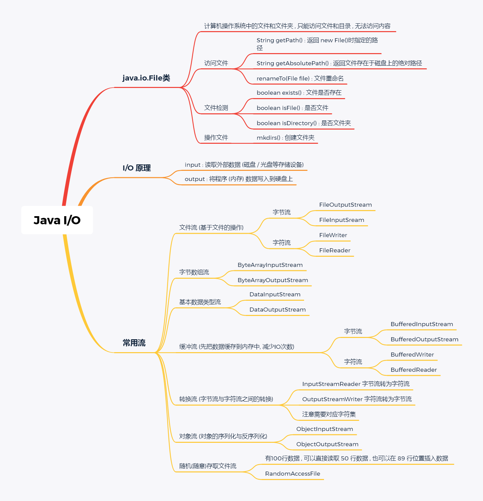
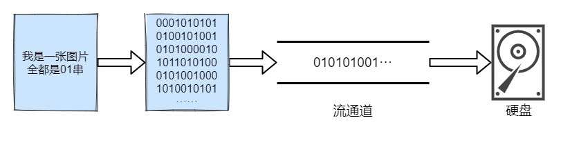
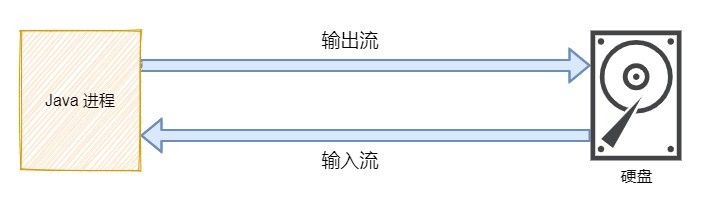
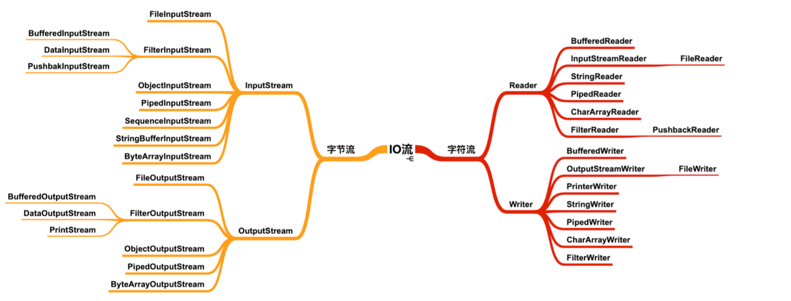
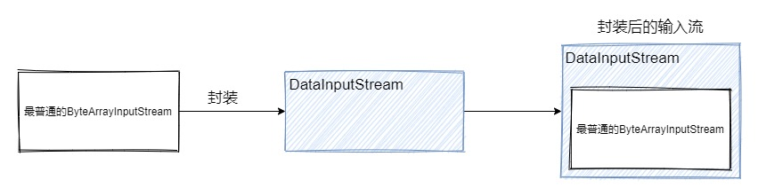
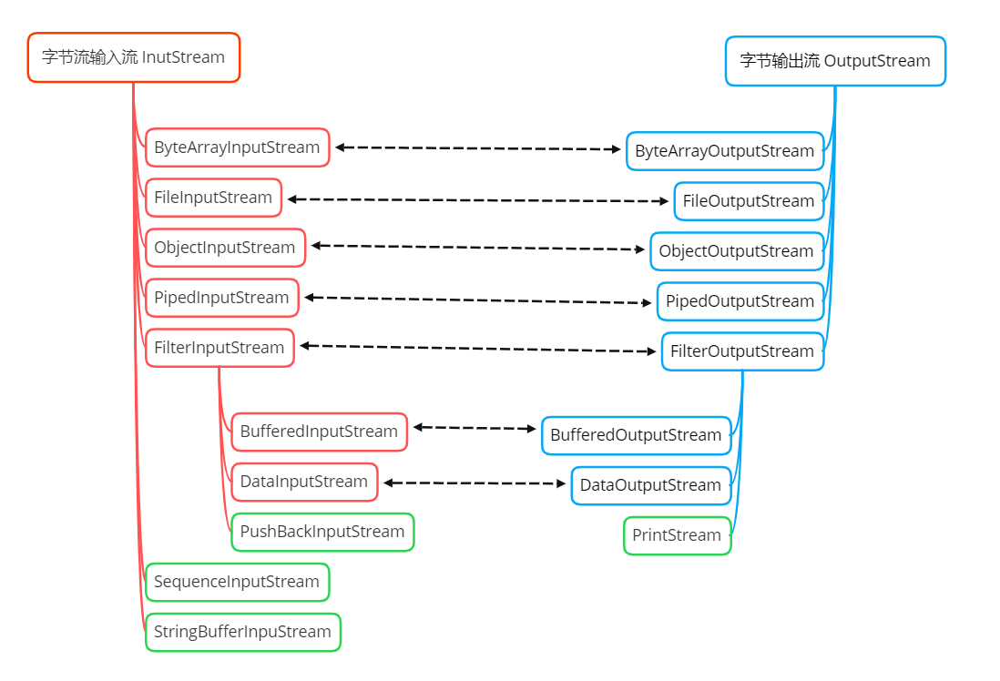
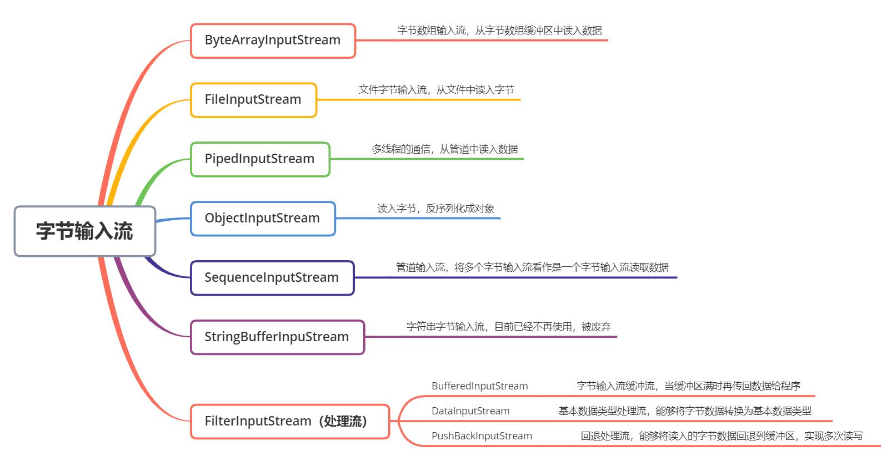
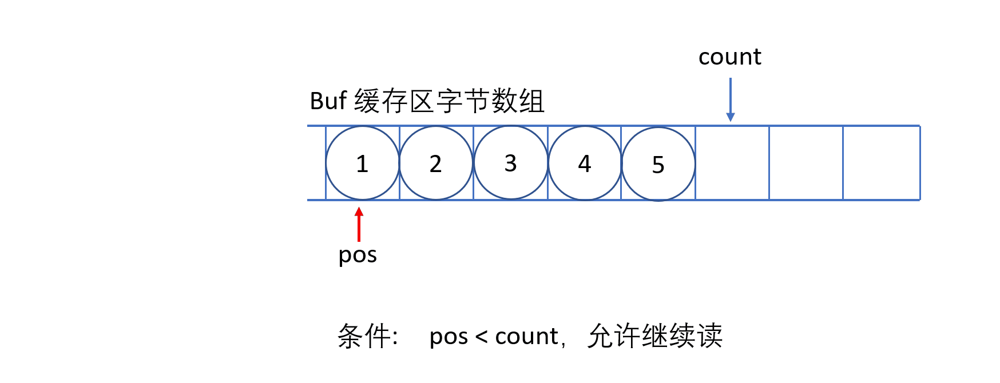
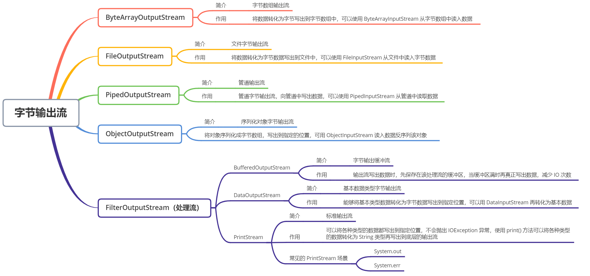

# IO 基础

Java IO 是一个庞大的知识体系

Java IO流是一个庞大的生态环境，其内部提供了很多不同的输入流和输出流，细分下去还有字节流和字符流，甚至还有缓冲流提高 IO 性能，
转换流将字节流转换为字符流······看到这些就已经对 IO 产生恐惧了，在日常开发中少不了对文件的 IO 操作，虽然 apache 已经提供了 Commons IO 这种封装好的组件，但面对特殊场景时，
我们仍需要自己去封装一个高性能的文件 IO 工具类，本文将会解析 Java IO 中涉及到的各个类，以及讲解如何正确、高效地使用它们。

## 什么是流

我们知道任何一个文件都是以二进制形式存在于设备中，计算机就只有 0 和 1，你能看见的东西全部都是由这两个数字组成，你看这篇文章时，这篇文章也是由01组成，只不过这些二进制串经过各种转换演变成一个个文字、一张张图片跃然屏幕上。

而流就是将这些二进制串在各种设备之间进行传输，如果你觉得有些抽象，我举个例子就会好理解一些：

> 下图是一张图片，它由01串组成，我们可以通过程序把一张图片拷贝到一个文件夹中，
> 把图片转化成二进制数据集，把数据一点一点地传递到文件夹中 , 类似于水的流动 , 这样整体的数据就是一个数据流
  

#### IO 流读写数据的特点：

* 顺序读写: 读写数据时，大部分情况下都是按照顺序读写，读取时从文件开头的第一个字节到最后一个字节，写出时也是也如此（RandomAccessFile 可以实现随机读写）
* 字节数组: 读写数据时本质上都是对字节数组做读取和写出操作，即使是字符流，也是在字节流基础上转化为一个个字符，所以字节数组是 IO 流读写数据的本质。

## 流的分类

根据数据流向不同分类：输入流 和 输出流

* 输入流：从磁盘或者其它设备中将数据输入到进程中
* 输出流：将进程中的数据输出到磁盘或其它设备上保存

图示中的硬盘只是其中一种设备，还有非常多的设备都可以应用在IO流中，例如：打印机、硬盘、显示器、手机······

根据处理数据的基本单位不同分类：字节流 和 字符流

* 字节流：以字节（8 bit）为单位做数据的传输
* 字符流：以字符为单位（1字符 = 2字节）做数据的传输

> 字符流的本质也是通过字节流读取，Java 中的字符采用 Unicode 标准，在读取和输出的过程中，通过以字符为单位，查找对应的码表将字节转换为对应的字符。

面对字节流和字符流，很多读者都有疑惑：什么时候需要用**字节流**，什么时候又要用**字符流**？

我这里做一个简单的概括，你可以按照这个标准去使用：

字符流只针对字符数据进行传输，所以如果是文本数据，优先采用字符流传输；除此之外，其它类型的数据（图片、音频等），最好还是以字节流传输。

根据这两种不同的分类，我们就可以做出下面这个表格，里面包含了 IO 中最核心的 4 个顶层抽象类：

数据流向 / 数据类型字节流字符流输入流InputStreamReader输出流OutputStreamWriter

现在看 IO 是不是有一些思路了，不会觉得很混乱了，我们来看这四个类下的所有成员。

看到这么多的类是不是又开始觉得混乱了，不要慌，字节流和字符流下的输入流和输出流大部分都是一一对应的，有了上面的表格支撑，我们不需要再担心看见某个类会懵逼的情况了。

看到 Stream 就知道是字节流，看到 Reader / Writer 就知道是字符流。

这里还要额外补充一点：Java IO 提供了字节流转换为字符流的转换类，称为转换流。

转换流 / 数据类型字节流与字符流之间的转换

（输入）字节流 => InputStreamReader** => 字符流 

（输出）字符流 => OutputStreamWriter => 字节流

注意字节流与字符流之间的转换是有严格定义的：

* 输入流：可以将字节流 => 字符流
* 输出流：可以将字符流 => 字节流

为什么在输入流不能字符流 => 字节流，输出流不能字节流 => 字符流？

> 在存储设备上，所有数据都是以字节为单位存储的，所以输入到内存时必定是以字节为单位输入，输出到存储设备时必须是以字节为单位输出，
> 字节流才是计算机最根本的存储方式，而字符流是在字节流的基础上对数据进行转换，输出字符，但每个字符依旧是以字节为单位存储的。

#### 节点流和处理流

在这里需要额外插入一个小节讲解节点流和处理流。

* 节点流：节点流是真正传输数据的流对象，用于向特定的一个地方（节点）读写数据，称为节点流。例如 FileInputStream
* 处理流：处理流是对节点流的封装，使用外层的处理流读写数据，本质上是利用节点流的功能，外层的处理流可以提供额外的功能。处理流的基类都是以 Filter 开头。

上图将 ByteArrayInputStream 封装成 DataInputStream，可以将输入的字节数组转换为对应数据类型的数据。例如希望读入int类型数据，就会以2个字节为单位转换为一个数字。

#### Java IO 的核心类 File

Java 提供了 File类，它指向计算机操作系统中的文件和目录，通过该类只能访问文件和目录，无法访问内容。 它内部主要提供了 3种操作：

* 访问文件的属性：绝对路径、相对路径、文件名······
* 文件检测：是否文件、是否目录、文件是否存在、文件的读/写/执行权限······
* 操作文件：创建目录、创建文件、删除文件······

上面举例的操作都是在开发中非常常用的，File 类远不止这些操作，更多的操作可以直接去 API 文档中根据需求查找。

###### 访问文件的属性

API功能String getAbsolutePath()返回该文件处于系统中的绝对路径名String getPath()返回该文件的相对路径，通常与 new File() 传入的路径相同String getName()返回该文件的文件名

###### 文件检测

API功能boolean isFIle()校验该路径指向是否一个文件boolean isDirectory()校验该路径指向是否一个目录boolean isExist()校验该路径指向的文件/目录是否存在boolean canWrite()校验该文件是否可写boolean canRead()校验该文件是否可读boolean canExecute()校验该文件/目录是否可以被执行

###### 操作文件

API功能mkdirs()递归创建多个文件夹，路径中间有可能某些文件夹不存在createNewFile()创建新文件，它是一个原子操作，有两步：检查文件是否存在、创建新文件delete()删除文件或目录，删除目录时必须保证该目录为空

###### 多了解一些

文件的读/写/执行权限，在 Windows 中通常表现不出来，而在 Linux 中可以很好地体现这一点，原因是 Linux 有严格的用户权限分组，不同分组下的用户对文件有不同的操作权限，所以这些方法在 Linux 下会比在 Windows 下更好理解。下图是 redis 文件夹中的一些文件的详细信息，被红框标注的是不同用户的执行权限：

* r（Read）：代表该文件可以被当前用户读，操作权限的序号是 4
* w（Write）：代表该文件可以被当前用户写，操作权限的序号是 2
* x（Execute）：该文件可以被当前用户执行，操作权限的序号是 1

## Java IO 流对象

回顾流的分类有2种：

* 根据数据流向分为输入流和输出流
* 根据数据类型分为字节流和字符流

所以，本小节将以字节流和字符流作为主要分割点，在其内部再细分为输入流和输出流进行讲解。

#### 字节流对象

字节流对象大部分输入流和输出流都是成双成对地出现，所以学习的时候可以将输入流和输出流一一对应的流对象关联起来，输入流和输出流只是数据流向不同，而处理数据的方式可以是相同的。

注意不要认为用什么流读入数据，就需要用对应的流写出数据，在 Java 中没有这么规定，下图只是各个对象之间的一个对应关系，不是两个类使用时必须强制关联使用。

> 下面有非常多的类，我会介绍基类的方法，了解这些方法是非常有必要的，子类的功能基于父类去扩展，只有真正了解父类在做什么，学习子类的成本就会下降。

###### InputStream

InputStream 是字节输入流的抽象基类，提供了通用的读方法，让子类使用或重写它们。下面是 InputStream 常用的重要的方法。

重要方法功能public abstract int read()从输入流中读取下一个字节，读到尾部时返回 -1public int read(byte b[])从输入流中读取长度为 b.length 个字节放入字节数组 b 中public int read(byte b[], int off, int len)从输入流中读取指定范围的字节数据放入字节数组 b 中public void close()关闭此输入流并释放与该输入流相关的所有资源

还有其它一些不太常用的方法，我也列出来了。

其它方法功能public long skip(long n)跳过接下来的 n 个字节，返回实际上跳过的字节数public long available()返回下一次可读取（跳过）且不会被方法阻塞的字节数的估计值public synchronized void mark(int readlimit)标记此输入流的当前位置，对 reset() 方法的后续调用将会重新定位在 mark() 标记的位置，可以重新读取相同的字节public boolean markSupported()判断该输入流是否支持 mark() 和 reset() 方法，即能否重复读取字节public synchronized void reset()将流的位置重新定位在最后一次调用 mark() 方法时的位置

###### ByteArrayInputStream

ByteArrayInputStream 内部包含一个 buf 字节数组缓冲区，该缓冲区可以从流中读取的字节数，使用 pos 指针指向读取下一个字节的下标位置，内部还维护了一个count 属性，代表能够读取 count 个字节。

> 必须保证 pos 严格小于 count，而 count 严格小于 buf.length 时，才能够从缓冲区中读取数据

###### FileInputStream

文件输入流，从文件中读入字节，通常对文件的拷贝、移动等操作，可以使用该输入流把文件的字节读入内存中，然后再利用输出流输出到指定的位置上。

###### PipedInputStream

管道输入流，它与 PipedOutputStream 成对出现，可以实现多线程中的管道通信。PipedOutputStream 中指定与特定的 PipedInputStream 连接，PipedInputStream 也需要指定特定的 PipedOutputStream 连接，之后输出流不断地往输入流的 buffer 缓冲区写数据，而输入流可以从缓冲区中读取数据。

###### ObjectInputStream

对象输入流，用于对象的反序列化，将读入的字节数据反序列化为一个对象，实现对象的持久化存储。

###### PushBackInputStream

它是 FilterInputStream 的子类，是一个处理流，它内部维护了一个缓冲数组buf。

在读入字节的过程中可以将读取到的字节数据回退给缓冲区中保存，下次可以再次从缓冲区中读出该字节数据。所以PushBackInputStream 允许多次读取输入流的字节数据，只要将读到的字节放回缓冲区即可。

需要注意的是如果回推字节时，如果缓冲区已满，会抛出 IOException 异常。

它的应用场景：对数据进行分类规整。

假如一个文件中存储了数字和字母两种类型的数据，我们需要将它们交给两种线程各自去收集自己负责的数据，如果采用传统的做法，把所有的数据全部读入内存中，再将数据进行分离，面对大文件的情况下，例如1G、2G，传统的输入流在读入数组后，由于没有缓冲区，只能对数据进行抛弃，这样每个线程都要读一遍文件。

使用 PushBackInputStream 可以让一个专门的线程读取文件，唤醒不同的线程读取字符：

* 第一次读取缓冲区的数据，判断该数据由哪些线程读取
* 回退数据，唤醒对应的线程读取数据
* 重复前两步
* 关闭输入流

到这里，你是否会想到 AQS 的 Condition 等待队列，多个线程可以在不同的条件上等待被唤醒。

###### BufferedInputStream

缓冲流，它是一种处理流，对节点流进行封装并增强，其内部拥有一个 buffer 缓冲区，用于缓存所有读入的字节，当缓冲区满时，才会将所有字节发送给客户端读取，而不是每次都只发送一部分数据，提高了效率。

###### DataInputStream

数据输入流，它同样是一种处理流，对节点流进行封装后，能够在内部对读入的字节转换为对应的 Java 基本数据类型。

###### SequenceInputStream

将两个或多个输入流看作是一个输入流依次读取，该类的存在与否并不影响整个 IO 生态，在程序中也能够做到这种效果

###### StringBufferInputStream

将字符串中每个字符的低 8 位转换为字节读入到字节数组中，目前已过期

###### InputStream 总结：
     
* InputStream 是所有输入字节流的抽象基类
* ByteArrayInputStream 和 FileInputStream 是两种基本的节点流，他们分别从字节数组 和 本地文件中读取数据
* DataInputStream、BufferedInputStream 和 PushBackInputStream 都是处理流，对基本的节点流进行封装并增强
* PipiedInputStream 用于多线程通信，可以与其它线程公用一个管道，读取管道中的数据。
* ObjectInputStream 用于对象的反序列化，将对象的字节数据读入内存中，通过该流对象可以将字节数据转换成对应的对象

#### OutputStream

OutputStream 是字节输出流的抽象基类，提供了通用的写方法，让继承的子类重写和复用。

方法功能public abstract void write(int b)将指定的字节写出到输出流，写入的字节是参数 b 的低 8 位public void write(byte b[])将指定字节数组中的所有字节写入到输出流当中public void write(byte b[], int off, int len)指定写入的起始位置 offer，字节数为 len 的字节数组写入到输出流当中public void flush()刷新此输出流，并强制写出所有缓冲的输出字节到指定位置，每次写完都要调用public void close()关闭此输出流并释放与此流关联的所有系统资源

OutputStream 中大多数的类和 InputStream 是对应的，只不过数据的流向不同而已。从上面的图可以看出：

* OutputStream 是所有输出字节流的抽象基类
* ByteArrayOutputStream 和 FileOutputStream 是两种基本的节点流，它们分别向字节数组和本地文件写出数据
* DataOutputStream、BufferedOutputStream 是处理流，前者可以将字节数据转换成基本数据类型写出到文件中；后者是缓冲字节数组，只有在缓冲区满时，才会将所有的字节写出到目的地，减少了 IO 次数。
* PipedOutputStream 用于多线程通信，可以和其它线程共用一个管道，向管道中写入数据
* ObjectOutputStream 用于对象的序列化，将对象转换成字节数组后，将所有的字节都写入到指定位置中
* PrintStream 在 OutputStream 基础之上提供了增强的功能，即可以方便地输出各种类型的数据（而不仅限于byte型）的格式化表示形式，且 PrintStream 的方法从不抛出 IOEception，其原理是写出时将各个数据类型的数据统一转换为 String 类型，我会在讲解完

#### 字符流对象

######

######

