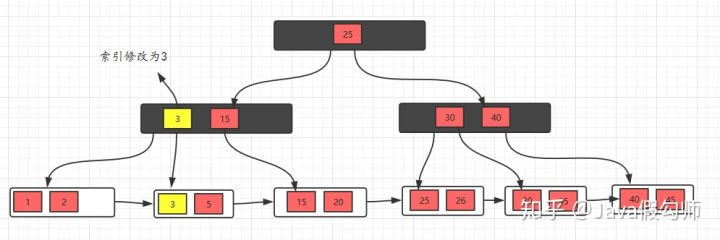

# B+ 树

B+树是对B树的一种变形树，它与B树的差异在于：

* 有k个子结点的结点必然有k个关键码；
* 非叶结点仅具有索引作用，跟记录有关的信息均存放在叶结点中。
* 树的所有叶结点构成一个有序链表，可以按照关键码排序的次序遍历全部记录。

如下图，是一个B+树:

下图是B+树的插入动画：

###### B和B+树的区别

B+树的非叶子结点只包含导航信息，不包含实际的值，所有的叶子结点和相连的节点使用链表相连，
便于区间查找和遍历。

###### B+树的优点：

由于B+树在内部节点上不包含数据信息，因此在内存页中能够存放更多的key。 数据存放的更加紧密，
具有更好的空间局部性。因此访问叶子节点上关联的数据也具有更好的缓存命中率。
B+树的叶子结点都是相链的，因此对整棵树的便利只需要一次线性遍历叶子结点即可。
而且由于数据顺序排列并且相连，所以便于区间查找和搜索。而B树则需要进行每一层的递归遍历。
相邻的元素可能在内存中不相邻，所以缓存命中性没有B+树好。

###### B树得优点

由于B树的每一个节点都包含key和value，因此经常访问的元素可能离根节点更近，因此访问也更迅速。

下面是B 树和B+树的区别图：

###### 下面我们看一个B+树的例子，感受感受它吧！

### 插入操作

对于插入操作很简单，只需要记住一个技巧即可：
当节点元素数量大于m-1的时候，按中间元素分裂成左右两部分，中间元素分裂到父节点当做索引存储，
但是，本身中间元素还是分裂右边这一部分的。

下面以一颗5阶B+树的插入过程为例，5阶B+树的节点最少2个元素，最多4个元素。

插入5，10，15，20

插入25，此时元素数量大于4个了，分裂

接着插入26，30，继续分裂

有了这几个例子，相信插入操作没什么问题了，下面接着看看删除操作。

### 删除操作

对于删除操作是比B树简单一些的，因为叶子节点有指针的存在，向兄弟节点借元素时，不需要通过父节点了，
而是可以直接通过兄弟节移动即可（前提是兄弟节点的元素大于m/2），
然后更新父节点的索引；如果兄弟节点的元素不大于m/2（兄弟节点也没有多余的元素），
则将当前节点和兄弟节点合并，并且删除父节点中的key，
下面我们看看具体的实例。

初始状态

删除10，删除后，不满足要求，发现左边兄弟节点有多余的元素，所以去借元素，最后，修改父节点索引

删除元素5，发现不满足要求，并且发现左右兄弟节点都没有多余的元素，
所以，可以选择和兄弟节点合并，最后修改父节点索引

发现父节点索引也不满足条件，所以，需要做跟上面一步一样的操作

这样，B+树的删除操作也就完成了，是不是看完之后，觉得非常简单！

### 为什么说B+树比B树更适合做操作系统的数据库索引和文件索引？

* B+树的磁盘读写的代价更低

B+树内部结点没有指向关键字具体信息的指针，这样内部结点相对B树更小。

* B+树的查询更加的稳定

因为非终端结点并不是最终指向文件内容的结点，仅仅是作为叶子结点中关键字的索引。这样所有的关键字的查找都会走一条从根结点到叶子结点的路径。所有的关键字查询长度都是相同的，查询效率相当。
