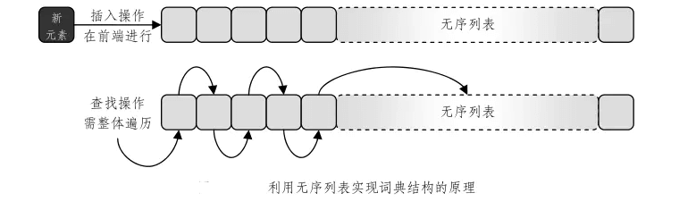

# 词典

与前面介绍的映射结构一样，词典结构也是用来存放条目对象的一种容器，不过，词典与映射之间有一个非常重要的差别——词典不再要求其中各条目的关键码互异。

这一点与我们日常使用的纸介质词典类似，不少单次都具有多种解释，每一种解释分别对应于一个词条。因此，我们往往将词典中的条目直接称作“词条”。

总体而言，词典可以分为两大类：无序词典和有序词典。
顾名思义，前一类词典中存放的条目无所谓次序，我们只能（利用某一判等器）比较一对条目（的关键码）是否相等；而在后一类词典所存放的条目之间，则（根据某一比较器）定义了某种全序关系，因此也相应地能够支持 first()、last()、prev()和 succ()之类的方法。

### 无序词典

| 操作方法| 	功能描述 | 
| :---- | :--- | 
| find(key) | 若词典中存在以 key 为关键码的条目，则返回该条目的数据对象 ；否则，返回 null<br>输入：一个关键码对象<br>输出：条目对象| 
| findAll(key) | 若词典中存在以 key 为关键码的条目，则返回这些条目组成的迭代器 ；否则，返回 null<br>输入：一个关键码对象<br>输出：条目对象的迭代器| 
| insert(key, value) | 插入条目(key, value)，并返回该条目<br>输入：一个关键码对象和一个数据对象<br>输出：条目对象| 
| remove(key) | 若词典中存在以 key 为关键码的条目，则将摘除其中的一个并返回；否则，返回 null<br>输入：一个关键码对象<br>输出：条目对象| 
| entries()| 回词典中所有关键码对象的一个迭代器<br>输入：无<br>输出：条目对象的迭代器| 
| getSize() | 报告词典的规模，即其中元素的数目<br>输入：无<br>输出：非负整数| 
| isEmpty() | 判断词典是否为空<br>输入：无<br>输出：布尔标志| 

##### 无序词典的接口

```java
package dsa.Dictionary;

import dsa.Iterator.Iterator;
import dsa.PriorityQueue.Entry;

public interface Dictionary {

    /*
     * （无序）词典结构接口
     */
    // 查询词典结构当前的规模
    public int getSize();

    // 判断词典结构是否为空
    public boolean isEmpty();

    // 若词典中存在以key为关键码的条目，则返回其中的一个条目；否则，返回null
    public Entry find(Object key);

    // 返回由关键码为key的条目组成的迭代器
    public Iterator findAll(Object key);

    // 插入条目(key, value)，并返回该条目
    public Entry insert(Object key, Object value);

    // 若词典中存在以key为关键码的条目，则将摘除其中的一个并返回；否则，返回null
    public Entry remove(Object key);

    // 返回词典中所有条目的一个迭代器
    public Iterator entries();
}
```

##### 基于列表实现的无序词典



```java
package dsa.Dictionary;

import dsa.Iterator.Iterator;
import dsa.Iterator.IteratorElement;
import dsa.List.List;
import dsa.List.List_DLNode;
import dsa.Map.EqualityTester;
import dsa.Map.EqualityTesterDefault;
import dsa.PriorityQueue.Entry;
import dsa.PriorityQueue.EntryDefault;
import other.Position;

public class Dictionary_DLNode implements Dictionary {
    /*
     * 基于列表实现（无序）词典结构
     */
    private List L;// 存放条目的列表
    private EqualityTester T;// 判等器
    // 构造方法

    public Dictionary_DLNode() {
        this(new EqualityTesterDefault());
    }

    // 默认构造方法
    public Dictionary_DLNode(EqualityTester t) {
        L = new List_DLNode();
        T = t;
    }

    /***************************** ADT方法 *****************************/
    // 查询词典结构当前的规模
    public int getSize() {
        return L.getSize();
    }

    // 判断词典结构是否为空
    public boolean isEmpty() {
        return L.isEmpty();
    }

    // 若词典中存在以key为关键码的条目，则返回其中的一个条目；否则，返回null
    public Entry find(Object key) {
        Iterator P = L.positions();
        while (P.hasNext()) {
            Position pos = (Position) P.getNext();
            Entry entry = (EntryDefault) pos.getElem();
            if (T.isEqualTo(entry.getKey(), key))
                return entry;
        }
        return null;
    }

    // 返回由关键码为key的条目组成的迭代器
    public Iterator findAll(Object key) {
        List list = new List_DLNode();
        Iterator P = L.positions();
        while (P.hasNext()) {
            Position pos = (Position) P.getNext();
            Entry entry = (EntryDefault) pos.getElem();
            if (T.isEqualTo(entry.getKey(), key))
                list.insertLast(entry);
        }
        return new IteratorElement(list);
    }

    // 插入条目(key, value)，并返回该条目
    public Entry insert(Object key, Object value) {
        Entry entry = new EntryDefault(key, value);// 创建新条目
        L.insertFirst(entry);// 将新条目插至表首，并
        return entry;// 返回null标志
    }

    // 若词典中存在以key为关键码的条目，则将摘除其中的一个并返回；否则，返回null
    public Entry remove(Object key) {
        Iterator P = L.positions();
        while (P.hasNext()) {// 逐一对比
            Position pos = (Position) P.getNext();// 各个位置
            Entry entry = (EntryDefault) pos.getElem();// 处的条目
            if (T.isEqualTo(entry.getKey(), key)) {// 若发现key已出现在某个条目中，则
                Entry oldEntry = entry;// 先保留该条目
                L.remove(pos);// 删除该条目
                return oldEntry;// 最后返回原先的条目
            }
        } // 若此循环结束，说明key尚未在词典中出现，因此
        return null;// 返回null标志
    }

    // 返回词典中所有条目的一个迭代器
    public Iterator entries() {
        return new IteratorElement(L);
    }// 直接利用List接口的方法生成元素迭代器
}
```

### 有序词典

上面所说的，基于无序列表实现的词典结构非常适用于解决网络访问日志之类的应用问题，这类问题的共同特点是：插入操作频繁，查找、删除操作却极少进行。

另外一些问题则正好相反，它们要求频繁地进行查询，但插入、删除操作相对更少，这方面的例子包括在线电话簿、订票系统等。

##### 有序词典的 ADT 

从 ADT 的角度，有序词典可以看作是无序词典的扩充，也就是说，
只需在无序词典 ADT 的基础上再增加以下操作：

| 操作方法| 	功能描述 | 
| :---- | :--- | 
| find(key) | 若词典中存在以 key 为关键码的条目，则返回该条目的数据对象 ；否则，返回 null<br>输入：一个关键码对象<br>输出：条目对象| 
| last( ) | 	若词典非空，则返回其中关键码最大的条目；否则，返回 null<br>输入：无<br>输出：条目对象| 
| successors(key) | 返回由关键码不小于 key 的条目依非降序组成的迭代器<br>输入：一个关键码对象<br>输出：条目对象的迭代器| 
| predecessors(key) | 返回由关键码不大于 key 的条目依非升序组成的迭代器<br>输入：一个关键码对象<br>输出：条目对象的迭代器| 

##### 有序词典接口

```java
package dsa.Dictionary;

import dsa.Iterator.Iterator;
import dsa.PriorityQueue.Entry;

public interface SortedDictionary extends Dictionary {

    /*
     * 有序词典接口
     */

    // 若词典非空，则返回其中关键码最小的条目；否则，返回null
    public Entry first();

    // 若词典非空，则返回其中关键码最大的条目；否则，返回null
    public Entry last();

    // 返回由关键码不小于key的条目依非降序组成的迭代器
    public Iterator successors(Object key);

    // 返回由关键码不大于key的条目依非升序组成的迭代器
    public Iterator predecessors(Object key);
}
```

这里利用可扩充数组实现有序查找表，并在此基础上利用二分查找算法

```java
package dsa.Dictionary;

import dsa.Iterator.Iterator;
import dsa.Iterator.IteratorElement;
import dsa.List.List;
import dsa.List.List_DLNode;
import dsa.PriorityQueue.Comparator;
import dsa.PriorityQueue.ComparatorDefault;
import dsa.PriorityQueue.Entry;
import dsa.PriorityQueue.EntryDefault;
import dsa.Vector.Vector;
import dsa.Vector.Vector_ExtArray;

public class SortedDictionary_ExtArray implements SortedDictionary {

    /*
     * 基于有序查找表实现的有序词典
     */

    Vector S;// 有序查找表
    Comparator C;// 比较器
    // 默认构造方法

    public SortedDictionary_ExtArray() {
        this(new ComparatorDefault());
    }

    // 构造方法
    public SortedDictionary_ExtArray(Comparator comp) {
        S = new Vector_ExtArray();
        C = comp;
    }

    /**************************** 辅助方法 ****************************/
    // 二分查找
    // 返回值可能是命中元素的秩，也可能是key可以插入的秩
    // 具体如何，需要进一步检查
    // 不变性：若将key按照返回的秩插入有序向量，向量依然有序
    private static int binSearch(Vector s, Comparator c, Object key, int lo, int hi) {
        if (lo > hi)
            return lo;// 递归基，查找失败
        int mi = (lo + hi) >> 1;// 取中值
        Entry e = (Entry) s.getAtRank(mi);// 居中的条目
        int flag = c.compare(key, e.getKey());// 比较关键码
        if (flag < 0)
            return binSearch(s, c, key, lo, mi - 1);// 转向左半区间
        else if (flag > 0)
            return binSearch(s, c, key, mi + 1, hi);// 转向右半区间
        else
            return mi;// 命中
    }

    /**************************** 无序词典ADT方法 ****************************/
    // 查询词典结构当前的规模
    public int getSize() {
        return S.getSize();
    }

    // 判断词典结构是否为空
    public boolean isEmpty() {
        return S.isEmpty();
    }

    // 若词典中存在以key为关键码的条目，则返回其中的一个条目；否则，返回null
    public Entry find(Object key) {
        int k = binSearch(S, C, key, 0, S.getSize() - 1);// 查找关键码为key的条目
        if (0 > k || k >= S.getSize() || (0 != C.compare(key, ((Entry) S.getAtRank(k)).getKey())))
            return null;// 若这样的条目不存在，则返回失败标志
        return (Entry) S.getAtRank(k);
    }

    // 返回由关键码为key的条目组成的迭代器
    public Iterator findAll(Object key) {
        List L = new List_DLNode();// 创建一个链表L
        int k = binSearch(S, C, key, 0, S.getSize() - 1);// 查找关键码为key的条目
        if (0 > k || k >= S.getSize() || (0 != C.compare(key, ((Entry) S.getAtRank(k)).getKey())))
            return new IteratorElement(L);// 若这样的条目不存在，则返回空迭代器
        L.insertFirst(S.getAtRank(k));// 将e插入L中
        int lo = k;// 从S[k-1]开始
        while (0 <= --lo) {// 不断向前搜索
            if (0 != C.compare(key, ((Entry) S.getAtRank(lo)).getKey()))
                break;// 直到第一个不命中的条目
            L.insertFirst(S.getAtRank(lo));// 将命中的条目插入L中
        }
        int hi = k;// 从S[k+1]开始
        while (++hi < S.getSize()) {// 不断向后搜索
            if (0 != C.compare(key, ((Entry) S.getAtRank(hi)).getKey()))
                break;// 直到第一个不命中的条目
            L.insertLast(S.getAtRank(hi));// 将命中的条目插入L中
        }
        return new IteratorElement(L);// 由L创建迭代器，返回之
    }

    // 插入条目(key, value)，并返回该条目
    public Entry insert(Object key, Object value) {
        Entry e = new EntryDefault(key, value);// 创建新条目
        // 若词典为空，则直接插入新元素
        if (S.isEmpty())
            return (Entry) S.insertAtRank(0, e);
        // 通过二分查找，确定可插入位置
        // 请读者自己检查：即便key在S中为最小或最大，都可以正常插入
        return (Entry) S.insertAtRank(binSearch(S, C, key, 0, S.getSize() - 1), e);
    }

    // 若词典中存在以key为关键码的条目，则将摘除其中的一个并返回；否则，返回null
    public Entry remove(Object key) {
        int k = binSearch(S, C, key, 0, S.getSize() - 1);// 查找关键码为key的条目
        if (0 > k || k >= S.getSize() || (0 != C.compare(key, ((Entry) S.getAtRank(k)).getKey())))
            return null;// 若这样的条目不存在，则返回失败标志
        return (Entry) S.removeAtRank(k);
    }

    // 返回词典中所有条目的一个迭代器
    public Iterator entries() {
        List L = new List_DLNode();
        for (int i = 0; i < S.getSize(); i++)
            L.insertLast(S.getAtRank(i));
        return new IteratorElement(L);// 直接利用List接口的方法生成元素迭代器
    }

    /**************************** 有序词典ADT方法 ****************************/
    // 若词典非空，则返回其中关键码最小的条目；否则，返回null
    public Entry first() {
        return (S.isEmpty()) ? null : (Entry) S.getAtRank(0);
    }

    // 若词典非空，则返回其中关键码最大的条目；否则，返回null
    public Entry last() {
        return (S.isEmpty()) ? null : (Entry) S.getAtRank(S.getSize() - 1);
    }

    // 返回由关键码不小于key的条目依非降序组成的迭代器
    public Iterator successors(Object key) {
        List L = new List_DLNode();// 创建一个链表L
        int k = binSearch(S, C, key, 0, S.getSize() - 1);// 查找关键码为key的条目
        if (0 > k || k >= S.getSize() || (0 != C.compare(key, ((Entry) S.getAtRank(k)).getKey())))
            return new IteratorElement(L);// 若这样的条目不存在，则返回空迭代器
        while (0 <= --k)// 从S[k-1]开始向前搜索，直至符合要求的、秩最小的元素
            if (0 != C.compare(key, ((Entry) S.getAtRank(k)).getKey()))
                break;
        while (S.getSize() > ++k)// 将后继的所有元素依次
            L.insertLast(S.getAtRank(k));// 插入L中
        return new IteratorElement(L);// 由L创建迭代器，返回之
    }

    // 返回由关键码不大于key的条目依非升序组成的迭代器
    public Iterator predecessors(Object key) {
        List L = new List_DLNode();// 创建一个链表L
        int k = binSearch(S, C, key, 0, S.getSize() - 1);// 查找关键码为key的条目
        if (0 > k || k >= S.getSize() || (0 != C.compare(key, ((Entry) S.getAtRank(k)).getKey())))
            return new IteratorElement(L);// 若这样的条目不存在，则返回空迭代器
        while (S.getSize() > ++k)// 从S[k-1]开始向后搜索，直至符合要求的、秩最大的元素
            if (0 != C.compare(key, ((Entry) S.getAtRank(k)).getKey()))
                break;
        while (0 <= --k)// 将前驱的所有元素依次
            L.insertLast(S.getAtRank(k));// 插入L中
        return new IteratorElement(L);// 由L创建迭代器，返回之
    }
}
```
