# 图

    弥诺陶洛斯（Minotaur）是希腊神话中半人半牛的怪物，它藏身于一个精心设计的迷宫之中。
    这个迷宫的结构极其复杂，一般人一旦进入其中，都休想走出来。
    不过，在公主阿里阿德涅（Ariadne）的帮助下，古希腊英雄特修斯（Theseus）还是想出了一个走出迷宫的方法。
    特修斯带上一团线去闯迷宫，在入口处，他将绳线的一头绑在门上。
    然后，他不断查找迷宫的各个角落，而绳线的另一头则始终抓在他的手里，跟随他穿梭于蜿蜒曲折的迷宫之中。
    借助如此简单的工具，特修斯不仅终于找到了怪物并将其杀死，而且还带着公主轻松地走出了迷宫。

特修斯之所以能够成功，关键在于他借助绳线来掌握迷宫内各个通道之间的联接关系，
而在很多的问题中，掌握类似的信息都是至关重要的。
通常，这类信息所反映的都是一组对象之间的二元关系，
比如城市交通图中联接于不同点之间的街道，或 Internet 中联接于两个 IP 之间的路由等。

在某种程度上，我们前面所讨论过的树结构也可以携带和表示这种二元关系，只不过树结构中的这类关系仅限于父、子节点之间。
然而在一般情况下，我们所需要的二元关系往往是定义在任意一对对象之间。
实际上，这样的二元关系恰恰正是图论（Graph theory ）

图是数据结构中重要内容。相比于线性表与树，图的结构更为复杂。
在线性表的存储结构中，数据直接按照前驱后继的线性组织形式排列。
在树的结构中，数据节点以层的方式排列，节点与节点之间是一种层次关系。
但是，在图的结构中数据之间可以有任意关系，这就使得图的数据结构相对复杂。

###  定义

图（Graph）是由顶点的有穷非空集合和顶点之间边的集合组成，通常表示为：G（V，E），其中，
G表示一个图，V是图G中顶点的集合，E是图G中边的集合。

例如：下图所示图

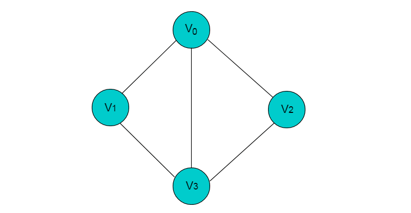

上图中，共有V0，V1，V2，V3 4个顶点，4个顶点之间共有5条边。

    当线性表没有数据节点时，线性表为空表。
    树中没有节点时，树为空树。
    但是，在图中不允许没有顶点，但是可以没有边。

    图（Graph）可以表示为 G = (V, E)

* 其中集合 V 中的对象称作顶点（Vertex）
* 而集合 E 中的每一元素都对应于 V 中某一对顶点⎯⎯说明这两个顶点之间存在某种关系⎯⎯称作边（Edge）

这里还约定 V 和 E 都是有限集，通常记 n = |V|、m = |E|。

对于图的定义，我们需要明确几个注意的地方：

* 线性表中我们把数据元素叫元素，树中叫结点，在图中数据元素我们则称之为顶点(Vertex)。
* 线性表可以没有数据元素，称为空表，树中可以没有结点，叫做空树，而图结构在咱国内大部分的教材中强调顶点集合V要有穷非空。
* 线性表中，相邻的数据元素之间具有线性关系，树结构中，相邻两层的结点具有层次关系，而图结构中，任意两个顶点之间都可能有关系，顶点之间的逻辑关系用边来表示，边集可以是空的。

### 无向边

若顶点 x 和 y 之间的边没有方向，则称该边为无向边(x,y)，(x,y) 与 (y,x) 意义相同，表示x和y之间有连接。

下图所示图中的边均为无向边。

### 有向边

有向边：若顶点 x 和 y 之间的边有方向，则称该边为有向边<x, y>，<x,y> 与 <y,x> 表示的意义是不同的，<x, y>表示从x连接到y，x称为尾，y称为头。<y,x>表示从y连接到x，y称为尾，x称为头。

下图所示图中的边为有向边。

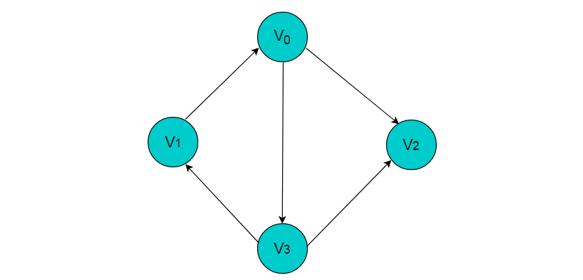

### 无向图

若图中任意两个顶点之间的边均是无向边，则称该图为无向图。

### 有向图

若图中任意两个顶点之间的边均是有向边，则称该图为有向图。

### 混合图

### 顶点与顶点的度

* 顶点的度：顶点V的度是和V相关联的边的数目，记为TD(V)。
   上图中，V0顶点的度为3。
* 入度：以顶点v为头的边的数目，记为ID(V)。
   上图中，V0的入度为1。
* 出度：以顶点v为尾的边的数目，记为OD(V)。
   上图中，V0的出度为2。
* 顶点的度 = 入度 + 出度。
   即TD(V) = ID(V) + OD(V)。

### 邻接

邻接是两个顶点之间的一种关系。如果图包含（u,v），则称顶点 v 与顶点 u 邻接。
在无向图中，这也暗示了顶点 u 也与顶点 v 邻接。换句话说，在无向图中邻接关系是对称的。

### 路径

在图中，依次遍历顶点序列之间的边所形成的轨迹。

例如：在下图中依次访问顶点 V0 、V3 和 V2 ，则构成一条路径。

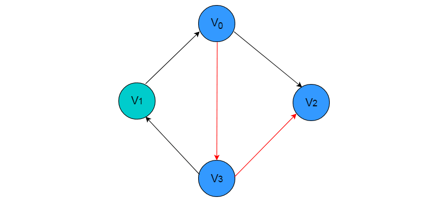

### 完全图

每个顶点都与其他顶点相邻接的图。

### 无向完全图

在无向图中，如果任意两个顶点之间都存在边，则称该图为无向完全图。
（含有n个顶点的无向完全图有(n×(n-1))/2条边）

下图为无向完全图

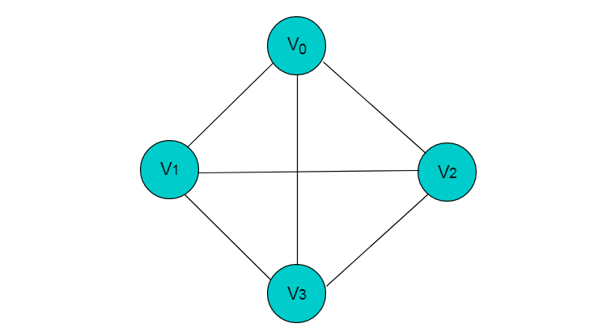

### 有向完全图

在有向图中，如果任意两个顶点之间都存在方向互为相反的两条边，则称该图为有向完全图。
（含有 n 个顶点的有向完全图有 n×(n-1) 条边）

下图为有向完全图。

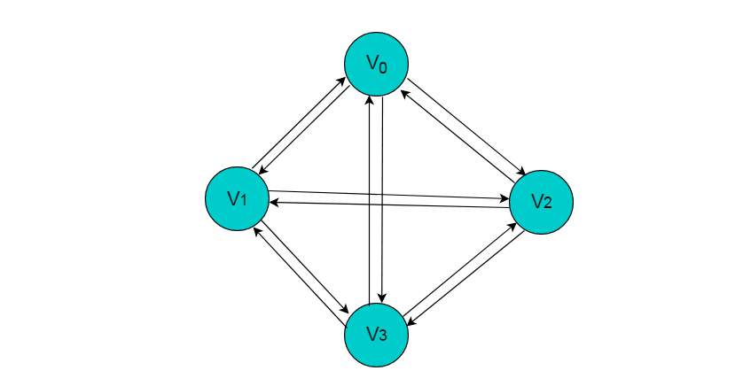

### 通路、环路及可达分量

通路——所谓图中的**一条通路或路径（Path）**，就是由（不一定互异的）m+1 个顶点与 m 条边交替构成的一个序列ρ = {v 0 , e 1 , v 1 , e 2 , v 2 , …, e m , v m }，m ≥ 0，而且 e i = (v i-1 , v i )，1 ≤ i ≤ m。

环路—— 长度 m ≥ 1 的路径，若第一个顶点与最后一个顶点相同，则称之为环路（Cycle）。

可达分量——对于指定的顶点 s，从 s 可达的所有顶点所组成的集合，称作 s 在 G 中对应的可达分量，记作 V r (G, s)。

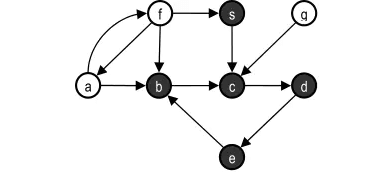

### 连通图

在无向图 G 中，如果从顶点 v 到顶点 v' 有路径，则称 v 和 v' 是连通的。
如果对于图中任意两个顶点 vi 、vj ∈E， vi，和vj都是连通的，则称 G 是连通图，否则图为非连通图。

例如：图4.1所示图，图中顶点A、B、C、D是连通的，但是其中任一顶点与顶点E或者顶点F之间没有路径，
因此图4.1中所示的图为非连通图。

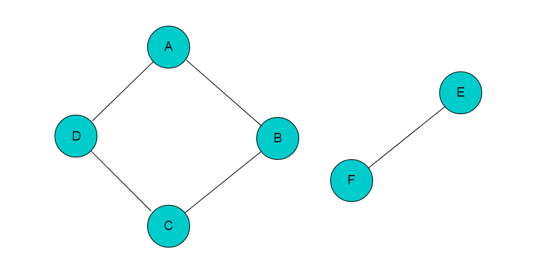

若添加顶点B与顶点F之间的邻接边，则图变为连通图，如下图所示：

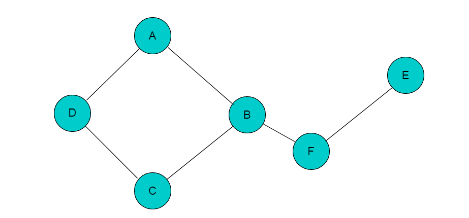

### 树、森林和连通图

无向图 G = (V, E)：

> 若 G 中不含任何环路，则称之为森林（Forest）。

> 连通的森林称作树（Tree）。

不难看出，森林中的每一连通分量都是一棵树，反之亦然。

设 G 为由 n 个顶点与 m 条边组成一幅无向图：

* 若 G 是连通的，则 m ≥ n-1；
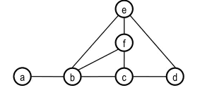
* 若 G 是一棵树，则 m = n-1；
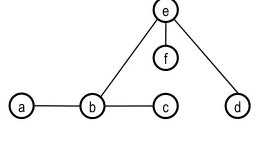
* 若 G 是森林，则 m ≤ n-1。
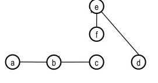

#### 面试中关于图的常见问题

* 实现广度和深度优先搜索
* 检查图是否为树
* 计算图的边数
* 找到两个顶点之间的最短路径
