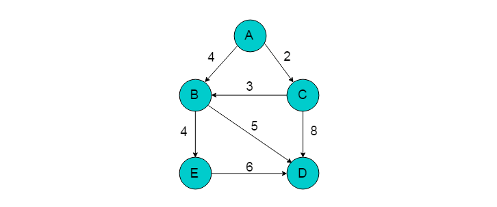
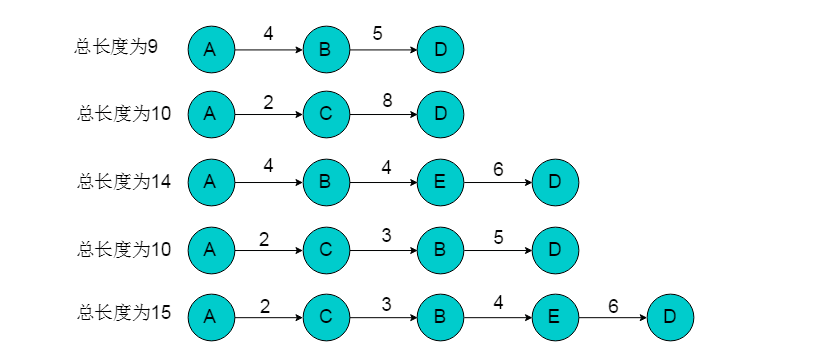
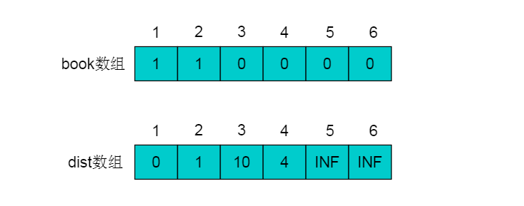
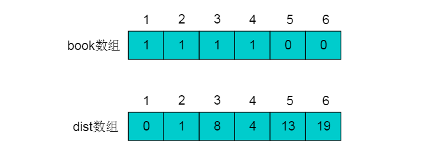
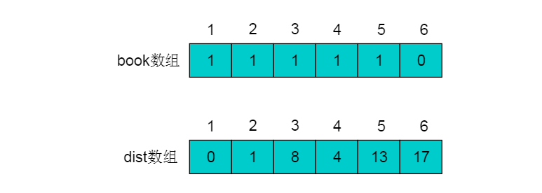
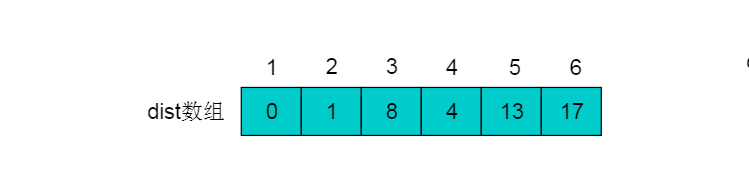
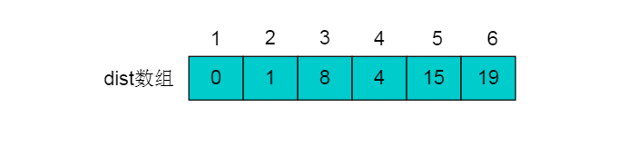
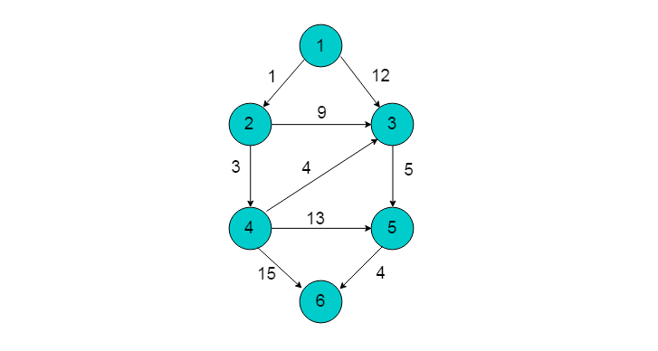

# 图最短路径

 最短路径问题一直是图论研究的热点问题。例如在实际生活中的路径规划、地图导航等领域有重要的应用。
关于求解图的最短路径方法也层出不穷，本篇文章将详细讲解图的最短路径经典算法。

### 重要概念

* 图的路径：图G = <V，E>中，从任一顶点开始，由边或弧的邻接至关系构成的有限长顶点序列称为路径。
* 注意：有向图的路径必须沿弧的方向构成顶点序列；构成路径的顶点可能重复出现(即允许反复绕圈)。
* 路径长度：路径中边或弧的数目。
* 简单路径：除第一个和最后一个顶点外，路径中无其它重复出现的顶点，称为简单路径。
* 回路或环：路径中的第一个顶点和最后一个顶点相同时，称为回路或环。
* 图的最短路径：如果从有向图中某一顶点(称为源点)到达另一顶点(称为终点)的路径可能不止一条，如何找到一条路径使得沿此路径上各边上的权值总和达到最小。

### 深度或广度优先搜索算法

##### 算法概述

从起点开始访问所有深度遍历路径或广度优先路径，则到达终点节点的路径有多条，取其中路径权值最短的一条则为最短路径。

##### 算法流程

1. 选择单源的起点作为遍历的起始点。
2. 采用深度优先搜索或者广度优先搜索的方式遍历图，在遍历同时记录可以到达终点的路径。
3. 在所有路径中选择距离最短的路径。

##### 实例图解

例如：下图所示的有向图中，选取A为源点，D为终点，采用遍历的方式获取最短路径。



1. 选择A为遍历起始点，D为终点。
2. 采用遍历的方式获取A到D路径。通过遍历方式得到的路径共有5条。


3. 从中选择距离最短的路径为A->B->D，长度为9。

##### 算法分析

采用遍历的方式获取单源最短路径，是一种暴力破解的方式。算法的性能与遍历过程性能相关。采用深度优先搜索遍历时时间复杂度为O(n+e)。

### 迪杰斯特拉（Dijkstra）算法

##### 算法概述

Dijkstra（迪杰斯特拉）算法是典型的单源最短路径算法，用于计算某个顶点到其他所有顶点的最短路径。Dijkstra（迪杰斯特拉）算法要求图中不存在负权边，即保证图中每条边的权重值为正。
算法的基本思想是：从源点出发，每次选择离源点最近的一个顶点前进，然后以该顶点为中心进行扩展，最终得到源点到其余所有点的最短路径。

##### 算法流程

1. 将所有的顶点分为两部分：已知最短路程的顶点集合P和未知最短路径的顶点集合Q。最开始，已知最短路径的顶点集合P中只有源点s一个顶点。我们这里用一个book[i]数组来记录哪些点在集合P中。例如对于某个顶点i，如果book[i] = 1则表示这个顶点在集合P中，如果book[i] = 0则表示这个顶点在集合Q中。
2. 设置源点s到自己的最短路径为0即dist = 0。若存在源点有能直接到达的顶点i，则把dist[i]设为e[s][i]。同时把所有其它（即源点不能直接到达的）顶点的最短路径为设为∞。
3. 在Q中选择一个离源点s最近的顶点u（即dist[u]最小）加入到P中。并考察所有以点u为起点的边，对每一条边进行松弛操作。
4. 重复第3步，如果集合Q为空，算法结束。最终dist数组中的值就是源点到所有顶点的最短路径。

##### 实例图解

例如：下图所示的有向图，以顶点1为源点，运用Dijkstra算法，获得最短路径。


1. 初始状态下，集合P中只有顶点1， book[1]=1。book数组以及dist数组如图：


2. 从dist数组中可以看出，距离顶点1最近的顶点为2，不存在可以中转的顶点使得顶点1到顶点2的距离更短，且顶点2不在集合P中。
因此，选择顶点2加入集合P中，令book[2]=1。顶点2加入后，需要考虑经过顶点2进行中转，使得顶点1到达其余顶点的距离发生改变。
顶点2的出边有<2,3>和<2,4>。
则需重新计算dist[3]和dist[4]。dist[3] = dis[2]+e[2][3] = 10 < 12，令dist[3]松弛为10。dist[4] = dis[2]+e[2][4] = 4 < INF，令dist[4]松弛为4。
更新后的book数组和dist数组如下：


3. 从剩余顶点3、4、5、6中选择dist中最近顶点为顶点4（因为顶点2已经在集合P中不能再次选择）。
将顶点4加入集合P中，令book[4]=1。按照相同的方式更新dist数组。顶点4的所有出边<4,3>（dist[3] = dis[4]+e[4][3]），<4,5>（dist[5] = dis[4]+e[4][5]）和<4,6>（dist[6] = dis[4]+e[4][6]）用同样的方法进行松弛。
松弛完毕之后book数组和dist数组为：


4. 继续在剩余的顶点3、顶点5顶点和6中，选出离顶点1最近的顶点。选择3号顶点。
此时，dis[3]的值已对3号顶点的所有出边（3->5）（dist[5] = dis[3]+e[3][5]）进行松弛。松弛完毕之后dist数组为：


5. 继续在剩余的顶点5和顶点6，选出离顶点1最近的顶点，选择5号顶点。对5号顶点的所有出边（5->4）（dist[4] = dis[5]+e[5][4]）进行松弛。
松弛完毕之后dist数组为：


6. 最后选择顶点6加入集合P，令book[6]=1。由于6号顶点没有出边，因此不用进行松弛处理。
最终得到的dist数组如下：


##### 算法分析

###### 复杂度
迪杰斯特拉（Dijkstra）算法适用于权值为非负的图的单源最短路径，
使用最小堆时间复杂度是O(VLogV)，用斐波那契堆的复杂度O(E+VlgV)。

###### 为什么不能有负权边

Dijkstra算法当中将节点分为已求得最短路径的集合（记为P）和未确定最短路径的个集合（记为Q），
归入P集合的节点的最短路径及其长度不再变更，如果边上的权值允许为负值，那么有可能出现当与P内某点（记为a）以负边相连的点（记为b）确定其最短路径时，
它的最短路径长度加上这条负边的权值结果小于a原先确定的最短路径长度(意思是原先从a0---a已经确定一个最短路径，而此时的边权值为负，
则此步骤中的边权计算结果必定小于已经确定了的路径长度)，但是a在Dijkstra算法下是无法更新的，由此便可能得不到正确的结果。

### Bellman-Ford算法

##### 算法概述

Bellman-Ford算法是从Dijkstra算法算法引申出来的，它可以解决带有负权边的最短路径问题。值得注意的是，Dijkstra算法和下面的Floyd算法是基于邻接矩阵的，而Bellman-Ford算法是基于邻接表，从边的角度考量的。
用一句话概括就是：对所有的边进行n-1次松弛操作。如果图中存在最短路径（即不存在负权回路），那么最短路径所包含的边最多为n-1条，也就是不可能包含回路。因为如果存在正回路，该路径就不是最短的，而如果存在负回路，就压根就不存在所谓的最短路径。

##### 算法流程

1. 从源点到任意一点u的最短路径的长度，初始化数组dist[u]为0，其余dist[i]为无穷大。
2. 以下操作循环执行至多n-1次，n为顶点数：对于每一条边edge(u,v)，如果dist[u] + weight(u,v) < dist[v]，则令dist[v] = dist[u] + weight(u,v)。若上述操作没有对dist进行更新，说明最短路径已经查找完毕，或者部分点不可达，跳出循环。否则执行下次循环；
3. 检测图中是否存在负环路，即权值之和小于0的环路。对于每一条边edge(u,v)，如果存在dist[u] + weight(u,v) < dist[v]的边，则图中存在负环路，即是说该图无法求出单源最短路径。否则数组dist[n]中记录的就是源点s到各顶点的最短路径长度。

##### 实例图解

以下图所示的有向图为例，以顶点1为源点，采用Bellman-Ford算法计算最短路径。


1. 选取顶点1为源点，令dist[1]=1，dist[2]-dist[6]=INF。
2. 图中共有9条边，分别为<1，2>，<1，3>，<2，3>，<2，4>，<3，5>，<4，3>，<4，5>，<4，6>，<5，6>。对于每一条边执行松弛操作。此过程至多执行5次。
3. 第一次松弛操作：


     对于边<1，2>，dist[2]=dist[1]+weight[1,2]=1 <INF。则dist[2]=1;
     对于边<1，3>，dist[3]=dist[1]+weight[1,3]=12<INF。则dist[3]=12;
     对于边<2，3>，dist[3]=dist[2]+weight[2,3]=10<12。则dist[3]=10;
     对于边<2，4>，dist[4]=dist[2]+weight[2,4]=4<INF。则dist[4]=4;
     对于边<3，5>，dist[5]=dist[3]+weight[3,5]=15<INF。则dist[5]=15;
     对于边<4，3>，dist[3]=dist[4]+weight[4,3]=8<10。则dist[3]=8;
     对于边<4，5>，dist[5]=dist[4]+weight[4,5]=17>15。则dist[5]=15;
     对于边<4，6>，dist[6]=dist[4]+weight[4,6]=19<INF。则dist[6]=19;
     对于边<5，6>，dist[6]=dist[5]+weight[5,6]=19<INF。则dist[6]=19;
得到的dist数组为：


4. 第二次松弛操作：


    对于边<1，2>，dist[2]=dist[1]+weight[1,2]=1=1。则dist[2]=1;
    对于边<1，3>，dist[3]=dist[1]+weight[1,3]=12=12。则dist[3]=12;
    对于边<2，3>，dist[3]=dist[2]+weight[2,3]=10>8。则dist[3]=8;
    对于边<2，4>，dist[4]=dist[2]+weight[2,4]=4=4。则dist[4]=4;
    对于边<3，5>，dist[5]=dist[3]+weight[3,5]=13<15。则dist[5]=13;
    对于边<4，3>，dist[3]=dist[4]+weight[4,3]=8<10。则dist[3]=8;
    对于边<4，5>，dist[5]=dist[4]+weight[4,5]=17>13。则dist[5]=13;
    对于边<4，6>，dist[6]=dist[4]+weight[4,6]=19=19。则dist[6]=19;
    对于边<5，6>，dist[6]=dist[5]+weight[5,6]=17<19。则dist[6]=17;

得到的dist数组为：


5.第三次松弛操作：


    对于边<1，2>，dist[2]=dist[1]+weight[1,2]=1=1。则dist[2]=1;
    对于边<1，3>，dist[3]=dist[1]+weight[1,3]=12=12。则dist[3]=12;
    对于边<2，3>，dist[3]=dist[2]+weight[2,3]=10>8。则dist[3]=8;
    对于边<2，4>，dist[4]=dist[2]+weight[2,4]=4=4。则dist[4]=4;
    对于边<3，5>，dist[5]=dist[3]+weight[3,5]=13<15。则dist[5]=13;
    对于边<4，3>，dist[3]=dist[4]+weight[4,3]=8<10。则dist[3]=8;
    对于边<4，5>，dist[5]=dist[4]+weight[4,5]=17>13。则dist[5]=13;
    对于边<4，6>，dist[6]=dist[4]+weight[4,6]=19=19。则dist[6]=19;
    对于边<5，6>，dist[6]=dist[5]+weight[5,6]=17<19。则dist[6]=17;

得到的dist数组为：


6.第三次松弛操作没有对dist进行更新，说明最短路径已经查找完毕。最终结果为：


##### 算法分析
Bellman-Ford算法初始化过程时间复杂度为O(V)，对边进行了V-1趟操作，每趟操作的运行时间为O(E)。整体的时间复杂度为O(V*E)

### SPFA算法

SPFA(Shortest Path Faster Algorithm)算法是求单源最短路径的一种算法，它是Bellman-ford的队列优化。
    
##### 算法流程

1. 初始化：选取顶点u为源点，令dist[u]=0，其余赋值为INF。并将源点入队列。
2. 读取队列头的顶点，并将头顶点u出队列，将与u邻接的所有顶点v进行松弛，若v没有在队列中，则将邻接顶点v入队列。如果已经在队列中，则不再入队。
3. 队列为空时，单源最短路径查找完毕。

##### 实例图解

例如：下图所示有向图，以顶点1为源点，采用SPFA算法求解最短路径。



1. 执行初始化操作，并将顶点1入队列。
2. 顶点1出队列，邻接顶点有2、3。进行松弛操作：
   * dist[2] = dist[1]+weight[1,2] = 1;
   * dist[3] = dist[1]+weight[1,3] = 12;
   * 更新dist数组，并将顶点2、3入队列。
3. 顶点2出队列，邻接顶点有3、4，进行松弛操作：
   * dist[3] = dist[2]+weight[2,3] = 10;
   * dist[4] = dist[2]+weight[2,3] = 4;
   * 更新dist数组，并将顶点4入队列（顶点3已在队列中）。
4. 顶点3出队列，邻接顶点有5。进行松弛操作：
   * dist[5] = dist[3]+weight[3,5] = 17;
   * 更新dist数组，并将顶点5入队列。
5. 顶点4出队列，邻接顶点有3、5、6。进行松弛操作：
   * dist[3] = dist[4]+weight[4,3] = 8;
   * dist[5] = dist[4]+weight[4,5] = 17;
   * dist[6] = dist[4]+weight[4,6] = 19;
   * 更新dist数组，并将顶点3、6入队列。
6. 顶点5出队列，邻接顶点有6。进行松弛操作：
   * dist[6] = dist[5]+weight[5,6] = 19 = 19;
   * 无需更新dist中数组值，同时无元素入队列。
7. 顶点3出队列，邻接顶点有5。进行松弛操作：
   * dist[5] = dist[3]+weight[3,5] = 13;
   * 更新dist数组，并将顶点5入队列。
8. 顶点6出队列，无邻接顶点，无需松弛操作。无元素入队列。
9. 顶点5出队列，邻接顶点有6。进行松弛操作：dist[6] = dist[5]+weight[5,6] = 17;更新dist中数组值，顶点6入队列。
10. 顶点6出队列，无邻接顶点，无需松弛操作。无元素入队列。此时队列为空，求解过程结束。得到最终结果为：

##### 算法分析

SPFA算法是Bellman-Ford算法的一种优化。Bellman-Ford算法的复杂度是O(ev)，由于Bellman-Ford算法依次对每一条边进行松弛操作，重复n-1次后得到最短路径。SPFA算法中，如果一个顶点上没有被松弛过，那么下次就不会从这个点开始松弛。只将松弛过的点加入队列，减少了每个点的更新次数。

### 弗洛伊德（Floyd）算法

Floyd算法是一个经典的动态规划算法。其主要思想为：从任意顶点u到任意顶点v的最短路径不外乎2种可能，一是直接从u到v，二是从u经过若干个顶点k到v。所以，我们假设dist(u,v)为顶点u到顶点v的最短路径的距离，对于每一个顶点k，我们检查dist(u,k) + dist(k,v) < dist(u,v)是否成立，如果成立，证明从u到k再到v的路径比u直接到v的路径短，我们便设置dist(u,v) = dist(u,k) + dist(k,v)，这样一来，当我们遍历完所有顶点k，dist(u,v)中记录的便是u到v的最短路径的距离。

##### 算法流程

1. 从任意一条单边路径开始。所有两点之间的距离是边的权，如果两点之间没有边相连，则权为无穷大。 　　 
2. 对于每一对顶点u和v，看看是否存在一个顶点w使得从u到w再到v比己知的路径更短。如果是更新它。

##### 实例图解

例如：下图所示的有向图采用Floyd算法求解最短路径。选取顶点1为源点，顶点3为终点。


1. 选取单边路径为<1,3>，由于顶点1与顶点3距离为12。
2. 遍历剩余顶点2、4、5、6，寻找是否有可以选做中间站的顶点，使得顶点1到顶点3路径小于12。
3. 遍历完毕后，找到中间顶点2。选择顶点2位中间顶点，使得因此顶点1到顶点3最短路径为10。此时需要走的路径为（1,2），（2,3）。
4. （1,2）边路径已经为最短路径，不存在中转顶点。遍历剩余顶点寻找（2,3）之间的中转顶点，发现通过顶点4可以使得1->3路径更短，路径长度为7。以此类推，逐逐步寻找最短路径。
    
   例如：上图所示的有向图采用Floyd算法求解最短路径。选取顶点2为源点，顶点5为终点。
5. 顶点2与顶点5不邻接，因此距离为INF
6. 顶点2与顶点5可以通过顶点3中转，经过中转后距离为14。此时路径为2->3->5。
7. 顶点2到顶点3又可以通过顶点4中转，经过转后顶点2至顶点5距离为12。此时路径为2->4->3->5。

##### 算法分析

弗洛伊德（Floyd）算法的核心代码如下：

```java
for(int i = 1; i <= n; i++)//枚举所有顶点，i代表顶点u
{
    for(int j = 1; j <= n; j++)//枚举所有顶点，j代表顶点v
    {
        for(int k = 1; k <= n; k++)//查找是否有中间顶点w使得从u到w再到v比己知的路径更短
        {
            if(dist[j][k] > dist[j][i] + dist[i][k])
            {
                dist[j][k] = dist[j][i] + dist[i][k];
            }
        }
    }
}
```
可以看出Floyd算法是一种暴力破解的方式获取最短路径。Floyd算法的时间复杂度为O(n^3)，空间复杂度为O(n^2)。Floyd算法可以获得任意顶点对之间的最短路径。

### 结语

最短路径问题是图论研究中的一个经典算法问题。因此针对图最短路径问题先后提出了许多算法。各类算法的应用场景不尽相同。Dijkstra算法和Bellman-Ford算法用于解决单源最短路径，而Floyd算法可以解决多源最短路径。

Dijkstra算法适用稠密图（邻接矩阵），因为稠密图问题与顶点关系密切。Bellman-Ford算法算法适用稀疏图（邻接表），因为稀疏图问题与边关系密切。 Floyd算法在稠密图（邻接矩阵）和稀疏图（邻接表）中都可以使用。

