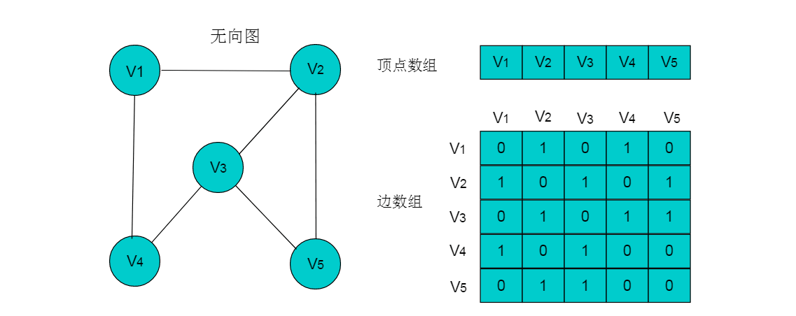
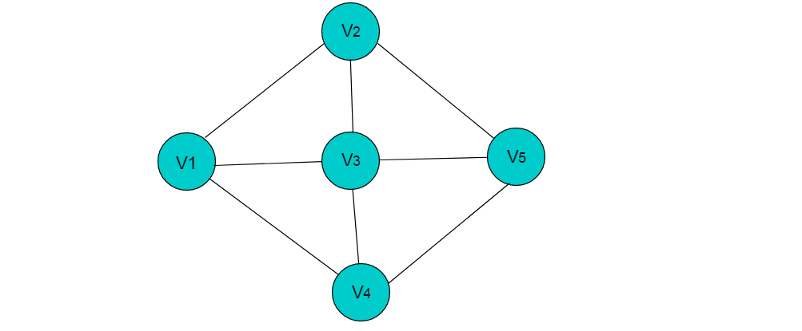
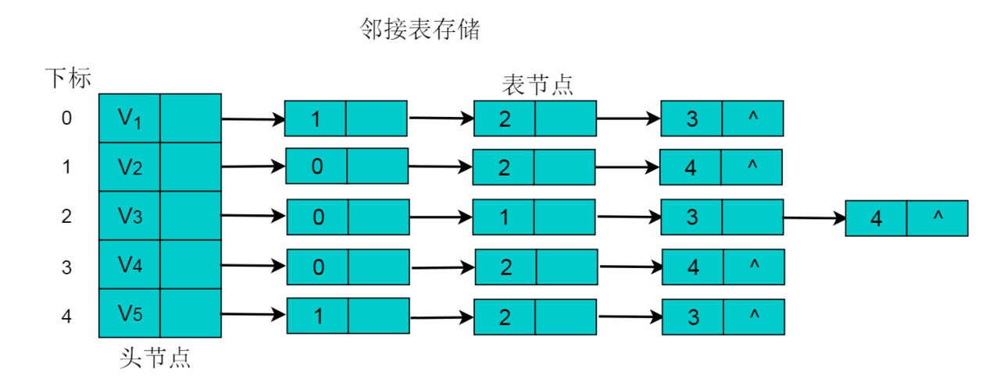
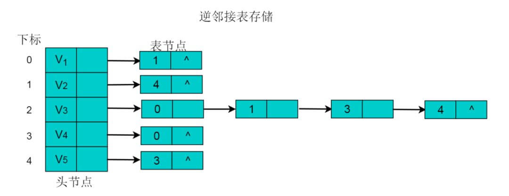
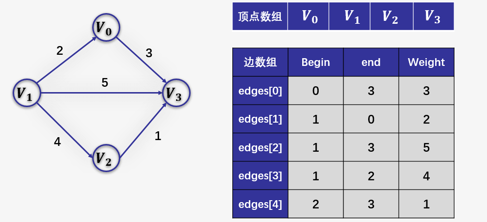

# 图存储结构

### 数组存储

**图的数组存储**方式也称为**邻接矩阵存储**。

图中的数据信息包括：顶点信息和描述顶点之间关系的边的信息，将这两种信息存储在数组中即为图的数组存储。

首先，创建顶点数组，顶点数组中存储的是图的顶点信息，采用一维数组的方式即可存储所有的顶点信息。存储图中边的信息时，由于边是描述顶点与顶点之间关系的信息，因此需要采用二维数组进行存储。

##### 定义

设图G有n个顶点，则邻接矩阵是一个n X n的方阵A，定义为：


其中，<Vi , Vj>或者(Vi , Vj,)表示顶点Vi与顶点Vj邻接。wi,j表示边的权重值。

例如：下图所示的无向图，采用数组存储形式如下。



注：图中的数组存储方式简化了边的权值为1。

###### 无向图的数组存储主要有以下特性

    （1）顶点数组长度为图的顶点数目n。边数组为n X n的二维数组。
    （2）边数组中，A[i][j] =1代表顶点i与顶点j邻接，A[i][j] = 0代表顶点i与顶点j不邻接。
    （3）在无向图中。由于边是无向边，因此顶点的邻接关系是对称的，边数组为对称二维数组。
    （4）顶点与自身之间并未邻接关系，因此边数组的对角线上的元素均为0。
    （5）顶点的度即为顶点所在的行或者列1的数目。例如：顶点V2的度为3，则V2所在行和列中的1的数目为3。

当图为有向图时，图的数组存储方式要发生变化。

例如：下图所示的有向图，采用数组存储形式如下。


###### 有向图的数组存储主要有以下特性

    （1）顶点数组长度为图的顶点数目n。边数组为n X n的二维数组。
    （2）边数组中，数组元素为1，即A[i][j] = 1,代表第i个顶点与第j个顶点邻接，且i为尾，j为头。 A[i][j] = 0代表顶点与顶点不邻接。
    （3）在有向图中，由于边存在方向性，因此数组不一定为对称数组。
    （4）对角线上元素为0。
    （5）第i行中，1的数目代表第i个顶点的出度。例如：顶点V1的出度为2，则顶点V1所在行的1的数目为2。
    （6）第j列中，1的数目代表第j个顶点的入度。例如：V3的入度为1，则V3所在列中1的数目为1。

##### 数组存储方式优点

数组存储方式容易实现图的操作。例如：求某顶点的度、判断顶点之间是否有边（弧）、找顶点的邻接点等等。

##### 数组存储方式缺点

采用数组存储方式，图若有n个顶点则需要n2个单元存储边(弧)，空间存储效率为O(n2)。 
当顶点数目较多，边数目较少时，此时图为稀疏图，这时尤其浪费空间。

例如：下图中有9个顶点，边数为10，需要9X9的二维数组，
而实际存储边信息空间只有10，造成空间浪费。


上图所示无向图的存储数组：


### 邻接表

当使用数组存储时，主要有以下三个问题：

    （1）对于一个图，若图中的顶点数目过大，则无法使用邻接矩阵进行存储。因为在分配数组内存时可能会导致内存分配失败。
    （2）对于某些稀疏图（即顶点数目多，边数目少），创建的数组大小很大，而真正存储的有用信息又很少，这就造成了空间上的浪费。
    （3）有时两个点之间不止存在有一条边，这是用邻接矩阵就无法同时表示两条以上的边。

针对以上情况，提出了一种特殊的图存储方式，让每个节点拥有的数组大小刚好就等于它所连接的边数，
由此建立一种邻接表的存储方式。

**邻接表存储**方法是一种数组存储和链式存储相结合的存储方法。
在邻接表中，对图中的每个顶点建立一个单链表，第i个单链表中的结点依附于顶点Vi的边（对有向图是以顶点Vi为尾的弧）。
链表中的节点称为表节点，共有3个域，具体结构见下图：


**表结点**由三个域组成，adjvex存储与Vi邻接的点在图中的位置，nextarc存储下一条边或弧的结点，data存储与边或弧相关的信息如权值。

除表节点外，需要在数组中存储**头节点**，**头结点**由两个域组成，分别指向链表中第一个顶点和存储Vi的名或其他信息。具体结构如下图：


其中，data域中存储顶点相关信息，firstarc指向链表的第一个节点。

##### 无向图采用邻接表方式存储

例如：下图所示的无向图采用邻接表存储。



采用邻接表方式存储上图中的无向图，绘图过程中忽略边节点的info信息，头结点中的data域存储顶点名称。
以V1顶点为例，V1顶点的邻接顶点为V2、V3、V4，则可以创建3个表节点，表节点中adjvex分别存储V2、V3、V4的索引1、2、3，按照此方式，得到的邻接表为：



##### 无向图的邻接表存储特性：

    （1）数组中头节点的数目为图的顶点数目。
    （2）链表的长度即为顶点的度。例如：V1顶点的度为3，则以V1为头节点的链表中表节点的数目为3。
    
##### 有向图采用邻接表方式存储

例如：图 6.3 所示的有向图采用邻接表存储。


采用邻接表方式存储图6.3中的有向图，绘图过程中忽略边节点的info信息，
头结点中的data域存储顶点名称。以V1顶点为例，
V1顶点的邻接顶点为V2、V3、V4，但是以V1顶点为尾的边只有两条，
即和因此，创建2个表节点。表节点中adjvex分别存储V3、V4的索引2、3，
按照此方式，得到的邻接表为：


##### 有向图的邻接表存储特性：

    （1）数组中表节点的数目为图的顶点数目。
    （2）链表的长度即为顶点的出度。例如V1的出度为2，V1为头节点的链表中，表节点的数目为2。
    （3）顶点Vi的入度为邻接表中所有adjvex值域为i的表结点数目。例如：顶点V3的入度为4，则链表中所有adjvex值域为2的表结点数目为4。
    
注：图采用邻接表的方式表示时，其表示方式是不唯一的。这是因为在每个顶点对应的单链表中，各边节点的链接次序可以是任意的，取决于建立邻接表的算法以及边的输入次序。


### 逆邻接表


在邻接表中，可以轻易的得出顶点的出度，但是想要得到顶点的入度，则需要遍历整个链表。为了便于确定顶点的入度，可以建立有向图的逆邻接表。逆邻接表的建立与邻接表相反。

采用逆邻接表的方式存储图3.2所示的无向图。以V3顶点为例，V3顶点的邻接顶点为V1、V2、V4、V5，以V3顶点为头的边有4条，即、、、因此，创建4个表节点。表节点中adjvex分别存储V0、V1、V3、V4的索引0、1、3、4，按照此方式，得到的逆邻接表为：



### 十字链表

对于有向图而言，邻接链表的缺陷是要查询某个顶点的入度时需要遍历整个链表，而逆邻接链表在查询某个顶点的出度时要遍历整个链表。为了解决这些问题，十字链表将邻接链表和逆邻接链表综合了起来，而得到的一种十字链表。在十字链表中，每一条边对应一种边节点，每一个顶点对应为顶点节点。

顶点节点
顶点节点即为头节点，由3个域构成，具体形式如下：


其中，data域存储与顶点相关的信息，firstin和firstout分别指向以此顶点为头或尾的第一个边节点。
边节点
在边节点为链表节点，共有 5 个域，具体形式如下：


其中，尾域tailvex和头域headvex分别指向尾和头的顶点在图中的位置。链域hlink指向头相同的下一条边，链域tlink指向尾相同的下一条边。info 存储此条边的相关信息。
例如：图8.1所示的有向图，采用十字链表存储图方式。


采用十字链表的方式存储图8.1中的有向图，绘图过程忽略边节点中的info信息，表头节点中的data域存储顶点名称。
以V1顶点为例，顶点节点的data域存储V1顶点名，firstin存储以V1顶点为头第一个边节点，以V1顶点为头边为，firstout存储以以V1顶点为尾第一个边节点，对应边为。
按照此规则，得到的十字链表存储为：


注：采用十字链表存储时，表头节点仍然使用数组存储，采用下标索引方式获取。

### 邻接多重表

对于无向图而言，其每条边在邻接链表中都需要两个结点来表示，而邻接多重表正是对其进行优化，让同一条边只用一个结点表示即可。邻接多重表仿照了十字链表的思想，对邻接链表的边表结点进行了改进。

重新定义的边结点结构如下图：


其中，ivex和jvex是指某条边依附的两个顶点在顶点表中的下标。 ilink指向依附顶点ivex的下一条边，jlink指向依附顶点jvex的下一条边。info存储边的相关信息。

重新定义的顶点结构如下图：


其中，data存储顶点的相关信息，firstedge指向第一条依附于该顶点的边。

例如：下图所示的无向图，采用邻接多重表存储图。


上图所示的无向图，采用邻接多重表存储，以 V0 为例，顶点节点的data域存储V0名称，firstedge 指向(V0 , V1)边，边节点中的ilink指向依附V0顶点的下一条边(V0 , V3)，jlink指向依附V1顶点的下一条边(V1 , V2)，按照此方式建立邻接多重表：


基于列表实现的顶点与边的结构：


##### （有向）图的顶点结构接口

```java
package dsa.Graph;

import dsa.Iterator.Iterator;
import other.Position;

public interface Vertex {

    /*
     * （有向）图的顶点结构接口
     */
    // 常量
    final static int UNDISCOVERED = 0;// 尚未被发现的顶点
    final static int DISCOVERED = 1;// 已被发现的顶点
    final static int VISITED = 2;// 已访问过的顶点
    // 返回当前顶点的信息

    public Object getInfo();

    // 将当前顶点的信息更新为x，并返回原先的信息
    public Object setInfo(Object x);

    // 返回当前顶点的出、入度
    public int outDeg();

    public int inDeg();

    // 返回当前顶点所有关联边、关联边位置的迭代器
    public Iterator inEdges();

    public Iterator inEdgePositions();

    public Iterator outEdges();

    public Iterator outEdgePositions();

    // 取当前顶点在所属的图的顶点集V中的位置
    public Position getVPosInV();

    // 读取、设置顶点的状态（DFS + BFS）
    public int getStatus();

    public int setStatus(int s);

    // 读取、设置顶点的时间标签（DFS）
    public int getDStamp();

    public int setDStamp(int s);

    public int getFStamp();

    public int setFStamp(int s);

    // 读取、设置顶点至起点的最短距离（BFS或BestFS）
    public int getDistance();

    public int setDistance(int s);

    // 读取、设置顶点在的DFS、BFS、BestFS或MST树中的父亲
    public Vertex getBFSParent();

    public Vertex setBFSParent(Vertex s);
}
```
##### （有向）图的边结构接口

```java
package dsa.Graph;

import other.Position;

public interface Edge {

    /*
     * （有向）图的边结构接口
     */
    // 常量
    final static int UNKNOWN = 0;// 未知边
    final static int TREE = 1;// 树边
    final static int CROSS = 2;// 横跨边
    final static int FORWARD = 3;// 前向跨边
    final static int BACKWARD = 4;// 后向跨边
    // 返回当前边的信息（对于带权图，也就是各边的权重）

    public Object getInfo();

    // 将当前边的信息更新为x，并返回原先的信息
    public Object setInfo(Object x);

    // 取当前边在所属的图的边集E中的位置
    public Position getEPosInE();

    // 取v[i]在顶点集V中的位置（i=0或1，分别对应于起点、终点）
    public Position getVPosInV(int i);

    // 当前边在其两个端点的关联边集I(v[i])中的位置
    public Position getEPosInI(int i);

    // 读取、设置边的类别（针对遍历）
    public int getType();

    public int setType(int t);
}
```

##### （有向）图结构接口

```java
package dsa.Graph;

import dsa.Iterator.Iterator;
import other.Position;

public interface Graph {

    /*
     * （有向）图结构接口 
     */

    // 取图中顶点、边的数目
    public int vNumber();

    public int eNumber();

    // 取图中所有顶点、顶点位置的迭代器
    public Iterator vertices();

    public Iterator vPositions();

    // 返回图中所有边、边位置的迭代器
    public Iterator edges();

    public Iterator ePositions();

    // 检测是否有某条边从顶点u指向v
    public boolean areAdjacent(Vertex u, Vertex v);

    // 取从顶点u指向v的边，若不存在，则返回null
    public Edge edgeFromTo(Vertex u, Vertex v);

    // 将顶点v从顶点集中删除，并返回之
    public Vertex remove(Vertex v);

    // 将边e从边集中删除，并返回之
    public Edge remove(Edge e);

    // 在顶点集V中插入新顶点v，并返回其位置
    public Position insert(Vertex v);

    // 在边集E中插入新边e，并返回其位置
    public Position insert(Edge e);
}
```

##### 基于邻接边表实现图的顶点结构

```java
package dsa.Graph;

import dsa.Iterator.Iterator;
import dsa.List.List;
import dsa.List.List_DLNode;
import other.Position;

public class Vertex_List implements Vertex {

    /*
     * 基于邻接边表实现图的顶点结构
     */

    // 变量
    protected Object info;// 当前顶点中存放的数据元素
    protected Position vPosInV;// 当前顶点在所属的图的顶点表V中的位置
    protected List outEdges;// 关联边表：存放以当前顶点为尾的所有边（的位置）
    protected List inEdges;// 关联边表：存放以当前顶点为头的所有边（的位置）
    protected int status;// （在遍历图等操作过程中）顶点的状态
    protected int dStamp;// 时间标签：DFS过程中该顶点被发现时的时刻
    protected int fStamp;// 时间标签：DFS过程中该顶点被访问结束时的时刻
    protected int distance;// 到指定起点的距离：BFS、Dijkstra等算法所确定该顶点到起点的距离
    protected Vertex bfsParent;// 在最短距离树（BFS或BestFS）中的父亲
    // 构造方法：在图G中引入一个属性为x的新顶点

    public Vertex_List(Graph G, Object x) {
        info = x;// 数据元素
        vPosInV = G.insert(this);// 当前顶点在所属的图的顶点表V中的位置
        outEdges = new List_DLNode();// 出边表
        inEdges = new List_DLNode();// 入边表
        status = UNDISCOVERED;
        dStamp = fStamp = Integer.MAX_VALUE;
        distance = Integer.MAX_VALUE;
        bfsParent = null;
    }

    // 返回当前顶点的信息
    public Object getInfo() {
        return info;
    }

    // 将当前顶点的信息更新为x，并返回原先的信息
    public Object setInfo(Object x) {
        Object e = info;
        info = x;
        return e;
    }

    // 返回当前顶点的出、入度
    public int outDeg() {
        return outEdges.getSize();
    }

    public int inDeg() {
        return inEdges.getSize();
    }

    // 返回当前顶点所有关联边、关联边位置的迭代器
    public Iterator inEdges() {
        return inEdges.elements();
    }

    public Iterator inEdgePositions() {
        return inEdges.positions();
    }

    public Iterator outEdges() {
        return outEdges.elements();
    }

    public Iterator outEdgePositions() {
        return outEdges.positions();
    }

    // 取当前顶点在所属的图的顶点集V中的位置
    public Position getVPosInV() {
        return vPosInV;
    }

    // 读取、设置顶点的状态（DFS + BFS）
    public int getStatus() {
        return status;
    }

    public int setStatus(int s) {
        int ss = status;
        status = s;
        return ss;
    }

    // 读取、设置顶点的时间标签（DFS）
    public int getDStamp() {
        return dStamp;
    }

    public int setDStamp(int s) {
        int ss = dStamp;
        dStamp = s;
        return ss;
    }

    public int getFStamp() {
        return fStamp;
    }

    public int setFStamp(int s) {
        int ss = fStamp;
        fStamp = s;
        return ss;
    }

    // 读取、设置顶点至起点的最短距离（BFS）
    public int getDistance() {
        return distance;
    }

    public int setDistance(int s) {
        int ss = distance;
        distance = s;
        return ss;
    }

    // 读取、设置顶点在的DFS、BFS、BestFS或MST树中的父亲
    public Vertex getBFSParent() {
        return bfsParent;
    }

    public Vertex setBFSParent(Vertex s) {
        Vertex ss = bfsParent;
        bfsParent = s;
        return ss;
    }
}
```

##### 基于邻接边表实现图的边结构

```java
package dsa.Graph;

import dsa.Deque.DLNode;
import other.Position;

public class Edge_List implements Edge {

    /*
     * 基于邻接边表实现图的边结构
     */

    // 变量
    protected Object info;// 当前边中存放的数据元素
    protected Position ePosInE;// 当前边在所属的图的边表中的位置
    protected Position vPosInV[];// 当前边两个端点在顶点表中的位置
    protected Position ePosInI[];// 当前边在其两个端点的关联边表中的位置
    // 约定：第0（1）个顶点分别为尾（头）顶点
    // 禁止头、尾顶点相同的边
    protected int type;// （经过遍历之后）边被归入的类别
    // 构造方法：在图G中，生成一条从顶点u到v的新边（假定该边尚不存在）

    public Edge_List(Graph G, Vertex_List u, Vertex_List v, Object x) {
        info = x;// 数据元素
        ePosInE = G.insert(this);// 当前边在所属的图的边表中的位置
        vPosInV = new DLNode[2];// 当前边两个端点在顶点表中的位置
        vPosInV[0] = u.getVPosInV();
        vPosInV[1] = v.getVPosInV();
        ePosInI = new DLNode[2];// 当前边在其两个端点的关联边表中的位置
        ePosInI[0] = u.outEdges.insertLast(this);// 当前边加入u的邻接（出）边表
        ePosInI[1] = v.inEdges.insertLast(this);// 当前边加入v的邻接（入）边表
        type = UNKNOWN;
    }

    // 返回当前边的信息
    public Object getInfo() {
        return info;
    }

    // 将当前边的信息更新为x，并返回原先的信息
    public Object setInfo(Object x) {
        Object e = info;
        info = x;
        return e;
    }

    // 取当前边在所属的图的边集E中的位置
    public Position getEPosInE() {
        return ePosInE;
    }

    // 取v[i]在顶点集V中的位置（i=0或1，分别对应于起点、终点）
    public Position getVPosInV(int i) {
        return vPosInV[i];
    }

    // 当前边在其两个端点的关联边集I(v[i])中的位置
    public Position getEPosInI(int i) {
        return ePosInI[i];
    }

    // 读取、设置边的类别（针对遍历）
    public int getType() {
        return type;
    }

    public int setType(int t) {
        int tt = type;
        type = t;
        return tt;
    }
}
```

##### 基于邻接边表实现图结构

```java
package dsa.Graph;

import dsa.Iterator.Iterator;
import dsa.List.List;
import dsa.List.List_DLNode;
import other.Position;

public class Graph_List implements Graph {
    /*
     * 基于邻接边表实现图结构
     */
    // 变量
    protected List E;// 容器：存放图中所有边
    protected List V;// 容器：存放图中所有顶点
    // 构造方法

    public Graph_List() {
        E = new List_DLNode();
        V = new List_DLNode();
    }

    // 取图的边表、顶点表
    protected List getE() {
        return E;
    }

    protected List getV() {
        return V;
    }

    // 取图中顶点、边的数目
    public int vNumber() {
        return V.getSize();
    }

    public int eNumber() {
        return E.getSize();
    }

    // 取图中所有顶点、顶点位置的迭代器
    public Iterator vertices() {
        return V.elements();
    }

    public Iterator vPositions() {
        return V.positions();
    }

    // 返回图中所有边、边位置的迭代器
    public Iterator edges() {
        return E.elements();
    }

    public Iterator ePositions() {
        return E.positions();
    }

    // 检测是否有某条边从顶点u指向v
    public boolean areAdjacent(Vertex u, Vertex v) {
        return (null != edgeFromTo(u, v));
    }

    // 取从顶点u指向v的边，若不存在，则返回null
    public Edge edgeFromTo(Vertex u, Vertex v) {
        for (Iterator it = u.outEdges(); it.hasNext();) {// 逐一检查
            Edge e = (Edge) it.getNext();// 以u为尾的每一条边e
            if (v == e.getVPosInV(1).getElem())// 若e是(u, v)，则
                return e;// 返回该边
        }
        return null;// 若不存在这样的(u, v)，则返回null
    }

    // 将顶点v从顶点集中删除，并返回之
    public Vertex remove(Vertex v) {
        while (0 < v.outDeg())// 将以v为尾的所有边
            remove((Edge) (((Vertex_List) v).outEdges.first()).getElem());// 逐一删除
        while (0 < v.inDeg())// 将以v为头的所有边
            remove((Edge) (((Vertex_List) v).inEdges.first()).getElem());// 逐一删除
        return (Vertex) V.remove(v.getVPosInV());// 在顶点表中删除v
    }

    // 将边e从边集中删除，并返回之
    public Edge remove(Edge e) {
        ((Vertex_List) e.getVPosInV(0).getElem()).outEdges.remove(e.getEPosInI(0));// 从起点的出边表中删除e
        ((Vertex_List) e.getVPosInV(1).getElem()).inEdges.remove(e.getEPosInI(1));// 从终点的入边表中删除e
        return (Edge) E.remove(e.getEPosInE());// 从边表中删除e
    }

    // 在顶点集V中插入新顶点v，并返回其位置
    public Position insert(Vertex v) {
        return V.insertLast(v);
    }

    // 在边集E中插入新边e，并返回其位置
    public Position insert(Edge e) {
        return E.insertLast(e);
    }
}
```

这里主要涉及三个算法，具体分析如下：

判断任意一对顶点是否相邻

> 算法：areAdjacent(u, v)
  输入：一对顶点u和v
  输出：判断是否有某条边从顶点u指向v
  {
  取顶点u的出边迭代器it;
  通过it逐一检查u的每一条出边e;
  一旦e的终点为v，则报告true;
  若e的所有出边都已检查过，则返回false;
  }
  
* 删除边

> 算法：RemoveEdge(e)
  输入：边e = (u, v)
  输出：将边e从边集E中删除
  {
  从起点u的出边邻接表中删除e;
  从终点v的入边邻接表中删除e;
  从边表E中删除e;
  }

* 删除顶点

> 算法：removeVertex(v)
  输入：顶点v
  输出：将顶点v从顶点集V中删除
  {
  扫描v的出边邻接表，（调用removeEdge()算法）将所有边逐一删除;
  扫描v的入边邻接表，（调用removeEdge()算法）将所有边逐一删除;
  在顶点表V中删除v;
  }
  
### 边集数组
边集数组是由两个一维数组构成，一个是存储顶点的信息，
另一个是存储边的信息，这个边数组每个数据元素由一条边的起点下标(begin)、终点下标(end)和权(weight)组成。


