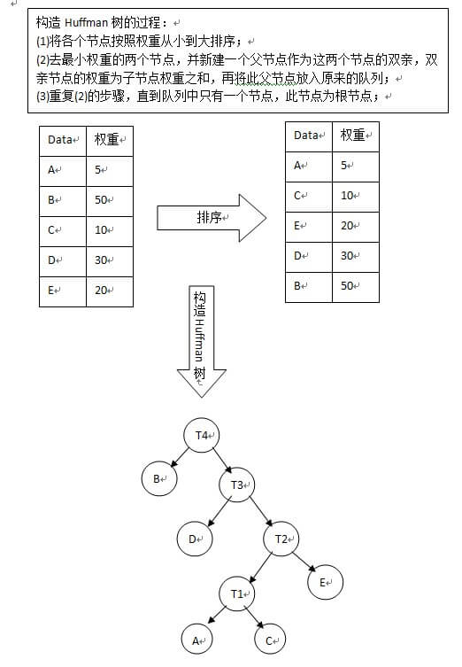
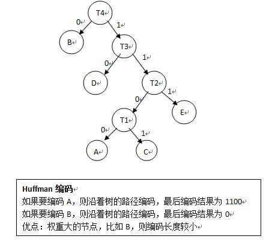
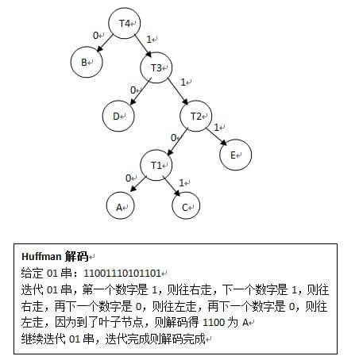

# Huffman树

又称为最优二叉数，是一种带权路径最短的树。
哈夫曼编码就是哈夫曼树的应用,可以用来进行编码压缩.

#### 关于霍夫曼编码（Huffman编码）

Huffman是一种前缀编码；Huffman编码是建立在Huffman树的基础上进行的，因此为了进行Huffman编码，必须先构建Huffman树；树的路径长度是每个叶节点到根节点的路径之和；带权路径长度是（每个叶节点的路径长度*wi）之和；Huffman树是最小带权路径长度的二叉树；

构造Huffman树的过程：

1. 将各个节点按照权重从小到大排序；
2. 取最小权重的两个节点，并新建一个父节点作为这两个节点的双亲，双亲节点的权重为子节点权重之和，再将此父节点放入原来的队列；
3. 重复(2)的步骤，直到队列中只有一个节点，此节点为根节点；

构造完Huffman树之后，就可以进行Huffman编码了，编码规则：左分支填0，右分支填1；

Huffman解码过程：给定一个01串，将01串进行Huffman树，到叶子节点了就表明已经解码一个节点，然后再次遍历Huffman树；

