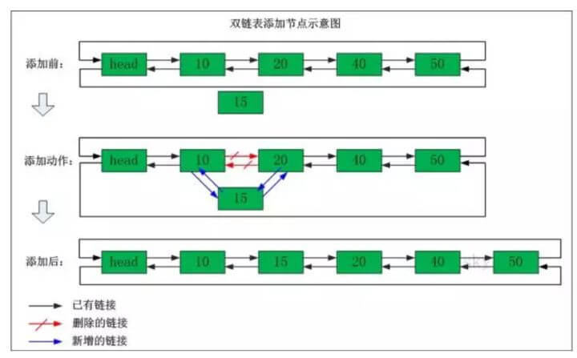

# 链表

链表这类数据结构，有点像生活中的火车，一节车厢连着下一节车厢，
在火车里面，只有到了4号车厢你才能进入5号车厢，
一般情况下，不可能直接在3号车厢绕过4号车厢进入5号车厢。
不过更准确来说，火车是双向链表，
也就是说在4号车厢也可以反向进入3号车厢。

* 链表是一系列的存储数据元素的单元通过指针串接起来形成的，
因此每个单元至少有两个域，一个域用于数据元素的存储，
另一个或两个域是指向其他单元的指针(Pointer)。
这里具有一个数据域和多个指针域的存储单元通常称为节点（node）。

* 链表的第一个节点和最后一个节点，分别称为链表的头节点和尾节点。
尾节点的特征是其 next 引用为空（null）。
链表中每个节点的 next 引用都相当于一个指针，指向另一个节点，
借助这些 next 引用，我们可以从链表的头节点移动到尾节点。

* 链表数据结构中主要包含单向链表、双向链表及循环链表

* 由于不必须按顺序存储，链表的插入和删除操作可以达到O(1)的复杂度。

* 这里的链表是一种抽象的数据结构，每个节点有信息和下一个节点的地址，和怎么实现半毛钱关系也没有。
链表当然也可以用数组实现，也可以用STL的vector，都不用动态allocate

## 单向链表

单向链表(单链表)是链表的一种，它由节点组成，
每个节点都包含下一个节点的指针，下图就是一个单链表，
表头为空，表头的后继节点是"结点10"(数据为10的结点)，
"节点10"的后继结点是"节点20"(数据为10的结点)，...


###### 单链表删除节点

我们看看单链表删除节点的操作，比如说下面这个单链表中我们要删除"节点30"。

**删除之前**："节点20" 的后继节点为"节点30"，而"节点30" 的后继节点为"节点40"。

**删除之后**："节点20" 的后继节点为"节点40"。


###### 单链表添加节点

我们再来看看单链表添加节点的操作，比如说下面这个单链表中我们在"节点10"与"节点20"之间添加"节点15"

**添加之前**："节点10" 的后继节点为"节点20"。

**添加之后**："节点10" 的后继节点为"节点15"，而"节点15" 的后继节点为"节点20"。


###### 代码实现

```java
package datastructure.sequence;

/**
 * 单向链表
 */
public class FireSinglyLinkedList<E> {

    int size = 0;
    Node<E> first;
    Node<E> last;

    public FireSinglyLinkedList() {

    }

    public boolean isEmpty() {
        return this.size == 0;
    }

    public int size() {
        return this.size;
    }

    public void add(E e) {
        Node<E> p = this.last;
        Node<E> newNode = new Node<>(e, null);
        this.last = newNode;

        if (p == null) {
            this.first = newNode;
        } else {
            last.next = newNode;
        }

        this.size++;
    }

    public void add(int index, E e) {
        checkPositionInde(index);
        if (index == size) {
            add(e);
        } else if (index == 0) {
            Node<E> newNode = new Node<>(e, null);
            newNode.next = first;
            this.first = newNode;
            this.size++;
        } else {
            Node<E> pre = node(index - 1);
            Node<E> newNode = new Node<>(e, null);
            Node<E> x = pre.next;
            pre.next = newNode;
            newNode.next = x;
            this.size++;
        }
    }

    private void checkPositionInde(int index) {
        if (!isPositionIndex(index)) {
            throw new IndexOutOfBoundsException("Index: " + index + ", Size: " + size);
        }
    }

    private boolean isPositionIndex(int index) {
        return index >= 0 && index <= this.size;
    }

    public void set(int index, E e) {

        Node<E> x = node(index);
        x.item = e;
    }

    private Node<E> node(int index) {
        Node<E> x = first;
        for (int i = 0; i < index; i++) {
            x = first.next;
        }
        return x;
    }

    public E get(int index) {
        return node(index).item;
    }

    public void remove(int index) {
        if (index == 0) {
            Node<E> head = first;
            this.first = first.next;
            head.next = null;
            //last = null;
        } else {
            Node<E> pre = node(index - 1);
            Node<E> x = pre.next;
            Node<E> next = x.next;
            pre.next = next;
            x.next = null;
        }

        size--;

        if (this.size == 0) {
            this.last = null;
        }
    }

    private class Node<E> {
        E item;
        Node<E> next;

        Node(E element, Node<E> next) {
            this.item = element;
            this.next = next;
        }
    }
}

```

## 循环链表


## 双向链表

双向链表(双链表)是链表的一种。和单链表一样，双链表也是由节点组成，它的每个数据结点中都有两个指针，分别指向直接后继和直接前驱。
所以，从双向链表中的任意一个结点开始，都可以很方便地访问它的前驱结点和后继结点。一般我们都构造双向循环链表。


表头为空，表头的后继节点为"节点10"(数据为10的节点)；
"节点10"的后继节点是"节点20"(数据为10的节点)，
"节点20"的前继节点是"节点10"；"节点20"的后继节点是"节点30"，
"节点30"的前继节点是"节点20"；...；末尾节点的后继节点是表头。

###### 双向链表删除节点

我们看看双向链表删除节点的操作，比如说下面这个单链表中我们要删除"节点30"。

**删除之前**："节点20"的后继节点为"节点30"，"节点30" 的前继节点为"节点20"。
"节点30"的后继节点为"节点40"，"节点40" 的前继节点为"节点30"。

**删除之后**："节点20"的后继节点为"节点40"，"节点40" 的前继节点为"节点20"。


###### 双向链表添加节点

我们再来看看双向链表添加节点的操作，比如说下面这个双向链表在"节点10"与"节点20"之间添加"节点15"

**添加之前**："节点10"的后继节点为"节点20"，"节点20" 的前继节点为"节点10"。

**添加之后**："节点10"的后继节点为"节点15"，"节点15" 的前继节点为"节点10"。"节点15"的后继节点为"节点20"，"节点20" 的前继节点为"节点15"。



###### 代码实现

```java

```


#### 用链表的目的是什么？省空间还是省时间？


链表的优点除了「插入删除不需要移动其他元素」之外，还在于它是一个局部化结构。
就是说当你拿到链表的一个 node 之后，不需要太多其它数据，就可以完成插入，删除的操作。而其它的数据结构不行。
比如说 array，你只拿到一个 item 是断不敢做插入删除的。

当然了，局部化这个好处只有 intrusive 链表才有，就是必须 prev/next 嵌入在数据结构中。
像 STL 和 Java 那种设计是失败了。


#### 数组（非动态）对比链表：

数组（非动态）对比链表：数组简单易用，在实现上使用的是连续的内存空间。
得益于现代处理器的缓存机制，其访问效率很高。
数组的缺点是大小固定，一经声明就要占用整块内存空间。如果声明的数组过大，系统可能没有足够的连续内存空间分配给它。
而如果声明的数组过小，则可能出现不够用的情况。这时只能再声明一个更大的数组，然后把原数组拷贝进去，非常费时。
链表最大的特点是大小动态可调，其大小与已经而不是计划存储的元素个数成正比。在确定了操作点之后，插入和删除的操作耗时是固定的。
但是使用链表也要为其动态特性付出代价，例如每个元素都需要消耗额外的存储空间去存储一份指向下一个元素的指针类数据。
链表与数组的各种操作复杂度如下所示：

操作 ------------------- 链表 ---- 数组

查找 -------------------- O(n) ---- O(1)

在头部插入/删除 ------ O(1) ---- O(n)

在尾部插入/删除 ------ O(n) ---- O(1)

在中间插入/删除 ------ O(n) ---- O(n)

额外的存储空间 ------- O(n) ----  0

**注意虽然表面看起来复杂度都是 O(n)，但是链表和数组在插入和删除时进行的是完全不同的操作。**
链表的主要耗时操作是历遍查找，删除和插入操作本身的复杂度是O(1)。
数组查找很快，主要耗时的操作是拷贝覆盖。
因为除了目标元素在尾部的特殊情况，数组进行插入和删除时需要对操作点之后的所有元素进行前后移位操作，只能通过拷贝和覆盖的方法进行。

from "Data Structures and Algorithms Made Easy"

**关于数据结构与 ADT:**
Linked-list 中的 linked 描述的仍然是数据的结构而不是实现的手段。
一般意义上的实现即 implementation 是跟具体的编程语言挂钩的。
另外计算机科学中一般说 Abstract data type (ADT) 而不是 Abstract data structure。ADT 是从用户的角度出发，
关心的重点既包括数据的定义也包括数据的使用方法。
而数据结构是从设计者的角度出发，关心的重点是数据的组织和存储方式。单论链表的组织和存储方法，这时链表的概念就是数据结构。
如果再加上链表的创建、历遍、删除、插入等操作，这时链表的概念就是 ADT。而用某一种编程语言实现了链表的 ADT，这叫做链表的实现。


#### 面试中关于链表的常见问题

* 反转链表

链表反转一般指的是单向链表，常见的方式是按原始顺序迭代结点，并将它们逐个移动到列表的头部

* 寻找中间节点

看看我们如何来理解快慢指针的：把链表看作一条赛道，运动员A速度是运动员B的两倍，当运动员A跑完全程，运动员B就刚刚好跑了一半。

我们要做的代码如下，fast的next指针为空或者fast的next的next指针为空，则退出寻址循环

    slow = slow.next
    fast = fast.next.next


* 删除链表中的节点

    输入: 1->2->6->3->4->5->6, val = 6
    输出: 1->2->3->4->5

*   奇偶链表

给定一个单链表，把所有的奇数节点和偶数节点分别排在一起。请注意，这里的奇数节点和偶数节点指的是节点编号的奇偶性，而不是节点的值的奇偶性。

请尝试使用原地算法完成。你的算法的空间复杂度应为 O(1)，时间复杂度应为 O(nodes)，nodes 为节点总数。

    输入: 1->2->3->4->5->NULL
    输出: 1->3->5->2->4->NULL


    输入: 2->1->3->5->6->4->7->NULL 
    输出: 2->3->6->7->1->5->4->NULL


* 回文链表


* 返回链表倒数第N个节点


* 删除链表中的重复项

第一种使用额外的存储空间，引入hash表
第二种不能使用额外的存储空间，直接在原始链表上进行操作

1. 建立指针p，用于遍历链表；
2. 建立指针q，q遍历p后面的结点，并与p数值比较；
3. 建立指针r，r保存需要删掉的结点，再把需要删掉的结点的前后结点相接。由此去掉重复值。

* 合并两个有序的单链表，合并之后的链表依然有序

这个类似于归并排序，你创建一个新链表，然后把上面两个链表依次比较，插入新链表

* 检测链表中的循环

这里也是用到两个指针，如果一个链表有环，那么用一个指针去遍历，是永远走不到头的。
因此，我们用两个指针去遍历：first指针每次走一步，second指针每次走两步，如果first指针和second指针相遇，说明有环。
;如果不存在环，指针fast遇到NULL退出。


* 取出有环链表中，环的长度

在环上相遇后，记录第一次相遇点为Pos，之后指针slow继续每次走1步，fast每次走2步。
在下次相遇的时候fast比slow正好又多走了一圈，也就是多走的距离等于环长。

设从第一次相遇到第二次相遇，设slow走了len步，则fast走了2*len步，相遇时多走了一圈：

    环长=2*len-len。

* 单链表中，取出环的起始点

第一次碰撞点Pos到连接点Join的距离=头指针到连接点Join的距离，
因此，分别从第一次碰撞点Pos、头指针head开始走，相遇的那个点就是连接点。


在环上相遇后，记录第一次相遇点为Pos，连接点为Join，假设头结点到连接点的长度为LenA，连接点到第一次相遇点的长度为x，环长为R。

    第一次相遇时，slow走的长度 S = LenA + x;
    第一次相遇时，fast走的长度 2S = LenA + n*R + x;
    所以可以知道，LenA + x =  n*R;　　LenA = n*R -x;
    
* 求有环单链表的链表长

　上述中求出了环的长度和连接点的位置，就可以求出头结点到连接点的长度。两者相加就是链表的长度。

* 判断两个单链表相交的第一个交点

解这道题之前，我们需要首先明确一个概念：
如果两个单链表有共同的节点，那么从第一个共同节点开始，后面的节点都会重叠，直到链表结束。
因为两个链表中有一个共同节点，则这个节点里的指针域指向的下一个节点地址一样，所以下一个节点也会相交，依次类推。所以，若相交，则两个链表呈“Y”字形。如下图：


1. 暴力解法。
从头开始遍历第一个链表，遍历第一个链表的每个节点时，同时从头到尾遍历第二个链表，看是否有相同的节点，第一次找到相同的节点即第一个交点。若第一个链表遍历结束后，还未找到相同的节点，即不存在交点。时间复杂度为O(n^2)。这种方法显然不是写这篇博客的重点。。。不多说了。

2. 使用栈。
我们可以从头遍历两个链表。创建两个栈，第一个栈存储第一个链表的节点，第二个栈存储第二个链表的节点。每遍历到一个节点时，就将该节点入栈。两个链表都入栈结束后。则通过top判断栈顶的节点是否相等即可判断两个单链表是否相交。因为我们知道，若两个链表相交，则从第一个相交节点开始，后面的节点都相交。
若两链表相交，则循环出栈，直到遇到两个出栈的节点不相同，则这个节点的后一个节点就是第一个相交的节点。

3. 遍历链表记录长度。
   同时遍历两个链表到尾部，同时记录两个链表的长度。若两个链表最后的一个节点相同，则两个链表相交。
   有两个链表的长度后，我们就可以知道哪个链表长，设较长的链表长度为len1,短的链表长度为len2。
   则先让较长的链表向后移动(len1-len2)个长度。然后开始从当前位置同时遍历两个链表，当遍历到的链表的节点相同时，则这个节点就是第一个相交的节点。


https://xiaozhuanlan.com/topic/5021347986
