# 图的遍历

遍历是指从某个节点出发，按照一定的的搜索路线，依次访问对数据结构中的全部节点，
且每个节点仅访问一次。

在二叉树基础中，介绍了对于树的遍历。
树的遍历是指从根节点出发，按照一定的访问规则，依次访问树的每个节点信息。
树的遍历过程，根据访问规则的不同主要分为四种遍历方式：

1. 先序遍历
2. 中序遍历
3. 后序遍历
4. 层次遍历

类似的，图的遍历是指，从给定图中任意指定的顶点（称为初始点）出发，
按照某种搜索方法沿着图的边访问图中的所有顶点，使每个顶点仅被访问一次，这个过程称为**图的遍历**。
遍历过程中得到的顶点序列称为**图遍历序列**。

图的遍历过程中，根据搜索方法的不同，又可以划分为两种搜索策略：
* 深度优先搜索（DFS，Depth First Search）
* 广度优先搜索（BFS，Breadth First Search）

### 深度优先搜索

##### 算法思想

假设初始状态是图中所有顶点均未被访问，则从某个顶点v出发，首先访问该顶点，
然后依次从它的各个未被访问的邻接点出发深度优先搜索遍历图，
直至图中所有和v有路径相通的顶点都被访问到。若此时尚有其他顶点未被访问到，
则另选一个未被访问的顶点作起始点，重复上述过程，直至图中所有顶点都被访问到为止。

##### 算法特点

深度优先搜索是一个递归的过程。首先，选定一个出发点后进行遍历，
如果有邻接的未被访问过的节点则继续前进。若不能继续前进，则回退一步再前进，
若回退一步仍然不能前进，则连续回退至可以前进的位置为止。
重复此过程，直到所有与选定点相通的所有顶点都被遍历。

深度优先搜索是递归过程，带有回退操作，因此需要使用栈存储访问的路径信息。
当访问到的当前顶点没有可以前进的邻接顶点时，需要进行出栈操作，将当前位置回退至出栈元素位置。

##### 图解过程

###### 无向图深度优先搜索

以下图中所示无向图说明深度优先搜索遍历过程。

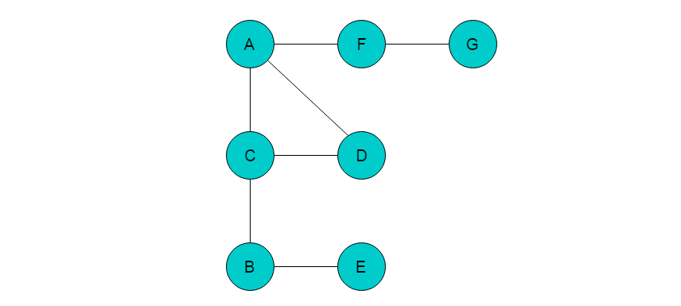

1. 首先选取顶点A为起始点，输出A顶点信息，且将A入栈，并标记A为已访问顶点。  

2. A的邻接顶点有C、D、F，从中任意选取一个顶点前进。这里我们选取C顶点为前进位置顶点。
输出C顶点信息，将C入栈，并标记C为已访问顶点。当前位置指向顶点C。
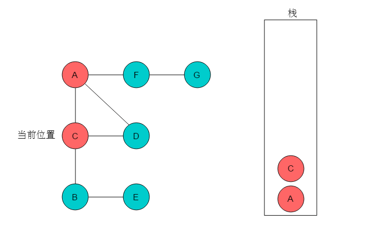

3. 顶点C的邻接顶点有A、D和B，此时A已经标记为已访问顶点，因此不能继续访问。
从B或者D中选取一个顶点前进，这里我们选取B顶点为前进位置顶点。
输出B顶点信息，将B入栈，标记B顶点为已访问顶点。当前位置指向顶点B。
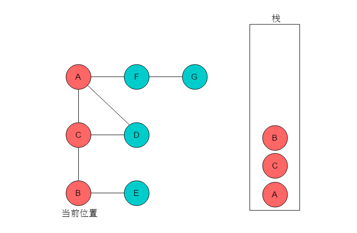

4. 顶点B的邻接顶点只有C、E，C已被标记，不能继续访问，因此选取E为前进位置顶点
，输出E顶点信息，将E入栈，标记E顶点，当前位置指向E。

5. 顶点E的邻接顶点均已被标记，此时无法继续前进，则需要进行回退。
将当前位置回退至顶点B，回退的同时将E出栈。

6. 顶点B的邻接顶点也均被标记，需要继续回退，当前位置回退至C，回退同时将B出栈。
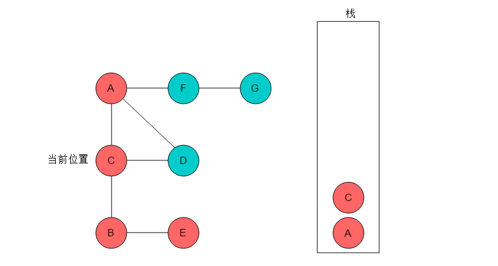

7. 顶点C可以前进的顶点位置为D，则输出D顶点信息，将D入栈，并标记D顶点。当前位置指向顶点D。
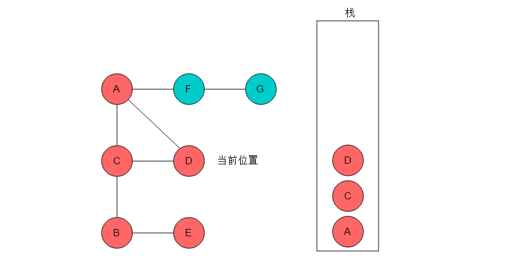

8. 顶点D没有前进的顶点位置，因此需要回退操作。将当前位置回退至顶点C，回退同时将D出栈。

9. 顶点C没有前进的顶点位置，继续回退，将当前位置回退至顶点A，回退同时将C出栈。
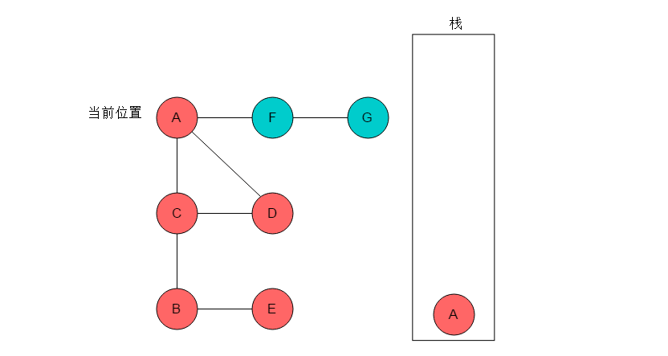

10. 顶点A前进的顶点位置为F，输出F顶点信息，将F入栈，并标记F。将当前位置指向顶点F。

11. 顶点F的前进顶点位置为G，输出G顶点信息，将G入栈，并标记G。将当前位置指向顶点G。

12. 顶点G没有前进顶点位置，回退至F。当前位置指向F，回退同时将G出栈。
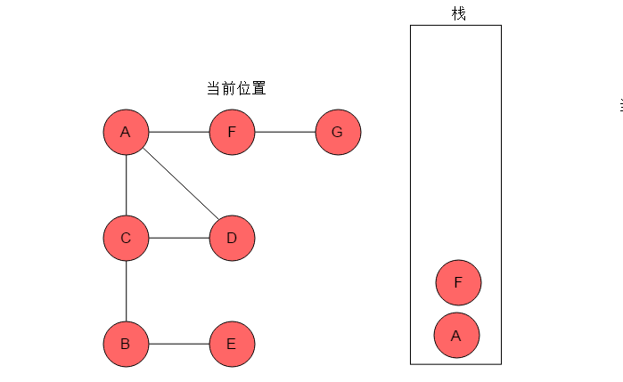

13. 顶点F没有前进顶点位置，回退至A，当前位置指向A，回退同时将F出栈。

14. 顶点A没有前进顶点位置，继续回退，栈为空，则以A为起始的遍历结束。
若图中仍有未被访问的顶点，则选取未访问的顶点为起始点，继续执行此过程。直至所有顶点均被访问。

15. 采用深度优先搜索遍历顺序为A->C->B->E->D->F->G。

###### 有向图深度优先搜索

以下图中所示有向图说明深度优先搜索遍历过程。

1. 以顶点A为起始点，输出A，将A入栈，并标记A。当前位置指向A。

2. 以A为尾的边只有1条，且边的头为顶点B，则前进位置为顶点B，输出B，将B入栈，标记B。当前位置指向B。

3. 顶点B可以前进的位置有C与F，选取F为前进位置，输出F，将F入栈，并标记F。当前位置指向F。
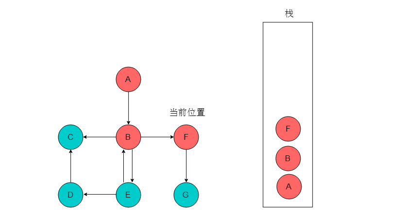

4. 顶点F的前进位置为G，输出G，将G入栈，并标记G。当前位置指向G。
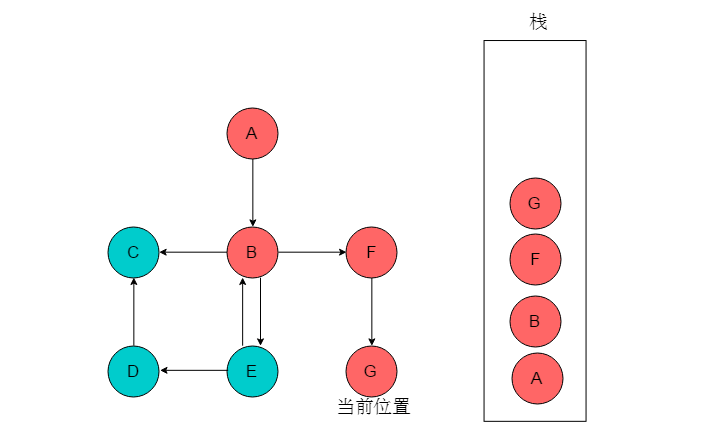

5. 顶点G没有可以前进的位置，则回退至F，将F出栈。当前位置指向F。
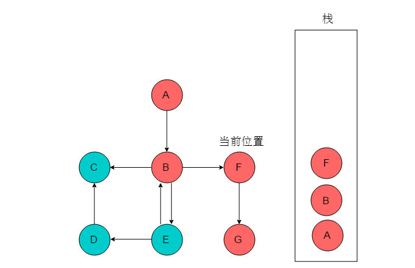

6. 顶点F没有可以前进的位置，继续回退至B，将F出栈。当前位置指向B。

7. 顶点B可以前进位置为C和E，选取E，输出E，将E入栈，并标记E。当前位置指向E。
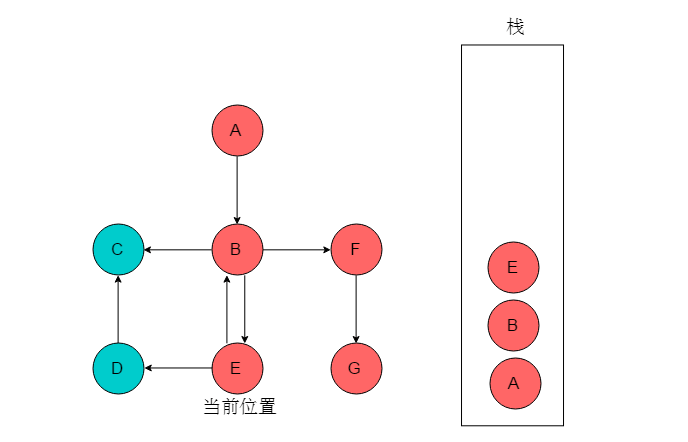

8. 顶点E的前进位置为D，输出D，将D入栈，并标记D。当前位置指向D。
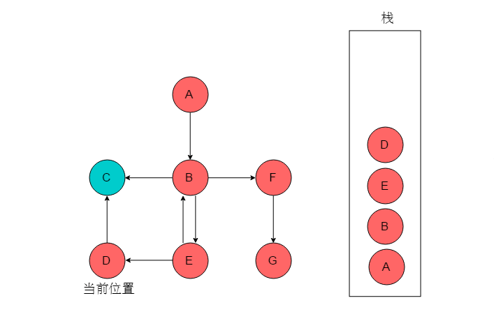

9. 顶点D的前进位置为C，输出C，将C入栈，并标记C。当前位置指向C。
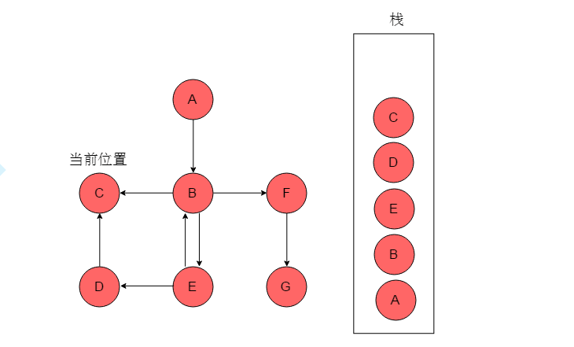

10. 顶点C没有前进位置，进行回退至D，回退同时将C出栈。

11. 继续执行此过程，直至栈为空，以A为起始点的遍历过程结束。若图中仍有未被访问的顶点，则选取未访问的顶点为起始点，继续执行此过程。
直至所有顶点均被访问

##### 算法分析

当图采用邻接矩阵存储时，由于矩阵元素个数为n^2，因此时间复杂度就是O(n^2)。

当图采用邻接表存储时，邻接表中只是存储了边结点(e条边，无向图也只是2e个结点)，加上表头结点为n（也就是顶点个数），因此时间复杂度为O(n+e)。

### 广度优先搜索

##### 算法思想

从图中某顶点v出发，在访问了v之后依次访问v的各个未曾访问过的邻接点，然后分别从这些邻接点出发依次访问它们的邻接点，
并使得“先被访问的顶点的邻接点先于后被访问的顶点的邻接点被访问，直至图中所有已被访问的顶点的邻接点都被访问到。
如果此时图中尚有顶点未被访问，则需要另选一个未曾被访问过的顶点作为新的起始点，
重复上述过程，直至图中所有顶点都被访问到为止。

##### 算法特点

广度优先搜索类似于树的层次遍历，是按照一种由近及远的方式访问图的顶点。在进行广度优先搜索时需要使用队列存储顶点信息。

##### 图解过程

###### 无向图的广度优先搜索

例如：下图所示的无向图，采用广度优先搜索过程。

1. 选取A为起始点，输出A，A入队列，标记A，当前位置指向A。
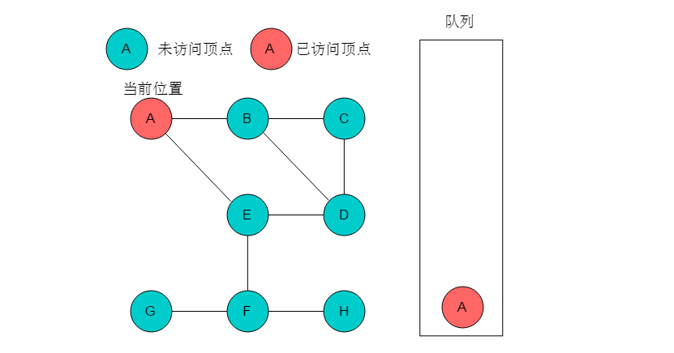

2. 队列头为A，A出队列。A的邻接顶点有B、E，输出B和E，将B和E入队，并标记B、E。当前位置指向A。
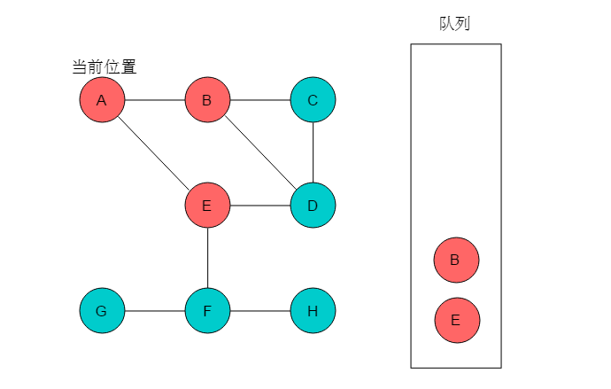

3. 队列头为B，B出队列。B的邻接顶点有C、D，输出C、D，将C、D入队列，并标记C、D。当前位置指向B。
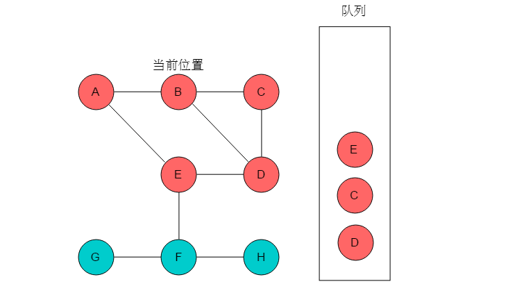

4. 队列头为E，E出队列。E的邻接顶点有D、F，但是D已经被标记，因此输出F，将F入队列，并标记F。当前位置指向E。
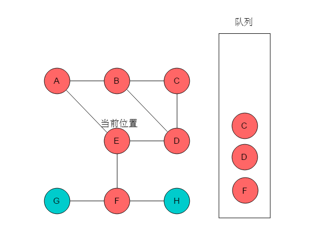

5. 队列头为C，C出队列。C的邻接顶点有B、D，但B、D均被标记。无元素入队列。当前位置指向C。
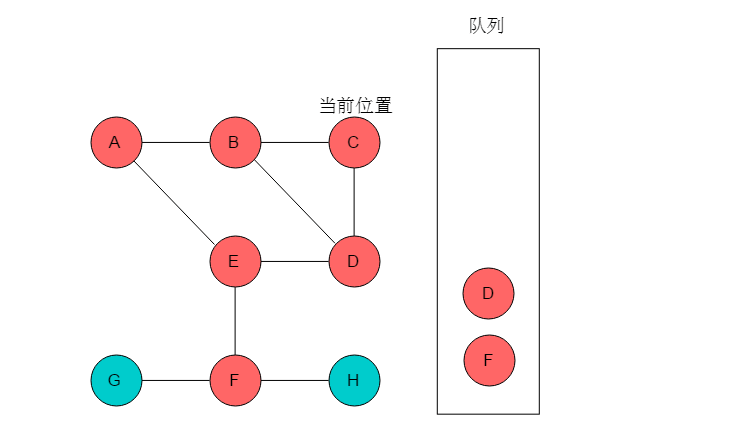

6. 队列头为D，D出队列。D的邻接顶点有B、C、E，但是B、C、E均被标记，无元素入队列。当前位置指向D。
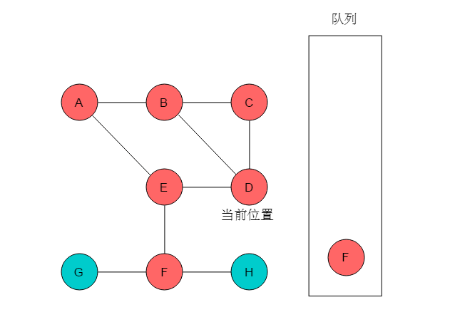

7. 队列头为F，F出队列。F的邻接顶点有G、H，输出G、H，将G、H入队列，并标记G、H。当前位置指向F。
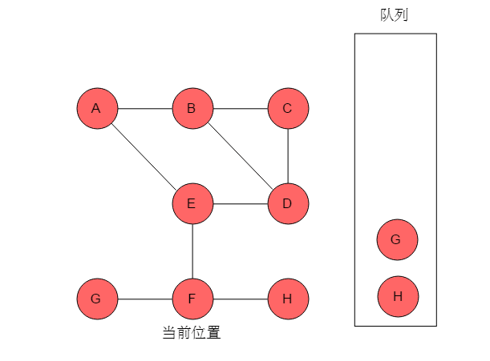

8. 队列头为G，G出队列。G的邻接顶点有F，但F已被标记，无元素入队列。当前位置指向G。
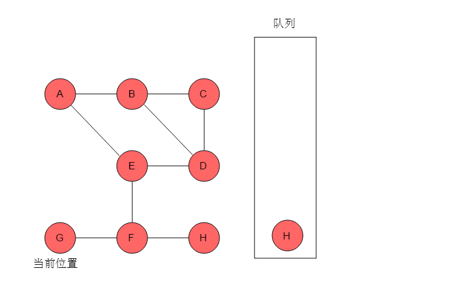

9. 队列头为H，H出队列。H的邻接顶点有F，但F已被标记，无元素入队列。当前位置指向H。
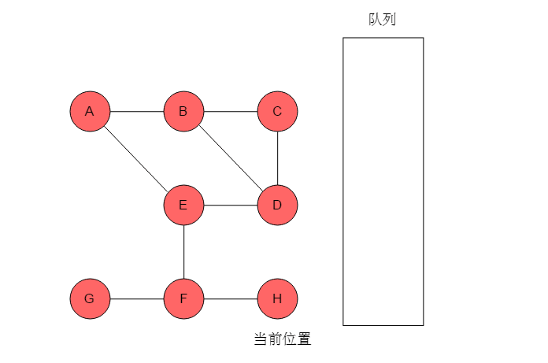

10. 队列空，则以A为起始点的遍历结束。若图中仍有未被访问的顶点，则选取未访问的顶点为起始点，继续执行此过程。直至所有顶点均被访问。

###### 有向图的广度优先搜索

以下图所示的有向图为例进行广度优先搜索。

1. 选取A为起始点，输出A，将A入队列，标记A。
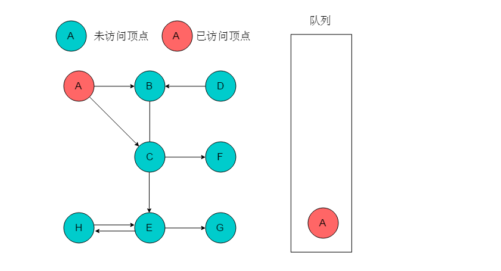

2. 队列头为A，A出队列。以A为尾的边有两条，对应的头分别为B、C，则A的邻接顶点有B、C。输出B、C，将B、C入队列，并标记B、C。

3. 队列头为B，B出队列。B的邻接顶点为C，C已经被标记，因此无新元素入队列。
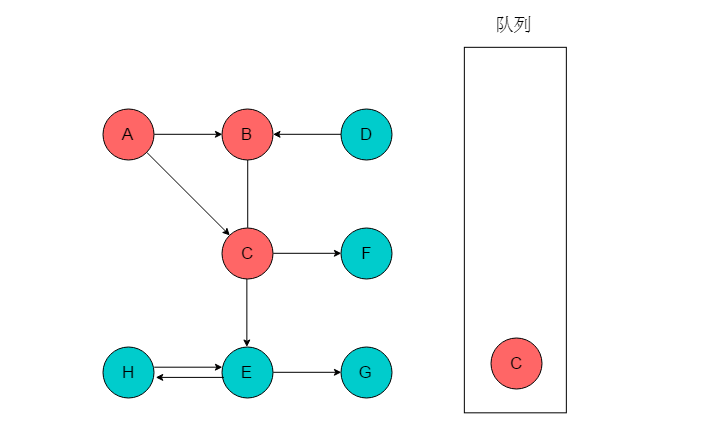

4. 队列头为C，C出队列。C的邻接顶点有E、F。输出E、F，将E、F入队列，并标记E、F。
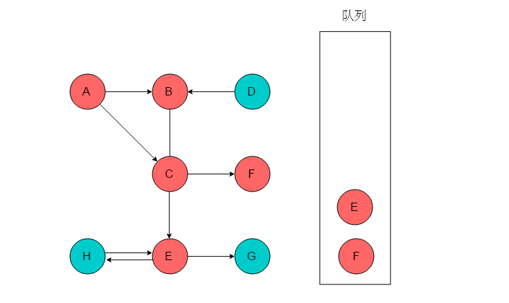

5. 队列头为E，E出队列。E的邻接顶点有G、H。输出G、H，将G、H入队列，并标记G、H。

6. 队列头为F，F出队列。F无邻接顶点。
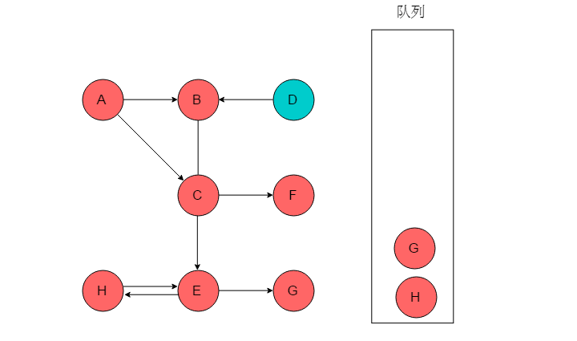

7. 队列头为G，G出队列。G无邻接顶点。
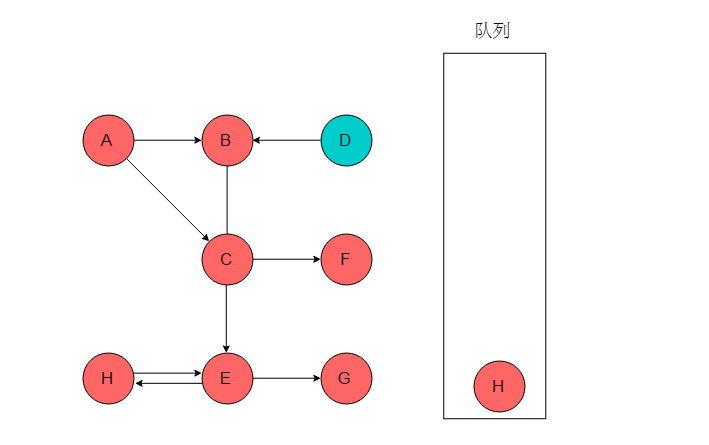

8. 队列头为H，H出队列。H邻接顶点为E，但是E已被标记，无新元素入队列。

9. 队列为空，以A为起始点的遍历过程结束，此时图中仍有D未被访问，则以D为起始点继续遍历。选取D为起始点，输出D，将D入队列，标记D。
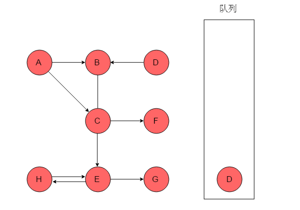

10. 队列头为D，D出队列，D的邻接顶点为B，B已被标记，无新元素入队列。
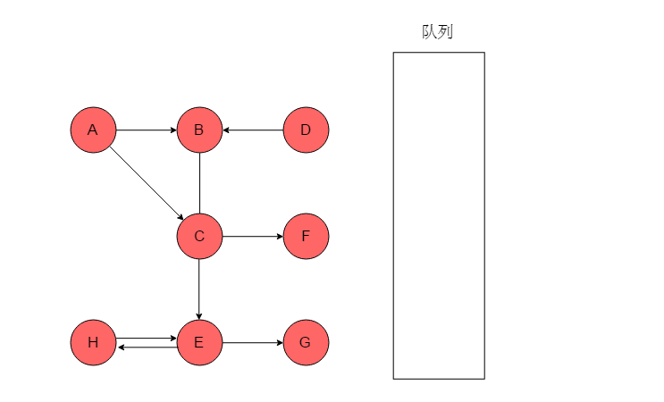

11. 队列为空，且所有元素均被访问，广度优先搜索遍历过程结束。广度优先搜索的输出序列为：A->B->E->C->D->F->G->H。

##### 算法分析

假设图有V个顶点，E条边，广度优先搜索算法需要搜索V个节点，时间消耗是O(V)，在搜索过程中，
又需要根据边来增加队列的长度，于是这里需要消耗O(E)，总得来说，效率大约是O(V+E)。

### 总结

图的遍历主要就是这两种遍历思想，深度优先搜索使用递归方式，需要栈结构辅助实现。
广度优先搜索需要使用队列结构辅助实现。在遍历过程中可以看出，对于连通图，
从图的任意一个顶点开始深度或广度优先遍历一定可以访问图中的所有顶点，但对于非连通图，
从图的任意一个顶点开始深度或广度优先遍历并不能访问图中的所有顶点。
