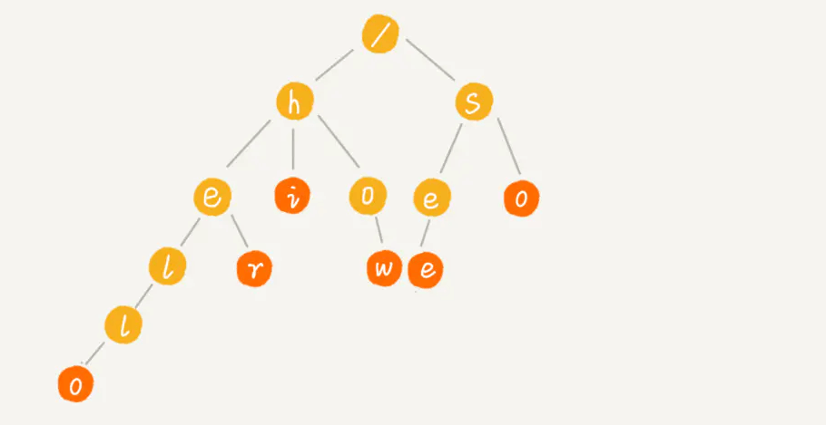
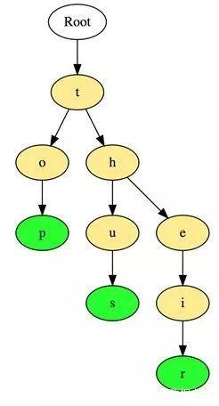
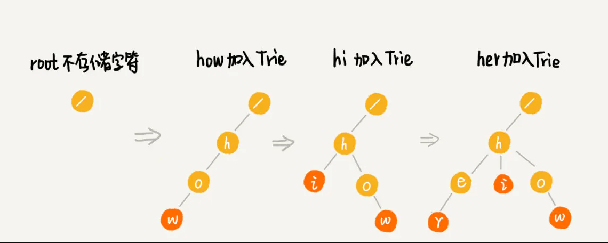

# 字典树

字典树，也称为“前缀树”，是一种特殊的树状数据结构，
对于解决字符串相关问题非常有效。它能够提供快速检索，
主要用于搜索字典中的单词，在搜索引擎中自动提供建议，
甚至被用于IP的路由。

Trie 树，也叫字典树，专门做字符串匹配的数据结构，也可快速的做字符串前缀匹配。

它是一种多叉树，即把前缀相同的字符串合并在一起，根节点默认不存储字符。如下图所示：




以下是在字典树中存储三个单词“top”，“so”和“their”的例子：



这些单词以顶部到底部的方式存储，其中绿色节点“p”，“s”和“r”分别表示“top”，“thus”和“theirs”的底部。


### 插入


hi 、her、how 的插入过程如下：



### 查找

##### 查找 hi 过程

1. 从根节点 root 开始，查找其子节点有无 h，结果是有
2. 查找 h 的子节点有无 i，结果也有，同时 i 是末尾节点，表示是个完整的字符串，匹配完成。

##### 查找 he 过程

1. 从根节点 root 开始，查找其子节点有无 h，结果是有
2. 查找 h 的子节点有无 e，结果也有，但 e 不是末尾节点，表示其只是匹配到了前缀，并不能完全匹配到 he。

### 实现

前面提到过，Trie 树是多叉树，节点的取值范围在字符串的所有可能出现的字符集内。如字符串包含的只是 a-z，那么最多只需要 26 个子节点；如果字符串包含 a-zA-Z，那么最多需要 52 个自己点；以此类推。

当然，不是每个节点的子节点都会包含所有字符集，不存在的子节点设置为 null。

所以，假设字符集为 a-z ，总共 26 个小写字母，其数据结构如下：

```java
class TrieNode {
    var data: Character
    
    // 字符集 26 个小写字母
    var children: [TrieNode?]
    var isEnd: Bool = false
    
    init(data: Character) {
        self.data = data
        
        children = [TrieNode]()
        
        // 初始化 26 个
        var i = 0
        while i < 26 {
            children.append(nil)
            i += 1
        }
    }
}
```

需要取子节点时，只需要算出 index = ch - 'a' ，然后根据 p.children[index] 取出即可，为 null 则表示不存在该 ch 字符。

Trie 树定义如下，包含插入和查找两个方法。

```java
class Trie {
    let root = TrieNode(data: Character("/"))

    // 插入
    func insert(text: String) {}

    // 查找
    func match(text: String) -> Bool {}
    
    // 计算index
    func indexOfChar(_ ch: Character) -> Int {
        let index = ch.toInt() - Character("a").toInt()
        return index
    }
}
```

##### 插入

逐个遍历字符串，若当前节点不存在该字符对应的子节点，则生成新的节点插入；若存在，则沿着树的分支继续往下走。当遍历完成，将最后一个节点结束符 isEnd 置为 true。

```java
func insert(text: String) {
    var p = root
    
    var i = 0
    while i < text.count {
        let strIndex = text.index(text.startIndex, offsetBy: i)
        
        let ch = text[strIndex]
        
        // 计算 index
        let index = indexOfChar(ch)
        if index < 0 || index >= 26 {
            assert(false, "包含非法字符")
        }
        
        if (index >= 0 && index <= p.children.count) {
            if p.children[index] == nil {
                // 插入新节点
                let node = TrieNode(data: ch)
                p.children[index] = node
            }
            
            p = p.children[index]!
        }
        
        i += 1
    }
    
    // 标记结束
    p.isEnd = true
}
```

##### 查找

逐个遍历字符串，若当前节点不存在该字符对应的子节点，则说明不匹配；若存在，则沿着树的分支继续往下走。当遍历完成，若最后一个节点是结束符，则完全匹配；否则只是前缀匹配。

```java
func match(text: String) -> Bool {
        
    var p = root
    
    var i = 0
    while i < text.count {
        let strIndex = text.index(text.startIndex, offsetBy: i)
        
        let ch = text[strIndex]
        
        // 计算 index
        let index = indexOfChar(ch)
        
        if (index >= 0 && index <= p.children.count) {
            if p.children[index] != nil {
                p = p.children[index]!
            } else {
                // 不匹配
                return false
            }
        } else {
            return false
        }
        
        i += 1
    }
    
    // 完全匹配
    if p.isEnd {
        return true
    }
    
    return false
}
```

### 效率

Trie 树构建时，需要遍历所有的字符串，因此时间复杂度为所有字符串长度总和 n，时间复杂度为 O(n)。
    
但是 Trie 树的查找效率很高，如果字符串长度为 k，那么时间复杂度 为 O(k)。
    
Trie 是一种以空间换时间的结构，当字符集较大时，会占用很多空间，同时如果前缀重合较少，空间会占用更多。所以其比较适合查找前缀匹配。
    

### Tire树的应用：

* 串的快速检索

给出N个单词组成的熟词表，以及一篇全用小写英文书写的文章，
请你按最早出现的顺序写出所有不在熟词表中的生词。

在这道题中，我们可以用数组枚举，用哈希，用字典树，先把熟词建一棵树，然后读入文章进行比较，
这种方法效率是比较高的。

*  “串”排序

给定N个互不相同的仅由一个单词构成的英文名，让你将他们按字典序从小到大输出。用字典树进行排序，
采用数组的方式创建字典树，这棵树的每个结点的所有儿子很显然地按照其字母大小排序。
对这棵树进行先序遍历即可。

* 最长公共前缀

对所有串建立字典树，对于两个串的最长公共前缀的长度即他们所在的结点的公共祖先个数，
于是，问题就转化为求公共祖先的问题。


### 为什么 360 面试官说 Trie 树没用？


说句实话，工程上来说，和hash比起来，trie就是没有用的东西。
这个可以说很深刻地表现出了一个学生和一个软件工程师的思维差异。
你可能很清楚，hash类的算法都有可能因为碰撞而退化，
而trie是稳定的复杂度，简直太招人喜欢了。
但是工程师99.9%的情况下都会用hash。因为，hash函数、map、set，
都有内置库，所有语言都有。这意味着一个功能用hash就是五行代码，
甚至体现不出用了hash，而用trie，
你要么先交一份trie开源库的分析选型比较报告来，要么自己撸一个，
附带着先写一千行的单元测试用例，再跑个压测。万一将来换个语言，
请从头再来。是的，就是这么简单，工程师才不会考虑碰撞，
他们甚至不关心rehash、hash实现这些细节，
许多语言内置的hash实现已经考虑了防止恶意碰撞了，
而随机碰撞，没有那么巧的事情。
写出简单可用能快速上线的代码要更重要。你看出来了，
学术关心理论最优，工程关心实践最优。你可能愤愤不平，
为啥标准库不把trie加进去？那你有没有想过这些问题呢？

1. 如果字符串不是常见的英文小写字母，而是unicode呢？
2. 如果这些字符串超级长，甚至有傻子拿来了一千个文本文件，
每个有100KB呢？
3. 字符串现在多得不能忍了，需要分布式处理，
你要怎么设计一个分布式的trie
（要记得trie的节点分布可能是高度不均衡的）？所以，
工程看重什么也是有道理的。当然trie自然不是真的没用，
它支持前缀匹配，支持范围查找，这些都有独特的应用，
比如数据库里字符串类型的索引就经常实现为前缀树
（另一种常见实现自然就是hash）。
但说实话，不会有工程师认为这是两种可以相互竞争的技术。


如果面试官问的问题就如同题主描述的一样的话，
那可以直接告诉面试官scan一遍就结束了。
毕竟一共才10万个字符串，只是需要找给定的字符串是否有匹配。
从性能方面考虑，
给了这10万个字符串无论如何都要扫描一遍才知道是否存在或存在多少个匹配的字符串。
上来先排序的话我觉得都是浪费，qsort复杂度nlog(n)，也是得把所有字符串至少读一遍。
为了帮一个给定字符串找匹配而做一遍sort实在划不来。
当然了，我觉得面试官想问的肯定没这么简单，
面试官希望得到的回答一定是对这10万个字符串建立某种数据结构从而使得以后每次做这种字符串匹配查询都很快。
对于10万这个量级的数据，从工程角度而言naive一点的话还是直接扫一遍就完了，完全不用排序。
为什么呢？假设每个字符串是100个byte，10万个字符串也不过就是1000KB就是10MB。
现在稍微一般的处理器L3 cache size都是25MB了，
把这么多字符串存在L3上扫一遍又能慢到哪里去呢？
要记住，字符串比较这种问题肯定是memory bound而不是cpu bound。
当然你要觉得scan一遍太简单粗暴想更fancy一点的，
那么可以把这10万个字符串sort一遍然后用个二分查找。
性能一定不差。如果你要觉得sort还不够fancy，
那我们就可以考虑一下hash或者trie了。
到底是hash好还是trie好呢？trie完全没用？
我想说，脱离实际的workload讨论这种问题完全是在耍流氓。
首先一个问题就是这是静态的数据集还是动态的数据集？
也就是说是否用户可以插入新的字符串到这个现有的字符串集合中？
如果是静态的数据集，那么用hash吧。
数据集大小固定，
用perfect hashing或者cuckoohashing可以达到collision概率最小，
构建完hash table之后对给定字符串进行查询几乎肯定是一次搞定。
然而如果是个动态的数据集，而且新的字符串被不断的插入呢？
这个时候用perfect/cuckoo hashing就不合适了。
这是因为perfect/cuckoo hashing的一个假设是workload size是提前预知的，
在这种假设前提下才能开出足够的空间在设定好hash function的情况下达到collision最小。
然而当有大量插入时，perfect/cuckoo hash table的性能就变得不稳定了，
因为每次insert都可能需要多次调整内部数据存放的位置。为了降低collision，只能增大hash table，
然而resize是perfect/cuckoo hashing最不擅长的，因为必须重新构建hash table，性能非常之差。
这时的解决方法是考虑extentiable hashing或者linear hashing。
这两种hash table能够很好的动态改变数据结构大小。当然相比于perfect/cuckoo hashing，
collision也会相对较多，同时也会带来linear probing的代价。在动态数据集的情况下，
我们可以尝试考虑trie作为索引结构。
trie的好处在于能够方便的插入新的数据，且相比于btree-style来讲comparison的代价也更小，
毕竟每次只要compare一个byte就完了。而相比于insert，trie的性能也可能很有可能更高，
这是因为trie更加cache-friendly。
对于这种memory bound的问题中合理利用cache是非常重要的。
我也看到有些答主说trie会占用大量内存。如果出现这种情况，
那99%的可能是你只实现了leetcode上刷题需要用到的那种trie。
trie的内部结构可以进行高效的压缩，
比如有如果“a”->"b"->"c"这三个连续的节点
（a是b的父节点，b是c的父节点），
"a"与"b"这两个节点均只有唯一的子节点，那么就可以很轻易的把"abc"合并为一个节点。
在有insert的情况下，trie树也可以合理的split merge内部节点来节约空间。
相比于btree-style数据结构，trie的内存使用率高了一大截，
因为btree中多数节点也就是半满的状态，很难达到全满。
其实面试官问的这种开放式的问题是十分好回答的，
毕竟这个直接凭平时写代码用数据结构的经验就能回答了。
就说这道题吧，
扩展一下的话我们还可以跟面试官扯扯如何用SIMD（甚至GPU）做加速，
如何支持concurrent insert，
在数据量极大的情况下如何合理使用SSD/HDD，如何分布式存储等等。
问题实在太多，扯一个小时都没问题。
对了，那个KMP好像是做substring matching的，不是很适合。
对我来讲上次碰KMP估计都是本科上算法课的时候了，


#### 面试中关于字典树的常见问题
     
* 计算字典树中的总单词数
* 打印存储在字典树中的所有单词
* 使用字典树对数组的元素进行排序
* 使用字典树从字典中形成单词
* 构建T9字典（字典树+ DFS ）
