# 树和森林与二叉树的相互转换

### 什么是森林？

很容易想到，由树组成森林。

专业一点的定义是：若干棵互不相交的树的集合。

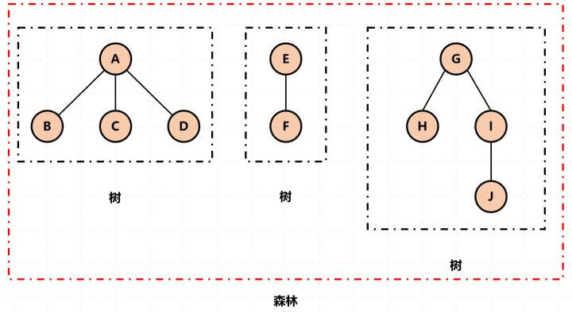

下面我们要用的是左孩子右兄弟的方法，

简单三步就能将树和二叉树相互转换。

### 树 -> 二叉树

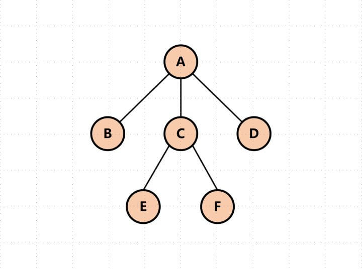

1. 加线。在所有的兄弟结点之间加一条线。
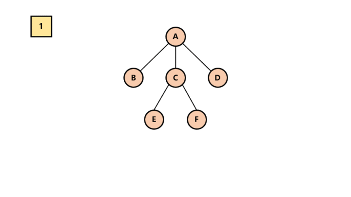

2. 去线。树中的每个结点，只保留它与第一个孩子结点的连线，
删除其他孩子结点之间的连线。
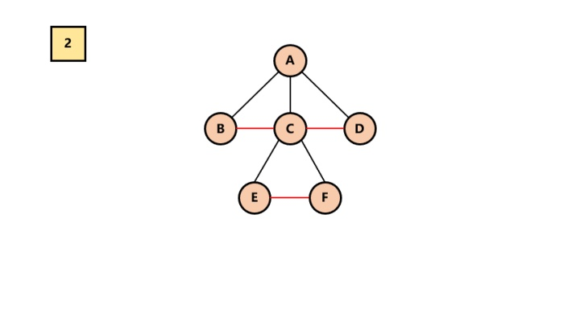

3. 调整。以树的根结点为轴心，将整个树调节一下（第一个孩子是结点的左孩子，兄弟转过来的孩子是结点的右孩子）

所以最终结果为：
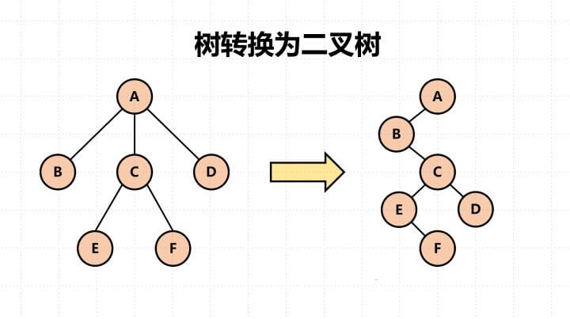

### 二叉树 -> 树

知道了树转换为二叉树，那么二叉树转换为树就是个逆过程呗。

1. 调整。将二叉树从左上到右下分为若干层。然后调整成水平方向。
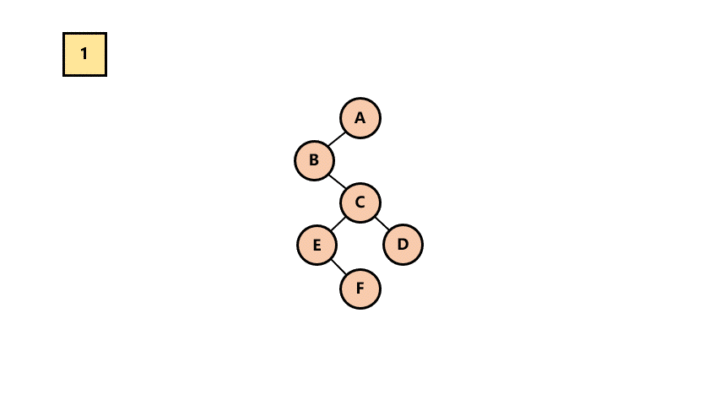

2. 加线。找到每一层节点在其上一层的父节点，加线。
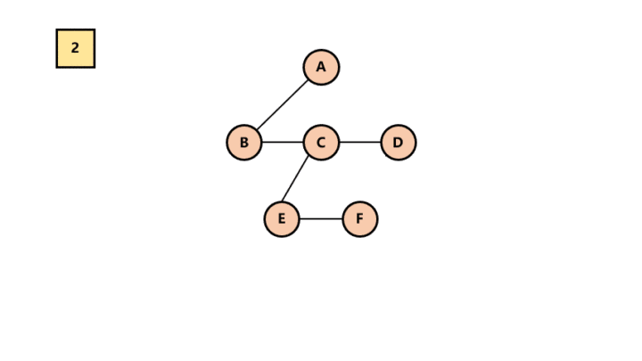

3. 去线。去除兄弟节点之间的连线。
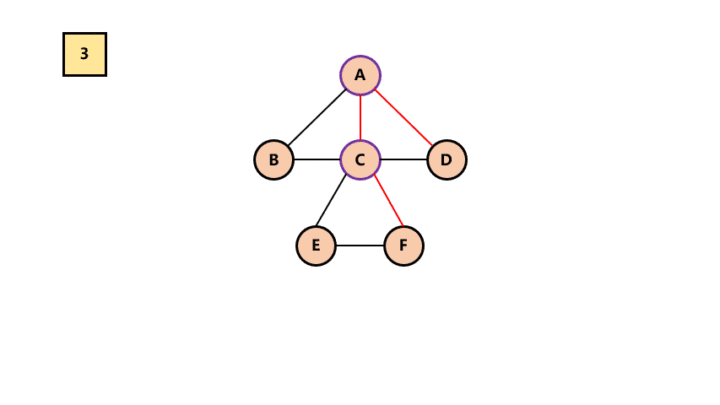

所以最终结果为：

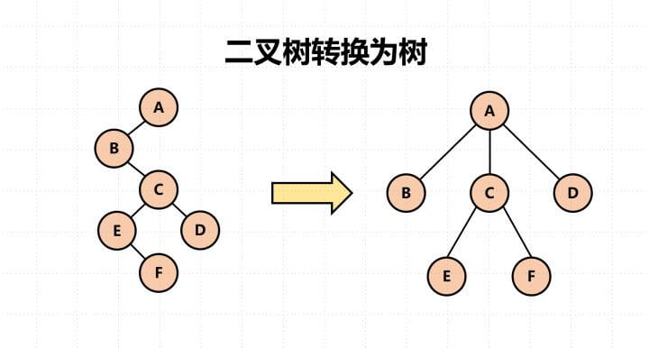

### 二叉树 -> 森林

在此我需要再次强调的是，根据孩子兄弟表示法，根节点是没有兄弟的。

前提：加入一棵二叉树的根节点有右孩子，则这棵二叉树能够转换为森林，否则转换为一棵树。

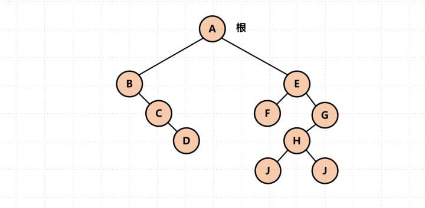

1. 删除右孩子连线。
     
   从根节点开始，若右孩子存在，则把与右孩子结点的连线删除。再查看分离后的二叉树，若其根节点的右孩子存在，则连续删除。直到所有这些根结点与右孩子的连线都删除为止。
   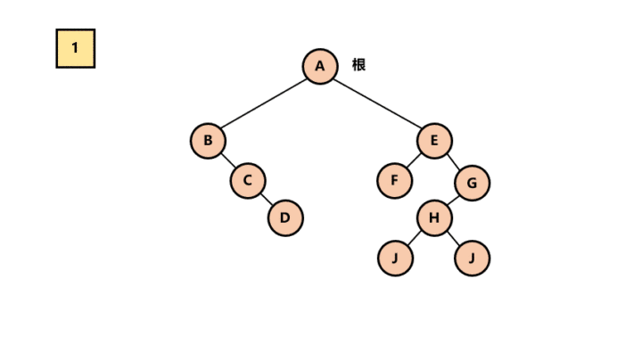
   
2. 将每棵分离后的二叉树转换为树。

   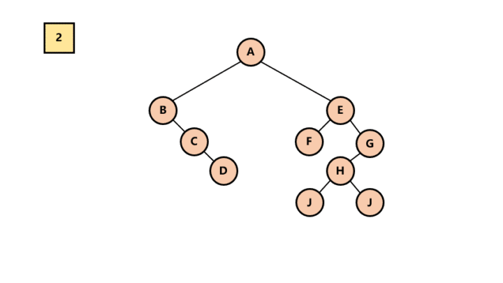

所以最终结果为：

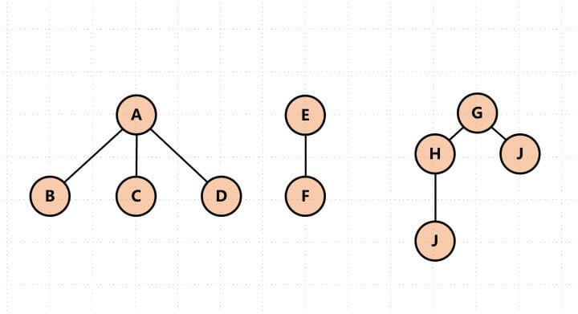
