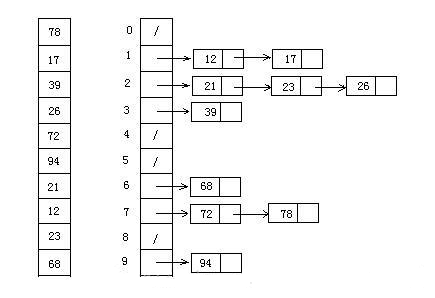
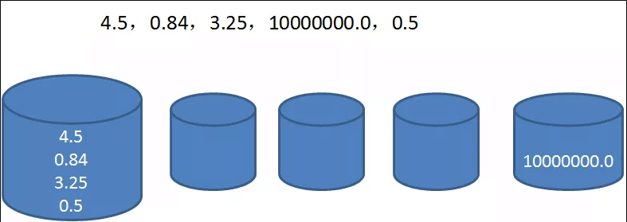
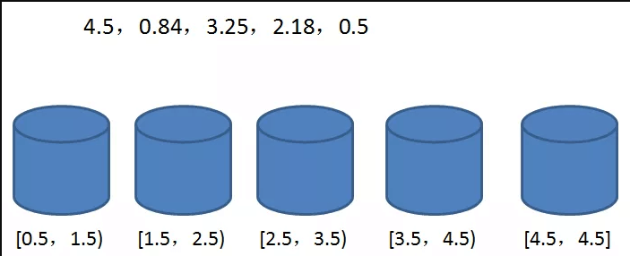
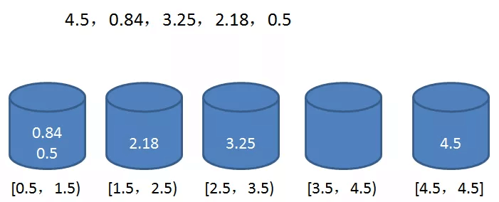

# 桶排序
桶排序 是计数排序的升级版。
它利用了函数的映射关系，高效与否的关键就在于这个映射函数的确定。

桶排序 (Bucket sort)的工作的原理：
假设输入数据服从均匀分布，将数据分到有限数量的桶里，每个桶再分别排序（有可能再使用别的排序算法或是以递归方式继续使用桶排序进行排

#### 算法描述
* 步骤1：人为设置一个BucketSize，作为每个桶所能放置多少个不同数值（例如当BucketSize==5时，该桶可以存放｛1,2,3,4,5｝这几种数字，但是容量不限，即可以存放100个3）；
* 步骤2：遍历输入数据，并且把数据一个一个放到对应的桶里去；
* 步骤3：对每个不是空的桶进行排序，可以使用其它排序方法，也可以递归使用桶排序；
* 步骤4：从不是空的桶里把排好序的数据拼接起来。 


    注意，如果递归使用桶排序为各个桶排序，则当桶数量为1时要手动减小BucketSize增加下一循环桶的数量，否则会陷入死循环，导致内存溢出。

#### 图片演示



#### 代码实现

```java
package algorithm.sort;

import java.util.ArrayList;
import java.util.Arrays;
import java.util.List;
import java.util.stream.Collectors;

public class BucketSort {

    public static void main(String[] args) {

        int[] array = {1, 2, 9, 4, 6, 7, 8, 3, 0, 5, 7, 6};
        System.out.println("原始数组：" + Arrays.toString(array));
        System.out.println("排序后数组：" + Arrays.toString(BucketSort.bucketSort(array, 3)));
    }

    private static int[] bucketSort(int[] array, int buketSize) {
        if (array.length < 2) {
            return array;
        }

        int min = array[0], max = array[0];
        for (int a : array) {
            if (a < min) {
                min = a;
            }
            if (a > max) {
                max = a;
            }
        }

        //求出桶的数量
        int bucketCount = (max - min) / buketSize + 1;
        List<Integer> originList = Arrays.stream(array).boxed().collect(Collectors.toList());

        ArrayList<ArrayList<Integer>> bucketArr = new ArrayList<ArrayList<Integer>>(bucketCount);

        for (int i = 0; i < bucketCount; i++) {
            bucketArr.add(new ArrayList<Integer>());
        }

        for (int i = 0; i < array.length; i++) {
            bucketArr.get((originList.get(i) - min) / buketSize)
                    .add(originList.get(i));
        }

        int index = 0;
        for (ArrayList<Integer> bucket : bucketArr) {
            //这里应该桶内排序
            for (int b : bucket) {
                array[index++] = b;
            }
        }

        return array;
    }
}

```

#### 算法分析

桶排序最好情况下使用线性时间O(n)，桶排序的时间复杂度，取决与对各个桶之间数据进行排序的时间复杂度，因为其它部分的时间复杂度都为O(n)。很显然，桶划分的越小，各个桶之间的数据越少，排序所用的时间也会越少。但相应的空间消耗就会增大。

最佳情况：T(n) = O(n+k)
最差情况：T(n) = O(n+k)
平均情况：T(n) = O(n2)

假设原始数列有n个元素，分成m个桶（我们采用的分桶方式 m=n），平均每个桶的元素个数为n/m。

下面我们来逐步分析算法复杂度：

第一步求数列最大最小值，运算量为n。

第二步创建空桶，运算量为m。

第三步遍历原始数列，运算量为n。

第四步在每个桶内部做排序，由于使用了O（nlogn）的排序算法，所以运算量为 n/m * log(n/m ) * m。

第五步输出排序数列，运算量为n。

加起来，总的运算量为 3n+m+ n/m * log(n/m ) * m = 3n+m+n(logn-logm) 。

去掉系数，时间复杂度为：

O(n+m+n(logn-logm)） 

至于空间复杂度就很明显了：

空桶占用的空间 + 数列在桶中占用的空间 = O（m+n）。

桶排序在性能上并非绝对稳定。理想情况下，桶中的元素分布均匀，当 n = m时，时间复杂度可以达到O(n).

但是，如果桶内元素的分布极不均衡，极端情况下第一个桶中有n-1个元素，最后一个桶中有1个元素。此时的时间复杂度退化到O(nlogn)，还白白创建了许多空桶。



#### 桶的概念

每一个桶（bucket）代表一个区间范围，里面可以承载一个或多个元素。桶排序的第一步，就是创建这些桶，确定每一个桶的区间范围：

具体建立多少个桶，如何确定桶的区间范围，有很多不同的方式。我们这里创建的桶数量等于原始数列的元素数量，除了最后一个桶只包含数列最大值，前面各个桶的区间按照比例确定。

区间跨度 = （最大值-最小值）/ （桶的数量 - 1）

第二步，遍历原始数列，把元素对号入座放入各个桶中：



第三步，每个桶内部的元素分别排序（显然，只有第一个桶需要排序）

第四步，遍历所有的桶，输出所有元素：

    0.5，0.84，2.18，3.25，4.5

到此为止，排序结束。
