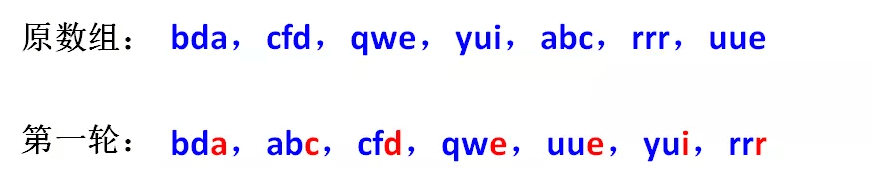
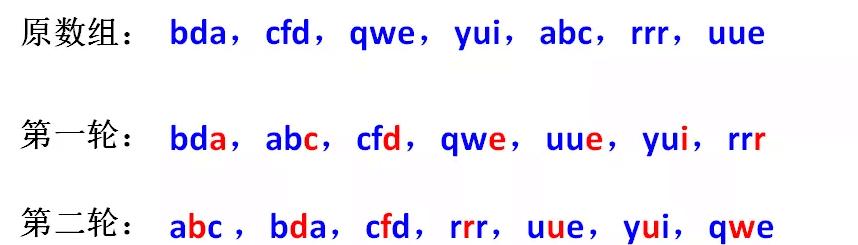
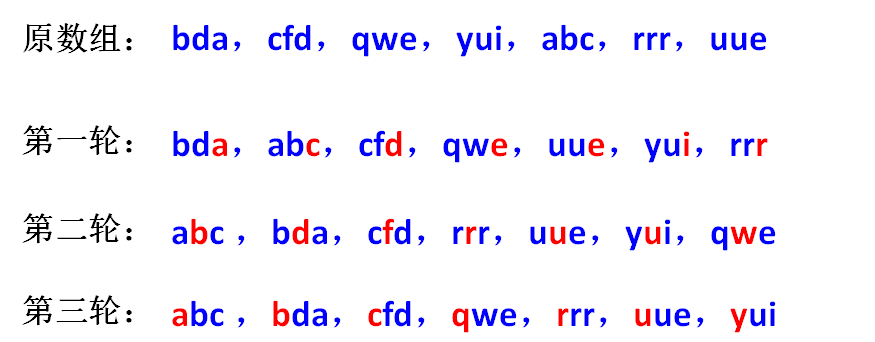

# 基数排序

​    基数排序也是非比较的排序算法，对每一位进行排序，从最低位开始排序，复杂度为O(kn),为数组长度，k为数组中的数的最大的位数；

    基数排序是按照低位先排序，然后收集；再按照高位排序，然后再收集；依次类推，直到最高位。有时候有些属性是有优先级顺序的，先按低优先级排序，再按高优先级排序。最后的次序就是高优先级高的在前，高优先级相同的低优先级高的在前。基数排序基于分别排序，分别收集，所以是稳定的。

#### 算法描述

* 步骤1：取得数组中的最大数，并取得位数；
* 步骤2：arr为原始数组，从最低位开始取每个位组成radix数组；
* 步骤3：对radix进行计数排序（利用计数排序适用于小范围数的特点）；

#### 动图演示

#### 算法分析

最佳情况：T(n) = O(n * k)
最差情况：T(n) = O(n * k)
平均情况：T(n) = O(n * k)

基数排序基于分别排序，分别收集，所以是稳定的。但基数排序的性能比桶排序要略差，每一次关键字的桶分配都需要O(n)的时间复杂度，而且分配之后得到新的关键字序列又需要O(n)的时间复杂度。假如待排数据可以分为d个关键字，则基数排序的时间复杂度将是O(d*2n) ，当然d要远远小于n，因此基本上还是线性级别的。

基数排序的空间复杂度为O(n+k)，其中k为桶的数量。一般来说n>>k，因此额外空间需要大概n个左右。

####  基数排序有两种方法：

MSD 从高位开始进行排序
LSD 从低位开始进行排序

#### 基数排序 vs 计数排序 vs 桶排序

这三种排序算法都利用了桶的概念，但对桶的使用方法上有明显差异：

基数排序： 根据键值的每位数字来分配桶
计数排序： 每个桶只存储单一键值
桶排序： 每个桶存储一定范围的数值

#### 计数排序有什么局限呢？让我们看两个特殊的需求：

###### 需求A，为一组给定的手机号排序：

18914021920

13223132981

13566632981

13660891039

13361323035

........

........

按照计数排序的思路，我们要根据手机号的取值范围，创建一个空数组。

可是，11位手机号有多少种组合？恐怕要建立一个大得不可想象的数组，才能装下所有可能出现的11位手机号！

###### 需求B，为一组英文单词排序：

banana

apple

orange

peach

cherry

........

........

计数排序适合的场景是对整数做排序，如果遇到英文单词，就无能为力了。

如何有效处理诸如手机号、英文单词等复杂元素的排序呢？仅仅靠一次计数排序很难实现。

这时候，我们不妨**把排序工作拆分成多个阶段，每一个阶段只根据一个字符进行计数排序，一共排序k轮**（k是元素长度）。

或许这样的描述有些抽象，我们来举一个例子。

数组中有若干个字符串元素，每个字符串元素都是由三个英文字母组成：

bda，cfd，qwe，yui，abc，rrr，uee

如何将这些字符串按照字母顺序排序呢？

由于每个字符串的长度是3个字符，我们可以把排序工作拆分成3轮：

第一轮：按照最低位字符排序。排序过程使用计数排序，把字母的ascii码对应到数组下标，第一轮排序结果如下：

第二轮：在第一轮排序结果的基础上，按照第二位字符排序。

需要注意的是，这里使用的计数排序必须是稳定排序，这样才能保证第一轮排出的先后顺序在第二轮还能继续保持。

比如在第一轮排序后，元素uue在元素yui之前。那么第二轮排序时，两者的第二位字符虽然同样是u，但先后顺序万万不能变，否则第一轮排序就白做了。

第三轮：在第二轮排序结果的基础上，按照最高位字符排序。

如此一来，这些字符串的顺序就排好了。

像这样把字符串元素按位拆分，每一位进行一次计数排序的算法，就是基数排序（Radix Sort）。

基数排序既可以从高位优先进行排序（Most Significant Digit first，简称MSD），也可以从低位优先进行排序（Least Significant Digit first，简称LSD）。

刚才我们所举的例子，就是典型的LSD方式的基数排序。