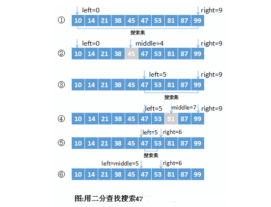

# 顺序查找

顺序查找适合于存储结构为顺序存储或链接存储的线性表。

### 基本思想

顺序查找也称为线形查找，属于无序查找算法。
从数据结构线形表的一端开始，顺序扫描，依次将扫描到的结点关键字与给定值k相比较，
若相等则表示查找成功；若扫描结束仍没有找到关键字等于k的结点，表示查找失败。

在程序中初始化创建查找表时，由于是顺序存储，所以将所有的数据元素存储在数组中，
但是把第一个位置留给了用户用于查找的关键字。

例如，在顺序表{1,2,3,4,5,6}中查找数据元素值为 7 的元素，
则添加后的顺序表为：



### 复杂度分析

* 查找成功时的平均查找长度为：（假设每个数据元素的概率相等） ASL = 1/n(1+2+3+…+n) = (n+1)/2 ;
* 当查找不成功时，需要n+1次比较，时间复杂度为O(n);

所以，顺序查找的时间复杂度为O(n)。


### 代码实现

```java
package algorithm.seek;

/**
 * 顺序查找
 */
public class SequentialSearch {

    /**
     * @param array  数集合
     * @param target 目标数
     */
    private static int sequential(int[] array, int target) {

        int length = array.length;

        for (int i = 0; i < length ; i++) {
            if (array[i] == target){
                return i;
            }
        }

        return -1;
    }

    public static void main(String[] args) {
        int[] a = {1, 2, 3, 4, 9, 6, 7, 8, 6};
        int value = sequential(a, 9);
        System.out.println(value);
    }
}

```
